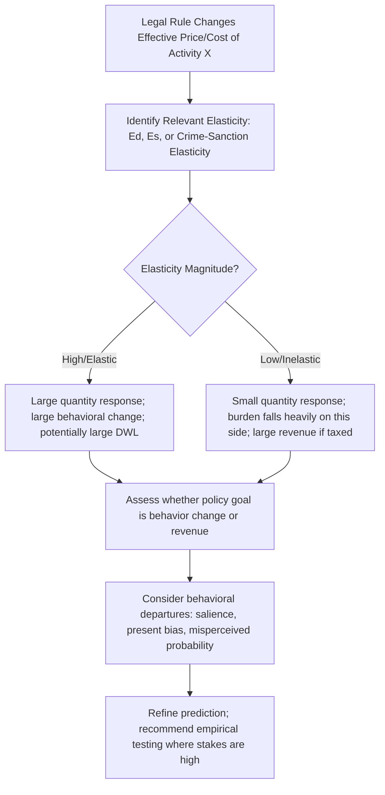

## Elasticity and Behavioral Response to Legal Rules

### Overview

Elasticity measures the responsiveness of one economic variable to a change in another, expressed as a ratio of percentage changes. For legal analysis, elasticity is the parameter that converts a qualitative prediction ("demand will fall") into a quantitative, testable one ("demand will fall by roughly 3% for every 10% price increase"). Because virtually every legal rule — taxes, fines, mandates, liability regimes, subsidies — operates by changing the effective price or cost of some activity, elasticity is the central tool for predicting how much behavioral response a rule will actually produce, who will bear its burden, and how much deadweight loss it will generate.

### Core Elasticity Concepts

#### Price Elasticity of Demand

$$E_d = \frac{\%\Delta Q_d}{\%\Delta P} = \frac{\partial Q_d / Q_d}{\partial P / P}$$

Using the midpoint (arc elasticity) formula, which avoids asymmetry between percentage increases and decreases:

$$E_d = \frac{(Q_2 - Q_1)/[(Q_2+Q_1)/2]}{(P_2 - P_1)/[(P_2+P_1)/2]}$$

Classifications:

- $|E_d| = 0$: perfectly inelastic (quantity fixed regardless of price)
- $0 < |E_d| < 1$: inelastic
- $|E_d| = 1$: unit elastic
- $|E_d| > 1$: elastic
- $|E_d| = \infty$: perfectly elastic (quantity fully collapses at any price above threshold)

#### Price Elasticity of Supply

$$E_s = \frac{\%\Delta Q_s}{\%\Delta P}$$

Supply elasticity tends to rise with the time horizon: in the short run, capacity constraints make supply relatively inelastic; in the long run, firms can enter, exit, or retool, making supply more elastic. This time dimension matters for legal rules whose effects are assessed at different horizons (e.g., housing supply response to zoning reform, which may take years to materialize).

#### Cross-Price Elasticity

$$E_{xy} = \frac{\%\Delta Q_x}{\%\Delta P_y}$$

- $E_{xy} > 0$: goods are substitutes
- $E_{xy} < 0$: goods are complements

This is doctrinally central to antitrust market definition: the SSNIP test asks whether a hypothetical monopolist could profitably raise price by 5-10%, which depends on cross-price elasticity with candidate substitute products.

#### Income Elasticity

$$E_m = \frac{\%\Delta Q_d}{\%\Delta m}$$

- $E_m > 0$: normal good
- $E_m < 0$: inferior good
- $E_m > 1$: luxury good

### Determinants of Elasticity

Elasticity is not a fixed property of a good but depends on context:

1. **Availability of substitutes** — the single most important determinant. More substitutes → more elastic demand.
2. **Necessity vs. luxury** — necessities (insulin, water) tend toward inelastic demand.
3. **Share of budget** — goods representing a larger share of spending tend to have more elastic demand (consumers notice and adjust).
4. **Time horizon** — demand and supply are both more elastic in the long run, as consumers and firms find substitutes, adjust habits, and retool capital.
5. **Definition of the market** — narrowly defined markets ("Coca-Cola") have more elastic demand than broadly defined ones ("soft drinks" or "beverages"), because narrow definitions admit more substitutes.

### Elasticity and Legal Rule Design

#### 1. Tax and Fine Incidence

As established in supply-demand analysis, statutory incidence does not determine economic incidence. The precise allocation of burden follows:

$$\frac{\text{Burden on Consumers}}{\text{Burden on Producers}} = \frac{E_s}{E_d}$$

(both elasticities in absolute value). The more inelastic side of the market bears a proportionally greater share of any tax, fine, or mandated cost — regardless of the legal fiction of who is nominally obligated to pay.

**Legal design implication**: A legislature seeking to burden a specific party (e.g., forcing employers rather than workers to bear a payroll tax) cannot achieve this simply by statutory labeling; it must consider the underlying elasticities. If labor supply is highly inelastic (workers cannot easily reduce hours or exit the labor force), workers will bear much of the tax through lower wages even though employers remit the payment.

#### 2. Deterrence and the Elasticity of Illegal Activity

In the economic model of crime (Becker), the "price" of a criminal act is the expected sanction: $p \times f$, where $p$ is probability of detection/conviction and $f$ is the fine or sentence severity. The elasticity of criminal activity with respect to expected sanction determines how effective increases in either enforcement probability or sanction severity will be at reducing crime.

$$E_{crime} = \frac{\%\Delta(\text{crime rate})}{\%\Delta(p \cdot f)}$$

[Inference: empirical estimates of deterrence elasticities vary substantially by crime type and enforcement margin (certainty vs. severity of punishment); a broad body of empirical criminology literature suggests certainty of punishment tends to have larger deterrent effects than severity, but exact elasticity magnitudes are context-dependent and contested.]

This has direct doctrinal relevance to sentencing policy debates: if the elasticity of crime with respect to sentence length is low (offenders do not respond strongly to marginal increases in already-long sentences), extending sentences produces high incarceration costs for little marginal deterrence — an argument frequently invoked in sentencing reform literature.

#### 3. Elasticity and the Design of Pigouvian Taxes/Regulation

For a Pigouvian tax intended to internalize an externality (see externalities topic), effectiveness in reducing the externality-generating activity depends on the elasticity of demand for that activity. Highly inelastic demand (e.g., for gasoline in the short run) means a carbon tax generates substantial revenue but only modest quantity reduction in the short term — revenue-raising and behavior-changing objectives can diverge sharply depending on elasticity.

$$\text{Quantity reduction} \approx E_d \times \frac{t}{P}$$

where $t$ is the per-unit tax and $P$ is the pre-tax price.

#### 4. Mandated Benefits and Labor Market Elasticity

When law mandates that employers provide a benefit (health insurance, parental leave, safety equipment), the ultimate incidence depends on the elasticity of labor supply relative to labor demand. If labor supply is highly inelastic (workers cannot easily withdraw from the labor market), the cost of the mandate is shifted largely onto workers through reduced wages — the mandate functions economically like a tax on labor, with incidence following the elasticity rule regardless of the legal requirement being framed as an employer obligation.

### Deadweight Loss and Elasticity

Deadweight loss from a tax or price distortion grows with the elasticities of both supply and demand — more elastic markets generate larger behavioral distortions (and thus larger efficiency losses) for a given tax or price control:

$$DWL \approx \frac{1}{2} \cdot t^2 \cdot \frac{E_d \cdot E_s}{E_d + E_s} \cdot \frac{Q}{P}$$

This is the microeconomic foundation for the **Ramsey Rule** in optimal taxation: to minimize deadweight loss for a given revenue target, tax goods with lower elasticity of demand more heavily (inelastic goods generate less behavioral distortion per dollar of revenue raised) — a principle in obvious tension with distributive and political considerations, since inelastic-demand goods are often necessities.

### Diagram: Elasticity and Tax Incidence

<svg xmlns="http://www.w3.org/2000/svg" viewBox="0 0 560 420">
<text x="280" y="25" text-anchor="middle" font-size="16" font-weight="bold" fill="#1a1a1a">Inelastic Demand: Tax Incidence Falls on Buyers (svg_diagram)</text>
<line x1="70" y1="360" x2="70" y2="50" stroke="#333" stroke-width="2" />
<line x1="70" y1="360" x2="500" y2="360" stroke="#333" stroke-width="2" />
<text x="35" y="55" font-size="13" fill="#333">Price</text>
<text x="470" y="385" font-size="13" fill="#333">Quantity</text>
<line x1="180" y1="70" x2="220" y2="340" stroke="#2980b9" stroke-width="2.5" />
<text x="150" y="65" font-size="13" fill="#2980b9" font-weight="bold">D (inelastic)</text>
<line x1="100" y1="300" x2="440" y2="120" stroke="#c0392b" stroke-width="2.5" />
<text x="445" y="115" font-size="13" fill="#c0392b" font-weight="bold">S</text>
<line x1="100" y1="255" x2="440" y2="75" stroke="#27ae60" stroke-width="2.5" stroke-dasharray="6,3" />
<text x="445" y="72" font-size="13" fill="#27ae60" font-weight="bold">S + tax</text>
<circle cx="205" cy="185" r="5" fill="#1a1a1a" />
<text x="212" y="180" font-size="12">Original E</text>
<circle cx="197" cy="140" r="5" fill="#1a1a1a" />
<text x="130" y="135" font-size="12">New price paid by buyer (Pb)</text>
<circle cx="212" cy="230" r="5" fill="#1a1a1a" />
<text x="218" y="245" font-size="12">Price kept by seller (Ps)</text>
<line x1="70" y1="140" x2="197" y2="140" stroke="#666" stroke-width="1" stroke-dasharray="3,2" />
<line x1="70" y1="230" x2="212" y2="230" stroke="#666" stroke-width="1" stroke-dasharray="3,2" />
<line x1="197" y1="140" x2="212" y2="230" stroke="#000" stroke-width="1.5" />
<text x="220" y="185" font-size="11" fill="#000">tax wedge</text>
</svg>

Because demand is steep (inelastic) relative to supply, most of the vertical tax wedge is absorbed as a price increase borne by buyers ($P_b$ rises close to the full tax amount), while the price sellers retain ($P_s$) falls only slightly.

### Behavioral Response Beyond Standard Elasticity: Insights from Behavioral Law and Economics

The standard elasticity framework assumes rational, forward-looking optimization. Behavioral law and economics identifies systematic departures relevant to predicting legal rule effects:

- **Present bias / hyperbolic discounting**: agents may respond less to future sanctions than a rational-actor elasticity model predicts, since deterrence requires weighing a future cost against present benefit, and present-biased agents undervalue delayed consequences (relevant to debates over the effectiveness of long-term prison sentences as deterrence versus swift, certain sanctions)
- **Salience effects**: elasticity of response can depend on whether a legal cost is salient (a per-transaction fee prominently disclosed) versus obscured (an ex post penalty), even when the expected monetary cost is identical — challenging the assumption that only the price level, not its framing, matters
- **Loss aversion**: behavioral responses to legal rules framed as removing an entitlement (a "penalty" default) can differ from economically identical rules framed as granting a benefit (a "bonus" default), producing asymmetric elasticities depending on framing
- **Bounded rationality in estimating probabilities**: since deterrence depends on the perceived (not actual) probability of detection $p$, systematic misperception of $p$ (over- or under-estimation) causes actual behavioral elasticity to diverge from what a rational-actor model calibrated to true probabilities would predict

[Inference: the magnitude and consistency of these behavioral departures across contexts remains an active empirical research area; the qualitative existence of such effects is well-documented in the behavioral economics literature, but translating them into precise elasticity adjustments for specific legal rules requires context-specific empirical work.]

### Estimating Elasticity Empirically

Common empirical strategies referenced in law and economics scholarship for estimating behavioral response to legal rules:

1. **Natural experiments**: exploiting policy changes across jurisdictions or time (e.g., staggered state adoption of a law) to estimate difference-in-differences elasticity
2. **Regression discontinuity designs**: exploiting sharp legal thresholds (e.g., a fine that jumps discontinuously at a specific blood alcohol level, or a minimum wage that applies above a firm-size cutoff)
3. **Instrumental variables**: addressing endogeneity where the legal rule itself may be correlated with unobserved factors affecting the outcome
4. **Structural estimation**: fitting a full behavioral model (e.g., a Becker-style crime model) to observed data to back out implied elasticities

**Example**: Empirical studies of the deterrent effect of increased police presence often use variation in police staffing driven by federal grant formulas (an instrument arguably unrelated to local crime trends) to estimate the causal elasticity of crime with respect to enforcement, addressing the concern that jurisdictions with more crime might independently hire more police (reverse causation).

### Practical Framework for Legal Elasticity Analysis

### Common Pitfalls in Legal Elasticity Reasoning

- **Confusing statutory and economic incidence**: assuming the party named in a statute bears the actual cost
- **Ignoring time horizon**: assuming short-run inelasticity persists in the long run (or vice versa), when supply and demand elasticities typically evolve as markets adjust
- **Treating elasticity as a fixed constant**: elasticity typically varies along a demand or supply curve (except in constant-elasticity functional forms) and across price ranges
- **Extrapolating average elasticities to marginal populations**: aggregate elasticity estimates may mask heterogeneity (e.g., aggregate labor supply elasticity is low, but elasticity among secondary earners or low-income workers may be substantially higher) — critical for predicting the incidence of labor mandates and tax changes on distinct subpopulations

### Related Topics

- Supply, demand, and market equilibrium in legal contexts
- Tax incidence and the Ramsey optimal taxation rule
- The economic model of crime and deterrence (Becker framework)
- Behavioral law and economics: bounded rationality, framing, and defaults
- Deadweight loss and efficiency analysis of legal interventions
- Antitrust market definition and the SSNIP test
- Pigouvian taxation and externalities
- Empirical methods in law and economics: natural experiments, regression discontinuity, instrumental variables