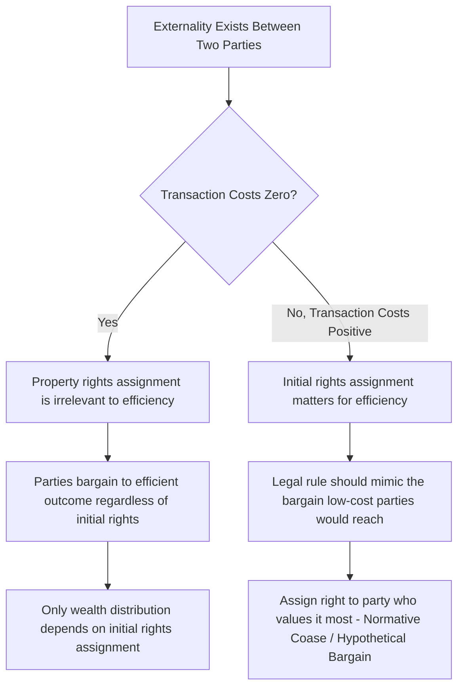

## Formulation and Proof of the Coase Theorem

### Overview

The Coase Theorem, articulated by Ronald Coase in *The Problem of Social Cost* (1960), is the single most influential proposition in law and economics. It challenges the pre-Coasean Pigouvian assumption that externalities necessarily require government intervention (taxes, regulation) to achieve efficient outcomes. Coase's core insight: when property rights are well-defined and transaction costs are zero, private bargaining among affected parties will produce the efficient allocation of resources regardless of the initial legal assignment of rights. The theorem's implication reframes the central legal question from "who caused the harm" to "what is the efficient allocation, and what are the transaction costs of getting there."

### Formal Statement

**Coase Theorem**: If (1) property rights are clearly defined, (2) transaction costs are zero, and (3) there are no wealth effects (or income effects on valuation are negligible), then private bargaining between parties will result in an efficient allocation of resources, and this efficient allocation is *independent of the initial assignment of legal rights*.

A corollary, sometimes called the **Invariance Thesis**, states that only the *distribution* of wealth — not the *efficiency* of the outcome — depends on the initial assignment of rights.

### Setup and Notation

Consider two parties: a factory (F) that emits pollution, and a laundry (L) located nearby whose business is harmed by the pollution. Let:

- $x$ = level of the factory's polluting activity (e.g., units of output, or units of smoke emitted)
- $B(x)$ = factory's benefit (profit) from activity level $x$, with $B'(x) > 0$ but $B''(x) < 0$ (diminishing marginal benefit)
- $D(x)$ = laundry's damage (cost) from activity level $x$, with $D'(x) > 0$ and $D''(x) \geq 0$ (increasing marginal damage)

**Social welfare** (the joint surplus of both parties) is:

$$W(x) = B(x) - D(x)$$

The **efficient level of activity** $x^*$ maximizes $W(x)$. Taking the first-order condition:

$$W'(x^*) = B'(x^*) - D'(x^*) = 0 \implies B'(x^*) = D'(x^*)$$

This is the standard efficiency condition: activity should continue until the factory's **marginal benefit** equals the laundry's **marginal damage** (marginal cost). This is the unique efficient point regardless of who holds legal rights — it depends only on the underlying cost and benefit functions.

### Proof Sketch: Invariance to Initial Rights Assignment

**Case 1: Factory has the right to pollute (no liability)**

The laundry must pay the factory to reduce its activity below the level the factory would otherwise choose (call this $x_F$, the factory's privately optimal, unconstrained level, where $B'(x_F) = 0$).

The laundry is willing to pay up to $D(x_F) - D(x)$ to have the factory reduce activity from $x_F$ to $x$ — this is the damage it avoids.

The factory is willing to accept payment as long as the payment exceeds its lost profit: it will accept a reduction from $x_F$ to $x$ if the payment $\geq B(x_F) - B(x)$.

A mutually beneficial bargain exists at activity level $x$ whenever the laundry's willingness to pay exceeds the factory's required compensation:

$$D(x_F) - D(x) > B(x_F) - B(x)$$

Bargaining will continue (the laundry will keep paying for further reductions) as long as the marginal damage avoided exceeds the marginal profit foregone, i.e., as long as $D'(x) > B'(x)$ at the margin. Parties will negotiate to the point where:

$$B'(x) = D'(x)$$

This is exactly $x^*$, the efficient level. **The factory retains the legal right to pollute, but bargaining still drives activity to the efficient level**, because the laundry has an incentive to "buy out" any unit of pollution where its damage avoided exceeds the factory's profit foregone.

**Case 2: Laundry has the right to be free from pollution (strict liability / injunction)**

Now the factory must pay the laundry for permission to pollute, starting from a baseline of $x = 0$.

The factory is willing to pay up to $B(x) - B(0) = B(x)$ for the right to operate at level $x$.

The laundry will accept payment as long as it exceeds the damage incurred: it will permit activity level $x$ if payment $\geq D(x) - D(0) = D(x)$.

A mutually beneficial bargain exists at activity level $x$ whenever:

$$B(x) - B(0) > D(x) - D(0)$$

Bargaining continues (the factory keeps paying for permission to pollute more) as long as marginal benefit exceeds marginal damage, i.e., as long as $B'(x) > D'(x)$ at the margin. Parties negotiate to:

$$B'(x) = D'(x)$$

**This is the same efficient point $x^*$ as in Case 1.** The legal starting point differs (factory has no right to pollute at all, versus factory has unlimited right to pollute), but the bargained-to outcome is identical.

### Numerical Example

Let $B(x) = 100x - x^2$ (factory profit) and $D(x) = x^2$ (laundry damage), for $x \geq 0$.

**Efficient level**:

$$B'(x) = 100 - 2x, \quad D'(x) = 2x$$

$$100 - 2x = 2x \implies x^* = 25$$

At $x^* = 25$: $B(25) = 100(25) - 625 = 1875$; $D(25) = 625$. Total surplus $W(25) = 1875 - 625 = 1250$.

**Case 1 (factory has right to pollute)**: Factory's unconstrained optimum is where $B'(x) = 0 \implies x_F = 50$. At $x_F = 50$: $B(50) = 2500$, $D(50) = 2500$. Total surplus $W(50) = 0$. The laundry will pay the factory to reduce output from 50 toward 25, since at every unit between 25 and 50, marginal damage avoided ($2x$) exceeds marginal profit foregone ($2x - 100$, in absolute terms $100-2x$... more precisely the laundry's marginal willingness to pay $D'(x)=2x$ exceeds the factory's marginal reservation price $-B'(x) = 2x - 100$ for $x>25$). Bargaining converges to $x = 25$, with a side payment somewhere in the bargaining range that splits the surplus gain of $1250 - 0 = 1250$ between the parties (the exact split depends on relative bargaining power, not covered by the theorem itself).

**Case 2 (laundry has right to be pollution-free)**: Laundry's default is $x = 0$, giving $W(0) = B(0) - D(0) = 0$. The factory will pay the laundry to permit output up to 25, since at every unit between 0 and 25, marginal profit ($100-2x$) exceeds marginal damage ($2x$). Bargaining converges to $x = 25$ again, with the same total surplus of $1250$, again split by relative bargaining power.

**Result**: In both cases, $x^* = 25$ is reached. **Only the direction of the side payment and the resulting wealth distribution differ** — the factory pays the laundry in Case 2, but the laundry pays the factory in Case 1.

### Diagram: Bargaining Convergence to Efficient Point

<svg xmlns="http://www.w3.org/2000/svg" viewBox="0 0 560 400">
<text x="280" y="25" text-anchor="middle" font-size="16" font-weight="bold" fill="#1a1a1a">Coase Theorem: Marginal Benefit = Marginal Damage (svg_diagram)</text>
<line x1="70" y1="340" x2="70" y2="50" stroke="#333" stroke-width="2" />
<line x1="70" y1="340" x2="500" y2="340" stroke="#333" stroke-width="2" />
<text x="35" y="55" font-size="13" fill="#333">$/unit</text>
<text x="470" y="365" font-size="13" fill="#333">Activity level x</text>
<line x1="90" y1="80" x2="470" y2="320" stroke="#2980b9" stroke-width="2.5" />
<text x="380" y="290" font-size="13" fill="#2980b9" font-weight="bold">MB(x) = B'(x)</text>
<line x1="90" y1="320" x2="470" y2="80" stroke="#c0392b" stroke-width="2.5" />
<text x="380" y="105" font-size="13" fill="#c0392b" font-weight="bold">MD(x) = D'(x)</text>
<circle cx="280" cy="200" r="6" fill="#1a1a1a" />
<text x="290" y="195" font-size="13" fill="#1a1a1a" font-weight="bold">x* (efficient)</text>
<line x1="280" y1="200" x2="280" y2="340" stroke="#666" stroke-width="1" stroke-dasharray="4,3" />
<text x="150" y="360" font-size="11" fill="#333">Factory has right: bargain from x_F leftward to x*</text>
<text x="150" y="378" font-size="11" fill="#333">Laundry has right: bargain from 0 rightward to x*</text>
</svg>

### The Role of Transaction Costs

The theorem's stated conditions (zero transaction costs, well-defined property rights, no wealth effects) are explicitly counterfactual — Coase's actual argument was the reverse of how the "theorem" is popularly invoked. Coase's own emphasis in the 1960 article was that **since transaction costs are never actually zero in the real world**, the assignment of legal rights *does* matter, because it determines which party must bear the cost of bargaining or, if bargaining fails, which allocation persists by default. The theorem is best understood as a baseline or benchmark against which real-world market failures (positive transaction costs) can be measured, rather than as a claim about real-world outcomes.

This produces the theorem's central practical implication for legal design: **courts and legislators, in a world of positive transaction costs, should assign rights as if mimicking the bargain that low-transaction-cost parties would have reached** — i.e., assign the right to the party who values it most, since that is often what bargaining would produce anyway, and doing so economizes on the transaction costs that would otherwise be needed to correct an inefficient assignment.

### Necessary Conditions and Their Fragility

1. **Well-defined and enforceable property rights**: bargaining requires clear entitlements to trade; ambiguous rights (e.g., contested or unclear liability rules) themselves constitute a transaction cost
2. **Zero transaction costs**: includes costs of identifying the other party, negotiating, drafting and enforcing an agreement, and monitoring compliance — in practice, virtually always positive, and rising with the number of affected parties (a key reason the theorem's predictions break down for diffuse externalities like air pollution affecting many households)
3. **No wealth effects / no income effects on valuation**: the theorem's invariance result assumes each party's valuation of the entitlement does not change based on whether they start out holding it or not. If wealth effects are present, the *efficient* level $x^*$ itself may differ slightly depending on initial rights assignment, because $B(x)$ and $D(x)$ could shift with wealth. [Inference: the practical magnitude of wealth-effect deviations from strict invariance is generally treated as a second-order theoretical qualification rather than a first-order empirical concern in most applied law and economics contexts, though this is itself a point of some debate in the literature.]
4. **No strategic behavior / holdout problems**: with more than two parties, bargaining can fail due to free-rider and holdout problems even when aggregate transaction costs would otherwise be low — a limitation Coase's original two-party framework does not fully address

### Relationship to the Pareto Efficiency Criterion

The Coase Theorem's efficient outcome is a **Pareto-efficient** allocation in the sense that no further mutually beneficial trade remains available — at $x^*$, no reallocation of activity level can make one party better off without making the other worse off, holding the agreed side payment fixed. It is important to distinguish this from a claim about the resulting *distribution*: the theorem is silent on which distribution (i.e., which split of the bargaining surplus, or which of the two initial rights-based endowments) is more just or preferable — that is a normative question the theorem does not answer, addressed instead by distributive justice frameworks outside the theorem's scope.

### Common Misapplications and Clarifications

- **Misapplication**: "Coase says markets will always fix externalities, so regulation is never needed." — Incorrect; the theorem's own premises (zero transaction costs) are explicitly the exception, not the rule, and Coase's broader project (transaction cost economics) is precisely about analyzing when bargaining will fail.
- **Misapplication**: "Since the outcome is efficient either way, courts shouldn't worry about which party gets the right." — Incorrect in any world with positive transaction costs (i.e., the real world); rights assignment affects both efficiency (when bargaining is costly or fails) and distribution (always).
- **Clarification**: The theorem does not claim bargaining is costless in practice, or that all externality problems will resolve via private ordering — it isolates a benchmark case to identify precisely which frictions (transaction costs, holdout problems, information asymmetries) are doing the analytical work when bargaining fails to reach efficiency.

### Related Topics

- Transaction costs: taxonomy and measurement (search, bargaining, enforcement costs)
- Property rules vs. liability rules (Calabresi and Melamed framework)
- Externalities and Pigouvian taxation as an alternative to bargaining
- Holdout and free-rider problems in multi-party bargaining
- The Cathedral: choosing between property rules, liability rules, and inalienability
- Normative Coase Theorem and efficient legal rule design under positive transaction costs
- Nuisance law and the assignment of entitlements in *Boomer v. Atlantic Cement* and similar doctrine