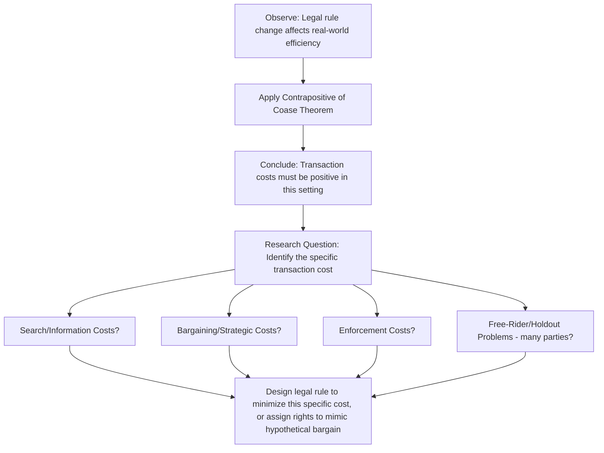

## The Zero Transaction Cost Benchmark

### Overview

The zero transaction cost benchmark is the theoretical device that gives the Coase Theorem its analytical power. Rather than being a description of the real world, it functions as a **counterfactual baseline**: a world without frictions against which real-world institutional arrangements, legal rules, and market failures can be measured and understood. The benchmark's central methodological contribution is to isolate transaction costs as *the* variable explaining why legal rules matter for efficiency — if the world had zero transaction costs, legal rules would only matter for distribution, not efficiency. Since legal rules manifestly do matter for efficiency in the real world, transaction costs must be positive, and identifying their nature, magnitude, and location becomes the central task of applied law and economics.

### What "Zero Transaction Costs" Actually Means

A rigorous statement of the zero transaction cost assumption requires unpacking it into its component parts, since "transaction cost" is a composite term covering several distinct frictions:

1. **Search and information costs**: zero cost of identifying who holds a given entitlement, who is affected by an externality, and what the relevant valuations are
2. **Bargaining costs**: zero cost of negotiating terms — no time cost, no cost of communication, no strategic delay
3. **Enforcement costs**: zero cost of drafting, monitoring, and enforcing any agreement reached, including zero risk of breach
4. **Free-rider/holdout costs**: implicitly, zero cost of coordinating among multiple affected parties (the theorem's original two-party framing avoids this problem, but multi-party extensions must assume it away)

Formally, the benchmark models the bargaining outcome as if the two parties can select any point on the Pareto frontier via costless Coasean bargaining, converging to the surplus-maximizing point:

$$x^* = \arg\max_x [B(x) - D(x)]$$

with the realized division of the resulting surplus determined by a bargaining solution (e.g., Nash bargaining), *not* by the assignment of the underlying entitlement.

### Nash Bargaining Solution Under the Zero-Cost Benchmark

Under zero transaction costs, a common formalization of *how* the surplus is split (though not *whether* the parties reach $x^*$) uses the **Nash Bargaining Solution**. Let $\pi_F$ and $\pi_L$ denote the payoffs to factory and laundry after bargaining, and let $d_F, d_L$ be their disagreement (threat) payoffs. The Nash solution maximizes the product of surplus over disagreement payoffs:

$$\max_{\pi_F, \pi_L} (\pi_F - d_F)(\pi_L - d_L) \quad \text{subject to } \pi_F + \pi_L = W(x^*)$$

With symmetric bargaining power, this yields an equal split of the surplus gain above the disagreement point. Critically, **the disagreement point $d_F, d_L$ shifts depending on which party holds the initial entitlement** — this is precisely why the *distribution* of wealth changes with rights assignment even while the *efficient quantity* $x^*$ does not.

### Why the Benchmark Isolates Transaction Costs as the Key Variable

The logical structure of Coase's argument can be represented as a conditional chain:

$$\text{If TC} = 0 \text{ and rights well-defined} \implies \text{Efficient outcome regardless of rights assignment}$$

Taking the **contrapositive**: if we observe that rights assignment *does* affect efficiency (as it demonstrably does in real markets — differing environmental liability regimes produce different pollution levels, for example), then it must be that transaction costs are **not** zero. This logical move is Coase's central methodological achievement: it converts an abstract question ("does the market work efficiently?") into an empirical research program ("what specific transaction costs are preventing efficient bargaining in this context, and how large are they?").

### The Benchmark as a Diagnostic Tool: Two-Party vs. Many-Party Settings

The zero transaction cost benchmark performs very differently depending on the number of affected parties, which is why the benchmark is most useful as a *diagnostic* rather than a *predictive* tool.

**Two-party bilateral externalities** (factory and single adjacent laundry): transaction costs are plausibly low in practice. Direct negotiation, clear parties, single agreement to draft. Real-world bargaining often does occur close to the Coasean prediction (e.g., private agreements between neighboring landowners, easements, restrictive covenants).

**Many-party diffuse externalities** (a factory's air pollution affecting an entire city, climate change affecting billions): transaction costs are, in practice, enormous or prohibitive:

- Search costs: identifying every affected party is often infeasible
- Free-rider problems: each affected party has an incentive to let others fund the bargaining/enforcement effort
- Holdout problems: any single party (especially the polluter, if multiple polluters exist) can extract disproportionate value by refusing to agree
- Enforcement costs: monitoring compliance across many dispersed parties is costly

**Example comparison**: A dispute between two adjacent landowners over a shared fence or drainage issue is a canonical low-transaction-cost setting where private bargaining (or simple default rules that the parties can contract around) typically suffices — courts often decline to intervene heavily, consistent with a Coasean prediction that the parties will reach efficient agreement regardless of the default rule. By contrast, a dispute over greenhouse gas emissions affecting the global population cannot plausibly be resolved by private Coasean bargaining given the transaction costs of coordinating among billions of affected parties and unknown future generations — this is precisely why climate change is treated as a paradigm case for regulatory (Pigouvian tax, cap-and-trade) rather than pure private-bargaining solutions.

### Table: Transaction Cost Magnitude Across Settings

| Setting | Number of Parties | Search Cost | Holdout Risk | Predicted Bargaining Outcome |
| --- | --- | --- | --- | --- |
| Adjacent landowner boundary dispute | 2 | Low | Low | Bargaining likely reaches efficient outcome; legal default matters little for efficiency |
| Factory vs. single neighboring business | 2 | Low | Low-Moderate | Bargaining plausible; Coasean benchmark reasonably descriptive |
| Noise pollution in a small apartment building | Few (5-20) | Moderate | Moderate | Bargaining possible but may require collective coordination (e.g., condo association) |
| Urban air pollution affecting a city | Thousands | High | High | Private bargaining infeasible; regulation/Pigouvian tax typically preferred |
| Global externality (climate change, ozone depletion) | Billions, including future generations | Extremely high | Extremely high | Private bargaining essentially impossible; international regulatory frameworks required |

### Using the Benchmark Normatively: The "Hypothetical Market" or "Mimicking the Market" Approach

Since the zero transaction cost world would allocate the entitlement to whichever party values it most (because the low-value holder would always sell to the high-value holder), the benchmark generates a normative prescription for real-world legal design under positive transaction costs:

> **Normative Coase Corollary**: When transaction costs prevent actual bargaining, courts and legislators should assign the initial legal entitlement to the party who would have acquired it in a zero-transaction-cost world — i.e., to the party who values it most highly — because doing so achieves the efficient outcome directly, without relying on (costly, potentially failing) bargaining to correct a misallocation.

This is the theoretical foundation for:

- **Calabresi and Melamed's "cheapest cost avoider"** principle in tort law: assign liability to whichever party can prevent the harm at lowest cost, mimicking what bargaining would produce
- **Efficient breach doctrine** in contract law: default remedies (expectation damages) are structured to permit breach when breach is efficient, approximating what parties would have bargained for ex ante if renegotiation were costless
- **Default rules in contract law generally**: "penalty default rules" and "majoritarian defaults" are designed to fill contractual gaps the way most similarly situated parties would have filled them via costless bargaining, minimizing the transaction costs of explicit negotiation over every contingency

### Formal Distinction: Coasean Bargaining Region

Given an initial entitlement held by party $i$, define the **Coasean bargaining region** as the set of alternative allocations that make both parties at least as well off as the status quo (i.e., the set of Pareto improvements available via bargaining). Under zero transaction costs, the parties will bargain to any point along the **contract curve** — the set of Pareto-efficient allocations — and specifically to the point that also maximizes joint surplus, since any point off this curve leaves unexploited gains from trade.

Positive transaction costs shrink this bargaining region: a transaction cost $c$ means a trade will only occur if the joint gain from moving to the efficient point exceeds $c$. This produces a simple decision rule:

$$\text{Bargaining succeeds} \iff W(x^*) - W(x_0) > c$$

where $x_0$ is the status quo (default) activity level under the initial entitlement, and $c$ is the transaction cost of reaching agreement. **This inequality is the precise sense in which "small" transaction costs can still block efficient reallocation when the underlying stakes are also small** — a point often missed in casual applications of the theorem, since even modest transaction costs can exceed modest bargaining surplus.

### Critiques and Limitations of the Benchmark

- **The benchmark is not directly testable**: because zero transaction costs never actually occur, the theorem's core claim cannot be directly falsified by observing real markets — it can only be used indirectly, via the contrapositive reasoning described above
- **Assumes away strategic behavior**: real bargaining, even with only two parties and low search/enforcement costs, can fail due to asymmetric information (each party may not know the other's true valuation) and strategic misrepresentation — a friction sometimes categorized separately from "transaction costs" narrowly defined, but which produces functionally identical bargaining failures
- **The benchmark's normative extension is contested**: critics (particularly from the Critical Legal Studies and some behavioral law and economics traditions) argue that "assign the entitlement to the highest-value user" begs the question of how value is measured — willingness-to-pay is itself a function of wealth, so using it as an efficiency criterion under the benchmark can encode existing wealth inequality into legal rule design. [This is a normative/contested critique, not a claim about the positive economics of the theorem itself.]
- **Wealth effects reintroduce rights-assignment sensitivity even at zero transaction costs**: as noted in the formulation of the theorem itself, if valuations are wealth-dependent, the "efficient" quantity $x^*$ can shift slightly depending on which party is enriched by holding the initial entitlement, technically breaking strict invariance even in the zero-transaction-cost limit. [Inference: this is a widely recognized theoretical qualification in the literature; its practical/quantitative significance for most legal contexts is treated as secondary to the transaction-cost analysis itself, though some scholars weight it more heavily.]

### Related Topics

- Formulation and proof of the Coase Theorem
- Taxonomy of transaction costs: search, bargaining, and enforcement costs
- Property rules, liability rules, and inalienability (Calabresi-Melamed framework)
- Holdout problems and eminent domain justification
- Free-rider problems and collective action (Olson)
- Default rules and penalty defaults in contract law
- Pigouvian taxation as a substitute for failed Coasean bargaining
- Cheapest cost avoider and efficient liability assignment in tort law