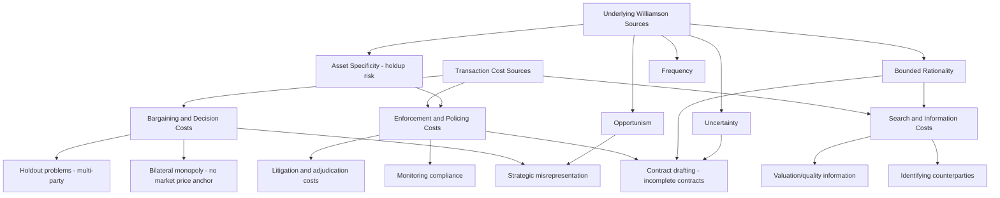

## Sources and Types of Transaction Costs

### Overview

Transaction costs are the frictions that prevent parties from costlessly negotiating, executing, and enforcing agreements to reallocate resources — the very costs the Coase Theorem assumes away in its zero-cost benchmark. Because real-world transaction costs are never zero, identifying their specific sources and magnitudes is the central empirical and analytical task of applied law and economics: it determines when private bargaining can be relied upon to achieve efficiency and when legal intervention (property rule protection, liability rules, regulation, or default contract terms) is needed to substitute for or reduce the cost of bargaining.

### Formal Definition

Following the taxonomy developed by Coase, Williamson, and subsequent transaction cost economics literature, a **transaction cost** is any cost of using the market (or, more broadly, any cost of coordinating economic activity) that would not exist if information were perfect, parties were perfectly rational and honest, and enforcement were costless and instantaneous. Transaction costs can be represented as reducing the net surplus available from an otherwise mutually beneficial trade:

$$\text{Net gain from trade} = W(x^*) - W(x_0) - TC$$

where $TC$ is the aggregate transaction cost of reaching and enforcing the efficient reallocation. A trade occurs only if this net gain is positive; otherwise, the parties remain at the (possibly inefficient) status quo $x_0$, and the initial legal rights assignment determines the persisting outcome.

### Primary Taxonomy: Three Core Categories

The standard taxonomy divides transaction costs into three sequential stages of a transaction, following Dahlman's (1979) influential decomposition:

#### 1. Search and Information Costs

The costs of identifying trading partners, discovering their identity, locating relevant goods or rights, and acquiring information about quality, value, and preferences.

- **Identifying the counterparty**: in a bilateral monopoly nuisance dispute, the parties are known to each other; in diffuse pollution affecting thousands of downwind residents, identifying every affected party is itself costly or infeasible
- **Valuation information**: each party's true willingness to pay/accept is private information; discovering it requires costly investigation, disclosure, or inference
- **Quality/attribute information**: in markets for goods or legal entitlements, verifying the true characteristics of what is being exchanged (e.g., verifying that a patent is valid before licensing it) requires costly due diligence

**Legal relevance**: mandatory disclosure regimes (securities law, consumer protection, environmental right-to-know statutes) function economically as legal interventions designed to reduce search/information transaction costs, thereby expanding the range of settings in which private bargaining can approximate the Coasean benchmark.

#### 2. Bargaining and Decision Costs

The costs of the negotiation process itself, including the opportunity cost of time spent negotiating, the cost of resolving conflicting demands, and costs arising from **strategic behavior**.

- **Bilateral monopoly bargaining costs**: when only one buyer and one seller exist for a given entitlement (the canonical two-party nuisance case), there is no market price to anchor negotiations, so the bargaining range itself (the zone between each party's reservation value) must be divided through costly, often protracted negotiation
- **Strategic misrepresentation**: each party has an incentive to understate their true valuation (if buying) or overstate it (if selling) to capture more of the bargaining surplus, and resolving this asymmetric information problem is itself costly and can cause bargaining to fail entirely even when a mutually beneficial trade exists (a result formalized in mechanism design literature — the Myerson-Satterthwaite impossibility theorem shows that under private information, no bargaining mechanism can guarantee efficient trade while remaining individually rational and budget-balanced)
- **Holdout problems**: when a transaction requires the consent of multiple parties (e.g., assembling contiguous parcels of land for a large project), any single party can strategically withhold consent to extract a disproportionate share of the surplus, potentially causing efficient assembly to fail — this is the standard economic justification for eminent domain as a substitute for costly multi-party bargaining

#### 3. Enforcement and Policing Costs

The costs of ensuring that an agreement, once reached, is actually carried out — monitoring compliance, detecting breach, and pursuing legal or extralegal remedies.

- **Monitoring costs**: verifying that a counterparty is complying with a negotiated agreement (e.g., verifying a factory actually reduced emissions to the agreed level) requires ongoing measurement, which is itself costly, especially for outcomes that are difficult to observe or verify
- **Litigation and adjudication costs**: if a dispute over compliance arises, resolving it via courts imposes attorney fees, court costs, delay, and the risk of erroneous judicial fact-finding
- **Contract drafting costs**: anticipating and specifying remedies for every possible contingency (breach, force majeure, changed circumstances) in a written agreement is costly, which is why real contracts are typically "incomplete" — a foundational premise of incomplete contract theory (Grossman-Hart-Moore) and the economic analysis of default contract rules

### Expanded Taxonomy: Oliver Williamson's Institutional Sources

Williamson's transaction cost economics identifies underlying *behavioral* and *environmental* conditions that generate the cost categories above, providing a causal explanation for why transaction costs arise in the first place:

**Behavioral assumptions:**

- **Bounded rationality**: parties cannot costlessly anticipate and contract for every future contingency, generating incomplete contracts and the associated costs of renegotiation or dispute when unanticipated states occur
- **Opportunism**: parties may act in self-interest with guile — misrepresenting information, shirking on unobservable performance dimensions, or reneging when it becomes advantageous — requiring costly monitoring and enforcement mechanisms to deter

**Environmental/transactional attributes:**

- **Asset specificity**: the degree to which an investment made for a particular transaction has significantly lower value in its next-best alternative use. High asset specificity creates a **hold-up problem**: once a party has made a relationship-specific investment (e.g., a plant built to supply a single customer), the counterparty can behave opportunistically post-investment, knowing the investing party has little outside option — this generates governance costs (long-term contracts, vertical integration) to protect against ex post opportunism
- **Uncertainty**: greater uncertainty about future states of the world increases the cost of drafting complete contracts and increases the likelihood that unanticipated contingencies will require costly renegotiation
- **Frequency**: transactions that recur frequently can justify greater investment in specialized governance structures (relational contracts, dedicated dispute-resolution mechanisms) since the fixed cost of establishing such structures is amortized over more transactions

### Free-Rider and Holdout Problems as Special Cases

Two collective-action-related transaction costs deserve separate treatment because they arise specifically in **multi-party** settings and do not reduce to simple search, bargaining, or enforcement costs individually:

**Free-rider problem**: when a good or outcome (e.g., pollution abatement, a public good) benefits many parties, each individual has an incentive to let others bear the cost of achieving it, since they cannot be excluded from the benefit once produced (non-excludability). This causes aggregate bargaining contributions to fall short of the efficient level even when each party individually would prefer the good be provided.

$$\text{Efficient provision}: \sum_i MB_i(x) = MC(x)$$

but each individual, acting non-cooperatively, contributes only up to the point where their *own* marginal benefit equals marginal cost, $MB_i(x) = MC(x)$, systematically under-providing the public good relative to the social optimum (the sum of all marginal benefits).

**Holdout problem**: the converse difficulty in assembling agreement from multiple parties whose consent is *individually necessary* (e.g., every landowner in a proposed assembly must agree). Because each party recognizes their consent is essential, each can extract a disproportionate share of the surplus by threatening to withhold agreement, and if too many parties adopt this strategy, the transaction can collapse even though it would be efficient overall (each party trying to capture more of a shrinking pie causes the pie itself to disappear).

**Example**: Assembling 50 contiguous parcels for a rail line: if all 50 owners must agree, and each owner recognizes that their individual parcel is essential to the entire project, each has an incentive to hold out for a price approaching the full project's surplus value — a coordination failure that eminent domain (a legal tool that removes the holdout option by allowing forced sale at fair market value) is specifically designed to solve, at the cost of removing the affected parties' ability to capture bargaining surplus above market value.

### Asymmetric Information as a Distinct Transaction Cost Category

Beyond simple search costs, **asymmetric information** between the parties to a potential bargain constitutes a formally distinct barrier, studied extensively in mechanism design and information economics:

- **Adverse selection**: when one party has private information about quality or type before the transaction (e.g., a seller knows a plot of land is more contaminated than the buyer realizes), the uninformed party's inability to verify quality can cause efficient trades to fail or markets to unravel entirely (the "lemons problem," per Akerlof)
- **Moral hazard**: when a party's post-agreement behavior is unobservable or costly to verify (e.g., whether a polluter is actually complying with an agreed abatement level), this generates the enforcement/monitoring transaction costs described above
- **Signaling and screening costs**: informed parties may incur costly actions to credibly signal private information (e.g., warranties, third-party certification), and uninformed parties may design costly screening mechanisms (menus of contracts) to induce self-selection — both are real resource costs attributable to the underlying information asymmetry

### Table: Transaction Cost Category vs. Typical Legal Response

| Transaction Cost Type | Typical Magnitude Driver | Common Legal/Institutional Response |
| --- | --- | --- |
| Search/information costs | Number of affected parties; complexity of valuation | Mandatory disclosure rules; public registries (land title, patent registries) |
| Bilateral bargaining costs | Absence of market price benchmark | Default contract terms; standard form contracts |
| Strategic misrepresentation | Degree of information asymmetry | Mechanism design (auctions); reputation systems; warranties |
| Holdout problems | Number of parties whose consent is individually necessary | Eminent domain; majority-rule statutes (e.g., condo association bylaws) |
| Free-rider problems | Non-excludability of the benefit | Public provision; mandatory taxation/assessment; Pigouvian subsidies |
| Enforcement/monitoring costs | Observability of compliance | Liquidated damages clauses; regulatory inspection regimes; bonding requirements |
| Asset-specificity/holdup | Degree of relationship-specific investment | Long-term contracts; vertical integration; specific performance remedies |

### Measuring Transaction Costs Empirically

Transaction costs are notoriously difficult to observe directly, since (unlike prices) they typically are not recorded in any transaction ledger. Standard empirical approaches include:

1. **Direct cost estimation**: measuring observable proxies such as legal fees, brokerage commissions, time spent in negotiation, or regulatory compliance costs
2. **Inferring transaction costs from institutional choice**: following Williamson's "discriminating alignment hypothesis," observing which governance structure parties choose (spot market, long-term contract, vertical integration) reveals information about the relative transaction costs each structure is designed to economize on — firms that vertically integrate are inferred to face high transaction costs of arm's-length contracting for that input
3. **Natural experiments comparing outcomes across transaction-cost regimes**: comparing bargaining outcomes or settlement rates across jurisdictions with different procedural rules (e.g., fee-shifting rules, discovery cost regimes) to estimate how legal rules that raise or lower bargaining/enforcement costs affect settlement versus litigation rates

[Inference: precise quantitative estimates of transaction cost magnitudes are highly context-dependent and often contested in the empirical law and economics literature; the qualitative taxonomy above is well-established, but assigning specific dollar magnitudes to categories like "holdout risk" or "search costs" in a given setting typically requires case-specific empirical investigation rather than general benchmarks.]

### Related Topics

- Formulation and proof of the Coase Theorem
- The zero transaction cost benchmark
- Property rules, liability rules, and inalienability (Calabresi-Melamed framework)
- Eminent domain and the holdout problem
- Asymmetric information: adverse selection and moral hazard
- Incomplete contract theory and the Grossman-Hart-Moore framework
- Oliver Williamson's transaction cost economics and the theory of the firm
- Mechanism design and the Myerson-Satterthwaite impossibility theorem