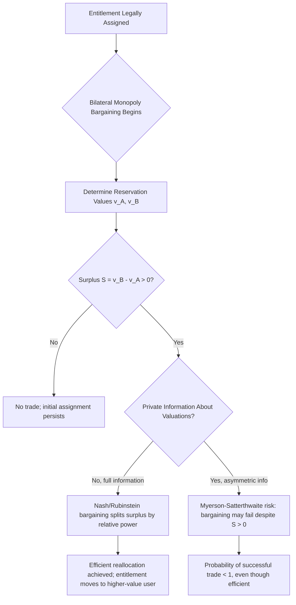

## Bargaining and the Allocation of Entitlements

### Overview

Once a legal system assigns an entitlement — the right to pollute, the right to quiet enjoyment, the right to breach a contract, the right to exclude — the question of *how* the affected parties bargain over that entitlement, and *whether* they will bargain at all, becomes a distinct analytical problem from the initial assignment itself. This topic examines the bargaining process that the Coase Theorem's zero-transaction-cost benchmark abstracts away: bargaining power, the structure of bilateral monopoly, the surplus-division problem, and how positive transaction costs and strategic behavior determine whether bargaining actually reallocates entitlements toward efficient use.

### The Bargaining Problem Formalized

Consider an entitlement initially assigned to party $A$, with a reservation value (minimum acceptable price) $v_A$, and a potential buyer $B$ with a maximum willingness to pay $v_B$. A mutually beneficial trade exists whenever:

$$v_B > v_A$$

The **bargaining surplus** (gains from trade) is:

$$S = v_B - v_A$$

Under the zero-transaction-cost benchmark, this surplus $S$ is realized whenever it is positive, with the *division* of $S$ between $A$ and $B$ determined by relative bargaining power rather than by economic efficiency considerations. This division problem — indeterminate under pure efficiency logic — is precisely why the Coase Theorem is silent on distribution even while being determinate on efficiency.

### Bilateral Monopoly: The Canonical Bargaining Structure

Most Coasean bargaining scenarios in legal contexts (a factory and a single adjacent landowner, two disputing neighbors, a patent holder and single infringer) exhibit **bilateral monopoly**: exactly one seller and one buyer, with no outside market price to serve as a bargaining anchor. This absence of a market-clearing price is the structural reason two-party bargaining costs are categorically different from costs in thick markets with many buyers and sellers.

**Key features of bilateral monopoly bargaining:**

1. **Indeterminate price within the bargaining range** $[v_A, v_B]$ — standard supply-demand equilibrium analysis does not apply, since there is no market of alternative counterparties disciplining the price
2. **Bargaining power matters for distribution** but not (under the zero-cost benchmark) for whether the efficient trade occurs
3. **Strategic behavior risk is highest here**, because with only one counterparty, each side has maximal incentive to misrepresent their reservation value to capture more surplus, and no outside option disciplines this behavior

### Formal Bargaining Solutions

#### Nash Bargaining Solution

Given disagreement payoffs $d_A, d_B$ (what each party gets if no agreement is reached) and a bargaining surplus to divide, the **Nash Bargaining Solution** selects the payoff split $(\pi_A, \pi_B)$ that maximizes the product of each party's gain over their disagreement point:

$$\max_{\pi_A, \pi_B} (\pi_A - d_A)(\pi_B - d_B) \quad \text{s.t. } \pi_A + \pi_B = v_B$$

With symmetric bargaining power (the standard simplifying assumption), this yields:

$$\pi_A = d_A + \frac{S}{2}, \quad \pi_B = d_B + \frac{S}{2}$$

— an equal split of the surplus above each party's disagreement payoff. Asymmetric bargaining power is modeled with a weighting parameter $\alpha \in [0,1]$:

$$\max_{\pi_A, \pi_B} (\pi_A - d_A)^\alpha (\pi_B - d_B)^{1-\alpha}$$

where $\alpha$ closer to 1 reflects greater bargaining power for party $A$, yielding $\pi_A = d_A + \alpha S$.

#### Rubinstein Alternating-Offers Bargaining

A non-cooperative, dynamic foundation for the Nash solution: two parties alternate making offers over an entitlement, with each round of delay imposing a discount cost (impatience) captured by discount factors $\delta_A, \delta_B \in (0,1)$. As the time between offers shrinks to zero, the unique subgame-perfect equilibrium split converges to:

$$\pi_A = \frac{1 - \delta_B}{1 - \delta_A \delta_B} \cdot S$$

**Key insight for legal analysis**: the party who is more patient (higher discount factor, i.e., who can better tolerate delay) obtains a larger share of the bargaining surplus. This has direct application to litigation settlement bargaining: a wealthier or better-capitalized litigant who can tolerate delay typically extracts better settlement terms than a resource-constrained party under financial pressure to settle quickly — a well-documented asymmetry in civil litigation.

### Diagram: Bargaining Range Under Bilateral Monopoly

<svg xmlns="http://www.w3.org/2000/svg" viewBox="0 0 560 240">
<text x="280" y="25" text-anchor="middle" font-size="16" font-weight="bold" fill="#1a1a1a">Bargaining Range (svg_diagram)</text>
<line x1="60" y1="120" x2="500" y2="120" stroke="#333" stroke-width="3" />
<circle cx="150" cy="120" r="6" fill="#2980b9" />
<text x="120" y="150" font-size="13" fill="#2980b9" font-weight="bold">v_A (Seller's reservation)</text>
<circle cx="410" cy="120" r="6" fill="#c0392b" />
<text x="360" y="150" font-size="13" fill="#c0392b" font-weight="bold">v_B (Buyer's max WTP)</text>
<line x1="150" y1="90" x2="410" y2="90" stroke="#27ae60" stroke-width="4" />
<text x="230" y="80" font-size="13" fill="#27ae60" font-weight="bold">Bargaining Range (Surplus S)</text>
<circle cx="280" cy="120" r="5" fill="#1a1a1a" />
<text x="255" y="105" font-size="11" fill="#1a1a1a">Nash split (symmetric power)</text>
<line x1="150" y1="100" x2="150" y2="140" stroke="#2980b9" stroke-width="1" />
<line x1="410" y1="100" x2="410" y2="140" stroke="#c0392b" stroke-width="1" />
</svg>

### Strategic Behavior and Bargaining Failure

The zero-transaction-cost benchmark assumes bargaining always succeeds when a positive surplus exists. In practice, **asymmetric information about reservation values** can cause bargaining to fail even when $v_B > v_A$ is true, because:

- Neither party can verify the other's true reservation value
- Each has an incentive to misrepresent their own value (the seller claims $v_A$ is higher than it is; the buyer claims $v_B$ is lower)
- If both parties adopt aggressive bargaining postures, negotiations can break down entirely

**Myerson-Satterthwaite Impossibility Theorem**: formalizes this problem, showing that when both parties' valuations are private information drawn from a continuous distribution, **no bargaining mechanism exists that simultaneously guarantees**: (1) trade occurs whenever it is efficient, (2) both parties voluntarily participate (individual rationality), and (3) no outside subsidy is needed (budget balance). This is a rigorous impossibility result, not merely an empirical observation — it demonstrates that positive-probability bargaining failure is a structural feature of bilateral monopoly under private information, not just a real-world imperfection layered on top of an otherwise-functioning Coasean mechanism.

### Bargaining Power: Sources and Legal Manipulability

Several factors determine relative bargaining power ($\alpha$ in the asymmetric Nash framework), many of which are directly affected by legal rules:

1. **Outside options / disagreement payoffs**: a party with a better fallback position (alternative trading partners, ability to walk away) bargains from strength. Legal rules affecting outside options — e.g., antitrust rules preventing a monopsonist buyer, or default rules determining what happens absent agreement — directly shift bargaining power.
2. **Patience / ability to tolerate delay**: as shown in the Rubinstein model, wealth and access to capital (which reduce the cost of delay) translate into bargaining power. Legal rules on interim relief, preliminary injunctions, and interest on judgments affect each party's cost of delay during litigation-related bargaining.
3. **Information**: a party with better information about the true value of the entitlement, the probability of prevailing at trial, or the counterparty's reservation value has a structural advantage — legal discovery rules directly affect this by equalizing (or failing to equalize) information between parties.
4. **Threat credibility**: the credibility of a party's threat to withhold agreement (walk away, litigate, breach) shapes the bargaining outcome — procedural rules affecting the cost and probability of success of litigation (fee-shifting rules, burden of proof standards) directly affect threat credibility.

### Application: Settlement Bargaining as Entitlement Allocation

Litigation settlement is a direct application of entitlement bargaining theory: the initial legal entitlement (who is liable, and for how much) is contested, and the parties bargain over a settlement in the shadow of the expected trial outcome.

Let $p$ = plaintiff's estimated probability of prevailing at trial, $J$ = judgment amount if plaintiff prevails, and $C_P, C_D$ = litigation costs for plaintiff and defendant respectively through trial. The plaintiff's expected value of proceeding to trial is:

$$EV_P = pJ - C_P$$

The defendant's expected cost of proceeding to trial is:

$$EV_D = pJ + C_D$$

A **settlement bargaining range** exists whenever $EV_D > EV_P$, i.e., whenever:

$$pJ + C_D > pJ - C_P \iff C_D + C_P > 0$$

which is always true — meaning litigation costs alone (regardless of the merits) always create a positive bargaining range, since both parties save their respective litigation costs by settling rather than proceeding to trial. This is the standard microeconomic explanation for why the overwhelming majority of civil disputes settle rather than proceed to judgment, and it directly parallels the Coasean logic: litigation costs function as the "transaction cost" whose avoidance creates the settlement surplus.

**Divergent expectations model**: if plaintiff and defendant have differing beliefs about $p$ (plaintiff believes $p_P$, defendant believes $p_D < p_P$), the bargaining range shrinks and can close entirely or reverse, explaining why cases with significant factual or legal uncertainty (where reasonable parties can form divergent probability estimates) are more likely to proceed to trial than cases with clear-cut facts. This is the core insight of the **Priest-Klein selection hypothesis** regarding which disputes are litigated to judgment versus settled.

### Entitlement Allocation and the Endowment Effect

Behavioral law and economics identifies a systematic departure from the standard bargaining model: the **endowment effect**, in which parties value an entitlement more highly simply because they currently possess it, independent of any wealth effect. This means $v_A$ (measured as willingness-to-accept, WTA, for someone who holds the entitlement) systematically exceeds what the same party's willingness-to-pay (WTP) would have been had they not held it — a gap not predicted by the standard rational-actor model, which assumes WTA and WTP should be approximately equal absent significant wealth effects or transaction costs.

**Legal implication**: if endowment effects are systematic and significant, initial entitlement assignment can affect the *ultimate resting allocation* even in a low-transaction-cost bargaining environment, because the party currently holding the entitlement will demand a higher price than a Coasean bargaining model (absent behavioral effects) would predict, potentially preventing efficient reallocation to a nominally higher-value user. [Inference: the magnitude and universality of the endowment effect across different types of entitlements and bargaining contexts remains debated in the experimental economics literature; some studies find it attenuates or disappears with market experience and repeated trading, while others find it persistent, particularly for entitlements linked to identity, safety, or environmental goods.]

### Multi-Party Extensions: Coalition Bargaining

When more than two parties hold interests in an entitlement (e.g., multiple polluters, multiple affected residents), bargaining theory extends into **cooperative game theory**, using solution concepts such as:

- **The Shapley Value**: allocates surplus based on each party's average marginal contribution across all possible orderings of coalition formation, providing a principled (though computationally intensive) method for dividing multi-party bargaining surplus
- **The Core**: the set of allocations that no sub-coalition of parties could improve upon by breaking away and bargaining independently; a non-empty core is a necessary condition for a stable, sustainable multi-party agreement

These frameworks help explain why multi-party Coasean bargaining (e.g., a river-basin water rights allocation among many users, or an international climate agreement among many nations) is structurally harder than two-party bargaining: the number of potential sub-coalitions and blocking strategies grows combinatorially with the number of parties, and empty-core situations (where no stable allocation exists) become increasingly likely.

### Related Topics

- Formulation and proof of the Coase Theorem
- The zero transaction cost benchmark
- Sources and types of transaction costs
- Property rules, liability rules, and inalienability (Calabresi-Melamed framework)
- Settlement bargaining and the economics of litigation (Priest-Klein selection)
- The endowment effect and behavioral law and economics
- Cooperative game theory: the Shapley value and the Core
- Mechanism design and the Myerson-Satterthwaite impossibility theorem