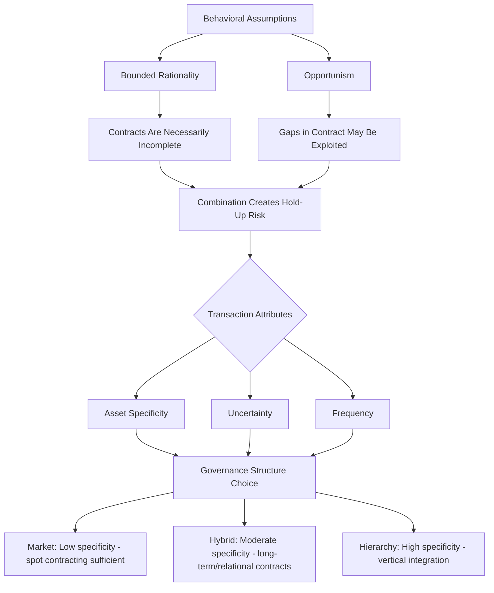

## Transaction Cost Economics and Oliver Williamson

### Overview

Oliver Williamson extended Coase's foundational insight — that firms and markets are alternative institutional arrangements for organizing transactions, chosen based on relative transaction costs — into a comprehensive theory explaining *why particular governance structures* (spot markets, long-term contracts, vertical integration) emerge for particular types of transactions. Williamson's transaction cost economics (TCE), for which he received the 2009 Nobel Memorial Prize in Economic Sciences (shared with Elinor Ostrom), provides the microanalytic tools most directly applicable to corporate law, contract law, and antitrust analysis of vertical arrangements.

### The Core Research Question

Williamson reframed Coase's 1937 question ("why do firms exist?") into a comparative institutional question:

> **Given a transaction with particular characteristics, which governance structure — market, hybrid (long-term contract), or hierarchy (vertical integration) — minimizes the sum of production costs and transaction costs?**

This is Williamson's **discriminating alignment hypothesis**: transactions, which differ in their attributes, are aligned with governance structures, which differ in their cost and competence, in a way that (mostly) economizes on transaction costs.

### The Three Key Dimensions of a Transaction

Williamson identifies three critical attributes along which transactions vary, each of which independently increases the transaction costs of relying on simple spot-market contracting:

#### 1. Asset Specificity

The degree to which an investment made to support a transaction has significantly lower value in its next-best alternative use or by an alternative user. Williamson distinguishes several types:

- **Site specificity**: assets located to minimize transport/inventory costs, immobile once sited (e.g., a power plant built adjacent to a specific coal mine)
- **Physical asset specificity**: equipment or capital designed for a specific transaction (e.g., a die designed to stamp a part for one particular customer's product)
- **Human asset specificity**: firm-specific or relationship-specific skills and knowledge accumulated through experience with a particular counterparty
- **Dedicated assets**: general-purpose investments made only because of a particular customer's demand (would not have been made "but for" the specific transaction)
- **Brand name capital and temporal specificity**: reputational or timing-dependent investments (e.g., perishable goods requiring precisely timed delivery)

**The hold-up problem**: once a relationship-specific investment is sunk, the investing party becomes vulnerable to opportunistic renegotiation by the counterparty, who can threaten to walk away (or demand better terms) knowing the investor has few alternative uses for the specific asset. This transforms an ex ante competitive bidding situation into an ex post bilateral monopoly.

$$\text{Quasi-rent} = \text{Value in current use} - \text{Value in next-best alternative use}$$

The quasi-rent is precisely the amount at risk of opportunistic appropriation post-investment, and its magnitude is what makes asset specificity the central variable in Williamson's framework.

#### 2. Uncertainty

Greater uncertainty about future states of the world increases the number of contingencies a complete contract would need to address, raising the cost of contracting (given bounded rationality) and increasing the likelihood that unanticipated events will require costly renegotiation. Williamson distinguishes:

- **Environmental uncertainty**: unpredictability in the external environment (demand, technology, input costs)
- **Behavioral uncertainty**: unpredictability arising from strategic behavior and information asymmetry between the parties themselves, exacerbated when combined with asset specificity (since uncertainty makes opportunistic renegotiation harder for outsiders, including courts, to detect and punish)

#### 3. Frequency

How often a given type of transaction recurs between the same parties. Higher frequency transactions justify greater investment in specialized governance mechanisms (dedicated relationship managers, customized contract templates, reputation-based informal enforcement), since the fixed cost of establishing such mechanisms is amortized over more repeated transactions.

### The Behavioral Foundations: Bounded Rationality and Opportunism

Williamson's TCE rests on two behavioral assumptions that depart from the frictionless rational-actor model of neoclassical price theory:

**Bounded rationality**: economic actors intend to behave rationally but are limited in their capacity to process information, anticipate future contingencies, and compute optimal responses. This is what makes contracts *necessarily incomplete* — no contract, however carefully drafted, can specify obligations for every possible future state of the world, given the cognitive and drafting costs involved.

**Opportunism**: a subset of economic actors will pursue self-interest "with guile" — through strategic misrepresentation, withholding or distorting information, or reneging on implicit understandings when it becomes advantageous to do so. Critically, Williamson does not assume *all* actors are always opportunistic, only that *some* actors *sometimes* are, and that this possibility cannot be reliably screened out ex ante — meaning governance structures must be designed to be robust to opportunism even if actual opportunistic behavior turns out to be rare.

**The combination is what generates transaction costs**: bounded rationality alone (without opportunism) would only require costly renegotiation when unanticipated states occur, which could in principle proceed cooperatively. Opportunism alone (without bounded rationality) could in principle be fully anticipated and contracted around in advance. It is the *combination* — the fact that contracts are unavoidably incomplete AND some parties may exploit the resulting gaps opportunistically — that creates the core problem TCE is designed to address.

### The Governance Structure Continuum

Williamson organizes governance structures along a continuum, each with distinct cost and incentive properties:

| Governance Form | Incentive Intensity | Administrative Control | Adaptability | Best Suited For |
| --- | --- | --- | --- | --- |
| **Market (spot contract)** | High-powered (residual claimant bears full consequences) | None (arm's length) | High (can switch counterparties freely) | Low asset specificity, low uncertainty, low frequency |
| **Hybrid (long-term contract, franchise, alliance)** | Moderate | Moderate (contractual safeguards, dispute resolution clauses) | Moderate | Moderate asset specificity; needs some continuity but not full integration |
| **Hierarchy (vertical integration)** | Low-powered (internal bureaucratic incentives, weaker high-powered market incentives) | High (fiat/authority to resolve disputes internally) | Low (costly to reverse; internal bureaucratic costs) | High asset specificity, high uncertainty, high frequency |

**The fundamental trade-off**: markets provide superior high-powered incentives (residual claimancy sharpens effort) but are vulnerable to hold-up when asset specificity is high. Hierarchies (vertical integration) eliminate hold-up risk by bringing the transaction inside a single firm subject to managerial fiat, but sacrifice high-powered market incentives and impose bureaucratic costs — Williamson's famous formulation of this trade-off is sometimes summarized as firms trading "incentive intensity" for "control."

### The Governance Choice as a Discrete Structural Alignment

Williamson's key methodological claim, distinguishing TCE from a simple continuous-cost-minimization exercise, is that governance choice is **discrete, not marginal**: the three governance forms are discretely structurally different (each has a coherent, internally consistent bundle of incentive, control, and contract law support characteristics), so the analysis proceeds by comparing which *discrete* structure best economizes on transaction costs for a transaction with given attributes, rather than smoothly optimizing along a continuous governance variable.

### Application: Vertical Integration Decisions and Antitrust

TCE provides the standard economic framework courts and antitrust agencies use to evaluate vertical mergers and vertical restraints (exclusive dealing, tying, resale price maintenance):

- A firm's decision to vertically integrate into an upstream supplier is predicted by TCE to occur when the upstream input involves **high asset specificity** relative to the firm's needs (e.g., a highly customized component available from few alternative suppliers), because arm's-length contracting under high specificity exposes the firm to hold-up risk from the supplier
- **Legal implication for antitrust**: TCE analysis suggests that many vertical integration decisions reflect efficiency-motivated responses to transaction cost problems (avoiding hold-up) rather than anticompetitive foreclosure strategies — this reasoning underlies the generally more permissive modern antitrust treatment of vertical mergers and restraints (compared to horizontal mergers), reflected in cases and guidelines that require a showing of likely anticompetitive foreclosure effects rather than treating vertical integration as inherently suspect

[Inference: the relative empirical importance of TCE-efficiency explanations versus anticompetitive-foreclosure explanations for any specific vertical arrangement is a fact-intensive question that antitrust economists and courts continue to dispute case by case; TCE provides the standard efficiency-side framework but does not itself resolve which explanation predominates in a given case.]

### Application: Employment Contracts and the Theory of the Firm

TCE explains the employment relationship itself as a governance structure chosen to economize on transaction costs of highly firm-specific human capital: rather than repeatedly re-contracting for labor services on a spot basis (costly given firm-specific skills, high uncertainty about future tasks, and high frequency of interaction), firms and workers adopt an **employment relationship** characterized by broad, incomplete authority ("fiat") allowing the employer to direct labor within certain bounds without renegotiating a contract for each new task — precisely the "hierarchy" governance solution TCE predicts for high-frequency, moderately-to-highly specific, uncertain transactions.

### Application: Franchise Contracts as a Hybrid Governance Form

Franchise arrangements are a paradigmatic **hybrid governance structure**, combining market-like high-powered incentives (the franchisee is a residual claimant on local profits) with hierarchy-like control mechanisms (the franchisor imposes standardized operating procedures, brand standards, and monitoring). TCE explains this hybrid as an efficient response to: moderate asset specificity (brand name capital, local market knowledge) combined with a need for some centralized quality control (since one franchisee's quality failures impose negative externalities on the brand's reputation across all other franchisees) — a problem full vertical integration would solve but at the cost of losing high-powered local incentives, and pure market contracting would fail to solve at all.

### Contract Law Doctrines Explained by TCE

Several contract law doctrines can be understood as legal responses to the specific transaction cost problems TCE identifies:

- **Specific performance remedies** are more readily available for contracts involving highly unique or specific assets (real estate, unique goods) precisely because monetary damages inadequately protect against hold-up risk when substitute performance is unavailable
- **Requirements and output contracts** (long-term contracts specifying that one party will buy/sell all its requirements/output from/to the other) are a hybrid governance response to moderate asset specificity, providing continuity without full vertical integration
- **Good faith and fair dealing doctrines** function as a judicial backstop against opportunistic exploitation of contractual gaps arising from bounded rationality — courts fill unanticipated gaps by asking what the parties would have agreed to had they been able to negotiate the contingency, a doctrinal echo of the "hypothetical bargain" logic from Coasean analysis
- **Non-compete and confidentiality clauses** protect against opportunistic exploitation of relationship-specific human capital and information that would otherwise deter firm-specific investment in employee training

### Critiques and Extensions

- **Property rights theory (Grossman-Hart-Moore) as a rival/complementary framework**: rather than focusing on ex post bargaining costs and opportunism as TCE does, the property rights approach emphasizes that ownership of assets confers residual control rights over uses not specified in a contract, and predicts integration decisions based on which party's investment incentives are more important to protect — producing similar predictions to TCE in many cases but from a distinct formal mechanism
- **Empirical testing challenges**: TCE's core theoretical constructs (asset specificity, bounded rationality, opportunism) are difficult to measure directly, so most empirical tests rely on proxies (contract duration, degree of vertical integration by industry) and have produced broadly supportive but not universally decisive evidence. [Inference: the empirical TCE literature is generally regarded as supportive of the theory's qualitative predictions, particularly regarding asset specificity and vertical integration, though the precision and universality of specific quantitative predictions remains an active area of research and some contested findings exist across industries and time periods.]
- **Under-emphasis on trust and relational norms**: critics (particularly from economic sociology, e.g., Granovetter's embeddedness critique) argue TCE's focus on opportunism understates the role of trust, reputation, and social/relational norms in sustaining exchange even under conditions of high asset specificity, without resort to formal hierarchical control

### Related Topics

- Formulation and proof of the Coase Theorem
- Sources and types of transaction costs
- The theory of the firm (Coase 1937 and subsequent developments)
- Incomplete contracts and the property rights theory (Grossman-Hart-Moore)
- Vertical integration and antitrust treatment of vertical restraints
- Relational contract theory and self-enforcing agreements
- The hold-up problem and specific performance remedies in contract law
- Franchise law and hybrid governance structures