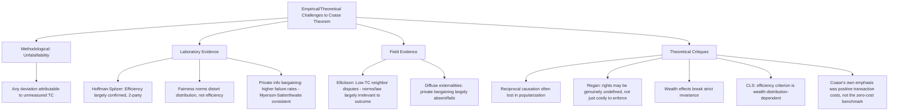

## Empirical Tests and Critiques of the Coase Theorem

### Overview

Because the Coase Theorem's stated conditions (zero transaction costs, well-defined property rights, no wealth effects) are explicitly counterfactual, testing it directly against real-world markets presents a fundamental methodological challenge: any observed deviation from the theorem's predicted invariance can always be attributed to the presence of positive transaction costs rather than to a failure of the theorem's internal logic. This has made the Coase Theorem simultaneously one of the most cited and one of the most methodologically contested propositions in law and economics. This entry surveys the principal empirical testing strategies, laboratory experiments, field evidence, and theoretical critiques that have emerged since 1960.

### The Core Methodological Problem: Unfalsifiability at the Margin

The theorem takes the logical form of a conditional: *if* transaction costs are zero and rights are well-defined, *then* the outcome is efficient regardless of rights assignment. Any real-world test faces an identification problem:

$$\text{Observed non-invariance} \implies \text{Either (a) TC} > 0, \text{ or (b) the theorem's logic is wrong}$$

Since transaction costs are essentially never exactly zero in any real market, defenders of the theorem can always attribute empirical failures to unmeasured transaction costs (interpretation (a)), making the theorem difficult to falsify through naturally occurring market data alone. This is precisely why controlled laboratory experiments — which can approximate genuinely low transaction costs — became the primary empirical battleground for testing the theorem's core behavioral predictions.

### Laboratory Experimental Evidence

#### Early Confirmatory Results

The earliest rigorous experimental tests, notably by **Elizabeth Hoffman and Matthew Spitzer** (1982, "The Coase Theorem: Some Experimental Tests," *Journal of Law and Economics*), used simple bargaining games with real monetary payoffs, randomly assigned "entitlements" to one of two subjects, and near-zero transaction costs (subjects could communicate freely and costlessly). Their central finding: **subjects reached the efficient (joint-surplus-maximizing) outcome in the overwhelming majority of trials**, regardless of which subject was randomly assigned the initial entitlement — providing strong experimental support for the core efficiency-invariance prediction under genuinely low transaction costs.

Hoffman and Spitzer's follow-up work extended this to three-and-more-person bargaining games, finding that **efficiency held up reasonably well even with more than two parties**, though with somewhat more variance and a higher incidence of failed bargains as group size increased — an early experimental signal that the free-rider/holdout problems theoretically expected to scale with party count do, in fact, emerge in practice.

#### The Fairness/Distributional Confound

A persistent finding across subsequent experimental literature is that while subjects frequently *do* reach the efficient outcome, the **distribution of the bargaining surplus is not well-predicted by pure self-interested Nash bargaining** — subjects systematically split surplus more equally than pure bargaining-power models predict, and fairness norms (e.g., 50-50 splitting heuristics) appear to substantially influence outcomes independent of relative bargaining leverage. [Inference: this finding is robust across a substantial body of experimental economics research on bargaining generally (not specific to Coasean settings), though the precise weight fairness norms carry relative to strategic bargaining power varies by experimental design and stakes.] This does not contradict the theorem's efficiency claim, but it does complicate any attempt to use the theorem's bargaining framework as a full positive model of real-world distributional outcomes.

#### Bargaining Failure Under Asymmetric Information

Later experimental work directly testing bilateral bargaining under **private information about valuations** (rather than the common-knowledge valuations of the earliest Hoffman-Spitzer designs) found substantially higher rates of bargaining failure — consistent with the theoretical prediction of the Myerson-Satterthwaite impossibility theorem. When subjects do not know their counterparty's true reservation value and have incentives to misrepresent their own, efficient trades that exist "on paper" frequently fail to materialize, even in laboratory settings with negligible search, drafting, and enforcement costs. This experimental literature is generally read as showing that **information asymmetry, not just conventionally defined "transaction costs," is an independent and empirically significant barrier to Coasean bargaining**, a point some scholars argue Coase's original framework under-emphasized relative to search/bargaining/enforcement costs narrowly defined.

### Field and Quasi-Experimental Evidence

#### Land Use, Nuisance, and Easement Bargaining

Field studies of low-transaction-cost bilateral land disputes (adjacent landowner boundary and easement disputes, agreements over shared resources like irrigation ditches in historically studied Western U.S. water rights contexts) have generally found bargaining outcomes broadly consistent with Coasean predictions: parties in small-numbers, well-defined-rights, repeat-interaction settings often do negotiate efficient private arrangements largely independent of the specific default legal rule, particularly in longstanding communities with strong informal enforcement norms (reputational sanctions substituting for costly formal legal enforcement).

**Ellickson's study of rancher-farmer boundary disputes** (*Order Without Law*, 1991, examining Shasta County, California) is a widely cited field study finding that neighbors frequently resolved cattle-trespass and fencing disputes through informal norms of neighborliness and reciprocity that were largely **independent of the formal legal liability rule** (whether the jurisdiction had an "open range" or "closed range" default rule for livestock liability) — a finding often read as broadly consistent with the Coasean invariance prediction in a genuinely low-transaction-cost setting, though Ellickson's own emphasis was on the primacy of informal social norms over formal law generally, a related but analytically distinct point.

#### Diffuse Externalities: Evidence of Bargaining Failure

By contrast, field evidence on diffuse, many-party externalities (regional air and water pollution, greenhouse gas emissions) consistently shows **failure of private bargaining to achieve efficient outcomes**, consistent with the theoretical prediction that transaction costs (search, free-rider, and holdout problems) scale sharply with the number of affected parties. The near-total absence of successful large-scale private Coasean bargains addressing regional air pollution or climate change — as opposed to the extensive reliance on regulatory instruments (cap-and-trade, Pigouvian taxes, command-and-control regulation) in these domains — is frequently cited as real-world confirmation that the theorem's benchmark conditions fail precisely where the theoretical taxonomy of transaction costs predicts they should fail (see prior entries on sources of transaction costs and the zero-transaction-cost benchmark).

### Theoretical and Conceptual Critiques

#### 1. The Reciprocal Nature of Harm (Coase's Own Point, Often Overlooked)

Coase's original 1960 argument emphasized that externality problems are **reciprocal in nature**: it is as true to say the laundry harms the factory (by seeking to restrict its activity) as it is to say the factory harms the laundry (by polluting). Critics and defenders alike note that much popular discussion of "the Coase Theorem" loses this reciprocity framing, defaulting to a one-directional "polluter harms victim" narrative that Coase explicitly rejected as economically arbitrary — the efficient outcome depends symmetrically on both parties' cost and benefit functions, not on a prior moral judgment about who is the "injurer."

#### 2. The Regan and Cooter Critique: Ill-Defined vs. Contested Rights

Some critics (e.g., Donald Regan, 1972) argue that in many real disputes, the underlying property right is not merely subject to positive transaction costs but is **genuinely contested or ill-defined at the outset** — the dispute exists precisely because it is unclear who holds the entitlement, meaning the theorem's premise of "well-defined property rights" is not merely idealized but analytically prior to and separate from the transaction cost question, and legal systems must resolve rights-definition before any Coasean bargaining framework can even be applied.

#### 3. The Wealth Effects Critique

As noted in the formulation entry, if the parties' valuations of the entitlement are wealth-dependent (a plausible assumption for entitlements involving health, safety, or environmental quality, which are not simply ordinary consumption goods with income-independent valuations), then the efficient quantity $x^*$ itself can shift depending on which party holds the initial entitlement — technically breaking strict invariance even at the zero-transaction-cost limit. [Inference: the practical, quantitative significance of wealth-effect deviations is treated by most law and economics scholars as a secondary theoretical qualification rather than a first-order empirical concern for most commercial transactions, though some scholars — particularly those studying environmental and health entitlements — argue wealth effects are large enough in these specific domains to substantially undermine the invariance prediction.]

#### 4. The Critical Legal Studies (CLS) Critique

Scholars associated with Critical Legal Studies have argued that the Coase Theorem's normative extension (assign entitlements to the highest-value user, as measured by willingness to pay) is circular or ideologically loaded: willingness to pay is itself a function of existing wealth distribution, so using it as an efficiency criterion for legal rule design risks entrenching and legitimating that distribution under the guise of neutral economic efficiency. Coasean scholars generally respond that the theorem is a *positive* (descriptive) claim about bargaining outcomes, not a *normative* claim that efficiency should trump distributive justice concerns in all legal design — though the boundary between positive and normative uses of the theorem in actual scholarly and judicial practice is itself a subject of ongoing dispute.

#### 5. The "Coase Theorem" vs. Coase's Actual Argument

A significant body of scholarship (including retrospective commentary by Coase himself) argues that the popularized "Coase Theorem" — as a claim that markets will efficiently solve externalities absent transaction costs — inverts the emphasis of Coase's actual 1960 article, whose primary point was that **since transaction costs are always positive, the choice of legal rule has real efficiency consequences**, and the bulk of the article is devoted to analyzing real cases (nuisance law, the *Sturges v. Bridgman* candy-maker/doctor dispute) precisely to illustrate how courts should account for reciprocal causation and comparative institutional costs — not to argue that bargaining alone typically suffices. Under this reading, the "zero transaction cost world" is a two-paragraph thought experiment used to isolate a variable, not the article's substantive conclusion, and treating it as "the" Coase Theorem somewhat misrepresents the balance of Coase's own argument.

### Summary Table: Where Evidence Supports vs. Challenges the Theorem

| Domain | Number of Parties | Typical Empirical Finding | Consistent with Theorem? |
| --- | --- | --- | --- |
| Lab bargaining, common knowledge valuations | 2 | High rate of efficient outcomes reached | Yes — strong support |
| Lab bargaining, private information | 2 | Substantial bargaining failure even with surplus available | Consistent with Myerson-Satterthwaite qualification, not core efficiency claim |
| Lab bargaining, 3+ parties | 3+ | Efficiency less reliable; more failed bargains | Consistent with theoretical prediction that multi-party TC is higher |
| Neighbor/boundary disputes (field) | 2, repeat interaction | Outcomes often independent of formal legal default | Yes — supportive in genuinely low-TC settings |
| Diffuse pollution/climate (field) | Many, dispersed | Private bargaining essentially absent; regulation dominant | Consistent with prediction that high-TC settings require non-bargaining solutions |
| Distribution of bargaining surplus (lab, all settings) | 2+ | Systematically more equal than pure bargaining-power models predict | Theorem is silent on distribution; not itself contradicted, but incomplete as a distributional theory |

### Implications for Legal Scholarship and Doctrine

The empirical and theoretical literature has converged on a broadly accepted synthesis position among most law and economics scholars: the Coase Theorem's core logical claim (invariance under the stated zero-transaction-cost, no-wealth-effect conditions) is **not seriously disputed as a matter of internal logic**, and its efficiency prediction receives reasonable experimental support in genuinely low-transaction-cost, common-knowledge bargaining settings. The theorem's *practical* value for legal analysis lies almost entirely in its **diagnostic use**: identifying, for any given legal dispute, where on the transaction-cost spectrum the setting falls, and therefore whether private bargaining, a liability rule, a property rule, or direct regulation is the more efficient institutional response — a use of the theorem far more modest than, and analytically distinct from, the popular caricature of "the market always solves externalities."

### Related Topics

- Formulation and proof of the Coase Theorem
- The zero transaction cost benchmark
- Sources and types of transaction costs
- Bargaining and the allocation of entitlements
- Transaction cost economics and Oliver Williamson
- Property rules, liability rules, and inalienability (Calabresi-Melamed framework)
- Ellickson's *Order Without Law* and the study of informal social norms
- The Myerson-Satterthwaite impossibility theorem and mechanism design