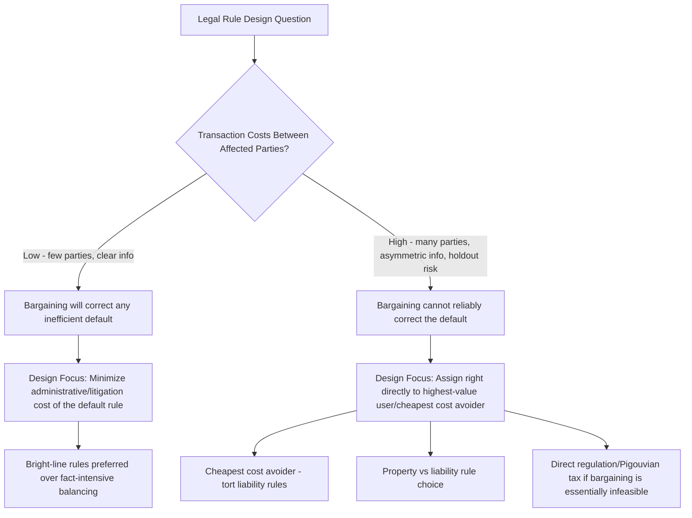
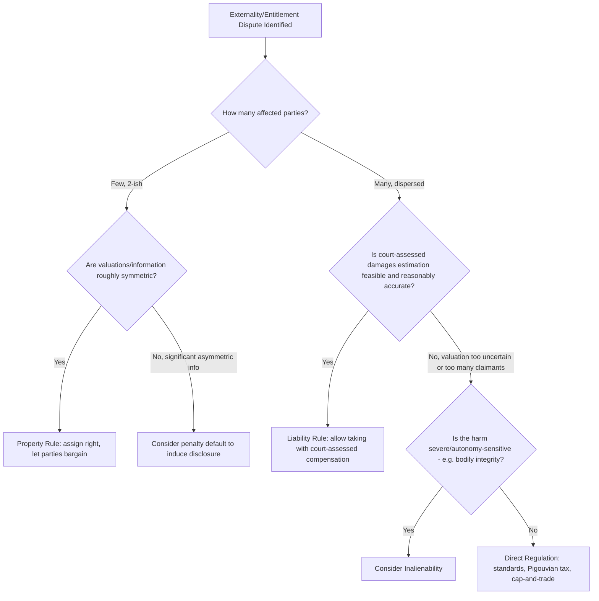

## Implications for the Design of Legal Rules

### Overview

The Coase Theorem and transaction cost economics, taken together, generate a coherent set of prescriptive principles for how legal rules should be designed once the analyst recognizes that transaction costs are always positive. Rather than asking "who is at fault" or "who caused the harm," the transaction-cost-informed approach to legal rule design asks a structurally different question: **given the transaction costs present in this setting, which legal rule minimizes the sum of (a) the cost of any remaining inefficiency and (b) the cost of the bargaining, administration, and error needed to correct it?** This entry synthesizes the design implications flowing from the preceding entries in this chapter into a practical framework for legal rule-making.

### The Central Design Principle: Minimize the Sum of Transaction and Error Costs

Following Coase's actual argument (as opposed to the popularized zero-transaction-cost theorem), the correct approach to legal rule design under positive transaction costs is a **comparative institutional analysis**: compare the total social cost of alternative legal rules, where total cost includes both the deadweight loss from any resulting inefficient allocation and the transaction costs of reaching, administering, and enforcing whatever allocation results.

$$\text{Total Cost}(\text{Rule } R) = \text{Expected DWL under Rule } R + \text{Transaction/Administrative Costs under Rule } R$$

The efficient legal rule minimizes this sum across all feasible rules, not merely the deadweight loss term in isolation — a rule that produces a perfectly efficient allocation in principle but requires enormously costly litigation or bargaining to reach may be inferior to a "second-best" rule that reaches an approximately efficient allocation directly and cheaply.

### Design Principle 1: Assign Rights to Mimic the Hypothetical Bargain (Low Transaction Cost Settings)

When transaction costs between the affected parties are genuinely low (few parties, clear valuations, low enforcement costs — see the earlier entry on the zero-transaction-cost benchmark and its diagnostic use), the specific initial rights assignment matters little for efficiency, since bargaining will correct any inefficient starting point. In these settings, legal rule design can focus primarily on **minimizing administrative and litigation costs** (clear, easily verifiable default rules) rather than on getting the substantive allocation exactly right, since the parties themselves will bargain to the efficient outcome regardless.

**Design implication**: in low-transaction-cost, small-numbers settings (e.g., disputes between two adjacent landowners, single-supplier contract disputes), courts and legislatures should favor **bright-line, easily administrable default rules** over fact-intensive case-by-case balancing tests, since the specific substantive content of the default matters less than the cost of determining and enforcing it.

### Design Principle 2: Assign Rights to the Highest-Value User Directly (High Transaction Cost Settings)

When transaction costs are high (many parties, significant information asymmetry, holdout or free-rider risk), private bargaining cannot be relied upon to correct an inefficient initial assignment. Here, the legal system should attempt to **directly assign the entitlement to whichever party would have ended up with it in a hypothetical zero-transaction-cost bargain** — i.e., to the party who values it most highly, or equivalently, to the "cheapest cost avoider."

This is the theoretical foundation for several major doctrinal frameworks:

- **Calabresi and Melamed's cheapest cost avoider principle** in tort law: liability should be assigned to whichever party can prevent the accident or harm at the lowest cost, since this is the allocation that a costless bargain between injurer and victim would have produced
- **Strict liability vs. negligence rule selection**: the choice between these liability regimes can itself be understood as a transaction-cost-minimizing design choice — strict liability economizes on the information costs of proving specific negligent conduct when the injurer has much better information about their own precautions, while negligence economizes on liability insurance and administrative costs when victims can more easily observe and prove specific failures to take due care [Inference: this is a widely used theoretical framework for analyzing liability rule choice in the law and economics literature; the specific rule that is actually efficient in any given real-world context depends on empirical facts about relative information and administrative costs that vary by setting]

### Design Principle 3: Choosing Between Property Rules, Liability Rules, and Inalienability

The **Calabresi-Melamed framework** ("Property Rules, Liability Rules, and Inalienability: One View of the Cathedral," 1972) provides the canonical taxonomy for how legal rules should be structured once an entitlement is assigned, distinguishing three modes of protection based on transaction cost considerations:

**Property rule protection**: the entitlement can only be transferred through **voluntary bargained-for exchange** at a price set by the holder (e.g., an injunction against nuisance, requiring the polluter to negotiate and pay whatever price the victim demands). Property rules are efficient when transaction costs are low, since they force the parties to bargain, and bargaining (by revealed preference) produces an outcome both parties value more than the status quo.

**Liability rule protection**: the entitlement can be taken from the holder *without* their consent, provided the taker pays an **objectively determined (court-assessed) compensation** (e.g., damages for nuisance rather than an injunction, allowing the factory to pollute as long as it pays court-assessed damages to the laundry). Liability rules are preferred when transaction costs are high enough that requiring bargained consent would likely block an efficient transfer (e.g., holdout risk with many affected parties), since a liability rule allows the efficient reallocation to proceed even without actual bargaining, substituting a court's estimate of value for the (unavailable) bargained price.

**Inalienability**: the entitlement cannot be transferred at all, even with consent and even with compensation (e.g., prohibitions on selling one's organs, one's vote, or oneself into slavery in most jurisdictions). Inalienability rules are justified on efficiency grounds primarily where market valuation is expected to be systematically unreliable due to externalities on third parties, severe information/rationality problems (e.g., concerns about non-autonomous consent), or paternalistic/distributive concerns that fall outside a pure transaction-cost efficiency framework.

$$\text{Choice of Rule} = f(\text{Transaction Costs}, \text{Valuation Reliability}, \text{Distributive/Autonomy Concerns})$$

**Worked design example — nuisance law**:

- Two adjacent landowners, low transaction costs (bilateral monopoly, both parties known, easy to bargain) → **property rule** (injunction) is efficient: it forces bargaining, and low transaction costs mean bargaining will succeed and reach the efficient outcome regardless of which party gets the injunction
- A factory polluting an entire neighborhood, high transaction costs (holdout risk among residents, or free-rider risk if residents must jointly fund a buyout of the factory) → **liability rule** (damages, not injunction) is often more efficient: it allows the factory to continue operating (if its benefit exceeds aggregate damage) or forces closure (if damages awarded exceed profit) without requiring costly and holdout-prone actual bargaining among all affected residents

### Design Principle 4: Penalty Default Rules to Induce Information Revelation

Ian Ayres and Robert Gertner's theory of **penalty default rules** extends Coasean logic to contract gap-filling: when a contract is silent on a term, courts must supply a default. Two types of defaults serve different transaction-cost-economizing functions:

- **Majoritarian (tailored) defaults**: fill the gap with the term most parties in that situation would have chosen, minimizing the transaction cost of explicit negotiation over routine terms
- **Penalty defaults**: deliberately fill the gap with a term that at least one party would *not* want, specifically to **induce the informed party to disclose information** by contracting around the unfavorable default — used when one party has private information that would be efficient to reveal (e.g., a rule that a seller with superior information about a product defect bears liability by default, inducing voluntary disclosure or explicit contractual allocation of that risk)

Penalty defaults are a direct legal-design application of the transaction-cost insight that information asymmetry (not just search, bargaining, or enforcement costs narrowly defined) is itself a transaction cost that legal rules can be designed to reduce.

### Design Principle 5: Reducing Transaction Costs Directly Through Institutional Design

Beyond choosing which party gets which right, legal systems can be designed to directly **lower** the transaction costs of private bargaining, expanding the domain in which Coasean private ordering can substitute for costly litigation or regulation:

- **Clear title and recording systems** (land registries, patent and trademark registries, UCC filing systems) reduce search and verification costs, directly expanding the class of transactions for which low-transaction-cost private bargaining is feasible
- **Standard form contracts and default terms** reduce the bargaining/drafting cost of routine transactions by supplying widely-applicable terms that parties need not re-negotiate from scratch
- **Alternative dispute resolution mechanisms** (arbitration, mediation) reduce enforcement/adjudication transaction costs relative to full litigation, expanding the range of disputes for which private resolution is cost-effective relative to costly court proceedings
- **Aggregation mechanisms for diffuse claims** (class actions) directly address the free-rider problem in claims where individual transaction costs of litigating would exceed each individual claimant's stake, but the aggregate stake justifies the transaction cost of a collective proceeding

### Design Principle 6: When Bargaining Is Infeasible, Regulate Directly

For settings where transaction costs are so high that neither property rules (bargaining) nor liability rules (case-by-case court-assessed damages) can feasibly achieve an efficient outcome — typically involving very large numbers of dispersed, hard-to-identify parties (regional air pollution, greenhouse gas emissions, systemic financial risk) — the transaction-cost framework itself points toward **direct ex ante regulation** (command-and-control standards, Pigouvian taxes, cap-and-trade systems) as the comparatively efficient institutional response, since these mechanisms substitute administrative/regulatory costs for the (even larger) transaction costs of attempting case-by-case bargained or litigated resolution among thousands or millions of affected parties.

### Summary Framework: A Decision Tree for Legal Rule Designers

### Illustrative Table: Rule Choice Across Settings

| Setting | Parties | Transaction Cost Level | Recommended Rule Type | Rationale |
| --- | --- | --- | --- | --- |
| Boundary dispute between two landowners | 2 | Low | Property rule (injunction) | Bargaining will reach efficient outcome cheaply regardless of assignment |
| Trade secret misappropriation | 2 (known parties) | Low-Moderate | Property rule with damages backstop | Encourages ex ante licensing negotiation |
| Single-factory nuisance affecting a small number of neighbors | Small (5-20) | Moderate | Liability rule (damages) or property rule with collective bargaining mechanism | Some holdout risk; court-assessed damages may be more administrable |
| Regional air pollution | Thousands | High | Direct regulation (emissions standards, cap-and-trade) | Bargaining/litigation transaction costs prohibitive at this scale |
| Global externality (climate change) | Billions, including future generations | Extremely high | International regulatory frameworks, Pigouvian carbon pricing | No feasible bargaining or liability-rule mechanism at this scale |
| Sale of bodily organs | 2, but severe autonomy/exploitation concerns | N/A (efficiency framework alone insufficient) | Inalienability (in most jurisdictions) | Distributive/autonomy concerns beyond pure transaction-cost efficiency |

### Limitations of the Design Framework

- **Valuation difficulty for liability rules**: courts assessing damages under a liability rule must estimate what an efficient bargain *would have* produced, but this estimation is itself imperfect and subject to error, litigation cost, and strategic manipulation of evidence — meaning liability rules substitute one set of costs (bargaining/holdout) for another (valuation error and litigation cost), and the comparison is not always straightforward
- **Distributive consequences are not resolved by this framework**: as with the Coase Theorem itself, transaction-cost-informed rule design speaks primarily to efficiency; questions of distributive fairness in how rights are initially assigned remain a separate normative inquiry that efficiency analysis alone does not resolve
- **Dynamic and behavioral considerations**: this framework is largely static and assumes rational bargaining behavior; as discussed in prior entries, endowment effects, fairness norms, and other behavioral departures can affect which rule actually performs best in practice, sometimes in ways that diverge from the pure transaction-cost-minimizing prediction

### Related Topics

- Formulation and proof of the Coase Theorem
- The zero transaction cost benchmark
- Sources and types of transaction costs
- Bargaining and the allocation of entitlements
- Transaction cost economics and Oliver Williamson
- Empirical tests and critiques of the Coase Theorem
- Property rules, liability rules, and inalienability (Calabresi-Melamed "Cathedral" framework)
- Penalty default rules and information-forcing contract design (Ayres and Gertner)