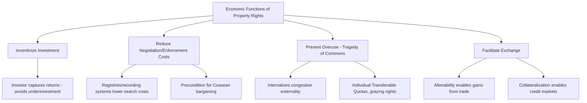

## Economic Functions and Justifications of Property Rights

### Overview

The economic analysis of property law asks a functional question distinct from moral or historical theories of property: what work do property rights *do* for a society's allocation of resources, and under what conditions does assigning exclusive, transferable rights to resources improve efficiency relative to alternative institutional arrangements (open access, collective ownership, state allocation)? This entry surveys the core economic functions property rights serve — incentivizing investment, reducing negotiation costs, preventing overuse of scarce resources, and facilitating exchange — along with the classical justifications and their limits.

### The Core Economic Functions of Property Rights

Harold Demsetz's foundational article "Toward a Theory of Property Rights" (1967) frames property rights as an institutional response to **externalities**: property rights emerge and evolve when the gains from internalizing externalities exceed the costs of establishing and enforcing the rights. This generates four principal economic functions:

#### 1. Incentivizing Investment (The Internalization Function)

Property rights allow the person who invests in improving, maintaining, or developing a resource to capture the resulting gains, rather than having those gains dissipated among non-investing parties. Without secure rights, an investor cannot be confident of capturing the return on investment, leading to systematic **underinvestment** relative to the efficient level.

Formally, let $I$ be an investment with private cost $c(I)$ and total social benefit $B(I)$. Under secure property rights, the investor captures the full benefit $B(I)$ and chooses $I$ to maximize $B(I) - c(I)$, satisfying the efficiency condition $B'(I^*) = c'(I^*)$. Under insecure rights, where a fraction $\theta < 1$ of the benefit is captured by the investor (the remainder dissipated to non-owners, through theft, expropriation, or open-access competition), the investor instead maximizes $\theta B(I) - c(I)$, yielding $\theta B'(I) = c'(I)$ — a first-order condition satisfied at $I < I^*$, i.e., **systematic underinvestment** proportional to the insecurity of the property right.

$$I(\theta) < I^*, \quad \frac{dI(\theta)}{d\theta} > 0$$

**Example**: A farmer will not invest in irrigation, soil improvement, or long-term crop rotation on land they do not securely own or hold a long-term lease over, since the benefits of that investment would accrue to whoever controls the land in the future — this is the standard economic explanation for chronically low agricultural investment observed in regions with insecure or communal land tenure systems, and the theoretical basis for land titling programs as development policy.

#### 2. Reducing Negotiation and Enforcement Costs (The Coasean Function)

Clearly defined and easily verifiable property rights reduce the transaction costs of bargaining over resource use — as established in the Coase Theorem entries, well-defined rights are a *precondition* for efficient private bargaining. Ill-defined or contested rights themselves constitute a transaction cost, since resources must be spent establishing who holds the entitlement before any bargaining over its use can proceed.

**Legal registries and recording systems** (land title registries, patent and trademark offices, UCC filing systems) function economically as public infrastructure that reduces the search and verification costs associated with property rights, directly expanding the domain of feasible low-transaction-cost Coasean bargaining discussed in the previous chapter.

#### 3. Preventing Overuse of Common Resources (The Tragedy of the Commons Function)

Where a resource is **rivalrous** (one person's use diminishes what is available to others) but **non-excludable** (no one can be prevented from using it), open access leads to systematic overuse relative to the socially efficient level — the classic **tragedy of the commons**, formalized by Garrett Hardin (1968) and given rigorous economic treatment in the theory of open-access resource exploitation (H. Scott Gordon, 1954).

Formally, consider a common resource (e.g., a fishery) with total yield $Y(N)$ as a function of the number of users $N$, where $Y'(N) > 0$ initially but $Y''(N) < 0$ (congestion effects). Each individual user, entering under open access, compares their private average benefit to their private cost, ignoring the **negative externality** their entry imposes on all other users (reducing the yield available to each). The open-access equilibrium $N_{OA}$ occurs where:

$$\text{Average Product} = \text{Marginal Private Cost}$$

whereas the efficient number of users $N^*$ satisfies:

$$\text{Marginal Social Product} = \text{Marginal Private Cost}$$

Because marginal product is below average product once congestion sets in ($MP < AP$ for $N > $ the point of maximum average yield), the open-access equilibrium systematically **overshoots** the efficient level: $N_{OA} > N^*$, dissipating the resource's economic rent entirely in equilibrium (each user's marginal private benefit is driven down to marginal private cost, leaving zero economic profit despite the resource's underlying scarcity value).

$$\text{Rent dissipation} = \text{Total resource value at } N^* - \text{Total private profit at } N_{OA} \to 0 \text{ as open access persists}$$

**Legal implication**: assigning exclusive property rights (individual transferable quotas in fisheries, grazing rights, extraction licenses) internalizes this congestion externality by making each user bear the full marginal social cost of their use, restoring the incentive to limit use to the efficient level $N^*$.

#### 4. Facilitating Exchange and Specialization (The Market Function)

Well-defined, transferable property rights are the necessary precondition for market exchange itself: without a clear right to transfer, a good cannot be sold, licensed, or used as collateral, foreclosing the gains from trade and specialization that underlie the broader case for market-based resource allocation (as developed in the supply-demand and Coasean bargaining entries). Alienability (the right to transfer) is thus not incidental to property rights but often treated as one of their defining economic features.

### Demsetz's Theory of the Emergence of Property Rights

Demsetz's central historical/comparative claim is that property rights systems **evolve endogenously** in response to changes in the relative costs and benefits of internalizing externalities — property rights are not simply imposed by legal fiat but emerge (and are demanded by economic actors) when the value of internalization rises relative to the cost of establishing and enforcing exclusive rights.

**Demsetz's classic example**: the emergence of exclusive hunting territories among the Montagnes Indians of Quebec/Labrador, which Demsetz argues arose specifically in response to the commercialization of the fur trade in the early 18th century. Before commercial fur trading, communal hunting grounds generated negligible externalities (hunting was primarily for subsistence, and the externality of one hunter's activity on others' future yield was small). Once fur became a valuable commercial commodity, the externality of overhunting (each hunter's activity reducing the fur-bearing animal population available to others) became economically significant enough that the benefit of establishing and enforcing exclusive family hunting territories exceeded the cost of doing so, and such exclusive territorial rights emerged.

$$\text{Property rights emerge when: Benefit of internalizing externality} > \text{Cost of establishing/enforcing exclusivity}$$

[Note: Demsetz's specific historical account of the Montagnes case has been contested by subsequent anthropological and historical scholarship regarding the accuracy and completeness of the historical record; the theoretical framework (property rights emerge when internalization benefits exceed enforcement costs) remains widely cited and applied independent of the specific historical case's accuracy.]

### The Classical Justifications: Locke, Utilitarianism, and Law and Economics

Property theory scholarship distinguishes several justificatory traditions, of which the economic/functional account is one among several:

- **Lockean labor theory**: property rights are justified because a person "mixes their labor" with unowned resources, creating a natural moral entitlement — a philosophical rather than economic justification, though it shares with the economic account an emphasis on rewarding productive investment
- **Utilitarian/economic justification** (the dominant law and economics framework): property rights are justified instrumentally, insofar as they produce efficient outcomes (the four functions above) — property rights have no inherent moral status in this framework but are evaluated purely by their consequences for social welfare
- **Personhood theory** (Margaret Jane Radin and others): certain property is constitutive of personal identity and autonomy (a family home, personal effects) and warrants stronger protection than purely fungible, instrumentally-held property — a distinct justificatory tradition that the pure efficiency framework does not fully capture, and which has influenced doctrines distinguishing "personal" from "fungible" property in remedies analysis (e.g., stronger presumption of specific performance/injunctive relief for unique personal property)

### Bundle of Rights: Property as a Set of Separable Entitlements

The economic analysis of property emphasizes that "property" is not a single unitary right but a **bundle of separable entitlements** — the right to possess, use, exclude, transfer, and derive income from a resource — that can be split among different parties without destroying the underlying efficiency logic, provided transaction costs of coordinating among the separate rightsholders remain manageable.

**Example**: A single parcel of land can simultaneously be subject to a fee simple ownership right, a leasehold interest, a mortgage lien, an easement for a utility company, mineral rights held separately from surface rights, and a restrictive covenant limiting use — each a distinct, separately transferable stick in the bundle. The economic function of allowing such splitting is to permit **specialization in the bearing of risk and provision of capital** (e.g., separating a mortgage lender's financial interest from the occupant's use interest allows more efficient allocation of capital than requiring the occupant to self-finance the full purchase price).

The limit on this splitting logic is transaction cost: excessive fragmentation of rights over a single resource (many separate rightsholders, each with a veto over some use) recreates a **multi-party holdout problem** (the "tragedy of the anticommons," discussed in the following entry), illustrating that the economic case for property rights is not simply "more exclusivity is always better" but depends on the specific transaction-cost tradeoffs of the fragmentation pattern chosen.

### Numerical Illustration: Investment Incentive Under Secure vs. Insecure Rights

Suppose an investment of $I$ (measured in dollars) yields social benefit $B(I) = 10\sqrt{I}$, with investment cost $c(I) = I$.

**Secure property rights** ($\theta = 1$): investor maximizes $10\sqrt{I} - I$.

$$\frac{d}{dI}\left(10\sqrt{I} - I\right) = \frac{5}{\sqrt{I}} - 1 = 0 \implies I^* = 25$$

**Insecure rights** (investor captures only $\theta = 0.4$ of the benefit, e.g., due to a 60% risk of expropriation or open-access dissipation): investor maximizes $4\sqrt{I} - I$.

$$\frac{d}{dI}\left(4\sqrt{I} - I\right) = \frac{2}{\sqrt{I}} - 1 = 0 \implies I = 4$$

**Result**: insecure property rights reduce investment from the efficient level of 25 to just 4 — an 84% reduction — illustrating the quantitative significance the security-of-tenure literature attributes to property rights institutions in development economics contexts. [Inference: the specific functional form and parameter values here are illustrative rather than drawn from a specific empirical study; the qualitative direction and general magnitude-sensitivity of the underinvestment result is a standard and robust theoretical prediction of the property rights investment-incentive model.]

### Limits and Critiques of the Functional Efficiency Account

- **Distributive silence**: like the Coase Theorem, the functional efficiency account of property rights is largely silent on how the *initial* distribution of property rights across persons should be determined — efficiency justifies having *some* system of exclusive rights, but not any particular initial allocation among individuals, a gap addressed by separate theories of distributive justice
- **Externalities from exclusion itself**: while property rights solve overuse externalities, the exclusion at the heart of property rights can itself generate externalities on excluded parties (e.g., excluding indigenous or customary users from land subject to new formal title, or excluding potential follow-on innovators from patented knowledge) — a tension explored further in intellectual property and the anticommons literature
- **Empirical contestation of the security-of-tenure/investment link**: while the theoretical investment-incentive logic is well-established, empirical studies of specific land titling programs have found mixed results regarding the magnitude of investment response to formalized title, with some studies finding strong effects and others finding formal title provides limited additional security beyond well-established informal/customary tenure arrangements. [Inference: this is an active empirical development-economics research area rather than a settled question; the theoretical mechanism is not disputed, but its empirical magnitude varies substantially by context, baseline informal tenure security, and complementary institutional factors such as credit market access.]

### Related Topics

- The tragedy of the commons and open-access resource problems
- The tragedy of the anticommons and excessive fragmentation of rights
- Numerus clausus and the standardization of property rights forms
- Formulation and proof of the Coase Theorem
- Intellectual property as a distinct property rights regime
- Eminent domain and the takings power
- Land titling and property rights in development economics
- Bundle of rights theory and the separability of property interests