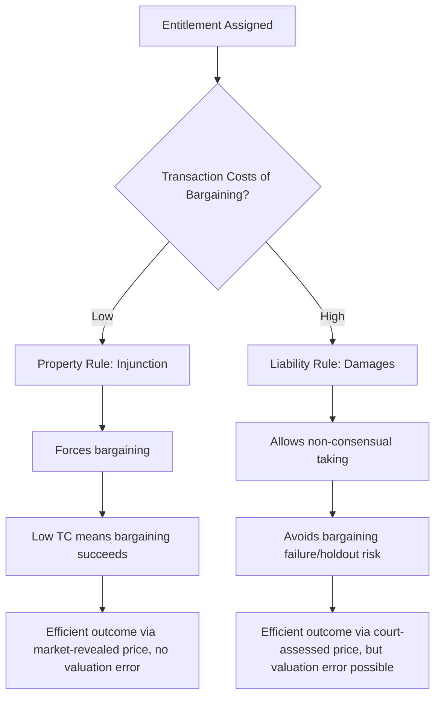

## Property Rules Versus Liability Rules

### Overview

The choice between protecting an entitlement with a **property rule** or a **liability rule** is the central organizing question of the economic analysis of remedies, first systematized by Guido Calabresi and A. Douglas Melamed in their landmark 1972 article "Property Rules, Liability Rules, and Inalienability: One View of the Cathedral." The framework asks: once a legal system has decided *who* holds an entitlement, how should it protect that entitlement — by requiring consensual transfer at a self-determined price, or by permitting non-consensual taking at a court-determined price? This distinction cuts across property, tort, and contract law and provides one of the most widely applied analytical tools in law and economics.

### The Basic Taxonomy

Calabresi and Melamed identify two initial questions that must be answered for any legal dispute: (1) **who gets the entitlement** (efficiency, distributional, or other justice considerations may all be relevant here), and (2) **how is the entitlement protected**. The second question generates the property rule/liability rule distinction (plus inalienability, treated as a third category):

**Property Rule**: The entitlement can be removed from its holder **only through a voluntary transaction at a price the holder sets**. Non-consensual takings are prohibited and typically remedied with an **injunction** — the entitlement holder can block the activity entirely until the parties reach agreement.

**Liability Rule**: The entitlement can be taken from its holder **without consent**, provided the taker pays a **court-determined (objectively assessed) price** — typically **damages**. The entitlement holder cannot block the activity but can recover compensation calculated by an external valuer (a judge or jury) rather than by their own asking price.

$$\text{Property Rule: Transfer requires } P_{\text{holder-set}} \quad \text{vs.} \quad \text{Liability Rule: Transfer requires } P_{\text{court-assessed}}$$

**Canonical doctrinal examples**:

- **Property rule**: an injunction against trespass or nuisance; specific performance of a contract for a unique good; a patent holder's right to exclude via injunction
- **Liability rule**: compensatory damages for breach of contract (expectation damages allow efficient breach without requiring the breaching party to obtain the counterparty's consent); damages (rather than injunction) for nuisance under the rule of *Boomer v. Atlantic Cement Co.*; eminent domain (government taking with "just compensation" rather than requiring the landowner's consent)

### The Core Efficiency Logic: Which Rule When?

The Calabresi-Melamed framework's central insight connects directly to Coasean transaction cost analysis: **the choice between property and liability rules should track the transaction costs of achieving a voluntary bargain.**

**Property rules are efficient when transaction costs are low.** When the parties can bargain cheaply (few parties, clear valuations, low negotiation costs), a property rule forces them to negotiate, and low transaction costs mean bargaining will succeed and produce the efficient outcome — the holder's self-set price simply reflects their true valuation, and if the taker values the entitlement more, a mutually beneficial trade will occur (exactly as the Coase Theorem predicts). This has the further advantage that it **does not require a court to estimate value** — the market (bargaining) reveals it directly, avoiding valuation error.

**Liability rules are efficient when transaction costs are high.** When bargaining is costly or likely to fail (many parties, holdout risk, high search costs, bilateral monopoly with severe information asymmetry), requiring actual consent as a precondition for transfer risks blocking efficient reallocations entirely. A liability rule allows the efficient transfer to occur anyway, substituting a court's *estimate* of the entitlement's value for the (unavailable) bargained price — sacrificing valuation accuracy in exchange for avoiding the larger cost of bargaining failure.

### Formal Comparison: Cost Trade-off

Define $TC$ as the transaction cost of achieving a voluntary bargain and $VE$ as the expected valuation error (and associated cost) of court-assessed damages under a liability rule. The efficient rule choice minimizes total social cost:

$$\text{Choose Property Rule if: } TC < VE$$

$$\text{Choose Liability Rule if: } VE < TC$$

This formalizes the core trade-off: property rules risk **bargaining failure costs** (which grow with the number of parties, information asymmetry, and holdout risk), while liability rules risk **valuation error costs** (which grow with the difficulty of ascertaining the true subjective value of the entitlement to its holder, particularly for unique, non-market, or highly personal entitlements).

### The Four Rules of the Cathedral

Calabresi and Melamed's original framework extends beyond the simple two-rule taxonomy by cross-classifying **who holds the entitlement** with **how it is protected**, generating four canonical rule combinations for a bilateral dispute (e.g., factory vs. laundry, polluter vs. victim):

| Rule | Entitlement Holder | Protection Mode | Doctrinal Example |
| --- | --- | --- | --- |
| **Rule 1** | Victim (right to be free from pollution) | Property rule | Injunction against the polluter |
| **Rule 2** | Victim | Liability rule | Polluter may continue but must pay court-assessed damages to victim |
| **Rule 3** | Injurer (right to pollute) | Property rule | Victim must pay the polluter to reduce/stop (polluter can refuse any offer) |
| **Rule 4** | Injurer | Liability rule | Victim may force reduction/cessation but must pay court-assessed compensation to the polluter |

Rules 1 and 3 are the property-rule pair (differing only in *who* holds the entitlement — this is the pure Coasean invariance case from the theorem's formulation, where transaction costs are assumed low enough for bargaining to reach the efficient point regardless of which of Rule 1 or Rule 3 applies). Rules 2 and 4 are the liability-rule pair, useful specifically when transaction costs preclude relying on Rules 1/3's bargaining mechanism.

**Rule 4 is comparatively rare in practice** (it requires the victim to compensate the injurer even when compelling a reduction in harmful activity) but is not merely a theoretical curiosity: it appears, for example, in some formulations of regulatory takings doctrine (where the government/public, analogized to the "victim" of a landowner's harmful use, must sometimes pay compensation to induce the landowner/"injurer" to cease an otherwise-lawful activity) and in some environmental "buy-out" or conservation easement purchase programs.

### Application: Expectation Damages and Efficient Breach

Contract remedies present one of the clearest applications of the liability rule logic. **Expectation damages** — the standard contract remedy, putting the non-breaching party in the position they would have occupied had the contract been performed — function as a **liability rule** protecting the promisee's entitlement to performance: the promisor can breach without the promisee's consent, provided they pay court-assessed expectation damages.

This liability-rule structure is the doctrinal foundation for the **efficient breach doctrine**: because damages (not specific performance) is the default remedy, a promisor can breach whenever a more valuable use of their resources arises elsewhere, provided they compensate the promisee for their expectation interest — permitting an efficient reallocation without requiring costly renegotiation (which a property-rule regime, i.e., mandatory specific performance, would require).

$$\text{Efficient Breach occurs when: } V_{\text{alternative}} > V_{\text{contract}} + \text{Expectation Damages}$$

**Contrast with specific performance**: for unique goods (real estate, rare art, custom-manufactured goods with no ready substitute), courts more readily grant **specific performance** — a property-rule remedy — precisely because court-assessed damages are especially likely to mis-estimate the true subjective value of a unique good (high $VE$), making the property rule's forced-bargaining mechanism comparatively more efficient than a liability rule's damage estimate, per the $TC$ vs. $VE$ trade-off above.

### Application: Nuisance Law — *Boomer v. Atlantic Cement Co.*

The 1970 New York case *Boomer v. Atlantic Cement Co.* is the canonical illustration of Rule 4 in nuisance doctrine. A cement plant's operations caused substantial dust and vibration damage to neighboring landowners. Rather than granting an injunction (Rule 1 — property rule protecting the landowners), which would have shut down a plant employing hundreds of workers and representing a large capital investment, the court instead awarded **permanent damages** (Rule 2 for the landowners, effectively) — allowing the cement plant to continue operating provided it paid the neighboring landowners a court-assessed lump sum for the diminished value of their property.

The court's reasoning is a direct (if not explicitly framed in economic language) application of the liability-rule efficiency logic: with numerous affected landowners on one side and a single, large capital investment on the other, transaction costs of individual bargaining (search costs of identifying all affected landowners, holdout risk among them if collective buyout of the plant were attempted, and the risk of judicial error in complex balancing) favored substituting a liability rule for outright injunctive property-rule protection, despite the plant's conduct constituting an actionable nuisance.

### Application: Patent Law — Injunctions vs. Reasonable Royalties

Patent remedies illustrate an evolving property-rule/liability-rule choice in U.S. law. Historically, patent infringement predictably resulted in **injunctive relief** (property rule) once infringement and validity were established. Following the U.S. Supreme Court's decision in *eBay Inc. v. MercExchange, L.L.C.* (2006), courts must apply the traditional four-factor equitable test for injunctions rather than presuming an injunction follows automatically from a finding of infringement — shifting patent remedies in many cases toward a **liability rule** (ongoing or lump-sum "reasonable royalty" damages) rather than automatic injunctive relief, particularly in cases involving **patent holdup** by non-practicing entities asserting patents covering only a small component of a complex multi-component product (where an injunction could give the patent holder leverage disproportionate to the patented component's actual economic contribution — precisely the kind of transaction-cost/holdout concern the Calabresi-Melamed framework identifies as favoring liability rules over property rules).

### Diagram: The Cost Trade-off Curve

<svg xmlns="http://www.w3.org/2000/svg" viewBox="0 0 560 340">
<text x="280" y="25" text-anchor="middle" font-size="16" font-weight="bold" fill="#1a1a1a">Property Rule vs Liability Rule: Cost Trade-off (svg_diagram)</text>
<line x1="70" y1="290" x2="70" y2="50" stroke="#333" stroke-width="2" />
<line x1="70" y1="290" x2="500" y2="290" stroke="#333" stroke-width="2" />
<text x="20" y="55" font-size="12" fill="#333">Cost</text>
<text x="460" y="315" font-size="13" fill="#333">Number of Affected Parties</text>
<path d="M 90 90 Q 280 130 470 260" stroke="#c0392b" stroke-width="2.5" fill="none" />
<text x="400" y="245" font-size="12" fill="#c0392b" font-weight="bold">Bargaining/Transaction Cost (TC)</text>
<line x1="90" y1="230" x2="470" y2="200" stroke="#2980b9" stroke-width="2.5" />
<text x="380" y="185" font-size="12" fill="#2980b9" font-weight="bold">Valuation Error Cost (VE)</text>
<circle cx="250" cy="163" r="6" fill="#1a1a1a" />
<line x1="250" y1="163" x2="250" y2="290" stroke="#666" stroke-width="1" stroke-dasharray="4,3" />
<text x="120" y="270" font-size="11" fill="#27ae60" font-weight="bold">Property Rule Zone (TC &lt; VE)</text>
<text x="330" y="270" font-size="11" fill="#8e44ad" font-weight="bold">Liability Rule Zone (VE &lt; TC)</text>
</svg>

As the number of affected parties grows, transaction/bargaining costs ($TC$) tend to rise faster than valuation error costs ($VE$), which is why liability rules become comparatively more attractive as disputes move from bilateral (two-party) toward multilateral (many-party) settings.

### Critiques and Refinements

- **Ayres and Talley's information-forcing critique**: Ian Ayres and Eric Talley (1995) argue that liability rules can sometimes outperform property rules even in low-transaction-cost bilateral settings, because liability rules can induce **information revelation** through the parties' post-rule bargaining behavior in ways property rules do not — a refinement suggesting the simple $TC$ vs. $VE$ heuristic, while useful, does not capture every efficiency-relevant dimension of remedy choice. [This is a theoretically contested refinement; the original Calabresi-Melamed $TC$ vs. $VE$ framework remains the dominant starting heuristic in most law and economics teaching and scholarship, with the Ayres-Talley extension representing a more specialized game-theoretic elaboration.]
- **Kaplow and Shavell's welfare-based critique**: Louis Kaplow and Steven Shavell (1996) argue that property rules are generally superior to liability rules whenever bargaining is possible at all, because property rules allow the parties themselves (who have better information than courts) to determine the efficient outcome, while liability rules risk **both** valuation error **and** insufficient deterrence of inefficient takings (since a party facing only court-assessed damages, rather than a self-interested seller's asking price, may take even when their private value is below the entitlement holder's true value, if the court's damage estimate is too low) — this critique pushes toward narrowing the domain in which liability rules are recommended, relative to the more balanced original Calabresi-Melamed framework.
- **Distributional and non-efficiency values**: as with the broader Coasean framework, the property/liability rule choice as classically formulated focuses on efficiency; corrective justice theorists and some tort scholars argue that the *moral* significance of consent (central to property rule protection) should not be reduced to a mere transaction-cost-economizing device, since forcing an unwilling party to accept compensation they did not choose (liability rule) may be objectionable on autonomy grounds independent of its efficiency properties.

### Related Topics

- Formulation and proof of the Coase Theorem
- Bargaining and the allocation of entitlements
- Economic functions and justifications of property rights
- Efficient breach doctrine and contract remedies
- Nuisance law and the *Boomer v. Atlantic Cement* framework
- Patent remedies and the *eBay v. MercExchange* injunction standard
- Eminent domain and just compensation
- Inalienability rules and their efficiency and non-efficiency justifications