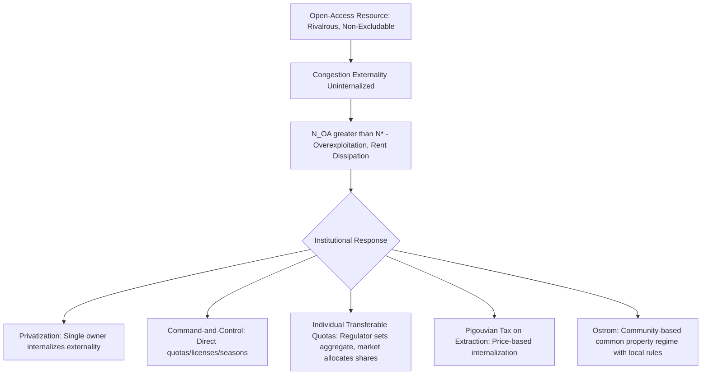

## The Tragedy of the Commons and Common Property Regimes

### Overview

The tragedy of the commons describes the systematic overuse or depletion of a rivalrous, non-excludable resource when access is unrestricted — each user, acting rationally in their own interest, imposes an uncompensated cost on all other users, leading to an equilibrium level of exploitation that exceeds the socially efficient level and can, in the extreme, exhaust the resource entirely. Building on the economic functions of property rights covered in the prior entry, this topic examines the formal theory of open-access resource dissipation, the range of institutional solutions beyond simple privatization, and Elinor Ostrom's empirically grounded critique of the assumption that state or private property are the only viable responses.

### Formal Statement of the Problem

Consider a common-pool resource (a fishery, grazing land, groundwater aquifer, or atmospheric carbon sink) with a **rivalrous** consumption technology (one user's extraction reduces what remains for others) but **non-excludable** access (no low-cost mechanism prevents additional users from entering). Let $N$ denote the number of users (or, equivalently, the aggregate level of extraction effort), and let $Y(N)$ denote total yield as a function of effort, with the standard biological/economic production property:

$$Y'(N) > 0 \text{ for } N < N_{MSY}, \quad Y'(N) < 0 \text{ for } N > N_{MSY}$$

where $N_{MSY}$ is the effort level generating **maximum sustainable yield**. Define **average product** $AP(N) = Y(N)/N$ (yield per unit of effort) and **marginal product** $MP(N) = Y'(N)$ (additional yield from one more unit of effort).

**Efficient (social optimum) level of use**, $N^*$, maximizes total net social value:

$$\max_N \left[ p \cdot Y(N) - w \cdot N \right] \implies p \cdot MP(N^*) = w$$

where $p$ is the resource's market price and $w$ is the cost per unit of extraction effort — the standard marginal-benefit-equals-marginal-cost condition, but using **marginal** product.

**Open-access equilibrium**, $N_{OA}$: because no individual user can exclude others or capture the resource's scarcity rent, each user enters as long as their *private* average return exceeds their cost — entry continues until:

$$p \cdot AP(N_{OA}) = w$$

Because $AP(N) > MP(N)$ for any $N$ beyond the point where yield begins to exhibit diminishing returns (a standard property whenever the production function is concave), the open-access equilibrium **systematically exceeds** the efficient level:

$$N_{OA} > N^*$$

and in the extreme case (the resource is subject to biological overexploitation with $Y(N) \to 0$ as $N$ grows without bound, or fixed costs of entry are low relative to potential returns), open access can drive the entire economic **rent** of the resource to zero — all users earn only a normal return on their effort, while the resource itself may be severely depleted or collapse.

$$\text{Economic Rent}_{OA} = p \cdot Y(N_{OA}) - w \cdot N_{OA} \to 0$$

### Diagram: Open Access vs. Efficient Extraction

<svg xmlns="http://www.w3.org/2000/svg" viewBox="0 0 560 380">
<text x="280" y="25" text-anchor="middle" font-size="16" font-weight="bold" fill="#1a1a1a">Open Access Overexploitation (svg_diagram)</text>
<line x1="70" y1="330" x2="70" y2="50" stroke="#333" stroke-width="2" />
<line x1="70" y1="330" x2="500" y2="330" stroke="#333" stroke-width="2" />
<text x="20" y="55" font-size="12" fill="#333">$/unit effort</text>
<text x="440" y="355" font-size="13" fill="#333">Effort / Number of Users (N)</text>
<path d="M 90 320 Q 200 90 300 100 Q 400 110 470 250" stroke="#2980b9" stroke-width="2.5" fill="none" />
<text x="330" y="90" font-size="12" fill="#2980b9" font-weight="bold">p · AP(N)</text>
<path d="M 90 320 Q 180 130 250 130 Q 340 130 470 320" stroke="#c0392b" stroke-width="2.5" fill="none" />
<text x="330" y="150" font-size="12" fill="#c0392b" font-weight="bold">p · MP(N)</text>
<line x1="90" y1="180" x2="470" y2="180" stroke="#27ae60" stroke-width="2" stroke-dasharray="5,3" />
<text x="475" y="184" font-size="12" fill="#27ae60" font-weight="bold">w</text>
<circle cx="280" cy="122" r="5" fill="#1a1a1a" />
<text x="150" y="115" font-size="11" fill="#1a1a1a">N* (efficient, MP=w)</text>
<line x1="280" y1="122" x2="280" y2="330" stroke="#666" stroke-width="1" stroke-dasharray="3,2" />
<circle cx="400" cy="180" r="5" fill="#1a1a1a" />
<text x="405" y="200" font-size="11" fill="#1a1a1a">N_OA (open access, AP=w)</text>
<line x1="400" y1="180" x2="400" y2="330" stroke="#666" stroke-width="1" stroke-dasharray="3,2" />
</svg>

The gap between $N^*$ and $N_{OA}$ represents the excess entry driven by open access — the rent that would otherwise accrue to a resource owner is instead dissipated across too many users, each earning only a competitive return.

### Numerical Example: An Open-Access Fishery

Suppose a fishery has yield function $Y(N) = 100N - N^2$ (in tons of fish, for effort $N$ measured in boat-days), fish price $p = \$10$/ton, and cost per boat-day $w = \$300$.

**Efficient level**: $MP(N) = Y'(N) = 100 - 2N$. Setting $p \cdot MP(N^*) = w$:

$$10(100 - 2N^*) = 300 \implies 1000 - 20N^* = 300 \implies N^* = 35$$

**Open-access equilibrium**: $AP(N) = Y(N)/N = 100 - N$. Setting $p \cdot AP(N_{OA}) = w$:

$$10(100 - N_{OA}) = 300 \implies 1000 - 10N_{OA} = 300 \implies N_{OA} = 70$$

**Result**: open access doubles effort relative to the efficient level ($70$ vs. $35$ boat-days), and yield at $N_{OA}=70$ is $Y(70) = 100(70) - 4900 = 2100$ tons, compared to yield at the efficient level $Y(35) = 3500 - 1225 = 2275$ tons — **open access produces both less total yield and far more effort/cost**, since $2100 < 2275$ while effort is double. Total economic rent at $N^*$: $10(2275) - 300(35) = 22750 - 10500 = 12250$. Total rent at $N_{OA}$: $10(2100) - 300(70) = 21000 - 21000 = 0$ — the entire resource rent is dissipated under open access, exactly as the theory predicts.

### Institutional Solutions: The Conventional Toolkit

The standard law and economics response to the tragedy of the commons is to eliminate open access through one of several conventional institutional mechanisms:

**1. Privatization (exclusive private property rights)**: assigning exclusive ownership to a single party (or excludable group) internalizes the congestion externality directly, since the owner now bears the full cost of any additional extraction and will restrict use to $N^*$ to maximize the resource's capitalized rental value. This is the historically dominant law and economics prescription (tracing to Demsetz's theory of property rights emergence).

**2. Government regulation (command-and-control)**: direct limits on effort or harvest (licensing quotas, closed seasons, gear restrictions, catch limits) imposed and enforced by a state authority, substituting administrative/regulatory transaction costs for the transaction costs of establishing and enforcing exclusive private title.

**3. Individual Transferable Quotas (ITQs)**: a hybrid mechanism assigning tradable rights to a *share* of an aggregate allowable catch or extraction level, set by a regulator at the efficient aggregate level $N^*$ (or the efficient total yield), while allowing market trading among quota holders to ensure the quota is allocated to its highest-value users — combining regulatory determination of the aggregate sustainable level with market-based allocation of shares within that limit.

**4. Pigouvian taxation of extraction**: a per-unit tax on extraction effort or harvest set equal to the marginal congestion externality (the gap between $MP$ and $AP$ at any given level of effort) can induce entrants to internalize the externality without requiring direct quantity restriction, in principle achieving $N^*$ through the price mechanism rather than direct quantity controls.

### Elinor Ostrom's Critique: The Commons Is Not Always Tragic

Elinor Ostrom's Nobel Prize-winning body of work (culminating in *Governing the Commons*, 1990) fundamentally challenged the presumed binary choice between privatization and state regulation as the only solutions to common-pool resource problems. Ostrom's key empirical contribution was documenting **numerous long-enduring, self-governing common property regimes** — irrigation systems in Spain and the Philippines, forest commons in Switzerland and Japan, fisheries in Turkey and Maine — that successfully avoided the tragedy of the commons **without** full privatization or centralized state control, instead relying on locally-crafted rules, monitoring, and graduated sanctions developed and enforced by the resource users themselves.

**Ostrom's Design Principles for durable common property institutions**, derived from comparative case study analysis:

1. **Clearly defined boundaries**: both of the resource itself and of who is authorized to use it (excludability from *non-members*, even without full individual privatization within the group)
2. **Congruence between rules and local conditions**: appropriation and provision rules tailored to local ecological and social conditions, rather than uniform rules imposed externally
3. **Collective-choice arrangements**: most individuals affected by the rules can participate in modifying them, generating legitimacy and compliance
4. **Monitoring**: monitors, who are accountable to the users or are users themselves, actively audit resource conditions and user behavior
5. **Graduated sanctions**: violators receive sanctions that escalate depending on the seriousness and context of the violation, rather than either no enforcement or maximally severe punishment
6. **Conflict-resolution mechanisms**: low-cost, accessible local arenas for resolving disputes among users
7. **Minimal recognition of rights to organize**: external authorities (the state) do not challenge the users' right to devise their own institutions
8. **Nested enterprises** (for larger commons): governance organized in multiple layered levels, from local to regional, for resources spanning larger scales

**Economic reinterpretation**: Ostrom's design principles can be understood, within the transaction cost economics framework from the prior chapter, as **institutional mechanisms for reducing the specific transaction costs that would otherwise prevent a large-numbers group from achieving a cooperative (efficient) outcome through repeated interaction** — clear boundaries reduce free-rider risk from outsiders, monitoring and graduated sanctions solve the internal moral hazard/enforcement problem cheaper than either full privatization (fragmenting the resource, potentially losing scale economies) or centralized state regulation (imposing high information costs on a distant regulator who lacks local ecological knowledge).

[Inference: Ostrom's empirical case studies are widely cited and her design principles are broadly influential in resource economics and institutional economics; the precise conditions under which community-based governance outperforms privatization or state regulation, versus conditions where it is likely to fail, remain an active area of empirical and theoretical research, and Ostrom's own work emphasized that success is conditional on the presence of the design principles rather than guaranteed for any commons regime generally.]

### The Tragedy of the Anticommons: The Mirror-Image Problem

Michael Heller's concept of the **tragedy of the anticommons** (1998) identifies the opposite institutional failure: when **too many parties each hold a right to exclude** others from a scarce resource, and **no single party has an effective right to use it**, the resource can be systematically **underused** relative to the efficient level — the mirror image of the open-access overuse problem.

$$\text{Anticommons: } N_{\text{effective use}} < N^* \quad \text{(due to excessive veto/exclusion rights fragmentation)}$$

**Classic example**: Heller's original analysis of post-Soviet Moscow storefronts, where overlapping and fragmented property claims (multiple government agencies and private claimants each holding a partial right to exclude) left many storefronts empty despite active demand, because the transaction cost of assembling consent from every rightsholder exceeded the value of the enabled use — directly analogous to the multi-party holdout problem discussed in the Coase Theorem entries.

**Application to biomedical patents ("the anticommons in biomedical research," Heller and Rebecca Eisenberg, 1998)**: the proliferation of overlapping patents on individual gene fragments, research tools, and upstream discoveries can, in principle, require a downstream researcher or drug developer to negotiate licenses with numerous separate patent holders, each of whom can hold up the project — potentially reducing the total volume of follow-on biomedical innovation below the efficient level, even though each individual patent grant was itself designed to *increase* innovation incentives. [Inference: the empirical magnitude of anticommons effects in biomedical research specifically has been debated in subsequent literature, with some empirical studies finding more limited real-world hold-up than the original theoretical concern suggested, while the theoretical mechanism itself (excessive fragmentation of exclusion rights can reduce use below the efficient level) is a well-established extension of property rights theory.]

### Comparative Table: Commons vs. Anticommons

| Feature | Tragedy of the Commons | Tragedy of the Anticommons |
| --- | --- | --- |
| Rights structure | Too few exclusion rights (open access) | Too many exclusion rights (fragmented veto power) |
| Resource outcome | Overuse / overexploitation | Underuse / underutilization |
| Canonical example | Open-access fishery, overgrazed pasture | Fragmented Moscow storefronts; overlapping biomedical patents |
| Standard prescription | Consolidate rights (privatize, or Ostrom-style community governance) | Consolidate rights (patent pools, liability rules instead of property rules, streamlined licensing) |
| Common underlying fix | Reduce number of independent users with unilateral access | Reduce number of independent parties with unilateral veto power |

### Related Topics

- Economic functions and justifications of property rights
- Formulation and proof of the Coase Theorem and holdout problems
- Property rules versus liability rules
- Elinor Ostrom's design principles and polycentric governance
- Individual Transferable Quotas in fisheries management
- Pigouvian taxation and externalities
- Patent pools and the anticommons in biomedical and technology licensing
- Public goods and the free-rider problem