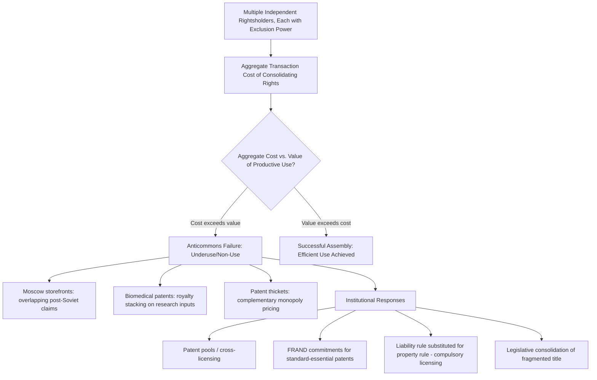

## The Tragedy of the Anticommons and Fragmentation

### Overview

The tragedy of the anticommons describes the systematic **underuse** of a scarce resource that occurs when multiple parties each hold an independent right to exclude others, and no single party holds an effective right to use the resource without first securing consent from every other rights-holder. Introduced by Michael Heller in his 1998 article "The Tragedy of the Anticommons: Property in the Transition from Marx to Markets," the concept is the precise mirror image of Garrett Hardin's tragedy of the commons: where the commons problem arises from too little exclusion (open access, leading to overuse), the anticommons problem arises from too much exclusion (fragmented veto power, leading to underuse). Together, the two concepts bracket the efficient middle ground that well-designed property institutions are meant to achieve.

### Formal Structure of the Problem

Consider a resource whose productive use requires assembling permission from $n$ independent rightsholders, each holding an independent right to exclude (a veto). Let $V$ denote the total social value generated if the resource is successfully put to its productive use, and let $c_i$ denote the transaction cost that rightsholder $i$ imposes in the negotiation process (search costs of identifying them, bargaining costs of reaching agreement with them, and any strategic holdout premium they can extract given their veto power).

A successful, value-creating transaction requires:

$$V > \sum_{i=1}^{n} c_i$$

Because holdout risk (each party's incentive to extract a disproportionate share of surplus given their veto power, as covered in the entry on bargaining and entitlement allocation) causes $c_i$ to grow **more than linearly** with the number of independent rightsholders $n$ — each additional veto-holder does not simply add a fixed negotiation cost, but also increases the strategic leverage of every other veto-holder, since the deal now depends on unanimous consent among a larger set of parties — the aggregate transaction cost $\sum c_i$ can exceed $V$ even when each individual rightsholder's claim is small and even when the underlying use would be highly socially valuable.

$$\text{Anticommons failure: } \sum_{i=1}^{n} c_i(n) > V, \quad \text{where } c_i(n) \text{ is increasing in } n$$

This generates the anticommons' central, counterintuitive prediction: **increasing the number of independent property rights over a single resource can reduce, rather than increase, the resource's productive use and social value** — directly complicating the simple heuristic (drawn from the entry on economic functions of property rights) that more clearly defined and enforced property rights are always efficiency-enhancing.

### Diagram: Rights Fragmentation and Resource Utilization

<svg xmlns="http://www.w3.org/2000/svg" viewBox="0 0 560 340">
<text x="280" y="25" text-anchor="middle" font-size="16" font-weight="bold" fill="#1a1a1a">Fragmentation and Resource Utilization (svg_diagram)</text>
<line x1="70" y1="290" x2="70" y2="50" stroke="#333" stroke-width="2" />
<line x1="70" y1="290" x2="500" y2="290" stroke="#333" stroke-width="2" />
<text x="20" y="55" font-size="12" fill="#333">Resource Utilization</text>
<text x="420" y="315" font-size="13" fill="#333">Number of Independent Veto-Holders (n)</text>
<path d="M 90 100 Q 150 90 200 95 Q 300 120 400 220 Q 450 260 480 280" stroke="#8e44ad" stroke-width="2.5" fill="none" />
<circle cx="120" cy="93" r="5" fill="#1a1a1a" />
<text x="90" y="80" font-size="11" fill="#1a1a1a">Single owner: full utilization</text>
<circle cx="420" cy="240" r="5" fill="#1a1a1a" />
<text x="330" y="260" font-size="11" fill="#1a1a1a">Many vetoes: near-zero utilization</text>
<line x1="70" y1="150" x2="500" y2="150" stroke="#27ae60" stroke-width="1.5" stroke-dasharray="5,3" />
<text x="480" y="145" font-size="11" fill="#27ae60">Efficient utilization level</text>
</svg>

### Canonical Historical Example: Post-Soviet Moscow Storefronts

Heller's original empirical motivation was the puzzling persistence of empty storefronts in post-Soviet Moscow in the early-to-mid 1990s, despite evident consumer demand and available capital for retail development. Heller's explanation: post-Soviet privatization had fragmented control over commercial real estate among multiple overlapping claimants — separate agencies with authority over the physical structure, the land beneath it, and various use permits, plus enterprises retaining residual claims from the Soviet era. Opening a functioning storefront required assembling consent from this entire fragmented set of rightsholders. Each held a de facto veto and could extract a share of the venture's value by threatening to withhold consent, and the aggregate transaction cost of securing all necessary approvals frequently exceeded the value the storefront would generate — leaving storefronts empty even where an ordinary market transaction (with a single identifiable owner) would readily have occurred.

### Application: Biomedical Patents — Heller and Eisenberg (1998)

The most extensively analyzed application of anticommons theory is Heller and Rebecca Eisenberg's companion article, "Can Patents Deter Innovation? The Anticommons in Biomedical Research" (*Science*, 1998). The argument: the rise of upstream patenting on gene fragments, research tools, receptors, and other foundational biomedical building blocks means that a researcher or firm seeking to develop a downstream therapeutic (which may depend on dozens of separately patented upstream components) faces a **royalty-stacking and multi-party licensing problem** structurally identical to Heller's storefronts:

$$\text{Total licensing cost} = \sum_{i=1}^{n} (\text{royalty}_i + \text{negotiation cost}_i)$$

As $n$ (the number of separately patented inputs required) grows, both the aggregate royalty burden and the aggregate transaction cost of negotiating with every patent holder can grow to the point where the downstream innovation — despite being individually valuable and despite each upstream patent having been granted precisely to *encourage* innovation — becomes commercially unviable to pursue, or is pursued only after substantial delay and cost.

[Inference: this remains a significant theoretical prediction in the patent law and economics literature, but subsequent empirical work examining actual biomedical licensing practices (notably by John Walsh, Ashish Arora, and Wesley Cohen in the mid-2000s) found that in practice, researchers and firms frequently developed informal "working solutions" — ignoring certain patents, engaging in ex post rather than ex ante licensing, or relying on research exemptions — that mitigated the severity of anticommons effects relative to the original theoretical prediction. Whether the anticommons problem is a first-order or a more modest, partially-self-correcting concern in biomedical patent practice remains an actively debated empirical question, distinct from the soundness of the underlying theoretical mechanism.]

### Application: Patent Thickets and Standard-Essential Patents

Related to but analytically distinct from the pure Heller-Eisenberg biomedical case is the concept of a **patent thicket**: a dense overlapping web of patent rights that a firm must navigate (via licensing or litigation) to commercialize a product, particularly prevalent in complex multi-component technologies such as smartphones, semiconductors, and telecommunications standards.

**Royalty stacking** is the specific mechanism by which patent thickets generate anticommons-like underuse: if each of $n$ patent holders sets royalties independently, without accounting for the fact that $n-1$ other patent holders are doing the same for complementary inputs to the same final product, the aggregate royalty burden can substantially exceed what any single, unified patent holder would have charged — a direct analogy to the classic **Cournot complementary monopoly** problem (multiple monopolists each controlling a complementary input independently set higher aggregate prices than a single monopolist controlling all inputs would set, since each ignores the negative externality their price increase imposes on demand for the other complementary inputs).

$$\text{Aggregate royalty under independent pricing} > \text{Aggregate royalty under joint/unified pricing}$$

**Standard-Essential Patents (SEPs)** subject to **FRAND** (Fair, Reasonable, And Non-Discriminatory) licensing commitments represent a specific institutional response: standard-setting organizations require members to commit to license patents essential to an industry standard on FRAND terms precisely to prevent the patent-thicket/royalty-stacking anticommons problem from blocking the standard's adoption and use.

### Institutional Responses to Anticommons Fragmentation

**1. Patent pools and cross-licensing arrangements**: voluntary consolidation mechanisms where multiple patent holders agree to jointly license a bundle of complementary patents to downstream users through a single transaction, directly reducing the transaction cost of multi-party negotiation by converting $n$ separate bilateral negotiations into a single pooled transaction.

**2. Liability rules substituted for property rules**: as covered in the prior entry on property versus liability rules, converting some or all of the fragmented exclusion rights into liability-rule (damages-only, no injunction) protection removes the holdout leverage each individual rightsholder would otherwise have, since a user can proceed with the productive use and simply pay court-assessed compensation rather than needing to secure every rightsholder's affirmative consent. Compulsory licensing regimes (used in some patent systems for certain categories of invention, and in copyright for mechanical music licenses in many jurisdictions) function exactly this way.

**3. Consolidation through acquisition or legislative reform**: in extreme fragmentation cases (e.g., historically fragmented mineral rights, or severely fragmented heirs' property in inherited land), legal reforms enabling forced consolidation, partition sales, or simplified title-clearing mechanisms directly reduce $n$, the number of independent veto-holders, restoring the possibility of productive use.

**4. Ex ante coordination in standard-setting and research consortia**: designing IP-sharing rules and licensing commitments *before* fragmentation occurs (as with FRAND commitments in standard-setting organizations, or pre-negotiated data/materials-sharing agreements in large-scale scientific research consortia) prevents the anticommons problem from arising in the first place, rather than requiring costly ex post consolidation.

### Anticommons vs. Commons: A Unified Framework

Both the tragedy of the commons and the tragedy of the anticommons can be understood as failures along a single continuum of **rights concentration** — one from having too few excludable rights (commons) and one from having too many independently exercisable veto rights (anticommons) — with efficient resource governance typically requiring an intermediate degree of consolidation calibrated to the specific transaction-cost and externality structure of the resource in question.

| Dimension | Tragedy of the Commons | Efficient Middle Ground | Tragedy of the Anticommons |
| --- | --- | --- | --- |
| Number of parties with unilateral access/use rights | Unlimited (open access) | Appropriately limited | N/A — access itself is the problem's target |
| Number of parties with unilateral veto/exclusion rights | Effectively zero | One (or a small, coordinated group) | Many, acting independently |
| Resulting resource outcome | Overuse, rent dissipation | Value-maximizing use | Underuse, non-use, foregone value |
| Root economic mechanism | Uninternalized negative externality of use on other users | Externality internalized by owner(s) | Uninternalized negative externality of one veto-holder's exclusion on other veto-holders' (and users') surplus |

### Critiques and Boundary Conditions

- **Not all rights fragmentation produces anticommons effects**: the bundle-of-rights literature (covered in the entry on economic functions of property rights) emphasizes that splitting property into separate, complementary sticks (e.g., separating a mortgage lender's security interest from an occupant's use right) is often efficiency-enhancing, since it permits specialization in risk-bearing and capital provision without creating an anticommons, *provided* the split rights do not each carry an independent, uncoordinated veto over the resource's primary productive use. The anticommons problem specifically requires that fragmentation take the form of **multiple independent exclusion rights over the same use**, not merely multiple economic interests in a resource's value.
- **Empirical prevalence remains contested**: as noted in the biomedical patent discussion, subsequent empirical research has found that real-world actors often develop informal coordination mechanisms (ignoring low-value patents, sequential rather than simultaneous negotiation, reputational norms against aggressive holdout) that mitigate anticommons effects relative to the theory's starkest predictions. [Inference: the theoretical mechanism is well-established and widely accepted; the question of how often and how severely it manifests in specific real-world markets (patents, land, spectrum, etc.) without such mitigating mechanisms is empirically variable and remains actively studied rather than settled.]
- **Distinguishing anticommons from ordinary bilateral monopoly holdout**: some scholars note that many "anticommons" examples are simply large-numbers extensions of the standard bilateral-monopoly holdout problem already covered under Coasean bargaining theory, raising a definitional question of whether the anticommons is a genuinely distinct phenomenon or a useful relabeling/extension of already-established transaction cost concepts to the specific context of fragmented exclusion rights — a question more of theoretical taxonomy than of substantive disagreement about the underlying economic mechanism.

### Related Topics

- Economic functions and justifications of property rights
- The tragedy of the commons and common property regimes
- Property rules versus liability rules
- Bargaining and the allocation of entitlements (holdout problems)
- Patent pools, cross-licensing, and FRAND commitments for standard-essential patents
- Compulsory licensing regimes in patent and copyright law
- Sources and types of transaction costs
- Eminent domain and forced consolidation of fragmented title