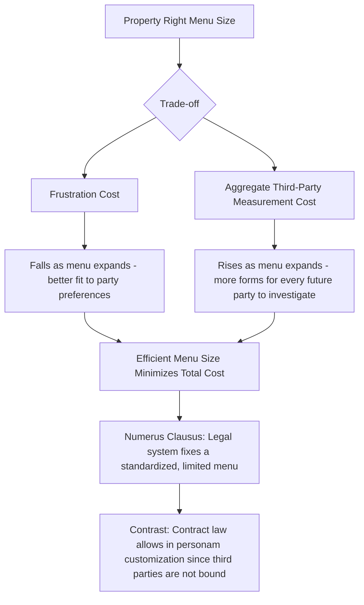

## Numerus Clausus and the Standardization of Property Rights

### Overview

The *numerus clausus* principle — Latin for "closed number" — holds that the law recognizes only a limited, fixed menu of property right forms (fee simple, life estate, easement, lease, mortgage, and a small number of others), and that private parties cannot create novel, customized property interests outside this fixed menu, even by explicit mutual agreement. This stands in sharp contrast to contract law, where parties are generally free to create whatever bespoke obligations they wish. The economic analysis of the *numerus clausus*, developed most rigorously by Thomas Merrill and Henry Smith ("Optimal Standardization in the Law of Property: The Numerus Clausus Principle," 2000), explains this apparent restriction on freedom of contract as an efficient response to a distinct category of transaction cost: the **information costs that novel property forms impose on third parties** who are not party to the original transaction.

### The Core Puzzle: Why Restrict Freedom of Contract for Property But Not Contracts?

Contract law is built on the premise that private ordering between consenting parties should generally be respected and enforced (subject to limited public policy exceptions). Property law, by contrast, imposes hard limits on the forms rights can take — a landowner cannot, for instance, create a novel "right to fly a purple flag over this specific corner of the parcel every third Tuesday, binding on all future owners of the land" as a property interest running with the land, even if the current owner and their contractual counterparty fully agree to it. Such an idiosyncratic arrangement, if desired, could only bind the *original* parties as a personal contractual obligation — it cannot be structured as a property right enforceable against the whole world (an *in rem* right) and automatically binding on subsequent purchasers.

**The economic answer**: property rights, unlike contract rights, are *in rem* — they bind not just the immediate parties but the entire world, including future purchasers, creditors, and other third parties who never negotiated with the original rights-creator. This generates a distinct **externality on third parties**: every idiosyncratic property form that is legally recognized imposes an information-processing cost on every subsequent party who must investigate title to that resource, since they must now identify and understand this unique, non-standard interest in order to safely transact.

### Formal Framework: Information Costs as a Third-Party Externality

Merrill and Smith's key formal insight is that the number and variety of property forms in a legal system creates a trade-off between two costs:

**Frustration costs**: the loss to parties who would have preferred to create a customized property interest but are constrained to select from the standardized menu, forcing them into a less-than-ideal fit for their specific needs.

**Measurement (information) costs**: the cost imposed on all third parties in the market who must, before any transaction involving the resource, investigate and verify what property interests attach to it. This cost is borne not by the party creating the interest, but by every future stranger to the original transaction — a classic externality, since the creating parties do not bear (and thus do not fully internalize) the total social cost of the informational burden their novel property form imposes on the broader market.

$$\text{Total Social Cost} = \text{Frustration Cost}(\text{menu restrictiveness}) + \text{Aggregate Measurement Cost}(\text{variety of forms})$$

The efficient menu size minimizes this sum. As the law permits more customized, idiosyncratic property forms, frustration costs fall (parties can better tailor rights to their specific needs) but aggregate measurement costs rise (every subsequent transaction involving any parcel or asset now requires investigating a wider universe of possible idiosyncratic interests). The *numerus clausus* principle reflects a legal system's judgment that, for property (unlike contract), the marginal reduction in frustration cost from allowing further customization is generally outweighed by the marginal increase in aggregate third-party measurement cost.

### Why Contracts Do Not Face the Same Restriction

The economic explanation for the property/contract asymmetry turns entirely on the **in rem vs. in personam** distinction:

- **Contract rights are *in personam***: they bind only the specific parties to the agreement. A third party who has no dealings with either contracting party need never investigate, understand, or account for the contract's terms — the contract simply does not affect them, so there is no third-party measurement cost externality to worry about, and the law can safely permit unlimited customization.
- **Property rights are *in rem***: they bind the whole world, including parties who had no role in creating the right and no opportunity to negotiate around it. A buyer of land, a mortgage lender, a judgment creditor seeking to attach an asset — each must be able to determine what property rights and burdens attach to a resource without conducting a costly individualized investigation into every possible idiosyncratic arrangement the current or a past owner might have privately crafted.

**Example illustrating the distinction**: Two neighbors can freely contract that one will personally pay the other $50/month for the privilege of using a portion of a driveway — this is a valid, fully customizable *personal* contract, binding only on the two of them. But if they wish to create a permanent right that automatically transfers to and binds all future owners of both parcels (a property interest — specifically an easement), the law requires them to fit their arrangement into one of the law's recognized easement categories (easement appurtenant, easement in gross, with specific formation and scope rules), rather than permitting them to define an entirely novel, freeform property interest that would bind future strangers to the original bargain.

### The Standardized Menu: Illustrative Categories

Common law and civil law systems both exhibit *numerus clausus* constraints, though the specific menus differ by jurisdiction. Representative categories in Anglo-American property law include:

| Category | Standardized Forms | Key Standardized Features |
| --- | --- | --- |
| **Estates in land** | Fee simple absolute, fee simple defeasible, life estate, leasehold (term of years, periodic tenancy) | Fixed duration/defeasibility structures; limited menu of conditions that can trigger forfeiture or reversion |
| **Concurrent ownership** | Tenancy in common, joint tenancy, tenancy by the entirety | Fixed rules regarding survivorship, severability, and creditor access |
| **Servitudes** | Easements (appurtenant, in gross), real covenants, equitable servitudes (profits) | Restricted categories of burdens that can "run with the land"; touch-and-concern requirements |
| **Security interests** | Mortgage, deed of trust, various statutory liens | Standardized foreclosure procedures and priority rules |
| **Future interests** | Reversion, remainder (vested/contingent), executory interest | Fixed classification scheme with standardized rules governing vesting and transferability |

Notably, even *within* these categories, the law imposes further standardizing constraints — for instance, the common law's traditional hostility to novel future interests and the historical **Rule Against Perpetuities**, which limits how far into the future a contingent property interest can remain unvested, can itself be understood as an information-cost-reducing standardization device, preventing owners from creating arbitrarily complex, long-duration contingent interests that would impose escalating investigation costs on the market indefinitely.

### Application: Why the "Touch and Concern" Requirement for Covenants Running with the Land

The common law's requirement that a covenant "touch and concern" the land (relate meaningfully to the use or enjoyment of the property, rather than being a purely personal obligation) in order to run with the land and bind successors is a direct doctrinal implementation of the *numerus clausus* logic: it filters out idiosyncratic, purely personal obligations that parties might otherwise attempt to attach to land in perpetuity, limiting the category of burdens that future purchasers must anticipate and investigate to those with a recognizable, standardized relationship to land use.

### Application: The Fixed Number of Estates and the Rejection of the "Fee Simple Determinable Upon Any Condition Whatsoever" Model

Historically, the common law developed a closed, hierarchical taxonomy of possessory estates rather than allowing any conceivable duration/condition combination a grantor might wish to impose. This standardization economizes on the measurement costs a title searcher would otherwise face if every grantor could design an entirely bespoke temporal/conditional structure — instead, once a title searcher identifies which of the recognized standard forms applies (fee simple absolute, life estate, etc.), a substantial body of settled default rules governing that form's incidents (alienability, waste liability, creditor rights) applies automatically, without need for further bespoke investigation.

### Cross-Jurisdictional Comparison: Civil Law Systems

The *numerus clausus* principle is, if anything, more explicitly and rigidly codified in civil law jurisdictions (drawing on Roman law traditions) than in common law systems, where the constraint is often more implicit and doctrinally scattered across the estates system, the law of servitudes, and the rules governing security interests. Civil codes frequently contain an explicit, enumerated list of the *iura in re* (rights in a thing) that the legal system recognizes, with private parties expressly barred from creating rights outside this enumerated list — a more formally codified version of the same information-cost-economizing logic Merrill and Smith identify as underlying the common law's more piecemeal approach.

### Efficiency Trade-offs and Criticisms

- **Rigidity costs are real and sometimes significant**: critics of the *numerus clausus* framework (or at least of its stringent application) note that forcing parties into an ill-fitting standardized category can impose substantial frustration costs, particularly for genuinely novel economic arrangements (e.g., early attempts to structure conservation easements, carbon offset property interests, or complex renewable energy siting rights sometimes required legislative intervention to create new standardized categories, since existing menus did not accommodate them well) — illustrating that the "closed" menu is not permanently fixed but periodically expanded through legislation when frustration costs from a genuinely novel and economically important use become large enough to justify creating a new standardized category (with its own new, but at least uniform, set of measurement-cost-reducing default rules).
- **Merrill and Smith's own qualification**: the *numerus clausus* is best understood as an economizing tendency and a strong presumption rather than an absolute, unchanging rule — legal systems do add new standardized property forms over time (condominium ownership, conservation easements, and various statutory security interests are all relatively modern additions to the historical menu), but new forms are added as new **standardized** categories with their own settled, generally applicable rules, not as one-off, infinitely customizable arrangements for individual parties.
- **Relationship to notice and recording systems**: the *numerus clausus* principle interacts closely with recording and title registration systems (covered in the entry on economic functions of property rights) — both are complementary information-cost-reducing institutions, with standardization limiting the *variety* of interests that can exist and recording systems reducing the cost of *discovering* which of the standardized interests actually attach to a specific asset.
- **Contested theoretical primacy**: some property theorists argue that factors beyond pure information-cost economizing — including path dependence, historical accident, and the interests of legal professionals invested in existing categories — also help explain the persistence of the standardized menu, meaning the pure efficiency account, while influential, may not be a complete explanation for every feature of the observed *numerus clausus* pattern. [This reflects genuine ongoing scholarly disagreement about the relative explanatory weight of efficiency versus other factors, rather than a settled empirical question.]

### Related Topics

- Economic functions and justifications of property rights
- The tragedy of the anticommons and fragmentation
- Bundle of rights theory and the separability of property interests
- Recording systems, title registries, and the economics of notice
- Real covenants, equitable servitudes, and the touch-and-concern requirement
- The Rule Against Perpetuities and temporal limits on future interests
- Comparative property law: civil law *numerus clausus* codification
- Conservation easements and the legislative creation of new standardized property forms