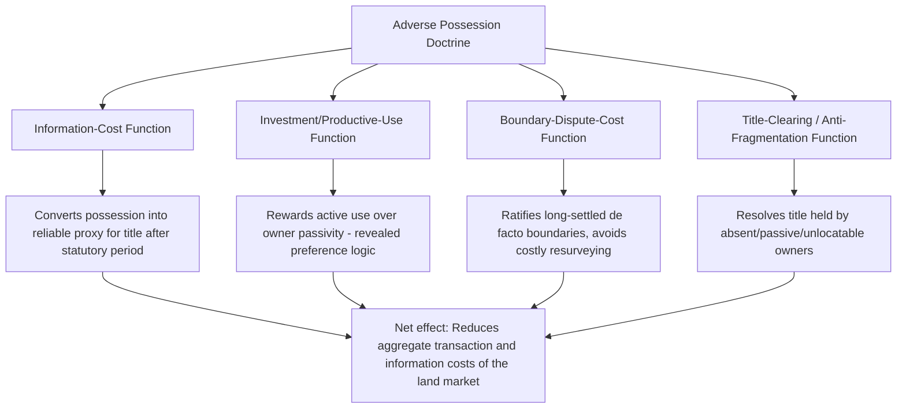

## Adverse Possession and Economic Efficiency

### Overview

Adverse possession — the common law doctrine allowing a trespasser who occupies land openly, notoriously, continuously, and adversely for a statutorily defined period to acquire legal title, extinguishing the original owner's rights — presents a puzzle for a legal system otherwise committed to protecting property rights: why would the law affirmatively reward a trespasser with ownership, effectively imposing an uncompensated taking on the original titleholder? The economic analysis of adverse possession identifies several efficiency-based justifications rooted in transaction cost economics, information economics, and the broader functions of property rights covered in this chapter, while also acknowledging that the doctrine's precise contours reflect a genuine trade-off among competing efficiency considerations.

### The Core Economic Justifications

#### 1. Correcting and Clearing Title (The Information-Cost Function)

Adverse possession functions as a **statute of limitations for title disputes**, converting a long-persisting factual possession into legally secure title after a fixed period. This serves the same information-cost-reducing function as the recording and registry systems discussed in the entry on economic functions of property rights: it allows a title searcher, after the statutory period, to rely on **observable possession** rather than needing to trace an unbroken, error-free chain of paper title back through potentially centuries of transactions, any one of which might contain a defect (a forged deed, an incompetent grantor, a boundary survey error).

$$\text{Cost of verifying title} = \text{Cost of tracing full historical chain} \quad \text{vs.} \quad \text{Cost of verifying current observable possession + elapsed statutory period}$$

By making the second, cheaper verification method legally sufficient after the statutory period, adverse possession reduces the aggregate information costs borne by the market in verifying title — a direct parallel to the *numerus clausus* principle's information-cost-economizing logic applied to the *temporal* dimension of title rather than the *variety* of recognized interests.

#### 2. Incentivizing Productive Use of Land (The Investment Function)

Adverse possession rewards the party who is actually **using** the land productively over the party who holds paper title but leaves the land idle, unmonitored, or neglected. This directly connects to the investment-incentive function of property rights covered earlier in this chapter: a true owner who never inspects, uses, or defends their land against encroachment is, in effect, revealing (through their inaction) a low valuation of the resource relative to the adverse possessor who is actively investing labor and capital in productive use.

Formally, if $v_O$ is the true owner's valuation of the land (proxied by their willingness to monitor and defend it) and $v_{AP}$ is the adverse possessor's valuation (proxied by their sustained investment in open, continuous use), the doctrine can be understood as implementing a **behavioral revealed-preference test**: an owner who fails to assert their right despite open and notorious adverse use for an extended period reveals $v_O < $ (cost of monitoring and ejecting the possessor), while the adverse possessor's sustained investment reveals a comparatively higher effective valuation, at least relative to the true owner's revealed indifference.

[Inference: this "revealed preference" framing is a standard theoretical justification advanced in the law and economics literature; it does not claim to precisely measure true subjective valuations, and critics note that an owner's failure to act may reflect ignorance, absence, or disability rather than genuinely low valuation — a limitation addressed further below.]

#### 3. Reducing the Cost of Boundary and Survey Disputes

Many adverse possession cases arise from good-faith boundary errors (a fence built slightly over the true property line, a structure that inadvertently encroaches) rather than deliberate land-grabbing. In these cases, adverse possession economizes on the cost of precise, litigation-grade boundary surveying for every parcel, every time a dispute might conceivably arise: rather than requiring landowners to invest in perfect, continuously-verified boundary certainty, the doctrine allows long-settled *de facto* boundaries (as evidenced by fences, structures, and continuous use patterns) to ripen into legal boundaries, reflecting the reduced value of resolving a small, long-unquestioned discrepancy relative to the cost of precise re-surveying and litigation.

#### 4. Quieting Title Against "Sleeping" or Unlocatable Owners

Adverse possession addresses a variant of the fragmentation/anticommons problem discussed earlier in this chapter: an owner who has become unlocatable, disorganized, or simply passive (e.g., heirs who have lost track of inherited land, or an owner who has abandoned the property without executing a formal transfer) can leave title in a state that blocks productive use indefinitely, since no one can obtain clear, marketable title without either locating the absent owner or waiting out a costly quiet title action. Adverse possession provides an automatic, self-executing mechanism for resolving this problem after a defined period, without requiring an affirmative judicial proceeding to locate and formally extinguish the absent owner's interest.

### The Elements of Adverse Possession Through an Economic Lens

Each traditional common law element of adverse possession can be understood as calibrating the doctrine to serve its efficiency functions while limiting opportunistic or purely predatory claims:

| Element | Traditional Requirement | Economic Function |
| --- | --- | --- |
| **Open and notorious** | Possession must be visible enough that a reasonably attentive owner would discover it | Ensures the true owner has a genuine (low-cost) opportunity to detect and object, so the doctrine only penalizes owners who had a real chance to act — preserving the "revealed preference" logic |
| **Continuous** | Possession must be uninterrupted for the statutory period (though "tacking" between successive possessors is often permitted) | Filters out sporadic, low-investment trespass from genuine sustained productive use; signals a stable, non-transient valuation |
| **Exclusive** | Possessor must exclude others, including the true owner, as a genuine owner would | Distinguishes genuine possessory claims from shared or permissive use, which does not raise the same title-clearing/information-cost rationale |
| **Adverse/hostile** | Possession must be without the true owner's permission | Preserves the distinction between adverse possession and a mere license or lease, ensuring only genuinely disputed claims (with the title-uncertainty-reducing benefit) qualify |
| **Statutory period** | A fixed number of years (varying by jurisdiction, commonly 10-20 years) | Balances the information-cost-reduction benefit (favoring a shorter period) against the owner's interest in a meaningful opportunity to discover and act (favoring a longer period) |

### Formal Trade-off in Setting the Statutory Period

The efficient length of the statutory limitations period reflects a trade-off between two costs that move in opposite directions as the period changes:

$$\text{Total Cost}(\tau) = \text{Owner monitoring/enforcement cost given period } \tau + \text{Aggregate title-uncertainty cost given period } \tau$$

A **shorter** statutory period $\tau$ reduces the length of time during which title remains uncertain and paper-title chains must be traced back further, but imposes a higher risk that a genuinely attentive owner is stripped of title before having a realistic opportunity to notice and object to an encroachment. A **longer** period reduces this risk to owners but extends the period during which title uncertainty (and the associated information costs for third parties) persists. [Inference: there is no single economically "correct" statutory period derivable from first principles alone; the wide variation in actual statutory periods across U.S. states (commonly ranging from about 5 to 20+ years, with some jurisdictions using shorter periods for claims based on color of title or payment of property taxes) likely reflects differing legislative judgments about this trade-off as well as historical and political factors beyond pure efficiency optimization.]

### Complications and Distinctions: Color of Title and Tax Payment

Many jurisdictions provide **shorter** statutory periods, or otherwise favorable treatment, for adverse possessors who hold **color of title** (a defective but facially plausible written instrument purporting to convey title) or who have paid property taxes on the disputed parcel during the possession period. Economically, these enhancements serve two purposes: (1) color of title signals a good-faith, non-opportunistic claim (the possessor genuinely believed they owned the land, reducing concern about deliberate land-grabbing), and (2) tax payment provides an independent, low-cost verification mechanism (the tax rolls) corroborating the possessor's claim and, in a practical sense, means the possessor has been treated as the owner by at least one other institution (the taxing authority) throughout the period — both features that reduce the informational uncertainty the doctrine is designed to resolve, justifying a shorter qualifying period.

### Critiques of the Pure Efficiency Account

- **Distributive and fairness concerns are not addressed by the efficiency framework**: adverse possession can operate harshly against owners who are absent for legitimate reasons (military deployment, incapacity, or simply owning distant or rural land that is genuinely costly to monitor even for an attentive owner) — the "revealed preference" justification is at its weakest precisely in these cases, since inaction may reflect the monitoring cost itself rather than low valuation, and several jurisdictions historically provided tolling provisions (extending the statutory period) for owners under legal disability (minority, incapacity, imprisonment) specifically to address this concern
- **Deliberate/knowing trespass vs. good-faith boundary error**: the doctrine's efficiency justification is most compelling for good-faith boundary disputes and passive/absent owners, and considerably weaker as applied to a possessor who knowingly and deliberately trespasses on land they know belongs to someone else, hoping to eventually acquire title — some jurisdictions and scholars have argued for treating "bad faith" adverse possession less favorably, though the traditional common law elements (particularly the "hostile" requirement) have historically been interpreted in most U.S. jurisdictions without regard to the possessor's subjective good or bad faith (the "objective" standard), a point of ongoing doctrinal and normative debate
- **Comparative rarity of successful claims may limit the doctrine's practical efficiency contribution**: the specific elements (particularly "open and notorious" and "exclusive") make successful adverse possession claims relatively rare in practice for developed, actively-monitored land, meaning the doctrine's efficiency contribution may be concentrated in a comparatively narrow set of cases (informal boundary disputes, genuinely abandoned or neglected land) rather than functioning as a general, broadly active title-clearing mechanism across the land market as a whole [Inference: precise empirical estimates of the frequency and economic magnitude of adverse possession's title-clearing function across the broader land market are limited; the theoretical efficiency rationale is well established in the law and economics literature, but its practical quantitative significance relative to formal recording and registration systems is not precisely measured in available research known to this analysis].
- **Interaction with modern title registration (Torrens) systems**: in jurisdictions using Torrens-style title registration (where the government-maintained register is conclusive evidence of title, rather than requiring private chain-of-title tracing), the information-cost rationale for adverse possession is substantially weakened, since the registration system itself already solves the title-verification problem that adverse possession partially addresses in traditional recording-act jurisdictions — helping explain why some Torrens jurisdictions restrict or abolish adverse possession against registered title.

### Related Topics

- Economic functions and justifications of property rights
- Numerus clausus and the standardization of property rights
- Recording systems, title registries, and the economics of notice
- The tragedy of the anticommons and fragmentation (absent/unlocatable owners)
- Statutes of limitations and repose across legal doctrine
- Torrens title registration systems
- Boundary disputes and the economics of imprecise property lines
- Quiet title actions and title-clearing mechanisms