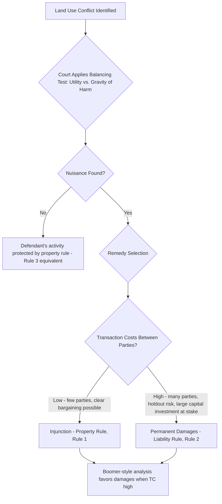

## Nuisance Law and the Economics of Land Use Conflicts

### Overview

Nuisance law governs disputes arising when one landowner's use of their property interferes with a neighboring landowner's use and enjoyment of theirs — noise, odor, smoke, vibration, light, or other spillover effects that cross property boundaries without any physical trespass. Economically, nuisance is the paradigmatic legal doctrine for addressing **bilateral or small-numbers externalities** between neighboring land uses, and it serves as the direct doctrinal proving ground for nearly every concept developed earlier in this chapter and the prior chapter: the Coase Theorem's reciprocal causation insight, the choice between property and liability rules, and the transaction-cost-driven design principles for legal rules generally.

### The Reciprocal Nature of Harm: Coase's Foundational Reframing

As emphasized in the entry on the formulation of the Coase Theorem, Ronald Coase's 1960 article used nuisance disputes (the cattle-rancher/farmer, factory/laundry, and confectioner/doctor examples) specifically to argue that harm in nuisance cases is **reciprocal**, not one-directional: it is equally true to say that the factory harms the laundry by polluting as it is to say the laundry harms the factory by seeking to restrict its profitable activity. Neither party has a self-evident, pre-legal claim to be free of the conflict — the legal system must choose which use to protect, and this choice necessarily imposes cost on one party or the other.

$$\text{Social Welfare} = B_{\text{injurer's activity}}(x) - D_{\text{neighbor's harm}}(x)$$

The efficient level of the injurer's activity $x^*$ satisfies $B'(x^*) = D'(x^*)$ — the same marginal condition developed in the Coase Theorem entry — **regardless of how the legal system frames the "cause" of the conflict.** Nuisance doctrine's central economic task is therefore not to identify a "guilty" party in any moral sense, but to select the legal rule that best approximates this efficient activity level given the transaction costs present in the specific dispute.

### The Traditional Doctrinal Framework: Balancing Utility and Gravity of Harm

Most common law jurisdictions frame nuisance liability around a **balancing test**, articulated in the Restatement (Second) of Torts §826: an intentional interference with land use is unreasonable (and thus actionable as a nuisance) if either:

(a) the **gravity of the harm** outweighs the **utility of the conduct**, or

(b) the harm is serious and compensatory damages would not render continuation of the conduct financially feasible

This balancing framework is a direct, if imprecisely operationalized, doctrinal analogue to the economic efficiency condition: gravity of harm corresponds to $D(x)$ (the damage function) and utility of conduct corresponds to $B(x)$ (the injurer's benefit function), and the test asks courts to make essentially the same marginal comparison the economic model formalizes — though without the mathematical precision of the underlying model, and historically applied inconsistently across jurisdictions.

### Choice of Remedy: Property Rule vs. Liability Rule in Nuisance

As developed in the entry on property rules versus liability rules, nuisance remedy selection is the paradigm case for the Calabresi-Melamed framework, and the four "rules of the Cathedral" map directly onto nuisance doctrine's available remedies:

- **Injunction protecting the plaintiff (Rule 1)**: courts enjoin the defendant's activity entirely, forcing any continuation to be negotiated and paid for at the plaintiff's self-set price — the traditional common law remedy for nuisance
- **Damages protecting the plaintiff (Rule 2)**: courts allow the defendant's activity to continue but require payment of court-assessed compensatory (or permanent) damages to the plaintiff — the approach taken in the seminal case of *Boomer v. Atlantic Cement Co.* (1970), discussed in the property rules/liability rules entry, where transaction costs (numerous affected landowners, holdout risk, and the scale of the cement plant's capital investment) favored a liability rule over an injunction
- **No liability, defendant may continue freely (Rule 3-equivalent)**: courts find no actionable nuisance, effectively assigning the entitlement to the defendant's activity, protected by a property rule (the plaintiff would have to pay the defendant to stop, if they wished, through private bargaining)
- **"Coming to the nuisance" doctrine**: a defense recognizing that a plaintiff who moves near a pre-existing land use (e.g., purchasing land near an established, lawfully-operating farm or industrial facility) has, in effect, revealed a lower valuation of freedom from that specific interference than an original neighbor would have — a doctrine that can be understood as a rough, judicially-administered proxy for what a hypothetical Coasean bargain would likely have produced (the newcomer, aware of the existing use, presumably paid a lower price for the land reflecting the burden, and re-litigating the same burden through a nuisance claim risks a kind of double recovery)

### The Coming-to-the-Nuisance Doctrine and Efficient Land Use Patterns

The coming-to-the-nuisance defense raises a distinct dynamic efficiency concern beyond the static balancing test: if courts too readily grant relief to newcomers who move near a pre-existing use, this can create a **perverse incentive against efficient land development** near existing industrial, agricultural, or other potentially interference-generating uses, since developers and residential buyers may rationally avoid otherwise economically sensible locations near such uses, or existing operators may find themselves perpetually vulnerable to being enjoined by whoever happens to move nearby next — undermining the security of expectations that the initial, lawful land use should reasonably be entitled to.

Conversely, if the doctrine is applied too rigidly to categorically bar all newcomers' claims, it can entrench inefficient existing uses against otherwise value-maximizing land use transitions (e.g., an area's efficient transition from industrial to residential use as a city grows and land values shift) — courts and the Restatement approach have generally treated "coming to the nuisance" as one relevant factor within the broader balancing test rather than an absolute bar, reflecting an attempt to accommodate both the security-of-expectations concern and the need to permit efficient long-run land use transitions.

### Zoning as a Substitute for and Complement to Nuisance Litigation

**Zoning ordinances** represent a direct institutional alternative to case-by-case nuisance litigation for resolving land use conflicts, and the choice between the two can itself be analyzed through the transaction-cost lens developed in the Coase Theorem chapter:

- **Nuisance litigation** resolves conflicts **ex post**, case by case, after a specific conflict has arisen between specific, identified neighboring parties — economizing on ex ante administrative costs (no need to anticipate every possible land use conflict in advance) but imposing significant ex post litigation costs, valuation uncertainty, and delay for each individual dispute
- **Zoning** resolves potential conflicts **ex ante**, through generally applicable rules (use districts, setback requirements, density limits) established by a legislative or administrative body before specific conflicts arise — economizing on the aggregate litigation costs of resolving numerous similar disputes case-by-case, at the cost of reduced flexibility to accommodate the specific, localized cost-benefit balance of any individual parcel's actual land use conflict

$$\text{Total Cost}(\text{Nuisance regime}) = \sum(\text{Individual litigation costs across all disputes}) + \text{Valuation error per case}$$

$$\text{Total Cost}(\text{Zoning regime}) = \text{Ex ante administrative/legislative cost} + \sum(\text{Cost of misfit between general rule and specific parcel conditions})$$

In practice, most jurisdictions rely on **both** mechanisms in combination: zoning handles the large majority of routine, predictable land use conflicts through general categorical rules, while nuisance litigation remains available as a residual mechanism for conflicts not adequately anticipated or resolved by the applicable zoning scheme (and indeed, compliance with an applicable zoning ordinance, while relevant evidence, is generally not an absolute defense to a nuisance claim in most jurisdictions, reflecting the continued complementary role of case-specific nuisance analysis).

### The Right-to-Farm Statutes: A Legislative Response to Coming-to-the-Nuisance Concerns

Many U.S. states have enacted **right-to-farm statutes**, which provide statutory protection to agricultural operations against nuisance claims brought by neighbors who move into a previously rural or agricultural area — a direct legislative response to the dynamic efficiency concern that expanding residential development into agricultural areas could otherwise use nuisance litigation to gradually eliminate long-established, lawfully operating farms through a series of individual coming-to-the-nuisance-adjacent claims. Economically, these statutes can be understood as a legislative judgment strengthening the property-rule protection afforded to the pre-existing agricultural use, shifting the effective entitlement (and the associated Coasean bargaining burden) toward newcomers who wish to be free of ordinary, non-negligent farm operations (odor, noise, dust) rather than requiring farmers to internalize the preferences of every subsequent nearby residential developer.

### Distinguishing Nuisance from Trespass: The Economic Rationale for Different Liability Standards

Nuisance law traditionally applies a **balancing/reasonableness** standard, whereas trespass to land traditionally imposes something closer to **strict liability** for any physical intrusion, however minor. The economic rationale for this doctrinal distinction tracks the transaction-cost and information-cost considerations developed throughout this chapter:

- **Trespass** typically involves a discrete, clearly observable physical intrusion (someone walking onto land, a structure physically crossing a boundary) where the "harm" (interference with exclusive possession) is essentially unambiguous and the balancing inquiry would add little value while significantly raising enforcement/verification costs — a bright-line strict liability rule is administrable and reflects the property right's core exclusionary function
- **Nuisance** typically involves diffuse, matter-of-degree interference (some noise, some odor, some vibration is inevitable in any populated or developed area) where a strict liability standard (any interference whatsoever is actionable) would be both economically inefficient (barring vast amounts of ordinary, socially valuable land use) and practically unadministrable (nearly every land use generates some spillover effect on neighbors) — the balancing test allows courts to distinguish tolerable, ordinary interference from genuinely excessive interference warranting legal intervention

### Numerical Illustration: The Balancing Test as Marginal Analysis

Suppose a factory's activity level $x$ generates profit $B(x) = 200x - 2x^2$ and imposes neighborhood harm $D(x) = 3x^2$.

**Efficient level**: $B'(x) = 200 - 4x$, $D'(x) = 6x$. Setting equal: $200 - 4x = 6x \implies x^* = 20$.

At $x^* = 20$: $B(20) = 4000 - 800 = 3200$; $D(20) = 1200$. Net social welfare $= 3200 - 1200 = 2000$.

If the factory currently operates at $x = 35$ (beyond the efficient level), $B(35) = 7000 - 2450 = 4550$; $D(35) = 3675$; net welfare $= 875$ — substantially below the $2000$ achievable at $x^*$. A properly calibrated nuisance injunction (property rule) or damages award (liability rule, set equal to $D(x)$ at whatever activity level the factory chooses) should, per the theoretical framework, induce the factory to internalize the harm and reduce activity toward $x^* = 20$, restoring the higher social welfare level.

### Limitations and Critiques

- **Courts do not perform this marginal calculation explicitly**: the balancing test in actual nuisance litigation is applied qualitatively, based on witness testimony, expert opinion, and judicial judgment, not through explicit specification and equating of marginal benefit and marginal damage functions — the economic model is best understood as illuminating the *underlying logic* the doctrine imperfectly approximates, not as a description of actual judicial methodology. [Inference: this gap between the formal economic model and actual judicial practice is widely acknowledged in the law and economics literature; the model's value is explanatory and normative (identifying what an efficient rule would achieve) rather than strictly descriptive of case-by-case judicial reasoning.]
- **Distributive and non-efficiency values remain relevant**: courts applying the balancing test have historically also considered factors such as the character of the neighborhood, the priority of occupation (which use came first), and community expectations — considerations that are not purely reducible to the efficiency-maximizing marginal analysis, reflecting nuisance law's mixed pedigree drawing on both economic and non-economic normative considerations.
- **Valuation difficulty for non-market harms**: many nuisance harms (aesthetic displeasure, general quality-of-life degradation, psychological distress from noise or odor) are inherently difficult to monetize precisely, complicating both the theoretical marginal analysis and the practical administration of damages awards under a liability-rule approach — a specific instance of the general valuation-error concern ($VE$) discussed in the property rules versus liability rules entry.

### Related Topics

- Formulation and proof of the Coase Theorem
- Property rules versus liability rules
- The tragedy of the commons and common property regimes
- Externalities and Pigouvian taxation
- Zoning law and land use regulation
- Right-to-farm statutes and agricultural land use protection
- Trespass to land and strict liability doctrine
- *Boomer v. Atlantic Cement Co.* and the permanent damages remedy