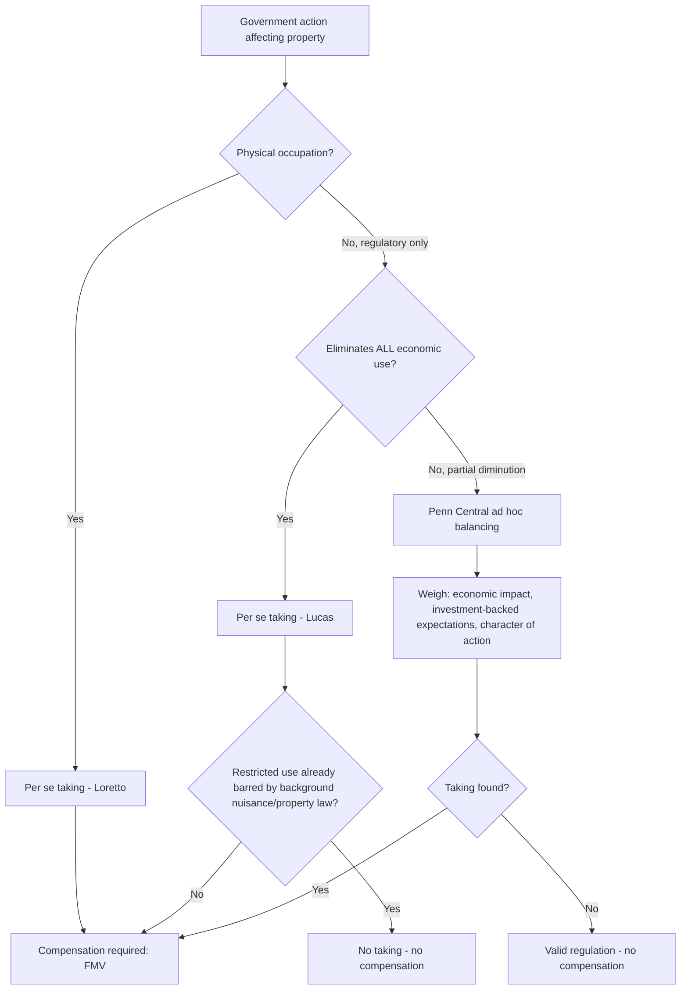

## Eminent Domain, Takings, and Just Compensation

### Conceptual Overview

Eminent domain is the sovereign power of the state to compel the transfer of private property to public or quasi-public use in exchange for compensation. In law and economics, the doctrine is analyzed not primarily as a constitutional guarantee but as a mechanism for solving a specific market failure: bilateral monopoly and holdout problems that prevent efficient land assembly through voluntary exchange.

The Takings Clause of the U.S. Constitution's Fifth Amendment states that private property shall not "be taken for public use, without just compensation," applied to the states via the Fourteenth Amendment. The economic analysis of takings law asks three interrelated questions: (1) when should the state be permitted to force a transfer rather than bargain for it, (2) how much compensation should be paid, and (3) how does the compensation rule affect the incentives of both the state and the property owner.

### The Efficiency Rationale: Holdout Problems

**Key Points**

- Eminent domain is economically justified primarily where transaction costs make voluntary market assembly of property prohibitively expensive.
- The paradigmatic case is linear or contiguous land assembly — highways, rail corridors, pipelines, transmission lines — where a project requires many parcels and any single owner can hold out for a price far above their true valuation.
- Holdout power arises because the value of the assembled parcel to the developer exceeds the sum of the parcels' values in their next-best use; each owner captures some share of this synergy value, and the last owner to sell can capture a disproportionate share, since the developer has already sunk costs into the other parcels.

Formally, if a project requires $n$ parcels and the developer's willingness to pay for the assembled tract is $V$, while the reservation prices of individual owners sum to $\sum_{i=1}^{n} r_i < V$, voluntary assembly is efficient in principle. But if owners can observe that assembly is underway, each has an incentive to withhold consent to extract a larger share of the surplus $V - \sum r_i$. Bargaining can break down entirely (strategic impasse), even though a mutually beneficial trade exists — a classic bilateral monopoly failure once the developer has committed sunk costs into adjacent parcels.

Eminent domain solves this by removing the individual owner's veto power, substituting a compensation formula (typically fair market value) for negotiated price, thereby preventing extraction of the assembly surplus by any single holdout.

**[Inference]** The claim that eminent domain is *necessary* for efficient assembly, rather than merely convenient, is contested; some scholars (notably Epstein and Fischel) argue that many assembly problems could be solved via contingent contracts, secret buyers, or private title insurance schemes, and that eminent domain's low political cost makes it overused relative to its efficiency justification.

### The Compensation Rule: Why "Just Compensation" Means Fair Market Value

Courts and most economic models define just compensation as **fair market value (FMV)** — the price a willing buyer would pay a willing seller in an arm's-length transaction, absent the threat of condemnation. This is deliberately *not* the owner's subjective valuation.

**Subjective value vs. market value**

Many owners hold property at a **subjective valuation** exceeding FMV — due to attachment, relocation costs, or idiosyncratic use value. Let:

$$V_s = V_m + S$$

where $V_m$ is market value and $S \geq 0$ is subjective surplus (consumer surplus the owner enjoys beyond what the market would pay). Compensation set at $V_m$ systematically undercompensates owners with positive $S$, since it does not reimburse implicit relocation costs, goodwill, or sentimental value.

This under-compensation is a deliberate design feature, not an oversight, in the standard economic account — see below on the fiscal-illusion problem.

### The Kelo Debate: Public Use and Economic Development Takings

**Key Points**

- *Kelo v. City of New London* (2005) held that transferring condemned property to private developers for economic redevelopment satisfies the "public use" requirement, so long as the taking serves a conceivable public purpose (increased tax revenue, jobs, blight remediation).
- The decision triggered widespread state-level backlash: most U.S. states subsequently passed statutes or constitutional amendments narrowing "public use" to exclude private economic development takings.
- Economically, *Kelo*-style takings raise the holdout-justification stakes: unlike a highway with a fixed, non-negotiable route, a private redevelopment project usually *could* proceed with a smaller footprint or alternate site, weakening the claim that eminent domain was strictly necessary to overcome holdout failure.

**[Speculation]** Some law-and-economics scholars argue that allowing economic-development takings creates a moral hazard for local governments: because compensation is set at FMV rather than the (much higher) value the redeveloped land will generate, municipalities and private developers capture the appreciation surplus, giving officials an incentive to condemn even when a voluntary sale was feasible at slightly higher cost. This is a normative critique, not an empirically settled finding.

### Fiscal Illusion and the Compensation Puzzle (Blume-Rubinfeld-Shapiro Framework)

A foundational law-and-economics result, developed by Blume, Rubinfeld, and Shapiro (1984), asks: **should just compensation equal full market value, or should it be set below (or above) FMV to optimize government incentives?**

The core tension:

1. **Owner-side incentive (moral hazard in investment):** If compensation is set too high (e.g., equal to full subjective value $V_s$), owners face no risk from a taking and may over-invest in immobile improvements to the property, since they are guaranteed to be made whole regardless of condemnation risk. Efficient investment requires the owner to bear at least some of the residual risk of a taking.
2. **Government-side incentive (fiscal illusion):** If compensation is set too low (or at zero), the government does not internalize the true social cost of the taking — the budget process makes takings appear "free" or artificially cheap, leading to **overuse of eminent domain** relative to the efficient number of takings. This is a demand-side moral hazard mirroring a Pigouvian externality problem: the taking authority does not pay the shadow price of the resource it consumes.

The BRS model shows that under fairly general conditions, **full compensation (FMV) generates optimal government incentives** (forces the state to internalize costs) **but generates suboptimal owner investment incentives** (over-investment, since owners are insured against takings risk). No single compensation rule can simultaneously solve both incentive problems — this is sometimes called the **"compensation dilemma."**

$$\text{Efficient takings condition: } V \geq \sum_{i=1}^{n} v_i(k_i)$$

where $v_i(k_i)$ is owner $i$'s value as a function of investment level $k_i$, and the government's decision to take should occur only when project value $V$ exceeds the *efficient* value of the parcels in private use — not their *actual* value under owners' potentially distorted investment choices.

**[Unverified]** Empirical estimates of the magnitude of over-investment or over-taking induced by these incentive distortions are sparse and highly context-dependent; the theoretical result is well established in the literature, but real-world magnitude estimates should be treated cautiously.

### Categorical Rules vs. Ad Hoc Balancing: Physical vs. Regulatory Takings

U.S. takings doctrine (and its economic rationale) separates into two broad categories:

**1. Physical takings (per se takings)**

Any permanent physical occupation of property by the government, however minor, is a taking requiring compensation (*Loretto v. Teleprompter Manhattan CATV Corp.*, 1982). Economically, this bright-line rule minimizes adjudication costs and eliminates government's ability to disguise a physical taking as a mere regulation.

**2. Regulatory takings**

Government regulation that restricts use of property without physical occupation can constitute a taking if it goes "too far" (*Pennsylvania Coal Co. v. Mahon*, 1922). Two major categorical rules exist:

- **Total wipeout rule** (*Lucas v. South Carolina Coastal Council*, 1992): a regulation that eliminates *all* economically beneficial use of land is a per se taking, unless the restricted use was already prohibited under background principles of state property/nuisance law.
- **Ad hoc balancing** (*Penn Central Transportation Co. v. New York City*, 1978): for partial diminutions in value, courts weigh (a) the economic impact of the regulation, (b) interference with investment-backed expectations, and (c) the character of the government action.

**Economic rationale for the physical/regulatory distinction:**

| Dimension | Physical Taking | Regulatory Taking |
| --- | --- | --- |
| Compensation rule | Always required (per se) | Case-by-case; often none |
| Rationale | Bright-line reduces strategic circumvention | Preserves government's police power flexibility |
| Risk to owner | Fully insured | Owner bears regulatory risk |
| Moral hazard concern | Minimal (rare, discrete events) | High (regulation is a routine, low-cost tool) |

**[Inference]** The differential treatment is often explained in economic terms as a **transaction-cost/administrability argument**: requiring compensation for *every* regulatory diminution in value (zoning, environmental rules, land-use restrictions) would be fiscally paralyzing and would be difficult to distinguish from ordinary tax/regulatory policy, whereas physical occupation is a discrete, easily verified event.

### Diagram: Decision Framework for Takings Analysis

### Public Use Doctrine: Comparative Standards

**Example**

Consider three jurisdictions' treatment of a hypothetical taking of 50 residential parcels to build a private shopping complex, justified by projected tax revenue increases:

- **Federal minimum (post-Kelo):** Satisfies public use if it serves a "public purpose," even broadly defined economic development. The taking would survive federal constitutional challenge.
- **Post-Kelo reform states (e.g., many states that amended statutes after 2005):** Explicitly excludes transfers to private parties for economic development alone; would likely fail unless blight or another statutory exception applies.
- **Blight-based takings:** If the area is independently declared "blighted" under a state redevelopment statute, the taking may proceed regardless of the private ultimate use, since blight remediation is treated as an independent public purpose.

### The Holdout-vs-Assembly Tradeoff: A Formal Illustration

Suppose a rail corridor requires 10 contiguous parcels. Each owner's true reservation value (opportunity cost) is $100,000, so the competitive assembly cost would be $1,000,000. But the corridor is worth $3,000,000 to the developer once complete, and worthless if even one parcel is missing.

Under voluntary bargaining with sequential negotiation and public knowledge of the project, the *last* holdout owner can credibly threaten to withhold consent, since the developer has already sunk $900,000+ into the other nine parcels. That owner's rational ask approaches the developer's remaining willingness to pay, not their opportunity cost:

$$\text{Holdout demand} \approx V - \sum_{i=1}^{9} p_i$$

If this exceeds the developer's remaining budget, the project collapses despite being socially efficient ($V > \sum r_i$). Eminent domain, paying each owner FMV ($100,000, assuming no unique subjective attachment), prevents this strategic extraction and allows the efficient project to proceed — but note this simultaneously extinguishes any legitimate subjective surplus owners might hold, which is the compensation-adequacy critique discussed above.

### Diagram: Bilateral Monopoly / Holdout Structure (svg_diagram)

<svg xmlns="http://www.w3.org/2000/svg" viewBox="0 0 700 320">
<rect x="0" y="0" width="700" height="320" fill="none" />
<text x="350" y="25" text-anchor="middle" font-size="16" font-weight="bold" fill="#1a1a1a">Sequential Land Assembly Holdout Problem (svg_diagram)</text>

<g>
<rect x="20" y="70" width="50" height="50" fill="#a3d9a5" stroke="#333" />
<rect x="80" y="70" width="50" height="50" fill="#a3d9a5" stroke="#333" />
<rect x="140" y="70" width="50" height="50" fill="#a3d9a5" stroke="#333" />
<rect x="200" y="70" width="50" height="50" fill="#a3d9a5" stroke="#333" />
<rect x="260" y="70" width="50" height="50" fill="#a3d9a5" stroke="#333" />
<rect x="320" y="70" width="50" height="50" fill="#a3d9a5" stroke="#333" />
<rect x="380" y="70" width="50" height="50" fill="#a3d9a5" stroke="#333" />
<rect x="440" y="70" width="50" height="50" fill="#a3d9a5" stroke="#333" />
<rect x="500" y="70" width="50" height="50" fill="#a3d9a5" stroke="#333" />
<text x="285" y="145" text-anchor="middle" font-size="12" fill="#1a1a1a">9 parcels acquired ($900,000 sunk)</text>
</g>

<rect x="580" y="70" width="60" height="50" fill="#e57373" stroke="#333" stroke-width="2" />
<text x="610" y="100" text-anchor="middle" font-size="11" fill="#1a1a1a">Parcel 10</text>
<text x="610" y="145" text-anchor="middle" font-size="12" fill="#b71c1c">Holdout</text>

<line x1="20" y1="200" x2="640" y2="200" stroke="#333" stroke-width="1" />
<text x="20" y="220" font-size="12" fill="#1a1a1a">Sum of reservation values: $1,000,000</text>
<text x="20" y="240" font-size="12" fill="#1a1a1a">Assembled project value: $3,000,000</text>
<text x="20" y="260" font-size="12" fill="#b71c1c">Holdout's strategic demand: approaches $2,100,000 (V minus sunk cost of other 9)</text>

<text x="350" y="295" text-anchor="middle" font-size="12" font-style="italic" fill="#555">Eminent domain caps compensation at fair market value, eliminating strategic extraction</text>

</svg>

### Just Compensation: What Is Excluded

Standard doctrine excludes several categories of loss from "just compensation," which is central to the economic critique of under-compensation:

- **Consequential/relocation damages** — moving costs, lost customer goodwill for a business, temporary business interruption — are generally *not* compensable under the constitutional minimum (though some are covered by separate statutes, e.g., the U.S. Uniform Relocation Assistance Act).
- **Subjective/sentimental value** — attachment to a family home, historical or cultural significance to the owner, is explicitly excluded from FMV.
- **Severance damages** — when only part of a parcel is taken, the reduction in value to the *remainder* parcel (e.g., due to reduced access or awkward remaining shape) generally *is* compensable in most U.S. jurisdictions, distinguishing it from the categories above.

**[Inference]** This systematic exclusion of subjective and consequential losses is often cited by law-and-economics scholars as evidence that "just compensation" as practiced is not actually designed to make owners whole in a welfare sense, but rather to approximate an efficient market-transaction price while deliberately preserving *some* government cost internalization (per the BRS framework above) — full compensation for all subjective loss would reintroduce the fiscal-illusion problem.

### Inverse Condemnation and Temporary Takings

**Key Points**

- **Inverse condemnation** is a cause of action brought by a property owner alleging a de facto taking occurred without formal condemnation proceedings — e.g., government flooding of land, or regulation so severe it functions as a taking. The owner, not the government, initiates the suit.
- **Temporary takings** (*First English Evangelical Lutheran Church v. County of Los Angeles*, 1987) established that even a temporary regulatory taking (later invalidated) requires compensation for the period during which the restriction was in effect — the government cannot simply repeal an invalid regulation to escape liability.

### Comparative Note: Takings Doctrine Outside the U.S.

Analogous doctrines exist in most legal systems, though terminology and thresholds vary:

- **Civil law jurisdictions** (e.g., France's *expropriation pour cause d'utilité publique*) generally require a formal declaration of public utility and judicial valuation, often with broader compensation for consequential losses than U.S. practice.
- **International investment law** — bilateral investment treaties and instruments like the ICSID Convention recognize both direct expropriation and "indirect expropriation" (regulatory measures with an expropriatory effect), a concept structurally similar to U.S. regulatory takings doctrine, though the standards for compensation (often "prompt, adequate, and effective" — the Hull formula) and the scope of indirect expropriation remain **[Unverified]** as consistently applied across arbitral tribunals, since outcomes vary significantly by tribunal and treaty language.

### Critiques and Alternative Frameworks

- **Epstein's broad view**: Richard Epstein argues many regulations (zoning, rent control, environmental restrictions) are functionally takings and should trigger compensation, since they redistribute wealth from property owners to the public without full compensation — a minority, libertarian-leaning position in the law-and-economics literature.
- **Michelman's efficiency-plus-fairness framework**: Frank Michelman's foundational 1967 article proposes that compensation should be paid when the "demoralization costs" of proceeding without compensation (settlement disincentives, perceived unfairness, resistance to future public projects) exceed the "settlement costs" (administrative costs of determining and paying compensation) — an early and highly influential cost-benefit approach to the compensation question.
- **Behavioral/public choice critiques**: Because the beneficiaries of a taking (the public, or private developers) are often well-organized while the burdened owners are typically dispersed, standard public-choice concerns about concentrated benefits and diffuse costs apply, predicting systematic over-taking relative to a social-welfare-maximizing baseline, particularly for lower-visibility regulatory takings.

### Related Topics

- Coase Theorem and transaction costs in property rights allocation
- Externalities and nuisance law as an alternative to takings (Pigouvian vs. Coasean remedies)
- Zoning and land-use regulation as implicit takings
- Public choice theory applied to condemnation authority and blight designations
- Contingent valuation and the challenge of measuring subjective property value
- Regulatory takings in environmental law (wetlands, endangered species habitat restrictions)
- International investment arbitration and indirect expropriation standards
- Property rule vs. liability rule protection (Calabresi & Melamed framework)