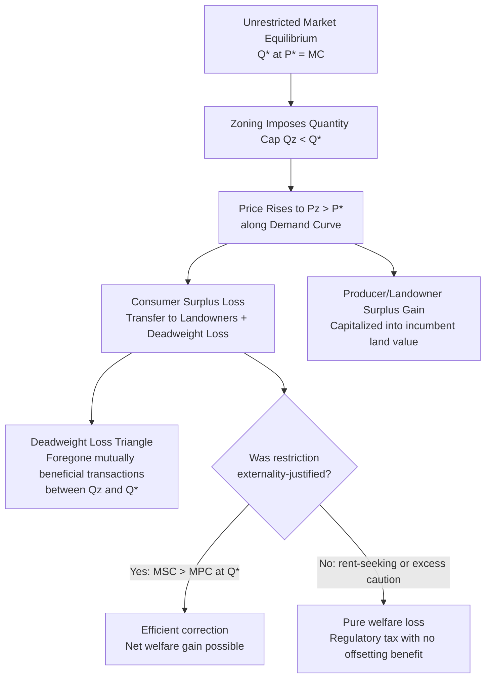

## Zoning and Land Use Regulation Economics

### Overview and Theoretical Foundations

Zoning and land use regulation economics examines how governments intervene in land markets to correct externalities, manage congestion, and allocate spatial resources, while also analyzing the costs such intervention imposes through reduced housing supply, misallocation, and rent-seeking. The field sits at the intersection of welfare economics, public choice theory, and property rights theory, asking two related questions: (1) what is the efficient level and form of land use regulation, and (2) why do observed regulatory regimes so often diverge from that efficient benchmark.

The foundational justification for zoning rests on externality theory. Land use decisions by one owner routinely affect neighboring parcels' value: a factory imposes noise and pollution costs on adjacent homes, a bar imposes noise costs on residential neighbors, and a tall building can block light and views. In the absence of well-defined and enforceable property rights, these spillovers are not fully priced into private land use decisions, leading to a divergence between private and social cost.

### The Coasean Baseline

**Key Points**

Ronald Coase's analysis in "The Problem of Social Cost" (1960) provides the theoretical starting point for evaluating zoning. Coase's central insight is that externality problems are reciprocal: it is not simply that the factory harms the homeowner, but that stopping the factory harms the factory owner. The efficient outcome depends on the relative value of conflicting land uses, not on assigning blame.

Under the Coase Theorem, if transaction costs are zero and property rights are clearly defined, private bargaining between affected parties will achieve the efficient allocation of land uses regardless of the initial assignment of rights. If a factory has the right to pollute but a neighboring homeowner values a quiet, clean environment more than the factory values the ability to pollute, the homeowner can pay the factory to reduce emissions or relocate, and vice versa.

$$W = \max(V_A, V_B) - C_{bargain}$$

where $V_A$ and $V_B$ represent the values of the land under competing uses (e.g., industrial versus residential) and $C_{bargain}$ represents transaction costs of reaching a bargained solution.

In practice, transaction costs in land use conflicts are rarely zero. Externalities from land use typically affect many parties simultaneously (an entire neighborhood, not just one adjacent owner), creating classic collective action and free-rider problems that make private bargaining prohibitively costly. This transaction cost failure is the primary economic justification for public zoning as a substitute for private Coasean bargaining.

### Zoning as a Response to Transaction Costs

Zoning can be understood as a low-transaction-cost substitute for the individually negotiated covenants and easements that would otherwise be needed to internalize land use externalities across an entire district. Rather than requiring hundreds of homeowners to negotiate individually with a would-be developer, a municipality establishes ex ante rules (use restrictions, density caps, setback requirements) that apply uniformly across a zone, dramatically reducing the transaction costs of achieving a coordinated outcome.

This framing, associated with economists such as William Fischel, treats zoning as analogous to a **implicit contract** among neighboring property owners, administered by the municipality, in which each owner accepts restrictions on their own land use in exchange for protection from incompatible uses by neighbors. Fischel's "homevoter hypothesis" extends this by arguing that because a home is typically a household's largest and most undiversified asset, homeowners are rationally motivated to use local political control over zoning to protect and enhance property values, even where this diverges from regional or national efficiency.

### Types of Land Use Regulation

**Example**

- **Euclidean (use-based) zoning**: Named after the landmark U.S. Supreme Court case *Village of Euclid v. Ambler Realty Co.* (1926), which upheld zoning as a valid exercise of police power. This divides land into districts by permitted use (residential, commercial, industrial) and typically layers on density, height, and setback restrictions.
- **Density and floor-area-ratio (FAR) restrictions**: Limit the amount of built floor space relative to lot size, directly constraining housing and commercial supply.
- **Minimum lot size and single-family zoning**: Mandate large minimum parcels or prohibit multi-family structures, restricting density and driving up per-unit land costs.
- **Height restrictions**: Cap building height, often justified by aesthetic or view-preservation rationales but with significant supply effects in high-demand areas.
- **Growth boundaries and urban growth management**: Restrict development to within a defined perimeter (e.g., Portland, Oregon's urban growth boundary), aiming to control sprawl and preserve open space.
- **Historic preservation and design review**: Restrict alteration or demolition of structures meeting historic or aesthetic criteria, often requiring discretionary review.
- **Impact fees and exactions**: Charge developers fees or require in-kind contributions (infrastructure, affordable units) to offset the marginal public costs of new development.
- **Performance zoning**: Regulates based on measurable outcomes (noise levels, traffic generation, effluent) rather than prescribed uses, theoretically more efficient but administratively costly to monitor and enforce.

### The Supply-Side Economics of Land Use Restriction

**Key Points**

A large empirical and theoretical literature, associated with economists including Edward Glaeser, Joseph Gyourko, William Wheaton, and others, analyzes how land use regulation constrains housing supply elasticity and thereby raises prices. The core model treats regulation as an implicit tax or quantity constraint on new construction.

In an unconstrained market, housing supply responds to price signals according to the marginal cost of construction:

$$P = MC(Q)$$

Land use regulation that imposes minimum lot sizes, density caps, or lengthy discretionary approval processes effectively shifts the supply curve inward or makes it more inelastic. Where regulation binds, price reflects not just physical construction cost but also the **shadow value of the regulatory constraint**:

$$P = MC(Q) + \lambda R$$

where $\lambda$ represents the shadow price of the binding regulatory constraint $R$ (e.g., a density cap). Empirical work (notably Glaeser and Gyourko's research on the "zoning tax") estimates this gap by comparing the market price of housing to the physical replacement cost of construction; a persistent, large gap in high-regulation metro areas is interpreted as evidence of a binding regulatory constraint on supply, capitalized into land prices.

This produces a **capitalization effect**: because the right to build is artificially scarce, its value is capitalized into the price of land (and, by extension, existing homes), creating a constituency of incumbent property owners with a financial interest in maintaining restrictive rules — the mechanism underlying the homevoter hypothesis above.

### Public Choice Perspectives: Zoning as Rent-Seeking

Beyond the externality-correction rationale, public choice theory offers a competing and complementary explanation for zoning: it is often used as a mechanism for **rent extraction and rent protection** rather than genuine externality internalization.

- **Fiscal zoning**: Municipalities restrict land to uses (e.g., large-lot single-family homes, commercial development) that generate more in local tax revenue than they consume in public service costs, and exclude uses (e.g., multi-family or low-income housing) perceived as fiscally burdensome. This is closely related to the Tiebout model of local government competition, in which zoning functions as an entry-control device analogous to a club good membership fee.
- **Exclusionary zoning**: Regulation designed, whether explicitly or through disparate effect, to exclude lower-income or minority households, often through minimum lot sizes or prohibitions on multi-family housing. This raises significant fair housing and equal protection concerns, litigated in cases such as *Mount Laurel* in New Jersey.
- **Incumbent rent protection**: Existing property and business owners lobby for restrictions on new entry or competing uses to protect the value of their existing investments, a pattern consistent with Mancur Olson's theory of concentrated benefits and diffuse costs — a small, organized group (current homeowners) has strong incentives to lobby for restriction, while the diffuse group harmed (future residents, renters, non-residents) is poorly organized.
- **Regulatory capture and discretionary approval**: Where zoning involves case-by-case discretionary review (variances, conditional use permits, planned unit developments), it creates opportunities for officials to extract value from developers, whether through legitimate negotiated exactions or through corruption.

### Diagrammatic Model: Welfare Effects of a Binding Zoning Constraint

The following diagram illustrates the standard partial-equilibrium welfare analysis of a binding housing supply restriction, analogous to a quantity control.

<svg xmlns="http://www.w3.org/2000/svg" viewBox="0 0 640 420" font-family="Helvetica, Arial, sans-serif">
<text x="320" y="24" font-size="16" font-weight="bold" text-anchor="middle">Welfare Effects of a Binding Zoning Quantity Constraint (svg_diagram)</text>
<line x1="70" y1="360" x2="600" y2="360" stroke="black" stroke-width="1.5" />
<line x1="70" y1="360" x2="70" y2="50" stroke="black" stroke-width="1.5" />
<text x="600" y="378" font-size="13" text-anchor="middle">Quantity (Housing Units)</text>
<text x="40" y="45" font-size="13" text-anchor="middle">Price</text>
<line x1="70" y1="330" x2="590" y2="90" stroke="#1a73e8" stroke-width="2" />
<text x="580" y="85" font-size="12" fill="#1a73e8">Demand</text>
<line x1="70" y1="330" x2="590" y2="150" stroke="#e8710a" stroke-width="2" />
<text x="580" y="145" font-size="12" fill="#e8710a">Supply (MC), unrestricted</text>
<line x1="430" y1="360" x2="430" y2="50" stroke="#333" stroke-width="1.5" stroke-dasharray="5,4" />
<text x="430" y="378" font-size="12" text-anchor="middle">Qz (zoned cap)</text>
<line x1="520" y1="360" x2="520" y2="50" stroke="#666" stroke-width="1" stroke-dasharray="2,3" />
<text x="520" y="378" font-size="12" text-anchor="middle">Q* (unrestricted)</text>
<line x1="70" y1="152" x2="430" y2="152" stroke="#333" stroke-width="1" stroke-dasharray="2,3" />
<text x="55" y="156" font-size="11" text-anchor="end">Pz</text>
<line x1="70" y1="242" x2="520" y2="242" stroke="#666" stroke-width="1" stroke-dasharray="2,3" />
<text x="55" y="246" font-size="11" text-anchor="end">P*</text>
<polygon points="430,152 430,242 520,180" fill="#d32f2f" fill-opacity="0.35" stroke="#d32f2f" stroke-width="1" />
<text x="450" y="215" font-size="11" fill="#b71c1c">Deadweight Loss</text>
<rect x="70" y="152" width="360" height="90" fill="#4caf50" fill-opacity="0.15" stroke="none" />
<text x="180" y="200" font-size="11" fill="#2e7d32">Surplus transferred to</text>
<text x="180" y="215" font-size="11" fill="#2e7d32">incumbent landowners</text>
<circle cx="430" cy="152" r="3" fill="black" />
<circle cx="520" cy="180" r="3" fill="black" />
</svg>

### Density Restriction Effects on Housing Supply Elasticity

**Example**

Consider a metropolitan area with high demand growth. Under elastic supply (few binding regulatory constraints, as in much of the Sun Belt historically), an increase in demand primarily generates new construction with modest price increases. Under inelastic, heavily zoned supply (as in much of coastal California or the Northeastern United States), the same demand shock translates disproportionately into price appreciation with limited new construction.

The relationship can be expressed via the price elasticity of housing supply, $\epsilon_S$:

$$\epsilon_S = \frac{\% \Delta Q_S}{\% \Delta P}$$

Where $\epsilon_S \to 0$ (perfectly inelastic, as in a hard growth boundary with no vertical development allowed), all of the burden of increased demand falls on price. Where $\epsilon_S$ is high, demand growth is absorbed mostly through quantity. Empirical estimates by Gyourko, Saiz, and others find substantial cross-metro variation in $\epsilon_S$, strongly correlated with a Wharton Residential Land Use Regulatory Index measuring the stringency of local zoning, permitting timelines, and discretionary review.

### Externality Correction vs. Fiscal/Exclusionary Motives: A Testable Distinction

Economists distinguish efficient from inefficient zoning empirically by examining whether restrictions correlate with plausible externality magnitudes or with fiscal/exclusionary incentives:

- If zoning restrictiveness tracks genuine externality risk (e.g., stricter industrial siting rules near schools and hospitals), this is consistent with the Coasean/externality rationale.
- If zoning restrictiveness instead tracks the fiscal profile of proposed uses (e.g., opposition to affordable multi-family housing that would increase school enrollment without proportionate tax revenue) or correlates with exclusionary demographic outcomes, this is more consistent with the public choice/rent-seeking rationale.

[Inference] Most empirical studies find that observed zoning in high-cost U.S. metropolitan areas reflects a substantial fiscal and exclusionary component beyond what pure externality correction would predict, though the precise decomposition between externality-correction and rent-seeking motives varies by jurisdiction and is difficult to identify with certainty given confounding factors in the underlying data.

### Law and Economics Treatment of Regulatory Takings

Zoning intersects with takings law where regulation becomes so restrictive that it is functionally equivalent to a physical appropriation of property. The U.S. Supreme Court's regulatory takings jurisprudence, especially *Penn Central Transportation Co. v. New York City* (1978) and *Lucas v. South Carolina Coastal Council* (1992), addresses when compensation is constitutionally required.

- **Penn Central multi-factor test**: Considers (1) the economic impact of the regulation on the owner, (2) interference with investment-backed expectations, and (3) the character of the government action.
- **Lucas categorical rule**: A regulation that deprives land of *all* economically beneficial use constitutes a per se taking requiring compensation, absent a background principle of nuisance or property law that would have prohibited the use anyway.

From an efficiency standpoint, the compensation requirement addresses a distinct problem from the underlying externality rationale for zoning itself: it disciplines government from imposing regulatory costs that are disproportionately concentrated on a few owners for a diffuse public benefit, internalizing the government's own incentive to over-regulate when the cost is not borne by the general treasury. Michelman's (1967) efficiency-and-fairness framework for takings compensation remains a canonical formalization of this tradeoff, balancing settlement costs, demoralization costs, and efficiency (administrative) costs.

### Zoning, Housing Affordability, and Regional Welfare

**Key Points**

- Restrictive zoning in high-productivity metropolitan areas has been linked in economic research to reduced labor mobility, as workers are priced out of moving to high-wage, high-productivity regions.
- Hsieh and Moretti (2019) estimate that land use restrictions in a small number of high-productivity U.S. cities (notably New York, San Francisco, and San Jose) generate substantial aggregate output losses by preventing labor from reallocating to its most productive use; their central estimate suggests U.S. GDP could have been meaningfully higher (their commonly cited figure is on the order of 36% higher over 1964–2009) absent these constraints, though this figure depends on strong modeling assumptions and should be treated as an illustrative upper-bound estimate rather than a precise measurement. [Unverified — exact magnitude sensitive to model specification and elasticity assumptions used in the underlying study]
- Restrictive zoning can also generate distributional effects, shifting wealth toward incumbent landowners (who capture the capitalized value of the restriction) at the expense of prospective entrants (renters, first-time buyers, and migrants).

### Comparative Regulatory Approaches

| Approach | Description | Economic Rationale/Critique |
| --- | --- | --- |
| Traditional Euclidean zoning | Prescriptive use districts set by ordinance | Simple to administer; blunt instrument, often over-inclusive relative to actual externalities |
| Form-based codes | Regulate building form/design rather than use | Allows more mixed-use flexibility; still constrains supply via form parameters |
| Performance zoning | Regulates measurable impacts (noise, traffic) directly | Closer to Pigouvian ideal; higher monitoring/enforcement costs |
| Impact fees | Developer pays marginal cost of public service impact | Can approximate efficient Pigouvian pricing if fees are cost-based; risk of being set to deter development (implicit tax) |
| Tradable development rights (TDR) | Development rights severable and tradable across parcels | Coasean market-based mechanism; enables efficient reallocation while preserving aggregate density targets; thin markets can limit liquidity |
| Upzoning/deregulation | Relaxes density, use, or height restrictions | Directly targeted at the supply constraint identified in the Glaeser-Gyourko literature; distributional losers among incumbent owners create political resistance |

### Tradable Development Rights as a Market-Based Solution

Tradable Development Rights (TDR) programs represent an explicitly Coasean policy response, allowing landowners in a "sending zone" (e.g., agricultural or historically significant land where development is restricted) to sell their unused development rights to landowners in a "receiving zone" (where additional density is permitted upon acquisition of TDR credits). This creates a market price for development rights that, in principle, allocates development to its highest-valued use while still achieving aggregate preservation goals, echoing the logic of cap-and-trade systems in environmental economics.

$$P_{TDR} = f(\text{demand for additional density in receiving zone}, \text{supply of preserved rights in sending zone})$$

[Inference] TDR markets in practice frequently suffer from thin trading volume and price volatility due to geographically segmented and administratively complex receiving-zone eligibility rules, which can undermine the theoretical efficiency gains relative to a idealized frictionless market, though performance varies significantly by program design and jurisdiction.

### Related Topics / Next Steps

- Coase Theorem and transaction cost economics in property law
- Tiebout model of local public goods and jurisdictional competition
- Nuisance law and the efficient boundary between property rules and liability rules (Calabresi and Melamed framework)
- Regulatory takings doctrine and the *Penn Central*/*Lucas* tests
- Housing supply elasticity estimation (Saiz methodology; Wharton Regulatory Index)
- Exclusionary zoning and fair housing law and economics
- Eminent domain economics and just compensation theory
- Environmental externalities and Pigouvian taxation as an alternative to command-and-control zoning
- Urban growth boundaries and their effects on land price gradients (monocentric city model, Alonso-Muth-Mills)
- Historic preservation law as a land use restriction category
- Public choice theory: concentrated benefits, diffuse costs, and local political economy of land use