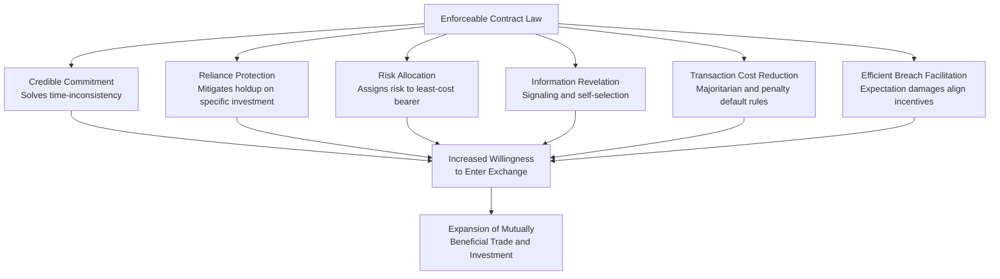

## Economic Functions of Enforceable Contracts

### Overview

The economic theory of contract law addresses a foundational question: why does society need a legal mechanism to enforce promises, when parties could in principle simply rely on reputation, repeated dealing, or trust? The economic answer is that enforceable contracts perform several distinct functions that private ordering alone cannot reliably achieve, particularly in one-shot or infrequent transactions, transactions involving asset-specific investments, and transactions occurring over time under uncertainty. This body of theory, developed substantially by scholars including Richard Posner, Steven Shavell, Robert Cooter, Charles Goetz, and Oliver Williamson, treats contract law as a set of default rules and enforcement mechanisms designed to minimize the sum of transaction costs, breach costs, and the costs of contracting itself.

### Function One: Enabling Credible Commitment

**Key Points**

The most basic economic function of enforceable contracts is to convert a promise into a credible commitment. Without legal enforcement, a promise is "cheap talk" — costless to make and costless to break, and therefore not credible where the promisor has an incentive to renege once the promisee has relied on it.

Enforceability solves this by attaching a cost to breach, typically expectation damages, which makes the promisor's threat to perform credible ex ante. This is closely related to the game-theoretic problem of **time inconsistency**: a party's optimal action at the time of contracting (promise to perform) may differ from their optimal action later (renege, if performance has become costly or unnecessary). Legal enforcement functions as a commitment device that binds the promisor's future self to the ex ante optimal action.

$$U_{promisor}(\text{breach}) < U_{promisor}(\text{perform}) \text{ once damages } D \text{ are imposed, even if } U_{promisor}(\text{breach}) > U_{promisor}(\text{perform}) \text{ absent } D$$

### Function Two: Protecting Reliance and Relationship-Specific Investment

A second core function is protecting investments made in reliance on a promise, particularly **relationship-specific investments** — expenditures that have significantly less value outside the specific contractual relationship for which they were made. Oliver Williamson's transaction cost economics identifies asset specificity as a central driver of contractual hazard: once a party has sunk a relationship-specific investment, it becomes vulnerable to **opportunistic renegotiation** or **holdup** by the counterparty, who can threaten non-performance to extract a larger share of the relationship's surplus.

**Example**

A manufacturer builds a custom factory adjacent to its sole supplier's plant to minimize transportation costs — an investment with little value if the supplier relationship ends. Absent enforceable contractual protection, the supplier could threaten to walk away unless the manufacturer accepts a renegotiated, less favorable price, capturing part of the quasi-rents generated by the manufacturer's sunk investment. Enforceable long-term contracts (or vertical integration, as Williamson also analyzes) mitigate this holdup problem by fixing terms ex ante and providing legal recourse if the supplier reneges.

This holdup problem can be formalized: let $I$ represent the relationship-specific investment, $V(I)$ the value it generates within the relationship, and $S(I) < V(I)$ its salvage/outside value. The gap $V(I) - S(I)$ represents "appropriable quasi-rents" that a counterparty can threaten to expropriate absent contractual protection, leading to systematic **underinvestment** relative to the efficient level $I^*$ in the absence of enforceable terms:

$$I^{observed} < I^* \text{ when holdup risk is present and uninsured by contract}$$

### Function Three: Efficient Risk Allocation

**Key Points**

Contracts allow parties to allocate risk to whichever party is the more efficient risk-bearer, based on differences in risk aversion, information, or ability to control or insure against the relevant contingency. This is the foundation of the economic analysis of contractual risk-shifting devices such as warranties, insurance-like clauses, force majeure provisions, and price-adjustment (indexing) clauses.

The efficient risk-bearer is typically the party that is (a) less risk-averse (e.g., a diversified firm versus an individual), (b) better able to control the probability or magnitude of the risk (the "least-cost risk avoider," analogous to Calabresi's least-cost avoider concept in tort law), or (c) better able to insure against the risk at lower cost. Enforceable contracts allow this allocation to be specified ex ante and reliably enforced ex post, rather than left to be litigated case-by-case under uncertain default rules.

### Function Four: Information Revelation and Signaling

Contract terms and the willingness to accept contractual obligations can serve an information-revelation function, addressing problems of asymmetric information between contracting parties (adverse selection and moral hazard, following the framework of Akerlof, Spence, and Rothschild-Stiglitz).

- **Warranties as signals**: A seller's willingness to offer a strong warranty signals private information about product quality that the buyer cannot directly observe, since offering a warranty is costlier for a seller of low-quality goods (who expects more claims) than for a seller of high-quality goods.
- **Contract terms as sorting mechanisms**: Menus of contract terms (e.g., different deductible/premium combinations in insurance) can be designed to induce self-selection, separating heterogeneous parties (e.g., high-risk versus low-risk insureds) who would otherwise be pooled and cross-subsidize one another inefficiently.

### Function Five: Reducing Transaction Costs Through Default Rules

**Key Points**

A substantial share of contract law consists not of mandatory rules but of **default rules** — terms that apply unless the parties contract around them. The economic function of well-designed default rules is to reduce the transaction costs of contracting by supplying efficient terms that most parties would have chosen anyway, so that parties need not explicitly negotiate every contingency.

Ayres and Gertner's influential distinction between **"majoritarian" defaults** (mimicking what most parties would want, minimizing the cost of drafting complete contracts) and **"penalty defaults"** (deliberately set at an inefficient level to induce the informed party to disclose information, or to force explicit negotiation over an issue where information asymmetry would otherwise persist) is central to this literature.

$$C_{total} = C_{negotiation} + C_{drafting} + C_{litigation~over~gaps}$$

Efficient default rules minimize $C_{total}$ across the population of similarly situated contracting parties by reducing the need for costly explicit negotiation over terms that would predictably be chosen the same way by most parties (e.g., default rules on the timing and place of delivery, or the UCC's gap-filling provisions for price and quantity).

### Function Six: Facilitating Efficient Breach

**Key Points**

Contract law, particularly through its choice of damages remedies, is designed in the Law and Economics tradition to permit and even encourage breach where breach is efficient — the so-called **theory of efficient breach**, most associated with Posner's economic analysis of contract remedies.

Under the expectation damages default remedy in most common law jurisdictions, a promisor will breach if and only if the cost of performance exceeds the value of performance to the promisee (plus the promisee's reliance losses, which expectation damages are designed to make whole). This aligns the promisor's private incentive to breach with the socially efficient decision, because expectation damages put the promisee in the position they would have occupied had the contract been performed, making them (in theory) indifferent between performance and breach-plus-damages.

$$\text{Breach is efficient iff } C_{performance} > V_{promisee} \text{, and expectation damages } D = V_{promisee} \text{ induce breach exactly when } C_{performance} > D$$

**Example**

A seller has contracted to deliver 1,000 units to Buyer A at $10/unit. A new Buyer B offers $25/unit for the same units, and Buyer A's actual value for the goods is $15/unit. If the seller breaches with Buyer A, sells to Buyer B, and pays Buyer A expectation damages of $5/unit (the difference between contract price and market/replacement value, or lost profit), the seller nets a higher return, Buyer A is made whole, and Buyer B receives the higher-valued use of the goods — an efficient reallocation facilitated precisely because damages (rather than an injunction compelling performance) is the default remedy.

This theory remains contested: critics (notably contract theorists emphasizing the moral force of promise-keeping, and others noting empirical evidence that damages often systematically undercompensate reliance and consequential losses) argue that expectation damages frequently fail to make promisees fully whole, undermining the claimed efficiency of the doctrine. [Inference] The efficient breach theory's practical validity depends heavily on courts' ability to accurately measure expectation damages, including consequential and reliance losses, which is often imperfect in practice due to proof difficulties and the doctrine of foreseeability (*Hadley v. Baxendale*) limiting recoverable consequential damages.

### Diagrammatic Summary: The Economic Functions Feeding Into Overall Efficiency

### Comparative Function-to-Doctrine Mapping

| Economic Function | Corresponding Doctrinal Mechanism | Illustrative Legal Rule |
| --- | --- | --- |
| Credible commitment | Enforceability of bargained-for promises | Consideration doctrine; promissory estoppel |
| Reliance/holdup protection | Remedies for breach; long-term contract enforcement | Reliance damages; specific performance for unique goods |
| Risk allocation | Default and negotiated risk-shifting terms | Warranty law; force majeure; UCC risk of loss rules |
| Information revelation | Disclosure duties and signaling terms | Implied warranty of merchantability; misrepresentation doctrine |
| Transaction cost reduction | Gap-filling default rules | UCC Article 2 default terms (price, delivery, quantity) |
| Efficient breach | Choice of damages measure | Expectation damages as default remedy over specific performance |

### The Baseline Problem: Why Not Rely on Reputation Alone?

**Key Points**

A recurring question in this literature is why legal enforcement is needed at all, given that repeated dealing and reputational sanctions can sustain cooperation in some settings (as in the "folk theorem" results from repeated-game theory, and empirically documented in relational contracting literature such as Macaulay's classic study of business practices). The economic answer identifies conditions under which reputation-based enforcement breaks down and legal enforcement becomes necessary:

- **One-shot or infrequent transactions**: Reputation has no disciplining power absent repeated interaction or a well-functioning intermediary reputation system.
- **Judgment-proof or exiting counterparties**: A party planning to exit the market, or one who is otherwise insensitive to reputational loss, cannot be disciplined by reputation alone.
- **Large, diffuse counterparty populations**: Where information about a party's past breaches does not efficiently propagate to future potential trading partners, reputational sanctions weaken.
- **High-value, infrequent, asset-specific transactions**: Where the stakes of a single transaction are very large relative to the value of the ongoing relationship, the short-term gain from breach may exceed the discounted value of future reputational loss, defeating self-enforcement (a standard result in repeated-game folk theorem analysis, where sufficient patience/discount factors are required for cooperation to be self-enforcing).

Legal enforcement is thus best understood not as a wholesale replacement for reputation and relational governance, but as a **complementary institution** that extends credible commitment to settings where private, self-enforcing mechanisms are insufficient — consistent with Williamson's broader framework of comparative institutional analysis across markets, hybrids (relational contracts), and hierarchies (vertical integration).

### Costs of Enforceability: The Other Side of the Ledger

A complete economic account must also recognize that enforceable contracts are not costless to provide. Contract enforcement generates:

- **Litigation and enforcement costs**: Court and legal costs of resolving disputes over contract interpretation, performance, and breach.
- **Drafting costs**: Costs of negotiating and specifying contract terms ex ante, which rise with contract complexity and the number of contingencies parties attempt to address.
- **Over-reliance risk**: Some theorists note that excessively generous reliance protection (e.g., broad promissory estoppel doctrines) can induce inefficiently high reliance investment before a contract is finalized, undermining the efficiency of the negotiation process itself.

The optimal scope of contract enforceability, in this view, balances the gains from credible commitment, reliance protection, and efficient risk allocation against these administrative and incentive costs — explaining why not all promises are legally enforceable (e.g., the consideration requirement, statute of frauds requirements for certain contract categories, and unenforceability of certain gratuitous or illusory promises).

### Related Topics / Next Steps

- Theory of efficient breach and the expectation-reliance-restitution damages hierarchy
- Transaction cost economics and Williamson's markets-hybrids-hierarchies framework
- Holdup problem and vertical integration as an alternative to contractual protection
- Default rules theory: majoritarian versus penalty defaults (Ayres and Gertner)
- Relational contract theory and Macaulay's empirical studies of non-legal contract enforcement
- Asymmetric information in contracting: adverse selection, moral hazard, and signaling models
- Specific performance versus damages as remedies: property rules versus liability rules (Calabresi-Melamed)
- Unconscionability and paternalistic limits on contractual freedom from an efficiency perspective
- Consideration doctrine as an economic screening mechanism
- Incomplete contract theory (Grossman-Hart-Moore) and the limits of contractual specification