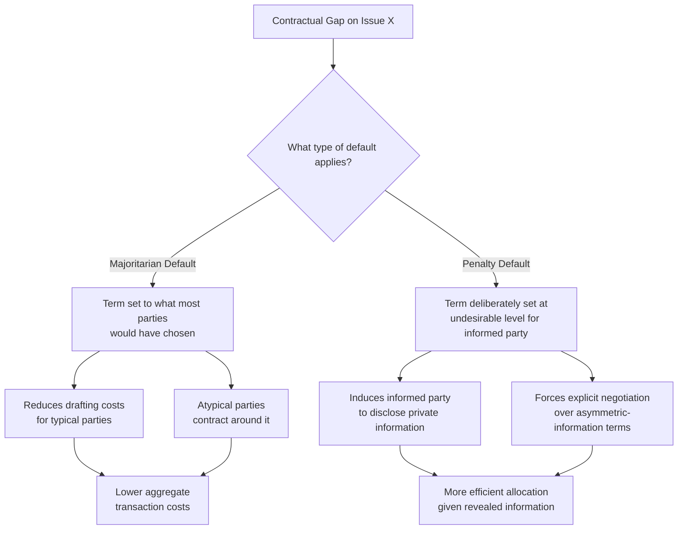

## Default Rules, Mandatory Rules, and Gap-Filling

### Overview

Contract law rules can be classified along a fundamental axis: **default rules**, which apply only if the contracting parties fail to specify otherwise and which parties are free to contract around, and **mandatory rules**, which apply regardless of the parties' expressed preferences and cannot be waived or altered by agreement. **Gap-filling** refers to the broader judicial and doctrinal process of supplying terms — whether through default rules or through interpretive construction — when a contract is silent, ambiguous, or incomplete on a given issue. This taxonomy, developed extensively in the Law and Economics literature by scholars including Ian Ayres, Robert Gertner, Charles Goetz, Robert Scott, and Alan Schwartz, is central to understanding both the efficiency rationale for contract doctrine and the proper allocation of lawmaking authority between private parties and courts.

### The Economic Rationale for Default Rules

**Key Points**

No contract can specify a term for every conceivable future contingency; doing so would be prohibitively costly given the number of possible states of the world and the cognitive and drafting costs of anticipating them (a core insight of **incomplete contract theory**, associated with Grossman, Hart, and Moore). Default rules exist to reduce the transaction costs of contracting by supplying terms that the parties would likely have chosen themselves, allowing them to write shorter, less costly contracts while still achieving efficient outcomes on unaddressed issues.

The efficiency case for default rules rests on a cost-minimization logic:

$$C_{total} = C_{ex\text{-}ante~drafting} + C_{ex\text{-}post~gap~litigation}$$

A well-designed default rule reduces $C_{ex\text{-}ante~drafting}$ by supplying the term most parties would have wanted, without requiring them to negotiate and draft it explicitly, while simultaneously reducing $C_{ex\text{-}post~gap~litigation}$ by giving courts a predictable rule to apply rather than requiring case-by-case construction of intent.

### Taxonomy: Majoritarian Defaults vs. Penalty Defaults

The most influential typology in this literature, developed by Ayres and Gertner (1989), divides default rules into two categories based on their underlying economic function.

**Majoritarian (or "off-the-rack") defaults** are set at the term that the majority of similarly situated contracting parties would choose if they negotiated explicitly. Their function is purely to minimize transaction costs by supplying the "market-mimicking" term, so that only atypical parties need to deviate and contract around the default.

**Penalty defaults** are deliberately set at a term that neither party (or at least the informed party) would want, precisely in order to induce information-forcing behavior. Where one party holds private information relevant to efficient contracting (e.g., about the value of the transaction, risk levels, or performance capabilities), a penalty default creates an incentive for the informed party to disclose that information by contracting around the undesirable default, or forces both parties to negotiate the term explicitly rather than remain silent.

**Example**

The classic illustration is *Hadley v. Baxendale* (1854), which established the foreseeability limitation on consequential damages. Under this rule, a breaching party is liable only for damages that were foreseeable at the time of contracting (or specifically communicated). A buyer with unusually high consequential losses from breach (e.g., a mill owner who will lose extraordinary profits from a delayed shipment) who does not disclose this fact receives only ordinary/foreseeable damages upon breach — a "penalty" relative to full compensation. This rule creates an incentive for the buyer with atypically high stakes to disclose that information to the seller ex ante (often resulting in a negotiated higher price or special contract term reflecting the risk), which the seller can then use to make efficient precaution and pricing decisions. Ayres and Gertner used this case as the foundational illustration of the penalty default concept.

$$\text{Penalty default induces disclosure iff } V_{disclosure} > C_{disclosure}, \text{ where } V_{disclosure} \text{ increases in the informational asymmetry avoided}$$

### Diagrammatic Comparison of Default Rule Types

### Mandatory Rules: Rationale and Categories

**Key Points**

Mandatory rules override party autonomy entirely; no contractual language, however explicit, can validly displace them. From an efficiency perspective, mandatory rules require a justification beyond ordinary transaction-cost reduction, since by definition they prevent parties from reaching what they may believe is their own preferred bargain. The Law and Economics literature identifies several justifications:

- **Externality correction**: Where a contract term would impose costs on third parties not privy to the contract (e.g., certain terms in contracts affecting public safety, environmental harm, or anticompetitive agreements), mandatory rules internalize third-party effects that private bargaining between the two contracting parties would not account for.
- **Correcting systematic bargaining failures**: Where one class of parties systematically lacks the information, sophistication, or bargaining power to negotiate efficiently (frequently invoked in consumer protection and employment contexts), mandatory terms (e.g., certain consumer warranty protections, minimum wage law, mandatory disclosure requirements) are justified as correcting a predictable market failure rather than displacing genuinely voluntary, informed bargains.
- **Paternalism and bounded rationality**: Behavioral Law and Economics scholarship (e.g., work building on Kahneman and Tversky's findings on cognitive biases) argues that mandatory rules can be justified where systematic biases (present bias, optimism bias, framing effects) lead parties to make choices inconsistent with their own long-term interests, particularly in take-it-or-leave-it standard-form contexts.
- **Preventing a race to the bottom / unraveling**: In markets where sophisticated repeat-player parties can extract terms from unsophisticated one-shot parties, mandatory minimum protections can prevent competitive unraveling toward exploitative terms, an argument frequently applied to consumer and employment contract regulation.
- **Preserving the integrity of legal institutions**: Certain terms (e.g., contractual waivers of the right to a jury trial in some contexts, or terms attempting to oust court jurisdiction entirely) may be restricted to preserve the functioning of legal and dispute-resolution institutions themselves.

**Example**

Usury laws capping interest rates, mandatory minimum wage laws, non-waivable consumer warranty protections under some state Lemon Laws, and prohibitions on contracting away tort liability for gross negligence or intentional harm are all examples of mandatory rules, each justified by a distinct combination of the rationales above (externality, bargaining power asymmetry, or paternalism).

### Gap-Filling: Methods and Doctrine

**Key Points**

Gap-filling encompasses the broader universe of techniques courts use to complete an incomplete contract, of which supplying a codified default rule (like the UCC's gap-filler provisions) is only one method. Others include:

- **Implied terms based on custom and usage of trade**: Courts fill gaps by reference to established industry practice, on the theory that this best approximates what informed parties in that industry would have intended (UCC §1-303 codifies usage of trade, course of dealing, and course of performance as interpretive aids).
- **Implied covenant of good faith and fair dealing**: A near-universal gap-filler in American contract law (and analogous doctrines elsewhere) requiring parties to exercise contractual discretion (e.g., over price adjustment clauses, termination rights, or approval requirements) in a manner consistent with the reasonable expectations of the bargain, rather than opportunistically.
- **Hypothetical bargain / "what would the parties have agreed" construction**: Courts (particularly in the tradition associated with Judge Richard Posner's opinions) explicitly ask what term the parties would have negotiated ex ante had they anticipated and addressed the contingency, applying economic reasoning about efficient risk allocation to construct the missing term.
- **UCC Article 2 default (gap-filler) provisions**: The Uniform Commercial Code supplies an extensive, explicit set of majoritarian defaults for sale-of-goods contracts, including price (§2-305, reasonable price at time of delivery if not specified), delivery terms, place of delivery, and time for performance, reflecting a deliberate legislative judgment about efficient market-mimicking terms.
- **Course of performance and course of dealing**: Where the parties' own conduct under the current or past contracts reveals a practical construction of an ambiguous term, courts treat this conduct as strong evidence of intended meaning, minimizing the risk of imposing a term inconsistent with the parties' actual (if unstated) understanding.

### The Hypothetical Bargain Standard: Formal Framework

Where courts explicitly apply hypothetical-bargain reasoning to fill a gap, the underlying economic question is which term $T^*$ maximizes the joint surplus of the contracting parties, since this is the term risk-neutral, rational parties would have agreed to ex ante (absent transaction costs preventing them from specifying it):

$$T^* = \arg\max_{T} \left[ V_{buyer}(T) + V_{seller}(T) \right]$$

subject to the constraint that neither party would have rejected $T^*$ given their information and bargaining position at contract formation. This mirrors the majoritarian default logic but applies it at the level of judicial construction for a specific dispute rather than at the level of a generally codified rule.

### Comparative Table: Default vs. Mandatory Rules

| Dimension | Default Rules | Mandatory Rules |
| --- | --- | --- |
| Waivability | Freely waivable/alterable by contract | Cannot be waived or altered by agreement |
| Primary economic function | Reduce transaction costs; may induce disclosure (penalty defaults) | Correct externalities, bargaining failures, or bounded rationality |
| Efficiency benchmark | Should mimic majority preference or force efficient disclosure | Justified by market failure that undermines private bargaining efficiency |
| Example | UCC gap-filler for price (§2-305) | Usury caps; mandatory minimum wage; non-waivable consumer protections |
| Risk of misdesign | Imposing costs on atypical parties who must now contract around it | Foreclosing genuinely efficient bargains between well-informed, symmetric parties |

### Critiques and Extensions

**Key Points**

- **Sophistication heterogeneity critique**: A single default rule cannot simultaneously be majoritarian-efficient for both sophisticated, well-advised parties and unsophisticated parties, since their "typical" preferred terms may differ; some scholars (e.g., Schwartz and Scott) argue for **tailored** or **altering-rule** defaults that vary based on observable party characteristics (e.g., merchant status under the UCC) rather than a single uniform default.
- **Behavioral critique of the penalty default framework**: Some scholars argue that penalty defaults presume a level of party sophistication and legal knowledge (i.e., awareness that failure to specify a term triggers a specific, unfavorable default) that many real-world contracting parties, especially unsophisticated ones, do not possess, limiting the information-forcing function in practice. [Inference] This critique's practical force varies by contracting context; sophisticated repeat-player commercial parties with legal counsel are more likely to respond to penalty defaults as the theory predicts than unsophisticated consumers, though the empirical extent of this gap across different transaction types is not fully settled.
- **Standard form and boilerplate literature**: Where contracts are standardized, non-negotiated boilerplate (common in consumer and even much commercial contracting), the classic "would the parties have agreed" hypothetical-bargain justification for gap-filling becomes strained, since there was no genuine individualized negotiation to reconstruct — a point raised extensively in the literature on standard-form contracts (e.g., work by Margaret Radin and others on "boilerplate").

### Related Topics / Next Steps

- Ayres and Gertner's original penalty default framework and subsequent scholarly responses
- UCC Article 2 gap-filler provisions in detail (price, quantity, delivery, and time terms)
- Implied covenant of good faith and fair dealing as a judicial gap-filling doctrine
- Incomplete contract theory (Grossman-Hart-Moore) and the limits of contractual specification
- Standard form contracts and boilerplate: efficiency and fairness debates
- Unconscionability doctrine as a limit on enforceability of oppressive negotiated or standard terms
- Behavioral Law and Economics critiques of rational-bargain assumptions underlying default rule theory
- Foreseeability limitation on damages (*Hadley v. Baxendale*) as the canonical penalty default
- Mandatory disclosure regimes in consumer and securities contracting
- Altering rules and tailored defaults based on party sophistication (Schwartz and Scott)