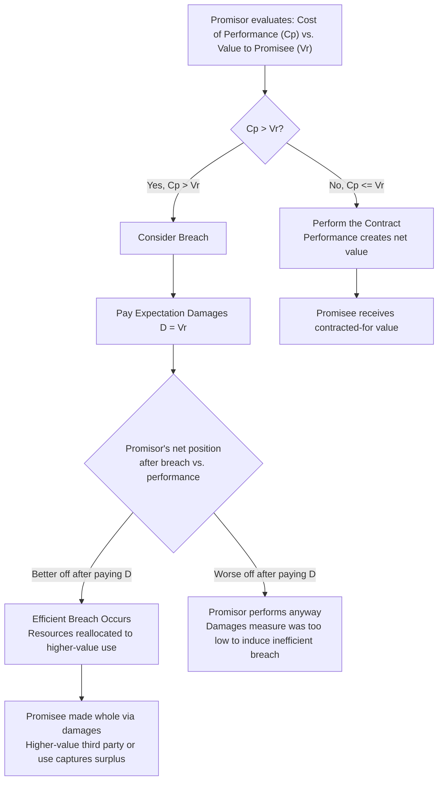

## Efficient Breach Theory

### Overview

Efficient breach theory is the proposition, central to the Law and Economics analysis of contract remedies, that a promisor should be permitted — and in some circumstances is economically encouraged — to breach a contract and pay damages whenever the cost of performance exceeds the value of performance to the promisee. The theory, developed principally by Richard Posner and further formalized by scholars including Robert Birmingham, Charles Goetz, Robert Scott, and Steven Shavell, treats breach not as a moral failing to be deterred at all costs but as a potentially value-maximizing reallocation of resources, provided the injured party is fully compensated.

### The Core Logic

**Key Points**

Efficient breach theory rests on the idea that contract remedies should be designed to induce parties to perform when performance is efficient and to breach when breach is efficient, rather than mandating performance categorically. A promisor facing a choice between performing and breaching compares the cost of performance to the compensation owed upon breach.

Under the standard formalization, let $C_P$ denote the promisor's cost of performance, $V_R$ denote the promisee's value of receiving performance, and $D$ denote the damages payable upon breach. Breach is deemed efficient when:

$$C_P > V_R$$

That is, performance would destroy value overall — the resources or effort required to perform are worth more than what the promisee would gain from receiving performance. If damages are set equal to the promisee's lost value ($D = V_R$, the expectation measure), the promisor's private incentive aligns exactly with the efficiency condition:

$$\text{Promisor breaches iff } C_P > D = V_R$$

This is the central claim of the theory: **expectation damages, as the default contract remedy, cause private incentives to track social efficiency**, because the promisor internalizes the full cost their breach imposes on the promisee.

### Canonical Numerical Example

**Example**

A seller contracts to deliver a custom machine part to Buyer A for $10,000, where Buyer A values the part at $14,000 (i.e., would suffer a $4,000 loss in expectation if not delivered). Before delivery, Buyer B offers the seller $20,000 for the same part, because Buyer B has an urgent, higher-value use for it.

- If the seller performs: Seller receives $10,000 from Buyer A. Total value created = $14,000 (Buyer A's value).
- If the seller breaches, sells to Buyer B, and pays Buyer A expectation damages of $4,000 (the value Buyer A expected to receive, i.e., $14,000 minus the $10,000 contract price paid, framed here as the lost benefit of the bargain): Seller nets $20,000 − $4,000 = $16,000 from the sale, still ahead of the $10,000 it would have received from performing. Buyer A is made whole (received $4,000 in damages, equivalent to their expected net gain from the contract). Buyer B receives the part, generating $20,000 in value.

Total value created by breaching and reallocating to Buyer B ($20,000) exceeds the value created by performing for Buyer A alone ($14,000), and because Buyer A is compensated for their full expectation interest, no party is worse off compared to performance — this is the Pareto-improving reallocation efficient breach theory identifies as desirable, resembling a Kaldor-Hicks efficient transaction validated by actual (not merely hypothetical) compensation.

### Diagrammatic Decision Logic

### The Remedy Choice: Why Damages Rather Than Specific Performance Matters

**Key Points**

The efficient breach theory depends critically on the choice of remedy. If courts instead awarded **specific performance** (compelling actual performance) as the standard remedy for all contract breaches, the promisor could not unilaterally reallocate the resource to a higher-value use without first bargaining with the promisee for a release — reintroducing the transaction costs of Coasean bargaining that expectation damages are designed to avoid.

This connects efficient breach theory directly to the property-rule/liability-rule framework of Calabresi and Melamed (1972):

- **Liability rule (damages)**: The promisee's entitlement is protected only by a right to compensation, allowing the promisor to take the entitlement (breach) unilaterally as long as they pay objectively determined damages. This is efficient when the cost of court-determined damages is lower than the transaction cost of a negotiated buyout of the promisee's right to performance.
- **Property rule (specific performance)**: The promisee's entitlement can only be taken through a voluntary, negotiated transaction (the promisor must buy out the promisee's right to insist on performance). This is preferable when court-assessed damages would be inaccurate (e.g., for unique goods, where market value understates true subjective value) and where transaction costs of bargaining are low enough that private renegotiation can efficiently reallocate the resource instead.

This explains the traditional common law rule that specific performance is generally available for contracts involving **unique goods or real property** (where damages are an inherently imperfect proxy for the promisee's true valuation, as in *Uniform Commercial Code* §2-716 and traditional real property doctrine), while damages remain the default remedy for ordinary fungible goods and services (where market price provides a reasonably accurate measure of loss).

### Conditions Under Which the Theory Breaks Down

**Key Points**

Efficient breach theory's conclusion that expectation damages induce efficient breach decisions depends on several assumptions that frequently fail in practice, generating substantial critique:

- **Undercompensatory damages**: Courts often fail to award full expectation damages due to the **foreseeability limitation** (*Hadley v. Baxendale*), the **certainty requirement** (damages that are too speculative are denied), the **avoidability/mitigation doctrine** (reducing recoverable damages by amounts the promisee could have mitigated), and the general difficulty of proving subjective or consequential losses. Where actual damages awarded, $D_{awarded}$, are systematically less than true expectation value, $D_{awarded} < V_R$, the promisor may breach even when $C_P < V_R$ — an **inefficient breach** induced by underenforcement.

$$\text{Inefficient breach occurs when } D_{awarded} < C_P < V_R$$

- **Litigation and enforcement costs**: The promisee must often incur costs to sue and prove damages, meaning the effective compensation received net of litigation costs is less than the nominal damages award, further understating the promisor's true incentive-relevant liability.
- **Non-pecuniary and idiosyncratic value**: Where the promisee's value from performance includes subjective, non-market elements (sentimental value, reputational value, or values difficult to monetize), expectation damages calculated by reference to market substitutes will systematically undercompensate, again permitting inefficient breach.
- **Moral and doctrinal critique**: Contract theorists in the "promise as such has moral force" tradition (e.g., Charles Fried's *Contract as Promise*) argue that treating breach as a mere pricing option undermines the moral and social function of promise-keeping and trust, independent of any measurement error in damages — a normative objection distinct from the efficiency-measurement critique above.
- **Reputation effects excluded from the model**: The simple model typically ignores reputational costs of breach (loss of future business, damage to the breaching party's standing), which in practice often supplement or substitute for formal legal damages in disciplining breach decisions, and which the simple Pos697nerian model does not explicitly incorporate.

### Efficient Breach vs. Efficient Reliance: A Related Tension

Economic analysis of contract remedies also recognizes a tension between inducing efficient breach and inducing efficient **reliance investment** by the promisee. If the promisee anticipates being fully compensated via expectation damages regardless of the promisor's breach decision, the promisee may be induced to over-rely (invest more in reliance than is jointly efficient), since they do not bear the risk of their reliance investment being wasted by breach. This is formalized in Shavell's and Cooter's work on the **reliance-breach efficiency tradeoff**, sometimes summarized as: full expectation damages induce efficient breach decisions by the promisor but potentially inefficient (excessive) reliance decisions by the promisee, since the promisee is effectively insured against breach.

$$\text{Optimal reliance } R^* \text{ solves } \max_R \left[ p \cdot V_R(R) - R \right]$$

where $p$ is the probability of performance; under full expectation damages, the promisee is insulated from this probability in their payoff calculation, distorting the reliance decision away from $R^*$. [Inference] The practical magnitude of this over-reliance distortion is contested in the empirical and theoretical literature, with some scholars arguing it is a second-order concern relative to the primary breach-inducement function of damages, though this remains a genuinely unresolved theoretical debate rather than a settled empirical finding.

### Alternative and Competing Remedy Design Perspectives

| Remedy Approach | Effect on Breach Incentives | Effect on Reliance Incentives |
| --- | --- | --- |
| Full expectation damages | Induces efficient breach (if accurately measured) | May induce over-reliance (promisee insured against breach) |
| Reliance damages only | May under-induce efficient breach avoidance in some models | Reduces over-reliance distortion relative to expectation measure |
| Specific performance | Requires bargained buyout for any reallocation; avoids court damages-measurement error | Promisee bears less breach risk, but transaction costs of buyout apply |
| Liquidated damages (agreed ex ante) | Parties themselves solve the measurement problem via negotiated pre-estimate | Depends on whether liquidated sum accurately reflects true value; penalty clauses generally unenforceable |
| Disgorgement/restitution of breacher's gain | Removes promisor's incentive to breach for opportunistic gain even where compensatory damages fall short | Not primarily targeted at reliance incentives |

### Related Topics / Next Steps

- Expectation, reliance, and restitution damages: the three measures of contractual recovery
- Property rules versus liability rules (Calabresi and Melamed) applied to contract remedies
- Specific performance doctrine and the uniqueness requirement for goods and real property
- Foreseeability limitation on consequential damages (*Hadley v. Baxendale*) and its interaction with breach incentives
- Reliance-breach tradeoff and optimal contract remedy design (Shavell, Cooter)
- Liquidated damages clauses and the unenforceability of penalty clauses
- Charles Fried's *Contract as Promise* and moral critiques of efficient breach theory
- Mitigation doctrine (avoidable consequences) and its effect on damages measurement accuracy
- Disgorgement remedies for opportunistic breach (*Attorney General v. Blake*)
- Empirical studies of actual damages awards relative to theoretical expectation measure