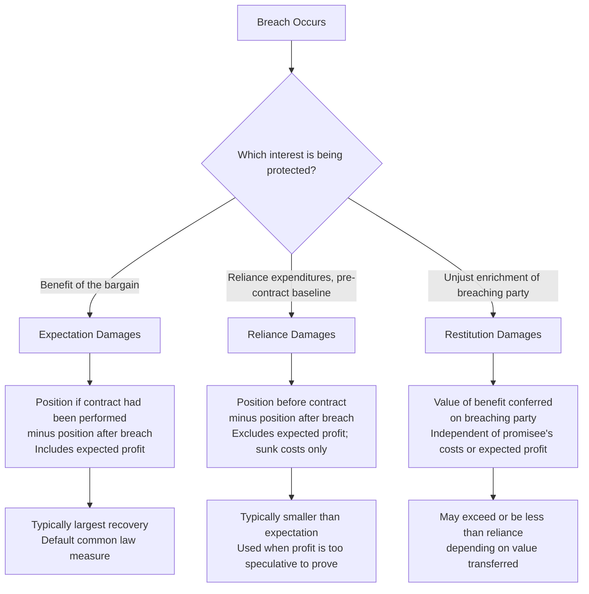

## Expectation, Reliance, and Restitution Damages Compared

### Overview

Anglo-American contract law recognizes three principal measures of monetary recovery for breach: **expectation damages**, **reliance damages**, and **restitution damages**. Each measure protects a distinct interest of the non-breaching party and, correspondingly, produces different incentive effects for both performance and breach decisions. This taxonomy, formalized in Fuller and Perdue's classic article "The Reliance Interest in Contract Damages" (1936) and subsequently analyzed extensively in the Law and Economics literature, provides the analytical foundation for evaluating which damages measure best serves efficiency goals in a given contractual context.

### The Three Interests Defined

**Key Points**

- **Expectation interest**: Protects the promisee's interest in receiving the benefit of the bargain — i.e., placing the non-breaching party in the position they would have occupied *had the contract been fully performed*. This is the default measure in most common law jurisdictions for breach of a valid, enforceable contract.
- **Reliance interest**: Protects the promisee's interest in being restored to the position they occupied *before entering the contract*, compensating for expenditures and forgone opportunities made in reliance on the promise, but not including the expected profit or benefit of the bargain itself.
- **Restitution interest**: Protects against **unjust enrichment**, requiring the breaching party to disgorge any benefit conferred upon them by the non-breaching party's performance, regardless of the value the non-breaching party expected to receive or actually expended.

### Formal Definitions

$$D_{expectation} = V_{position~if~performed} - V_{position~after~breach}$$

$$D_{reliance} = V_{position~before~contract} - V_{position~after~breach~and~reliance~expenditure}$$

$$D_{restitution} = \text{Value of benefit conferred on breaching party by non-breaching party's performance}$$

In general, for most contracts where the promisee has not yet begun performance but has incurred some reliance costs, the ordering of these measures typically satisfies:

$$D_{restitution} \leq D_{reliance} \leq D_{expectation}$$

This ordering reflects that expectation damages include the promisee's expected profit (the surplus above cost), while reliance damages capture only sunk costs without the expected gain, and restitution captures only the value transferred to the breaching party (which may be less than what the promisee spent, particularly for services or customized goods with limited value to the recipient).

### Canonical Numerical Example

**Example**

A homeowner contracts with a contractor to build a custom deck for $20,000. The contractor's cost of materials and labor would have been $15,000, implying an expected profit of $5,000. The contractor breaches after having received a $5,000 deposit and having purchased $3,000 in materials already delivered to the site (value to the homeowner of the partial work and materials, ignoring completion, is $3,000).

- **Expectation damages** (from the homeowner's perspective, if the homeowner must now pay a replacement contractor $22,000 to finish an equivalent deck): $22,000 - 20,000 = \$2,000$ (the excess cost of cover over the original contract price), placing the homeowner in the position of having a completed deck for the originally agreed $20,000.
- **Reliance damages** (from the contractor's perspective, if the contractor sues to recover reliance expenditures after the homeowner wrongfully terminates): the contractor's sunk costs of $3,000 in materials, without the $5,000 expected profit — placing the contractor back where they started financially, excluding lost profit.
- **Restitution damages** (from the contractor's perspective, if the homeowner breaches after receiving $3,000 worth of delivered materials and partial work): the $3,000 value actually conferred on the homeowner, regardless of the contractor's costs or expected profit, and available even in some jurisdictions to a party who would otherwise be in breach themselves (a "losing contract" scenario), reflecting restitution's independence from the expectation bargain.

### Diagrammatic Comparison

### Economic Function of Each Measure

**Key Points**

- **Expectation damages** are generally favored on efficiency grounds because, as discussed in efficient breach theory, they place the promisor's decision to perform or breach on the correct margin: the promisor internalizes the full cost of breach to the promisee, inducing breach precisely when the cost of performance exceeds the promisee's value of performance. Expectation damages also, in principle, make the promisee indifferent between performance and breach-plus-damages, preserving the promisee's incentive to make efficient reliance investments up to (but not excessively beyond) the level justified by the probability-weighted value of performance.
- **Reliance damages** are typically invoked where expectation damages cannot be proven with reasonable certainty (e.g., a speculative new business's lost profits) or in promissory estoppel cases where no fully bargained-for exchange exists but the promisee has detrimentally relied on a promise. From an incentive perspective, reliance damages under-protect the promisee relative to expectation (since expected profit is excluded), which can, in some theoretical treatments, lead to under-reliance relative to the jointly efficient level, since the promisee bears more of the downside risk of breach without capturing the full upside via damages.
- **Restitution damages** serve primarily an anti-unjust-enrichment function rather than a pure efficiency-alignment function, and are particularly important in cases of partial performance, contracts void for lack of capacity or illegality, and in "losing contract" scenarios where a breaching party who conferred a benefit may still recover its value despite being in breach (in some jurisdictions), since permitting the non-breaching party to retain an unjustified windfall would itself be inefficient and inequitable.

### The Reliance-Expectation Relationship: Fuller and Perdue's Framework

Fuller and Perdue's foundational analysis observed that the reliance interest is analytically prior to the expectation interest: full performance necessarily encompasses full reliance (a party who performs completely has, by definition, incurred all their reliance costs and also received their expected profit), meaning expectation damages can be conceptually decomposed as:

$$D_{expectation} = D_{reliance} + \pi_{expected}$$

where $\pi_{expected}$ represents the promisee's expected net profit from the bargain. This decomposition explains why expectation damages are, absent unusual facts (e.g., a "losing contract" where the promisee would have lost money even on full performance), always at least as large as reliance damages, and why courts sometimes use reliance damages as an easier-to-prove **proxy** or floor for expectation damages when expected profit is too speculative to establish with the required certainty.

### The "Losing Contract" Problem

**Key Points**

A theoretically important edge case arises when the promisee would have lost money even had the contract been fully performed (i.e., $\pi_{expected} < 0$, or equivalently the contract price was below the promisee's true cost). In this scenario:

- **Expectation damages** would be *negative* or zero, since full performance would not have benefited the promisee net of their own costs — expectation damages cannot be used to shift this loss onto the breaching party beyond making the promisee whole for the (negative) bargain they struck.
- **Reliance damages**, if awarded without adjustment, could theoretically exceed expectation damages in this scenario, since reliance damages ignore the promisee's own losing cost structure.
- Most jurisdictions address this by allowing the breaching party to raise the "losing contract" as an affirmative defense, capping reliance recovery at what expectation damages would have been, to prevent the reliance measure from putting the promisee in a *better* position than full performance would have — which would violate the general common law principle that damages should not overcompensate.

$$D_{reliance,~awarded} = \min(D_{reliance,~raw}, D_{expectation})$$

### Comparative Table

| Dimension | Expectation | Reliance | Restitution |
| --- | --- | --- | --- |
| Baseline position protected | Position if contract performed | Position before contract formed | Prevents unjust enrichment of breaching party |
| Includes expected profit? | Yes | No | No (measures value conferred, not profit) |
| Typical use case | Default remedy for enforceable bargained contracts | Promissory estoppel; profits too speculative to prove | Partial performance; void/unenforceable contracts; "losing contract" scenarios |
| Efficiency alignment (breach incentives) | Strongest alignment with efficient breach condition | Weaker; may under-induce efficient promisor behavior if promisee under-compensated | Not primarily designed for breach-incentive alignment |
| Available to a breaching party? | No | No (generally available only to non-breaching party) | Sometimes yes, in some jurisdictions, for value conferred despite own breach |
| Typical magnitude | Largest (or equal to reliance plus profit) | Smaller than expectation (excludes profit) | Varies; capped in some jurisdictions by contract price |

### Critiques and Extensions

**Key Points**

- **Proof and measurement problems with expectation damages**: Despite its theoretical efficiency advantages, expectation damages frequently prove difficult to establish with certainty, particularly for lost profits of new ventures, non-pecuniary losses, or highly uncertain future performance, leading courts to fall back on reliance measures as a practical proxy even where expectation is doctrinally preferred.
- **Overcompensation risk with restitution in some doctrines**: Some jurisdictions permit a plaintiff to recover the *market value* of services rendered under a quantum meruit theory even where this exceeds the contract price, which can create tension with the general principle against overcompensation and has generated doctrinal debate about the proper scope of restitution when a valid contract price existed. [Inference] The degree to which courts permit restitution to exceed the contract price varies meaningfully by jurisdiction and by whether the underlying contract is void, voidable, or simply breached, making this an area of doctrinal variation rather than a single settled rule.
- **Promissory estoppel and the reliance-only remedy**: Where a promise is enforced under promissory estoppel (absent traditional consideration), courts frequently limit the remedy to reliance damages rather than full expectation damages, reflecting a judgment that the weaker enforceability basis of the promise justifies a correspondingly narrower remedy — an application of graduated remedies tracking the strength of the underlying obligation.

### Related Topics / Next Steps

- Fuller and Perdue's "The Reliance Interest in Contract Damages" and its foundational role in remedies theory
- Efficient breach theory and the incentive effects of the expectation measure
- Promissory estoppel doctrine and its typical limitation to reliance-based recovery
- Quantum meruit and unjust enrichment doctrine outside the contract context
- Certainty requirement for proving lost profits and expectation damages
- The "losing contract" defense and its effect on reliance damages caps
- Consequential damages and the foreseeability limitation (*Hadley v. Baxendale*)
- Liquidated damages clauses as a contractually specified alternative to judicial damages measures
- Specific performance and injunctive relief as non-monetary alternatives to damages
- Comparative law perspectives: expectation-reliance-restitution analogues in civil law systems