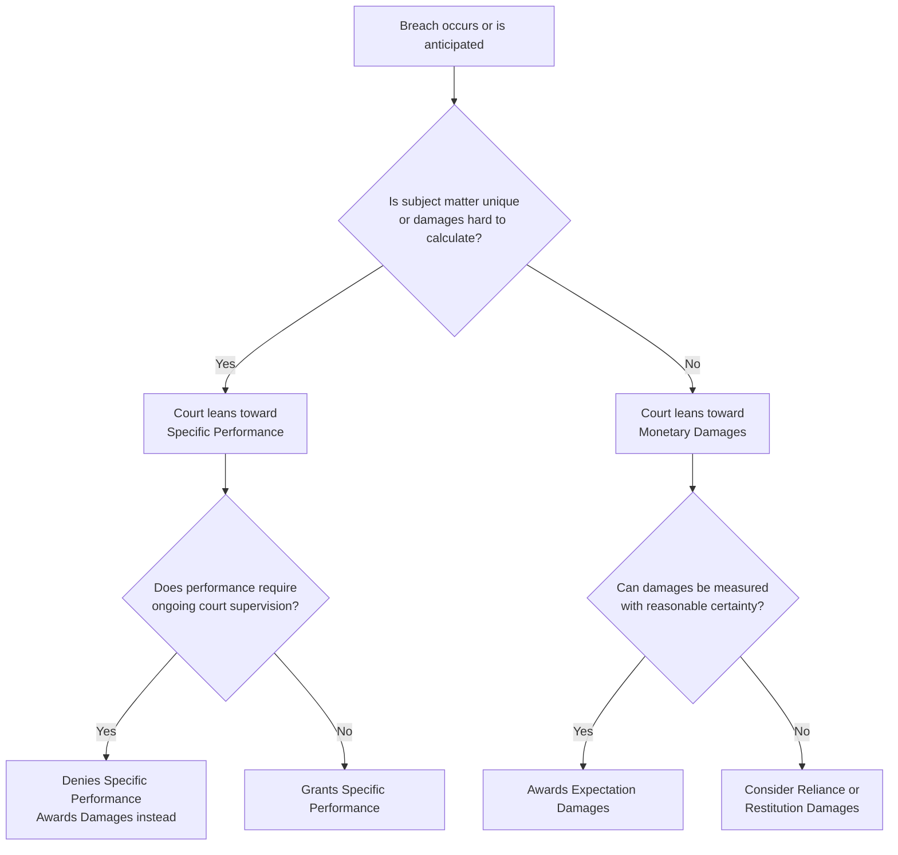

## Specific Performance versus Monetary Damages

### Overview and Doctrinal Background

Contract remedies fall into two broad categories: **specific performance**, an equitable remedy compelling the breaching party to actually perform the contractual obligation, and **monetary damages**, a legal remedy requiring the breaching party to pay a sum of money to compensate the non-breaching party. Common law systems (US, UK) treat damages as the default remedy and specific performance as an exceptional remedy granted only when damages are "inadequate." Civil law systems (France, Germany) generally treat specific performance as the primary remedy, with damages as a substitute when performance is impossible or impractical. This divergence is not incidental — it reflects deep disagreements about efficiency, autonomy, and the proper role of courts in enforcing bargains.

### The Common Law Default Rule

Under common law, courts award specific performance only when:

- The subject matter is **unique** (land, rare goods, unique chattels)
- Damages are **difficult to calculate** with reasonable certainty
- The breaching party would otherwise be **insolvent** or judgment-proof
- Performance does not require **excessive court supervision** (a key reason personal service contracts are rarely specifically enforced)

Land sale contracts are the classic case for specific performance because each parcel of land is considered legally unique — no substitute exists, so money damages cannot make the buyer whole in the same way replacement goods could.

### The Efficiency Rationale: Liability Rules and the Coase Theorem

Law and economics analyzes the choice between remedies as a choice of **liability rule**, following the Calabresi-Melamed framework:

- **Property rule** protection = specific performance. The promisee's entitlement can only be taken with consent; the promisor must negotiate a buyout if they want to escape performance.
- **Liability rule** protection = damages. The promisor can take the entitlement (breach) unilaterally and pay a court-determined price (damages) afterward.

Under the Coase theorem, if transaction costs are zero, the choice of remedy should not affect the ultimate efficient outcome — parties will bargain around an inefficient rule to reach the value-maximizing result. If a buyer no longer wants land but specific performance is available, the seller can still be bought out of the entitlement, and the parties reach the same efficient endpoint. The importance of the remedy choice emerges precisely because transaction costs are positive.

$$W = \max\{V_{perform}, V_{breach} - C_{damages}\}$$

where $V_{perform}$ is the value of performance to the promisee, $V_{breach}$ is the value to the promisor of escaping the contract, and $C_{damages}$ is the cost of the remedy imposed.

### Efficient Breach Theory

The dominant law-and-economics justification for the expectation-damages default is the **theory of efficient breach**: a promisor should breach if and only if the gain from breach (e.g., a more valuable resale) exceeds the loss to the promisee, measured by expectation damages. Because expectation damages are designed to make the promisee indifferent between performance and breach, a promisor who breaches only when their alternative use of the resource is more valuable than the promisee's expected gain is, in principle, moving the resource to its highest-valued use.

**Numerical Example:**

- Seller contracts to sell 100 widgets to Buyer A for $1,000 (Buyer A values them at $1,200, so expected profit is $200).
- Buyer B later offers Seller $1,500 for the same widgets.
- If Seller breaches and pays Buyer A expectation damages of $200 (the lost profit), Seller nets $1,500 − $1,000 (cost, illustratively) − $200 = positive gain, and Buyer A is made whole.
- Total surplus is higher than if Seller performed, because Buyer B's valuation exceeds Buyer A's.

This is efficient **only if** damages are calculated accurately. If courts systematically **underestimate** true expectation damages — which is common because subjective value, reliance losses, and transaction costs of finding substitutes are hard to verify — efficient breach theory breaks down, and promisors breach even when the promisee's true value exceeds the promisor's alternative use. [Inference] The empirical magnitude of this underestimation is contested and varies significantly by contract type and jurisdiction.

### Critiques of Efficient Breach: The Case for Specific Performance

Several law-and-economics scholars, most notably **Alan Schwartz**, argue specific performance is frequently the more efficient default rule:

1. **Damages undercompensate systematically.** Courts routinely refuse to award damages for subjective value, certain consequential losses (due to foreseeability limits like *Hadley v. Baxendale*), and litigation/transaction costs of the breach itself. Specific performance sidesteps the valuation problem entirely by giving the promisee the actual performance they bargained for.
2. **Specific performance shifts the bargaining, not the outcome — but at lower cost.** If specific performance is the default and the promisor genuinely has a higher-valued use for the resource, the promisor can still negotiate a release from the promisee. This converts the court's role from "estimate damages" (an information-intensive, error-prone task) to "enforce the entitlement" (a much simpler task), pushing the valuation problem back onto the parties who have better information than the court.
3. **Reduced litigation costs.** A specific performance regime may reduce costly litigation over the correct measure of damages, since the parties negotiate a price for release privately (Coasean bargaining) rather than litigating valuation before a judge.

### Counterarguments: Why Damages Might Still Dominate

1. **Bargaining/transaction costs after breach.** If parties face high transaction costs post-breach (holdout behavior, strategic bargaining, asymmetric information about true valuations), the Coasean bargain to reach the efficient outcome under specific performance may fail. The promisee, holding a property-rule entitlement, may exploit **bilateral monopoly** power and demand more than their true valuation, causing bargaining breakdown and an inefficient outcome (no reallocation to the higher-value user).
2. **Court supervision costs.** Specific performance of ongoing or complex obligations (construction, personal services, long-term supply contracts) requires courts to monitor compliance and adjudicate disputes over adequacy of performance — costs largely avoided when damages simply require paying a fixed sum. This is why courts almost never order specific performance of personal service contracts (also implicating involuntary servitude concerns) or contracts requiring continuous supervision.
3. **Third-party effects and strategic behavior.** If the entitlement holder anticipates the other party's willingness to pay for release, this changes ex ante investment and negotiation behavior, potentially incentivizing wasteful strategic conduct (e.g., deliberately signaling inflated valuations).
4. **Risk-bearing and insurance.** Damages remedies can function as implicit insurance for promisees against certain contingencies, whereas rigid specific performance can force performance even when circumstances have made it substantially more costly than anticipated (though doctrines like impossibility/frustration mitigate this).

### Comparative Law: Civil Law's Default Preference for Specific Performance

Civil law jurisdictions (France under the historical *Code Civil* Article 1184, Germany's *BGB* § 241) treat the right to demand actual performance (*Naturalerfüllung*, *exécution en nature*) as primary, reflecting a philosophical commitment to pacta sunt servanda — the sanctity of the bargained-for exchange itself, not merely its monetary equivalent. [Inference] Some law-and-economics scholars argue this civil law default is, in practice, converging with common law outcomes because civil law systems also impose practical limitations (excessive burden defenses, impossibility) that function similarly to common law's "adequacy of damages" test — but this convergence claim remains debated in comparative law scholarship.

### Formal Model: Comparing Remedies Under Renegotiation

Consider a simple two-party model with seller S and buyer B. Let $v$ be buyer's valuation of performance, $c$ be seller's cost of performing, and $c'$ be the seller's cost/value of an alternative use of resources where $c' < c$ (i.e., breach is potentially efficient if $c' < v$, since performance is efficient only when $v \geq c$).

Under a **damages rule** with perfectly measured expectation damages $D = v$:

- Seller breaches iff alternative profit exceeds $c$ plus damages owed, i.e., iff avoiding performance and paying $D$ is cheaper than performing: efficient breach occurs precisely when $c > v$.

Under a **specific performance rule**:

- Buyer holds the entitlement. Seller must buy out buyer's right to performance.
- If transaction costs are zero, Seller pays Buyer some $p \in [v, c]$ (assuming $c > v$) to release the obligation, and breach still occurs efficiently.
- If transaction costs are positive or bargaining fails with probability $q$, the expected efficiency loss is:

$$E[\text{Loss}] = q \cdot (c - v) \cdot \mathbb{1}[c > v]$$

This shows that the specific performance/damages comparison reduces empirically to a comparison of **valuation error under damages** versus **bargaining failure probability under specific performance**. Neither rule dominates the other in the abstract; the efficient choice is context-dependent. [Inference] This is a stylized simplification; real-world models incorporate incomplete information, reputation effects, and repeated dealings, which complicate the comparison further.

### Diagram: Decision Tree for Remedy Choice

### Illustration: Property Rule vs. Liability Rule Protection (svg_diagram)

<svg xmlns="http://www.w3.org/2000/svg" viewBox="0 0 700 340">
<text x="350" y="30" text-anchor="middle" font-size="18" font-weight="bold" fill="#1a1a2e">Property Rule vs. Liability Rule Protection (svg_diagram)</text>
<rect x="30" y="60" width="290" height="220" rx="8" fill="#eef3fb" stroke="#2b4c7e" stroke-width="2" />
<text x="175" y="90" text-anchor="middle" font-size="15" font-weight="bold" fill="#2b4c7e">Specific Performance</text>
<text x="175" y="90" text-anchor="middle" font-size="15" font-weight="bold" fill="#2b4c7e" dy="0" />
<text x="175" y="112" text-anchor="middle" font-size="12" fill="#1a1a2e">(Property Rule)</text>
<text x="55" y="140" font-size="12" fill="#1a1a2e">• Entitlement held by promisee</text>
<text x="55" y="162" font-size="12" fill="#1a1a2e">• Breaching party must negotiate</text>
<text x="65" y="180" font-size="12" fill="#1a1a2e">a voluntary buyout</text>
<text x="55" y="202" font-size="12" fill="#1a1a2e">• Court simply enforces the</text>
<text x="65" y="220" font-size="12" fill="#1a1a2e">right, no valuation needed</text>
<text x="55" y="242" font-size="12" fill="#1a1a2e">• Risk: bilateral monopoly,</text>
<text x="65" y="260" font-size="12" fill="#1a1a2e">holdout, bargaining failure</text>
<rect x="380" y="60" width="290" height="220" rx="8" fill="#fbeeee" stroke="#7e2b2b" stroke-width="2" />
<text x="525" y="90" text-anchor="middle" font-size="15" font-weight="bold" fill="#7e2b2b">Monetary Damages</text>
<text x="525" y="112" text-anchor="middle" font-size="12" fill="#1a1a2e">(Liability Rule)</text>
<text x="405" y="140" font-size="12" fill="#1a1a2e">• Breaching party may take the</text>
<text x="415" y="158" font-size="12" fill="#1a1a2e">entitlement unilaterally</text>
<text x="405" y="180" font-size="12" fill="#1a1a2e">• Court sets price ex post</text>
<text x="415" y="198" font-size="12" fill="#1a1a2e">(damages calculation)</text>
<text x="405" y="220" font-size="12" fill="#1a1a2e">• Enables efficient breach if</text>
<text x="415" y="238" font-size="12" fill="#1a1a2e">damages measured accurately</text>
<text x="405" y="260" font-size="12" fill="#1a1a2e">• Risk: systematic under-</text>
<text x="415" y="278" font-size="12" fill="#1a1a2e">compensation, valuation error</text>
<line x1="320" y1="170" x2="380" y2="170" stroke="#555" stroke-width="2" stroke-dasharray="4,3" />
<text x="350" y="310" text-anchor="middle" font-size="12" fill="#555" font-style="italic">Both converge to efficient outcome only if transaction/valuation costs → 0</text>
</svg>

### Related Topics

- **Expectation, reliance, and restitution damages measures**
- **The Calabresi-Melamed framework of property rules, liability rules, and inalienability**
- **Efficient breach theory and its critics**
- **Liquidated damages clauses and penalty clause doctrine**
- **Mitigation of damages and the duty to cover**
- **Foreseeability limits on damages (*Hadley v. Baxendale*)**
- **Renegotiation and holdout problems under incomplete contracts**
- **Impossibility, impracticability, and frustration of purpose defenses**