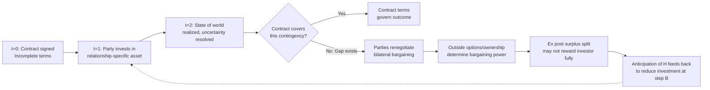

## Incomplete Contracts and Renegotiation

### Overview and Conceptual Foundation

An **incomplete contract** is a contract that fails to specify obligations, prices, or actions for every possible future state of the world. Real-world contracts are inherently incomplete because parties face **bounded rationality**, **costly contracting** (the expense of anticipating and drafting for every contingency), and **asymmetric information** about future states. Because courts and third parties cannot verify certain information that the parties themselves observe (unverifiable information), gaps in the contract must be filled either by default legal rules, by ex post renegotiation between the parties, or by litigation. This topic sits at the intersection of contract theory, the theory of the firm, and mechanism design, and is foundational to modern law-and-economics treatments of contract law's gap-filling function.

### Why Contracts Are Incomplete: Sources of Incompleteness

1. **Bounded rationality** — parties cannot foresee or enumerate every contingency ex ante; cognitive and informational limits make exhaustive contracting infeasible.
2. **Costly contracting (transaction costs of drafting)** — even where a contingency is foreseeable, specifying contractual terms for low-probability states may not be worth the drafting and negotiation cost.
3. **Asymmetric information** — one party may know something relevant (e.g., true cost of performance, true value of the good) that the other party or the court cannot verify, making it impossible to write enforceable contingent clauses referencing that private information.
4. **Non-verifiability** — even if both contracting parties observe a state of the world, if a third-party court cannot verify it, contract terms conditioned on that state are unenforceable, effectively rendering the contract incomplete with respect to that variable. This is the crucial distinction in the Grossman-Hart-Moore tradition: *observable but non-verifiable* information cannot be contracted upon even though the parties themselves know it perfectly.

### The Hold-Up Problem and Relationship-Specific Investment

Incomplete contracts interact critically with **relationship-specific investments** — investments whose value is much higher inside the specific contractual relationship than in alternative uses (e.g., a supplier building a factory next to a single buyer's plant). Because the contract cannot specify complete terms for every future contingency, parties must renegotiate the price or terms once the relationship-specific investment is sunk. This creates the **hold-up problem**:

$$\text{Ex ante investment } I \text{ increases surplus, but ex post, the investing party's bargaining power falls because their investment is sunk and irreversible.}$$

If the anticipated ex post renegotiation allows the counterparty to appropriate part of the returns to investment (because the investing party cannot credibly threaten to walk away once sunk costs are incurred), the investing party will **underinvest relative to the efficient level**, even though both parties would be better off ex ante if the investment were made at the efficient level and the surplus shared according to the original bargain.

**Numerical Example:**

- Supplier can invest $100 to build specialized equipment, raising total relationship surplus from $150 to $400 (an increase of $250, so investment is efficient since $250 > $100).
- Once the investment is sunk, suppose renegotiation under a standard bargaining protocol (e.g., Nash bargaining with equal split of the incremental surplus) gives Supplier only half of the *incremental* surplus over the no-investment outcome: Supplier receives $125 of the $250 gain.
- Supplier's net private return is $125 − $100 = $25, which may be positive but is **below the socially efficient level of investment**, because Supplier does not capture the full marginal return to investment (the buyer captures the other $125 through renegotiation leverage).
- If the investment had a continuous, cost-increasing production function, Supplier would stop investing before reaching the surplus-maximizing point — this is **underinvestment due to hold-up**.

### The Fundamental Theorem: Incomplete Contracts Cause Inefficiency (Grossman-Hart-Moore / GHM)

The property-rights approach to the firm (Grossman & Hart, 1986; Hart & Moore, 1990) formalizes how the allocation of **residual control rights** (ownership of assets) determines bargaining power in ex post renegotiation when contracts cannot specify all contingencies. Key results:

- Ownership of an asset confers the **residual right of control** over that asset in states not covered by the contract.
- Because ownership determines each party's "threat point" or **outside option** in bargaining (what they get if negotiation breaks down and they walk away, taking their asset with them), it determines how much of the ex post surplus each party can extract in renegotiation.
- Efficient asset ownership (vertical integration, i.e., which party should own which productive asset) should be allocated to the party whose **investment is more important** to maximizing total surplus, since ownership strengthens that party's bargaining position and thus their incentive to invest.

This underlies the economic theory of **vertical integration** as a response to incomplete contracting and hold-up risk — firms integrate specifically to mitigate hold-up when contracts cannot be written completely and relationship-specific investments are large.

### Renegotiation: The Coasean Response to Incompleteness

Renegotiation is the process by which parties revise contract terms after signing, in light of information or circumstances that were not (or could not be) contracted for initially. Renegotiation can be understood through a Coasean lens:

- If **transaction costs of renegotiating are low** and there is no asymmetric information at the renegotiation stage, parties will renegotiate to the ex post efficient outcome regardless of the original contract's gaps (a "renegotiation-proofness" or Coasean efficiency result).
- However, if the **initial contract's default allocation of bargaining power** anticipates this renegotiation, the *ex ante* investment incentives are still distorted, even though the *ex post* outcome (given the investment already made) is efficient. This is the crux of the hold-up problem: ex post efficiency does not guarantee ex ante efficiency.

$$\text{Total Welfare} = \underbrace{S(I^*)}_{\text{ex post efficient surplus given investment } I} - \underbrace{I}_{\text{investment cost}}$$

Anticipated renegotiation affects how much of $S(I)$ the investor expects to capture, and thus affects the investor's choice of $I$ relative to the surplus-maximizing $I^*$.

### Contract Design Responses to the Hold-Up Problem

Because courts recognize that renegotiation under incomplete contracts creates inefficient investment incentives, several contractual and legal mechanisms attempt to mitigate hold-up:

1. **Vertical integration** — eliminating the need for a contract altogether by having a single owner control both parties' assets, aligning incentives via unified ownership (per GHM).
2. **Long-term contracts with price formulas** — indexing future prices to observable variables (e.g., commodity price indices) to reduce the scope for future renegotiation over price.
3. **Take-or-pay and requirements contracts** — pre-committing quantities to reduce ex post bargaining over volume.
4. **Specific performance as a default remedy** — as discussed in remedies theory, granting the non-breaching party a property-rule entitlement can *increase* their bargaining power in renegotiation, which can either mitigate or exacerbate hold-up depending on which party is under-investing.
5. **Option contracts and rights of first refusal** — allocating decision rights ex ante to reduce ex post bargaining uncertainty.
6. **Penalty defaults (Ayres & Gertner)** — courts deliberately set default rules that parties would *not* have chosen, in order to induce information-revealing contracting behavior (parties contract around the default only if they have private information worth revealing), which reduces reliance on costly renegotiation.

### Formal Model: The Two-Sided Investment Hold-Up Problem

Consider Buyer and Seller, each choosing investment $i_B, i_S \geq 0$ at cost $i_B, i_S$ (normalized), producing total surplus $S(i_B, i_S)$ if trade occurs. Suppose the contract is silent on price, and renegotiation splits the surplus via Nash bargaining with equal bargaining weights and outside options $\underline{u}_B, \underline{u}_S$ (payoffs if no trade occurs).

Each party's ex post payoff:

$$u_B = \underline{u}_B + \frac{1}{2}\left[S(i_B, i_S) - \underline{u}_B - \underline{u}_S\right]$$

$$u_S = \underline{u}_S + \frac{1}{2}\left[S(i_B, i_S) - \underline{u}_B - \underline{u}_S\right]$$

Each party's **marginal private return to investment** is only half the marginal social return $\partial S/\partial i_j$ (assuming outside options don't depend on that party's own investment), leading each to invest at $i_j$ such that:

$$\frac{1}{2}\frac{\partial S}{\partial i_j} = 1 \quad \text{(marginal cost)}$$

rather than the efficient condition $\partial S/\partial i_j = 1$. Both parties **underinvest** relative to the first-best, and this is often called the **"1/2 hold-up problem"** in bilateral-investment settings. [Inference] The precise degree of underinvestment depends heavily on the specific bargaining protocol assumed (Nash bargaining with equal weights is a common but not universal modeling choice); alternative bargaining games (e.g., asymmetric bargaining power, take-it-or-leave-it offers) yield different, sometimes more severe, underinvestment results.

### Diagram: Timeline of Incomplete Contracting and Hold-Up

### Illustration: Bargaining Power and Investment Incentives Under Incomplete Contracts (svg_diagram)

<svg xmlns="http://www.w3.org/2000/svg" viewBox="0 0 700 320">
<text x="350" y="28" text-anchor="middle" font-size="17" font-weight="bold" fill="#1a1a2e">Bargaining Power and Investment Incentives Under Incomplete Contracts (svg_diagram)</text>
<line x1="80" y1="270" x2="620" y2="270" stroke="#333" stroke-width="2" />
<line x1="80" y1="270" x2="80" y2="60" stroke="#333" stroke-width="2" />
<text x="350" y="300" text-anchor="middle" font-size="13" fill="#1a1a2e">Investment Level (i)</text>
<text x="35" y="165" text-anchor="middle" font-size="13" fill="#1a1a2e" transform="rotate(-90 35 165)">Marginal Return</text>
<path d="M 80 260 L 620 260" stroke="#7e2b2b" stroke-width="2.5" fill="none" />
<text x="600" y="250" font-size="11" fill="#7e2b2b">Marginal Cost = 1</text>
<path d="M 80 90 Q 250 130 420 200 Q 500 230 600 260" stroke="#2b4c7e" stroke-width="2.5" fill="none" />
<text x="150" y="100" font-size="11" fill="#2b4c7e">Full Social Marginal Return ∂S/∂i</text>
<path d="M 80 175 Q 250 200 420 235 Q 500 250 600 260" stroke="#2b7e4c" stroke-width="2.5" stroke-dasharray="6,4" fill="none" />
<text x="150" y="195" font-size="11" fill="#2b7e4c">Private Return under Renegotiation (½ ∂S/∂i)</text>
<line x1="420" y1="270" x2="420" y2="200" stroke="#2b4c7e" stroke-width="1.5" stroke-dasharray="3,2" />
<text x="420" y="288" text-anchor="middle" font-size="11" fill="#2b4c7e">i* (efficient)</text>
<line x1="260" y1="270" x2="260" y2="212" stroke="#2b7e4c" stroke-width="1.5" stroke-dasharray="3,2" />
<text x="260" y="288" text-anchor="middle" font-size="11" fill="#2b7e4c">i_actual (underinvestment)</text>

<text x="350" y="315" text-anchor="middle" font-size="11" fill="#555" font-style="italic">Gap between i_actual and i* represents the hold-up efficiency loss</text>

</svg>

### Related Topics

- **The property-rights theory of the firm (Grossman-Hart-Moore) and vertical integration**
- **Relationship-specific investment and asset specificity (Williamson's transaction cost economics)**
- **Penalty defaults and information-forcing default rules (Ayres & Gertner)**
- **Specific performance versus monetary damages (interaction with ex post bargaining power)**
- **Optimal contract length and renegotiation design**
- **Mechanism design and revelation principle under asymmetric information**
- **Efficient breach theory and its relationship to renegotiation surplus division**
- **Long-term contracts, take-or-pay clauses, and price-indexation mechanisms**