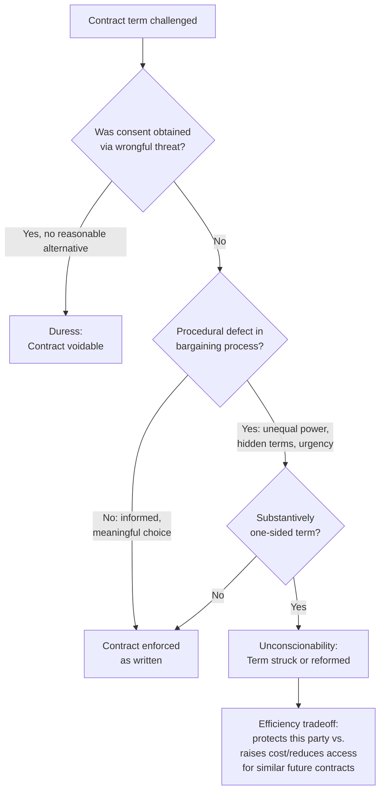

## Unconscionability, Duress, and Paternalistic Limits

### Overview and Doctrinal Background

Contract law generally enforces bargains as freely made, reflecting a presumption that voluntary exchange between competent parties is welfare-enhancing. However, several doctrines allow courts to refuse enforcement, or to reform terms, when the bargaining process or the resulting terms are sufficiently defective. **Duress** invalidates consent obtained through wrongful threats that overcome a party's free will. **Unconscionability** allows courts to refuse enforcement of terms (or entire contracts) that are so one-sided, combined with defects in the bargaining process, that enforcement would be unjust. Both doctrines raise a central question for law and economics: when, if ever, should the state override the parties' own revealed preferences — a form of **paternalism** — and what are the efficiency costs and benefits of doing so?

### Duress: Doctrinal Elements and Economic Rationale

Duress requires (1) a **wrongful or improper threat** and (2) that the threat left the victim with **no reasonable alternative** but to agree, such that the resulting "consent" was not voluntary in the relevant sense. Economic threats (e.g., threatening to breach an existing contract unless the price is renegotiated) can constitute duress under the doctrine of **economic duress**, distinct from the classic case of physical threats.

**Economic Rationale:**

- Duress doctrine addresses situations where the "bargain" does not reflect genuine gains from trade but rather a transfer extracted through a threat to withhold something the threatening party had no legal right to withhold, or to breach a pre-existing obligation.
- Economically, a threat is "wrongful" in the relevant sense when it does not create new value but merely reallocates existing value through coercion — i.e., it is **rent-seeking** rather than surplus-creating. Legitimate hard bargaining (e.g., "I won't sell unless you pay more") is generally not duress if the threatening party had a legal right to withhold performance and both parties retain meaningful alternatives (an outside option).
- The key economic distinction is whether the threatened party had a **reasonable alternative**: if genuine competitive alternatives existed (another supplier, the ability to sue for breach and recover damages, time to seek other options), the "threat" is more likely ordinary bargaining leverage rather than duress.

**Example — Economic Duress in Renegotiation:**

- Supplier has a contract to deliver goods to Buyer at $10,000. Mid-project, Supplier threatens to stop delivery unless Buyer agrees to pay $15,000, knowing Buyer has no time to find an alternative supplier before a critical deadline (e.g., a construction subcontractor situation).
- If Buyer has no reasonable alternative (cannot find substitute performance in time, and the threat to breach is wrongful because Supplier had no legal justification for withholding performance), courts may find the renegotiated $15,000 term unenforceable as economic duress, and Buyer may recover the excess paid.
- This doctrine can be understood as preventing **strategic hold-up exploitation** of a *legally* (not just economically) unjustified threat, complementing the ex ante hold-up analysis discussed under relationship-specific investment (see incomplete contracts and renegotiation) — though duress specifically targets threats that violate a pre-existing legal entitlement, whereas ordinary hold-up can occur even among fully law-abiding threats.

### Unconscionability: Procedural and Substantive Dimensions

American contract law (UCC § 2-302, Restatement (Second) of Contracts § 208) generally requires courts to find both:

1. **Procedural unconscionability** — defects in the bargaining process: unequal bargaining power, lack of meaningful choice, hidden or buried terms, high-pressure sales tactics, or exploitation of the other party's lack of sophistication or urgent need.
2. **Substantive unconscionability** — the resulting terms are unreasonably one-sided or oppressive (e.g., extreme price disparity, unconscionable limitation of remedies, terms that shock the conscience of the court).

Most jurisdictions apply a **sliding scale**: the more procedurally defective the bargaining process, the less substantively unfair the term needs to be for a court to intervene, and vice versa.

### Economic Justifications for Unconscionability Doctrine

Law and economics offers several distinct, sometimes competing, justifications:

1. **Correcting market failures in the bargaining process.** If procedural defects (information asymmetry, cognitive limitations, exploitation of urgent necessity) mean the resulting contract does not reflect a genuine meeting of minds or a Pareto-improving exchange, unconscionability doctrine can be understood as a proxy for **market failure correction** — akin to voiding contracts that fail the basic conditions for mutually beneficial trade (informed, voluntary consent).
2. **Reducing the incentive to exploit informational or bargaining asymmetries.** If sellers know that terms exploiting unsophisticated buyers may be struck down, ex ante incentives shift toward using standard, less exploitative terms, potentially raising the average quality of adhesion contracts across the market (a **deterrence rationale** operating on drafters, not just remedying individual injustices).
3. **Reducing transaction costs / **duty to read** problem.** In markets characterized by standard-form ("boilerplate") contracts and rational apathy (it is not individually rational for any one consumer to read and negotiate every term of a low-value transaction), unconscionability functions as a backstop that limits how far sellers can exploit the fact that most buyers will not read or bargain over terms. This connects unconscionability to the broader economic theory of standard-form contracts and the "duty to read" doctrine.

### The Paternalism Critique and Efficiency Costs

Law-and-economics scholars, particularly those in the classical/libertarian tradition (e.g., **Richard Epstein**), raise significant efficiency-based objections to unconscionability and similar paternalistic doctrines:

1. **Interference with voluntary exchange reduces the gains from trade ex ante.** If courts routinely refuse to enforce terms that appear one-sided, this raises the cost and uncertainty of contracting generally, potentially reducing the total volume of mutually beneficial trade, including transactions that would have been beneficial to the party the doctrine purports to protect.
2. **Ex ante versus ex post perspective problem.** A term that appears "unconscionable" ex post (after an adverse contingency has occurred) may have been part of an efficient risk allocation ex ante — for instance, a high-interest, high-fee loan to a risky borrower may reflect the lender's rational pricing of default risk, not exploitation. Striking down such terms after the fact may simply cause lenders to stop offering credit to the affected population entirely (a form of **market exit** or credit rationing), harming the very population the doctrine intended to protect.
3. **Redistribution through remedy law is a blunt instrument.** If the underlying concern is inequality or vulnerability, some economists argue direct redistribution (taxes, transfers, targeted subsidies) is a more efficient policy tool than distorting contract enforcement rules, since contract-law-based redistribution introduces price and availability distortions in the specific market affected (a point analogous to critiques of price controls).
4. **Adverse selection and pooling effects.** If courts unpredictably strike down harsh terms in a subset of cases, sellers may respond by charging all customers a higher average price to compensate for the risk that some contracts will be unenforceable, effectively cross-subsidizing the protected party's cost onto other customers — a redistribution with ambiguous welfare effects across the customer base.

### The Behavioral Economics Counter-Rationale

Modern behavioral law and economics offers a more nuanced defense of paternalistic doctrines, sometimes called **"asymmetric" or "libertarian" paternalism**:

1. **Bounded rationality and systematic biases.** If consumers systematically underestimate the probability or magnitude of adverse contingencies (e.g., default, illness, job loss) due to well-documented cognitive biases (optimism bias, hyperbolic discounting, present bias), then contracts signed under these biases do not reflect genuine informed consent to the risk allocation, even absent classic procedural defects like fraud or misrepresentation.
2. **Doctrine as a response to exploitative "shrouding" of terms.** Sellers may have an incentive to structure contracts to exploit known consumer biases (e.g., burying penalty terms, back-loading fees) — a strategic response to predictable irrationality rather than genuine price competition. Unconscionability can function as a check on this **exploitative contract design**, distinguishing it from ordinary paternalism that overrides fully-informed preferences.
3. **Targeted versus blanket intervention.** The behavioral case for unconscionability is generally narrower than a blanket paternalistic override — it targets specific, well-documented failure modes (biased risk assessment, shrouded terms, systematic exploitation of urgent necessity) rather than general dissatisfaction with contract outcomes, distinguishing it from broader critiques of enforcing any harsh-but-informed bargain.

### Formal Framing: When Does Intervention Increase Welfare?

Let $W_E$ be expected welfare under enforcement of the term as written, and $W_V$ be expected welfare if courts void or reform the term. A rough welfare comparison:

$$W_E = \pi \cdot U(\text{good outcome}) + (1-\pi) \cdot U(\text{harsh outcome}) - \text{(distortion costs of enforcement, e.g., reduced credit access if none)}$$

$$W_V = U(\text{outcome under reformed term}) - \text{(distortion costs of non-enforcement, e.g., reduced future contract offers, higher prices for other borrowers)}$$

Intervention increases welfare only when the **distortion costs of voiding** (reduced future supply of similar contracts, cross-subsidization, chilling effects on efficient risk-based pricing) are smaller than the **distortion costs of enforcing** a term extracted through genuine market failure (biased consent, exploitative shrouding, lack of meaningful alternatives). [Inference] This welfare comparison is highly context- and empirics-dependent; the theoretical model does not itself resolve which regime dominates in any particular market, and courts in practice apply doctrinal tests (procedural + substantive unconscionability) rather than performing this welfare calculation directly.

### Diagram: Analytical Path from Bargaining Defect to Remedy

### Illustration: Procedural vs. Substantive Unconscionability Sliding Scale (svg_diagram)

<svg xmlns="http://www.w3.org/2000/svg" viewBox="0 0 700 320">
<text x="350" y="28" text-anchor="middle" font-size="17" font-weight="bold" fill="#1a1a2e">Procedural vs. Substantive Unconscionability Sliding Scale (svg_diagram)</text>
<line x1="90" y1="270" x2="620" y2="270" stroke="#333" stroke-width="2" />
<line x1="90" y1="270" x2="90" y2="60" stroke="#333" stroke-width="2" />
<text x="355" y="300" text-anchor="middle" font-size="13" fill="#1a1a2e">Procedural Unfairness (bargaining defect)</text>
<text x="45" y="165" text-anchor="middle" font-size="13" fill="#1a1a2e" transform="rotate(-90 45 165)">Substantive Unfairness (term harshness)</text>
<path d="M 90 260 Q 300 200 620 80" stroke="#7e2b2b" stroke-width="2.5" fill="none" stroke-dasharray="6,3" />
<text x="420" y="120" font-size="11" fill="#7e2b2b">Threshold for judicial intervention</text>
<rect x="140" y="220" width="140" height="35" fill="#eef3fb" stroke="#2b4c7e" />
<text x="210" y="242" text-anchor="middle" font-size="11" fill="#1a1a2e">Enforced (low/low)</text>
<rect x="440" y="90" width="150" height="35" fill="#fbeeee" stroke="#7e2b2b" />
<text x="515" y="112" text-anchor="middle" font-size="11" fill="#1a1a2e">Struck down (high/high)</text>
<rect x="440" y="220" width="150" height="35" fill="#f5f0dd" stroke="#8a7a2b" />
<text x="515" y="242" text-anchor="middle" font-size="11" fill="#1a1a2e">Contestable: high proc., moderate subst.</text>
<rect x="140" y="90" width="150" height="35" fill="#f5f0dd" stroke="#8a7a2b" />
<text x="215" y="112" text-anchor="middle" font-size="11" fill="#1a1a2e">Rarely struck: low proc., high subst. (freedom to bargain)</text>
</svg>

### Related Topics

- **Standard-form contracts and the "duty to read" problem**
- **Behavioral law and economics: bounded rationality, present bias, and shrouded attributes**
- **Incomplete contracts and renegotiation (hold-up versus economic duress)**
- **Consumer protection regulation as an alternative to contract-law paternalism**
- **Adhesion contracts and the doctrine of reasonable expectations**
- **Usury laws and price-cap regulation as paternalistic price controls**
- **Information-forcing default rules and mandatory disclosure regimes**
- **Capacity doctrines: minors, mental incapacity, and intoxication as consent defects**