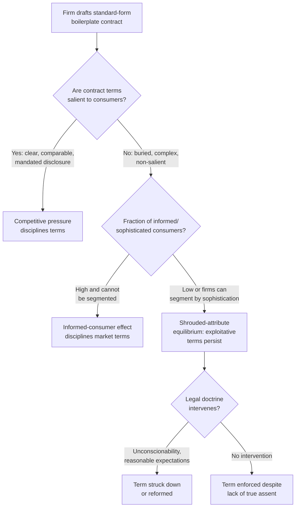

## Standard Form Contracts and Boilerplate Terms

### Overview and Definitional Framework

**Standard form contracts** (also called adhesion contracts or boilerplate contracts) are contracts drafted unilaterally by one party (typically a repeat-player firm) and offered to the other party (typically a one-shot consumer) on a take-it-or-leave-it basis, with little or no individualized negotiation over most terms. Boilerplate refers specifically to the pre-printed, standardized clauses within such contracts — warranty disclaimers, arbitration clauses, choice-of-law provisions, limitation-of-liability clauses, forum-selection clauses — that are largely invariant across the drafting party's entire customer base. Standard form contracts are ubiquitous in modern commerce (software EULAs, insurance policies, employment agreements, consumer credit agreements, terms of service) precisely because they dramatically reduce the transaction costs of contracting at scale.

### Economic Rationale: Why Standardization Is Efficient

1. **Reduced drafting and negotiation costs.** Negotiating every term of every transaction individually would be prohibitively costly relative to the value of most consumer transactions. Standardization allows a firm to draft once and transact repeatedly, spreading the fixed cost of legal drafting across a large volume of transactions — a straightforward economy of scale.
2. **Reduced information and search costs for the drafting party.** Firms can rely on well-tested legal language (often vetted through prior litigation) rather than bespoke drafting for each counterparty, reducing legal risk and uncertainty.
3. **Predictability and risk allocation.** Standardized terms allow firms to price products based on a known, uniform risk and liability profile, rather than pricing uncertainty into every transaction individually (which would raise average prices for all consumers).
4. **Network and reputational effects.** Widely used boilerplate (e.g., ISDA master agreements in derivatives markets, AIA contracts in construction) benefits from accumulated judicial interpretation, reducing the legal uncertainty of using well-established language.

### The Core Problem: Rational Apathy and the "Duty to Read" Fiction

Classical contract doctrine assumes a party who signs a contract has read and assented to all its terms (the "duty to read"). Law and economics identifies why this assumption often fails to reflect actual market behavior:

- **Rational apathy / rational ignorance.** For any individual consumer, the expected cost of carefully reading, understanding, and potentially negotiating over boilerplate terms (time, cognitive effort, possible loss of the deal if negotiation is even possible) typically exceeds the expected benefit, given that the probability any specific clause will matter to that particular consumer is low and the value of most consumer transactions is modest. It is **individually rational not to read** even though, in the aggregate, this creates a market where sellers face weak competitive discipline on the content of boilerplate terms.
- **Take-it-or-leave-it structure removes negotiation as a discovery mechanism.** Because most standard-form terms are non-negotiable in practice, there is no market mechanism by which an individual consumer's objection to a specific clause could be communicated to and incorporated by the seller.

### Does Competition Discipline Boilerplate Terms? The "Two-Tier" Market Model

A key question in law and economics is whether ordinary market competition over price is sufficient to discipline sellers from including exploitative or inefficient boilerplate terms, given that most consumers do not read the fine print.

**The optimistic view (competitive discipline argument):**

- If even a small fraction of consumers **are informed** (read terms, compare across sellers, or rely on informed intermediaries like consumer advocacy groups, journalists, or comparison sites), and if sellers cannot **price discriminate** based on whether a specific consumer is informed or not, then informed consumers exert a disciplining effect on the *entire* market. Sellers who include exploitative boilerplate lose the informed segment of consumers, which can be enough to make exploitative terms unprofitable market-wide — this is sometimes called the **"marginal/informed consumer" hypothesis**.

**The pessimistic view (market failure argument):**

- If sellers **can** distinguish or effectively segment informed from uninformed consumers (e.g., through the format, salience, or timing of disclosure — burying unfavorable terms deep in lengthy documents that only highly motivated searchers will find), competitive discipline breaks down. Sellers compete vigorously on the *salient* dimension (headline price) while degrading *non-salient* dimensions (boilerplate terms), since consumers do not factor non-salient terms into their purchase decision. This produces a **race to the bottom on non-salient contract terms** even in a fully competitive price market — a form of market failure distinct from monopoly power.
- This is closely related to the behavioral economics concept of **shrouded attributes** (Gabaix & Laibson): sellers have an equilibrium incentive to shroud costly or unfavorable terms because revealing them would not attract the marginal informed consumer sufficiently to offset the cost of losing the ability to extract value from uninformed consumers via the shrouded term.

### Legal Doctrines Addressing Standard-Form Contract Problems

1. **Unconscionability** (procedural + substantive) — as previously covered, functions partly as a backstop against terms that exploit the fact that most consumers do not read boilerplate.
2. **Reasonable expectations doctrine** — courts (especially in insurance law) may refuse to enforce a boilerplate term that defeats the **objectively reasonable expectations** of the non-drafting party, even if the term is technically part of the signed document, on the theory that true assent did not extend to unexpected or buried terms.
3. **Contra proferentem** — ambiguous terms in a standard-form contract are construed against the drafter, creating an incentive for drafters to write clearly (an information-forcing, incentive-aligning default rule).
4. **Mandatory disclosure regimes** — regulatory requirements (Truth in Lending Act, Truth in Savings Act, various consumer protection statutes) mandate standardized disclosure formats (e.g., APR disclosure boxes) designed to make key terms salient and comparable across sellers, directly targeting the shrouded-attribute problem by legal fiat rather than relying on litigation-based doctrines.
5. **Restatement (Second) of Contracts § 211** — explicitly addresses standardized agreements, providing that a party is not bound by terms they had no reason to know would be included, and that a court may refuse to enforce unconscionable terms.

### Formal Model: Shrouded Terms Under Partial Consumer Sophistication

Let $\alpha \in [0,1]$ be the fraction of "sophisticated" consumers who correctly perceive the expected cost of a shrouded term (e.g., a hidden fee, an unfavorable arbitration clause, a low liability cap), and $1-\alpha$ be "naive" consumers who ignore it. Let $p$ be the salient headline price and $f$ be the expected cost of the shrouded term.

- A firm's expected profit per naive consumer includes the full extraction: $\pi_{naive} = p + f - c$
- A firm's expected profit per sophisticated consumer (who factors in $f$ when deciding whether to buy, and shops elsewhere if a rival offers a better full-cost deal): $\pi_{sophisticated} = p - c$ (approximately, assuming competitive pass-through of $f$'s expected cost into willingness-to-pay)

If firms cannot price-discriminate directly by consumer type but *can* set $f$ non-salient (making it hard for even sophisticated consumers to compare $f$ across sellers before purchase), a competitive equilibrium can still feature $f > 0$ and even $f$ set at a **welfare-destroying level** (higher than any efficient risk-based justification) as long as:

$$\alpha \cdot (\text{loss of sophisticated demand from raising } f) < (1-\alpha) \cdot (\text{gain from extracting } f \text{ from naive consumers})$$

This shows shrouding and exploitative boilerplate terms can survive in equilibrium even under significant price competition and even with a meaningful fraction of sophisticated consumers, refuting the naive assumption that "competition solves everything" for contract terms. [Inference] The specific equilibrium outcome is highly sensitive to modeling assumptions about search costs, whether firms can commit to unshrouding, and consumer learning over repeated interactions; some models predict market unraveling toward full disclosure under specific conditions (e.g., costless verifiable disclosure and consumer skepticism about unlabeled products).

### Arbitration Clauses as a Special Case of Boilerplate

Mandatory pre-dispute arbitration clauses in consumer and employment contracts have become a heavily studied form of boilerplate:

- **Efficiency argument:** Arbitration can lower dispute-resolution costs for both parties relative to litigation, and firms may pass some of these savings to consumers via lower prices, particularly benefiting consumers whose disputes are low-value and would otherwise be economically infeasible to litigate individually.
- **Concern:** Arbitration clauses are frequently bundled with **class-action waivers**, which can eliminate the primary mechanism (aggregate litigation) by which small, dispersed harms across many consumers are economically viable to pursue at all, potentially reducing deterrence of firm misconduct even if each individual consumer's arbitration process is procedurally fair. [Inference] Empirical findings on consumer/employee win rates and outcomes in arbitration versus litigation are mixed and contested across studies, and the net welfare effect of mandatory arbitration remains actively debated among law-and-economics scholars.

### Diagram: Standard-Form Contracting and Market Discipline Pathways

### Illustration: Informed vs. Naive Consumer Segments and Shrouded Term Incentives (svg_diagram)

<svg xmlns="http://www.w3.org/2000/svg" viewBox="0 0 700 330">
<text x="350" y="28" text-anchor="middle" font-size="16" font-weight="bold" fill="#1a1a2e">Informed vs. Naive Consumer Segments and Shrouded Term Incentives (svg_diagram)</text>
<rect x="60" y="60" width="580" height="90" rx="6" fill="#eef3fb" stroke="#2b4c7e" stroke-width="2" />
<text x="350" y="85" text-anchor="middle" font-size="13" font-weight="bold" fill="#2b4c7e">Sophisticated Consumers (fraction α)</text>
<text x="80" y="108" font-size="11" fill="#1a1a2e">• Perceive shrouded fee f and factor it into purchase decision</text>
<text x="80" y="128" font-size="11" fill="#1a1a2e">• Shop across sellers on full expected cost (p + f); exert competitive discipline</text>
<rect x="60" y="170" width="580" height="90" rx="6" fill="#fbeeee" stroke="#7e2b2b" stroke-width="2" />
<text x="350" y="195" text-anchor="middle" font-size="13" font-weight="bold" fill="#7e2b2b">Naive Consumers (fraction 1-α)</text>
<text x="80" y="218" font-size="11" fill="#1a1a2e">• Do not perceive or account for shrouded fee f</text>
<text x="80" y="238" font-size="11" fill="#1a1a2e">• Choose based on salient headline price p only; fee f is pure surplus extraction</text>
<path d="M 350 260 L 350 285" stroke="#333" stroke-width="2" marker-end="url(#arrow)" />
<text x="350" y="305" text-anchor="middle" font-size="12" fill="#1a1a2e" font-style="italic">Firms set f &gt; 0 whenever extraction from (1-α) exceeds lost demand from α</text>
</svg>

### Related Topics

- **Unconscionability, duress, and paternalistic limits (doctrinal overlap and remedies)**
- **Behavioral law and economics: shrouded attributes and consumer biases**
- **Mandatory disclosure regulation (Truth in Lending Act, standardized disclosure boxes)**
- **Mandatory arbitration clauses and class-action waivers**
- **Contra proferentem and the reasonable expectations doctrine**
- **Network effects and industry-standard boilerplate (ISDA, AIA contracts)**
- **Regulation versus contract-law responses to market failure in consumer contracting**
- **Information-forcing default rules (Ayres & Gertner) applied to disclosure design**