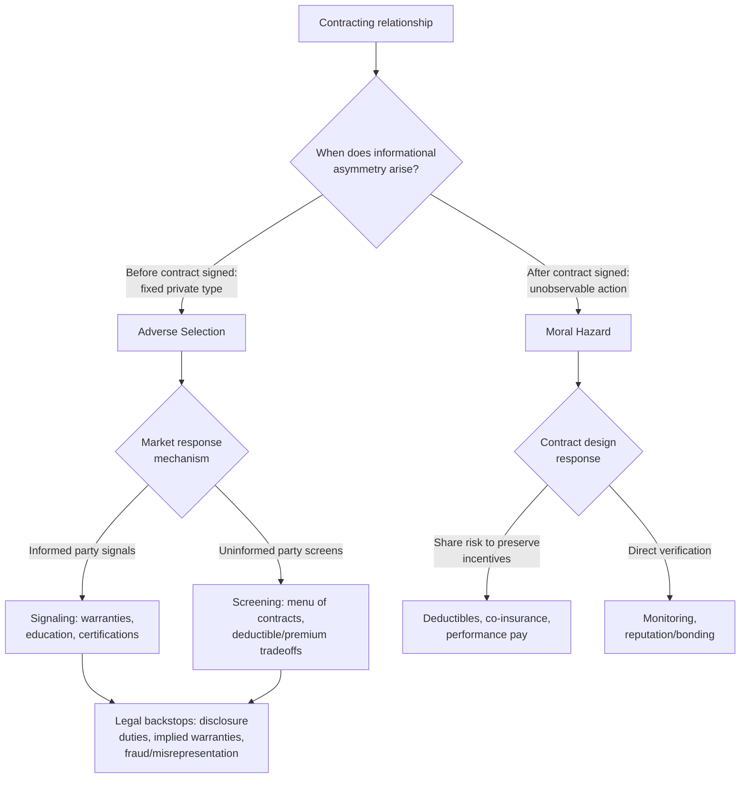

## Contracting Under Asymmetric Information

### Overview and Conceptual Foundation

Asymmetric information exists when one party to a potential contract possesses relevant information that the other party lacks, and this informational gap affects the terms, feasibility, or efficiency of the exchange. This topic is foundational to modern contract theory and connects directly to mechanism design, insurance economics, and corporate finance. Two canonical problems dominate the literature: **adverse selection** (asymmetric information about a *fixed characteristic* known before contracting, such as quality or risk type) and **moral hazard** (asymmetric information about *actions taken after* contracting, such as effort or care). A third related concept, **signaling and screening**, describes mechanisms parties use to overcome adverse selection absent direct verification.

### Adverse Selection: The Market for Lemons

George Akerlof's classic analysis of the used-car market demonstrates how asymmetric information about quality, known to the seller but not the buyer, can cause **market unraveling**:

- Sellers know the true quality of their good; buyers only know the population distribution of quality.
- Buyers rationally offer a price reflecting the **average** quality in the market, since they cannot distinguish individual sellers.
- Sellers of above-average quality goods are unwilling to sell at a price reflecting only average quality, and exit the market.
- As high-quality sellers exit, the average quality of goods remaining on the market falls further, causing buyers to lower their price offer further, triggering additional exits — an unraveling spiral that can, in the extreme case, cause the market to shrink dramatically or collapse entirely.

$$p^* = E[q \mid \text{seller willing to sell at } p^*]$$

This is a **fixed-point condition**: the market-clearing price must be consistent with the quality composition of sellers who find that price acceptable, and this self-referential condition can have only low-quality equilibria (or no trade at all) even though efficient trade (at true quality-reflective prices) would benefit both parties.

**Contract law implications:** Adverse selection motivates several doctrines and default rules:

- **Implied warranties** (merchantability, fitness for purpose) shift some quality risk to sellers who have better information, partially substituting for buyers' inability to verify quality directly.
- **Disclosure duties** in specific contexts (real estate defect disclosure statutes, securities law disclosure requirements) are direct legal responses to adverse selection, mandating that the informed party reveal material information the uninformed party cannot verify independently.
- **Misrepresentation and fraud doctrines** penalize affirmatively false statements about quality, reducing sellers' ability to actively worsen the adverse selection problem through deception rather than mere silence.

### Screening and Signaling: Market Responses to Adverse Selection

Where legal mandates are absent or insufficient, market participants develop private mechanisms to mitigate adverse selection:

1. **Signaling** (informed party moves first) — the informed party takes a costly action to credibly reveal private information, where the cost structure ensures only genuinely high-quality types find signaling worthwhile (Spence's job-market signaling model with education as the classic example). In contract terms: warranties are a signal — only sellers confident in their product's quality can profitably offer a generous warranty, since low-quality sellers would face excessive warranty claims.
2. **Screening** (uninformed party moves first) — the uninformed party designs a menu of contract options such that different types self-select into different contracts, revealing their private type through their choice (Rothschild-Stiglitz insurance model). In insurance markets, offering a menu of {high premium, full coverage} versus {low premium, partial coverage with a deductible} induces low-risk types to reveal themselves by choosing the partial-coverage option (since they are less likely to need full coverage and prefer the lower premium), while high-risk types self-select into full coverage.

**Formal Screening Condition (Insurance Example):**

For a menu of contracts to successfully separate types, it must satisfy **incentive compatibility (IC)**: each type must prefer their intended contract to the contract intended for the other type.

$$U_L(\text{contract}_L) \geq U_L(\text{contract}_H) \quad \text{and} \quad U_H(\text{contract}_H) \geq U_H(\text{contract}_L)$$

where $U_L, U_H$ denote the utility functions of low-risk and high-risk types respectively. The standard result (Rothschild-Stiglitz) is that separating equilibria require **inefficient contract distortion** for the low-risk type (e.g., forcing them to accept only partial coverage even though full coverage at their true risk-based price would be efficient) purely to prevent the high-risk type from mimicking them — a real efficiency cost attributable directly to the informational asymmetry, not to any inherent riskiness itself.

### Moral Hazard: Asymmetric Information About Post-Contractual Actions

Moral hazard arises when one party's actions after contracting affect the outcome, but those actions are **unobservable or unverifiable** by the other party, creating an incentive to shirk, take excessive risk, or otherwise act contrary to the other party's interest once insulated from the consequences.

**Classic examples:**

- An insured party takes less care to prevent loss once insurance coverage reduces their exposure to the loss (ex post moral hazard, or "moral hazard" in the strict insurance sense).
- An employee reduces effort once compensation is fixed (salary) rather than tied to observable output (agency-cost moral hazard).
- A borrower takes on riskier projects than agreed once loan proceeds are disbursed and monitoring is imperfect (asset substitution problem in corporate finance).

**Contract design responses to moral hazard:**

1. **Deductibles and co-insurance** — requiring the informed party to bear part of the loss preserves some incentive to take precautions, trading off risk-sharing efficiency against incentive efficiency.
2. **Performance-based compensation** — tying pay to observable output (piece rates, stock options, commissions) aligns the agent's incentives with the principal's interest, though at the cost of exposing the agent to risk from factors outside their control.
3. **Monitoring** — direct verification of effort or care, subject to its own cost-benefit tradeoff (monitoring is often costly and imperfect).
4. **Bonding and reputation mechanisms** — requiring the informed party to post a bond or invest in reputation that they forfeit if shirking is later discovered, effectively making future information verification (even if delayed) matter for current behavior.

### The Principal-Agent Formalization

The standard principal-agent model with moral hazard: a principal hires an agent to take an unobservable action (effort) $e$, which stochastically affects an observable outcome $x$. The principal can only condition the agent's compensation $w(x)$ on the observable outcome, not on effort directly.

$$\max_{w(\cdot)} E[x - w(x)] \quad \text{subject to:}$$

$$\text{(IR) } E[u(w(x)) - c(e)] \geq \bar{u} \quad \text{(agent's participation constraint)}$$

$$\text{(IC) } e \in \arg\max_{e'} E[u(w(x)) - c(e')] \quad \text{(agent chooses effort to maximize own utility given the wage schedule)}$$

The **fundamental tradeoff**: if the agent is risk-averse and outcomes are noisy (affected by factors beyond the agent's control), tying compensation tightly to output to induce high effort (satisfying IC) imposes costly risk on the agent, requiring a risk premium (worsening the IR constraint or requiring higher expected pay). This is the **risk-incentive tradeoff**, and it explains why observed real-world compensation contracts are rarely pure pay-for-performance even when moral hazard concerns are significant — some insurance against outcome noise is efficient even at the cost of somewhat blunted incentives.

### Contract Law Doctrines Responsive to Moral Hazard

1. **Duty to mitigate damages** — requiring the non-breaching party to take reasonable steps to minimize losses after breach counteracts a form of moral hazard: without this duty, a non-breaching party might have insufficient incentive to avoid easily preventable additional losses, since damages would fully compensate regardless of their own subsequent care.
2. **Comparative negligence-style doctrines in contract-adjacent contexts** — allocating losses partly based on the non-breaching party's own conduct, mirroring insurance deductibles' incentive-preserving logic.
3. **Good faith and fair dealing doctrine** — can be understood partly as a response to moral hazard in relational and long-term contracts, where one party's discretion (e.g., in an output or requirements contract) creates opportunities for opportunistic behavior that explicit terms cannot fully constrain.

### Diagram: Adverse Selection vs. Moral Hazard — Timing and Response

### Illustration: Adverse Selection Market Unraveling (svg_diagram)

<svg xmlns="http://www.w3.org/2000/svg" viewBox="0 0 700 320">
<text x="350" y="26" text-anchor="middle" font-size="16" font-weight="bold" fill="#1a1a2e">Adverse Selection Market Unraveling (svg_diagram)</text>
<line x1="80" y1="270" x2="620" y2="270" stroke="#333" stroke-width="2" />
<line x1="80" y1="270" x2="80" y2="55" stroke="#333" stroke-width="2" />
<text x="350" y="298" text-anchor="middle" font-size="12" fill="#1a1a2e">Round of Price Adjustment</text>
<text x="35" y="165" text-anchor="middle" font-size="12" fill="#1a1a2e" transform="rotate(-90 35 165)">Price / Average Quality</text>
<path d="M 100 90 L 220 130 L 340 170 L 460 205 L 580 235" stroke="#2b4c7e" stroke-width="2.5" fill="none" />
<circle cx="100" cy="90" r="4" fill="#2b4c7e" />
<circle cx="220" cy="130" r="4" fill="#2b4c7e" />
<circle cx="340" cy="170" r="4" fill="#2b4c7e" />
<circle cx="460" cy="205" r="4" fill="#2b4c7e" />
<circle cx="580" cy="235" r="4" fill="#2b4c7e" />
<text x="150" y="80" font-size="11" fill="#2b4c7e">Round 1: p reflects avg quality</text>
<text x="420" y="255" font-size="11" fill="#7e2b2b">High-quality sellers exit at each round</text>

<text x="100" y="288" text-anchor="middle" font-size="10" fill="#555">t=0</text>

<text x="220" y="288" text-anchor="middle" font-size="10" fill="#555">t=1</text>

<text x="340" y="288" text-anchor="middle" font-size="10" fill="#555">t=2</text>

<text x="460" y="288" text-anchor="middle" font-size="10" fill="#555">t=3</text>

<text x="580" y="288" text-anchor="middle" font-size="10" fill="#555">t=4</text>

<text x="350" y="315" text-anchor="middle" font-size="11" fill="#555" font-style="italic">Each exit of high-quality sellers lowers average quality, further lowering price offers</text>

</svg>

### Related Topics

- **The Rothschild-Stiglitz screening model in insurance markets**
- **Spence signaling model and warranties as quality signals**
- **Principal-agent theory and executive compensation design**
- **Implied warranties and disclosure duties as legal responses to adverse selection**
- **Mitigation of damages doctrine as a moral hazard control**
- **Incomplete contracts and renegotiation (interaction with unverifiable information)**
- **Insurance law: deductibles, co-insurance, and experience rating**
- **Mechanism design and the revelation principle**