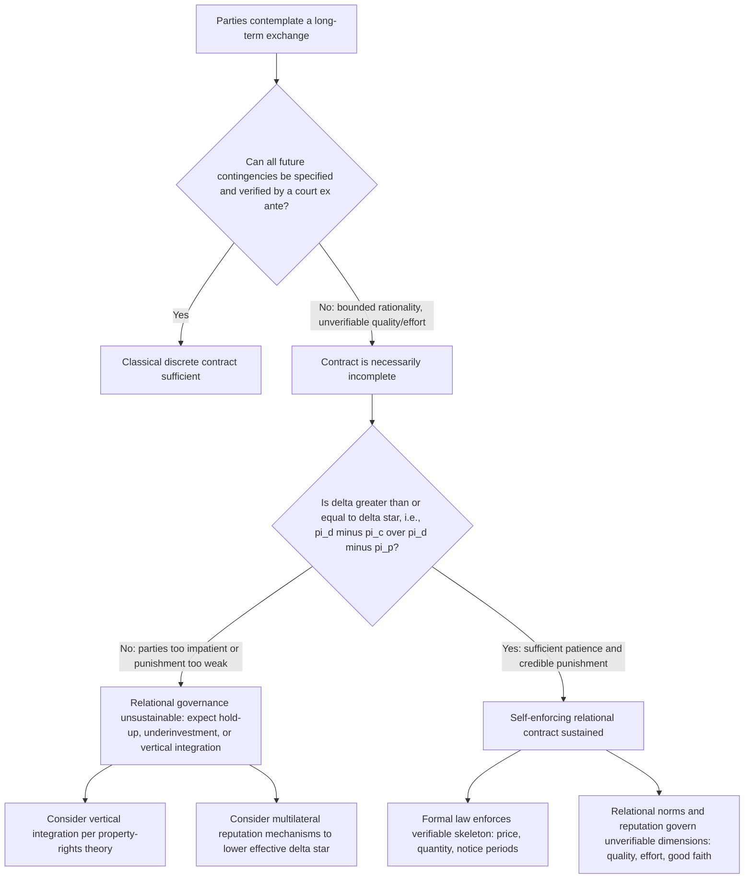

## Relational Contracts and Long-Term Business Relationships

### Definitional Foundations

**Key Points**

- A relational contract is a governance structure for exchange in which the parties' obligations are defined only partly by explicit terms and substantially by an ongoing relationship, shared norms, and expectations of future interaction.
- Ian Macneil's typology positions relational contracts at one end of a spectrum, opposite discrete (spot) transactions, with "presentiation" (the degree to which the future is brought into the present via explicit terms) as the organizing variable.
- Discrete transactions are characterized by: (1) short duration, (2) precise measurability of performance, (3) minimal future cooperation, and (4) complete third-party enforceability via courts.
- Relational contracts exhibit the opposite: long duration, imprecise or unmeasurable elements of performance, high interdependence, and reliance on non-legal sanctions (reputation, self-enforcement) alongside or instead of court enforcement.

Formally, a contract can be modeled as a point on a continuum indexed by relational thickness $r \in [0,1]$, where $r=0$ is a pure spot transaction and $r=1$ is a fully relational, norm-governed exchange with no meaningful reliance on formal adjudication.

### Why Classical Contract Theory Fails to Explain Long-Term Relationships

**Key Points**

- Classical contract law assumes complete contracts: all contingencies specified ex ante, breach is a discrete, verifiable event, and damages restore the promisee to the position performance would have achieved.
- Long-term business relationships (supply agreements, franchising, joint ventures, employment, distributorships) systematically violate this assumption because of bounded rationality, unforeseeable contingencies, and the prohibitive cost of specifying every future state of the world.
- Macneil identified this gap and argued that courts and economists analyzing only the discrete-transaction paradigm mischaracterize how real long-term exchange is actually structured and enforced.

The formal problem is one of contractual incompleteness. Let $S$ denote the set of possible future states of the world. A complete contract specifies an obligation $x(s)$ for every $s \in S$. Writing costs $c(x)$ rise with the granularity of specification, and:

$$\lim_{|S| \to \infty} c(x) \to \infty$$

Because $|S|$ is effectively unbounded in multi-year relationships (price shocks, technological change, demand shifts, regulatory changes), parties rationally leave the contract incomplete and substitute relational governance mechanisms for missing terms.

### Incomplete Contracts and the Economic Rationale for Relational Governance

**Key Points**

- Incomplete contract theory (Grossman-Hart-Moore tradition) explains why parties deliberately leave gaps rather than incur specification costs, and why residual control/decision rights become the substitute mechanism for governing unforeseen contingencies.
- Transaction cost economics (Williamson) explains relational contracting as a response to asset specificity, uncertainty, and frequency: as these rise, governance shifts from market (spot contracts) toward hybrid (relational contracts) toward hierarchy (vertical integration).
- The core economic trade-off: relational contracts economize on ex ante drafting and negotiation costs but incur ongoing ex post governance costs (monitoring, renegotiation, enforcement via non-legal sanctions).

Williamson's discriminating alignment hypothesis can be stated as: transactions, which differ in their attributes, are matched with governance structures, which differ in their costs and competencies, so as to minimize total transaction costs. Formally, for a transaction characterized by asset specificity $k$, uncertainty $u$, and frequency $f$, the governance cost functions for market $(M)$, hybrid/relational $(H)$, and hierarchy $(V)$ satisfy:

$$G_M(k) < G_H(k) < G_V(k) \text{ for low } k$$

$$G_V(k) < G_H(k) < G_M(k) \text{ for high } k$$

with relational (hybrid) governance being cost-minimizing over an intermediate range of $k$.

### Self-Enforcement: The Repeated Game Foundation

**Key Points**

- Because formal enforcement of relational obligations is often unavailable (terms are unverifiable to courts even if observable to the parties), relational contracts are typically self-enforcing, sustained by the threat of relationship termination.
- The economic logic is that of an infinitely (or indefinitely) repeated game: cooperation is sustained if the discounted value of continued cooperation exceeds the one-shot gain from defection (opportunistic breach).
- This is the folk-theorem logic underlying relational contract theory as formalized by Klein and Leffler (1981), Telser (1980), and later Baker, Gibbons, and Murphy (2002).

**Formal Self-Enforcement Condition**

Consider two parties in a repeated relationship. Let:

- $\pi_c$ = per-period payoff from cooperating (honoring the implicit understanding)
- $\pi_d$ = one-time payoff from defecting (e.g., shirking on unverifiable quality, expropriating a relationship-specific investment)
- $\pi_p$ = per-period payoff following punishment/termination (typically the competitive market payoff)
- $\delta \in (0,1)$ = discount factor reflecting patience and probability the relationship continues

Cooperation is sustained in a trigger-strategy equilibrium if and only if the present value of continued cooperation weakly exceeds the present value of defecting once and then reverting to punishment:

$$\frac{\pi_c}{1 - \delta} \geq \pi_d + \frac{\delta \pi_p}{1 - \delta}$$

Rearranging gives the **critical discount factor**:

$$\delta \geq \delta^* = \frac{\pi_d - \pi_c}{\pi_d - \pi_p}$$

This inequality is the central analytical tool of relational contract theory. It implies:

- Higher one-shot temptation to defect ($\pi_d - \pi_c$ large) makes self-enforcement harder (raises $\delta^*$).
- A harsher punishment payoff ($\pi_p$ small relative to $\pi_c$) makes self-enforcement easier (lowers $\delta^*$).
- Impatient parties (low $\delta$, e.g., financially distressed firms, short time horizons, high risk of relationship dissolution for exogenous reasons) cannot sustain relational cooperation even when it would be jointly efficient.

**[Inference]** In practice this means relational contracts break down predictably during financial distress, ownership changes, or executive turnover, since these events lower the effective $\delta$ perceived by at least one party.

### The Klein-Leffler Model: Reputation as Collateral

**Key Points**

- Klein and Leffler (1981) formalized how reputation substitutes for legal enforcement of quality/performance promises that are observable but not verifiable to courts (e.g., "best efforts," product quality, service responsiveness).
- The seller earns a price premium above marginal cost; this premium is a quasi-rent that is forfeited if the seller is caught shirking, functioning as a self-enforcing performance bond.

**Formal Structure**

Let $p$ = price charged, $c$ = marginal cost of honest (high-quality) performance, and $c_0 < c$ = marginal cost of cheating (low-quality/shirking). The buyer detects cheating with probability $\theta$ per period, after which the relationship ends and the seller reverts to competitive payoff (zero premium, i.e., $p = c$).

The seller's no-cheating condition (analogous to $\delta \geq \delta^*$ above) requires the premium $(p - c)$ to satisfy:

$$p - c \geq \frac{(1-\delta)(c - c_0)}{\delta}$$

This premium is often called the **price premium for reputation** or the "efficiency wage" of contract theory applied to firms rather than individual workers (cf. Shapiro-Stiglitz efficiency wage models, which share identical mathematical structure).

**[Inference]** This is why reputable long-term suppliers often charge above competitive spot-market prices even absent market power — the premium is the economic collateral securing quality that courts cannot verify.

### Relational Contracts and Governance of Employment (Baker, Gibbons, Murphy)

**Key Points**

- Baker, Gibbons, and Murphy (2002) extend the self-enforcement framework to explain why firms use both formal (explicit, court-enforceable) and relational (implicit, self-enforced) incentive contracts simultaneously, and how the choice between them, and between market and hierarchy, depends on the same discount-factor logic.
- A central result: relational contracts within a firm (hierarchy) can sometimes be *harder* to sustain than relational contracts between firms (markets), because vertical integration changes the parties' outside options and the value of reneging, contrary to the naive intuition that integration always solves opportunism problems.
- This literature formalizes Macneil's intuition using principal-agent and repeated-game tools, converting a largely sociological/legal theory into testable comparative statics.

### Efficient Adaptation and the Governance Function of Relational Contracts

**Key Points**

- Relational contracts function less as devices for allocating risk ex ante and more as **governance structures for adapting to unforeseen contingencies ex post**.
- Macneil identified specific relational norms that substitute for missing explicit terms: role integrity, reciprocity, implementation of planning, effectuation of consent, flexibility, contractual solidarity, restitution/reliance/expectation interests, creation and restraint of power, propriety of means, and harmonization with the social matrix.
- Economically, the key function is enabling **efficient adaptation**: because $x(s)$ cannot be specified for all $s \in S$ ex ante, relational governance allows parties to renegotiate performance as information about the realized state $s$ arrives, while self-enforcement constraints prevent either party from using renegotiation opportunistically to extract surplus.

### Hold-Up Problem and Relationship-Specific Investments

**Key Points**

- Relational contracts are especially important where parties must make **relationship-specific investments** (physical, human, site, or dedicated-asset specificity in Williamson's taxonomy) that have little value outside the relationship.
- Once sunk, such investments create quasi-rents that the other party may attempt to expropriate through renegotiation — the classic **hold-up problem** (Klein, Crawford, Alchian 1978).
- Relational contracting mitigates hold-up by embedding the transaction in a repeated-game structure where opportunistic renegotiation triggers termination, preserving the investing party's incentive to invest efficiently.

**Formal Hold-Up Illustration**

Suppose party A can make a relationship-specific investment $I$ at cost $I$, raising joint surplus by $V(I)$ where $V' > 0, V'' < 0$. If contracts are incomplete and bargaining power is split 50/50 ex post (Nash bargaining), A anticipates capturing only half the marginal surplus and invests according to:

$$\max_I \; \frac{1}{2}V(I) - I$$

yielding underinvestment relative to the efficient (first-best) level $I^*$ that solves $V'(I^*) = 1$. This is the **underinvestment result** central to the property-rights theory of the firm (Grossman-Hart-Moore) and is the formal economic justification for why parties in long-term relationships either vertically integrate, use relational contracts with reputational enforcement, or allocate residual control rights to the investing party.

### Multi-Party Reputation Mechanisms

**Key Points**

- In markets with many buyers and sellers, individual bilateral relational contracts can be reinforced by **multi-market or network reputation effects**: a seller who cheats one buyer loses reputation with *all* potential buyers, not just the injured party.
- This substantially lowers the required $\delta^*$ per bilateral relationship because the effective punishment payoff $\pi_p$ falls (loss of the *entire* market, not just one counterparty), as formalized in Greif's (1993) work on the Maghribi traders' coalition and Milgrom-North-Weingast's (1990) analysis of the medieval Law Merchant.
- Institutions like credit-rating bureaus, trade associations, industry blacklists, and online reputation/review systems (eBay feedback, Uber ratings) are modern instantiations of this mechanism, converting what would be a fragile bilateral relational contract into a robust multilateral reputation system.

### Formal Law's Role: Court Enforcement of the "Relational Skeleton"

**Key Points**

- Even highly relational contracts typically retain a formal legal skeleton: courts enforce clearly verifiable terms (price, delivery quantities, payment schedules, termination notice periods) while leaving unverifiable performance dimensions (quality, effort, cooperation, good faith) to self-enforcement.
- This is the practical resolution of Macneil's discrete/relational dichotomy: real contracts are **hybrids**, with formal law enforcing the "hard" verifiable terms and relational norms governing the "soft" unverifiable terms.
- The implied covenant of good faith and fair dealing (UCC §1-304 in the U.S.; comparable doctrines elsewhere) is the primary doctrinal tool courts use to give indirect legal traction to relational, non-verifiable obligations without requiring courts to specify their content ex ante.
- Requirements contracts, output contracts, exclusive dealing arrangements, and long-term supply agreements typically combine explicit price/quantity formulas with open-ended "reasonable efforts" or "good faith" performance standards — a legally efficient way of contracting around the impossibility of complete specification.

### Franchise Contracts as a Canonical Relational Governance Case

**Key Points**

- Franchise agreements are a paradigm case: the franchisor licenses a brand (a relationship-specific, reputation-bearing asset) and imposes extensive behavioral controls, while the franchisee makes large sunk investments (build-out, training, local marketing).
- The franchisor's brand-name capital functions like the Klein-Leffler quasi-rent: it constrains the franchisor from opportunistically terminating good franchisees or degrading brand quality, since doing so destroys system-wide reputational value.
- Franchise termination clauses, non-compete covenants, and encroachment restrictions are formal-law backstops layered onto what is fundamentally a relational governance structure sustained by repeated interaction and brand reputation.

### Comparative Governance Diagram

<svg xmlns="http://www.w3.org/2000/svg" viewBox="0 0 900 480" font-family="Helvetica, Arial, sans-serif">
<title>Governance Structure Continuum by Asset Specificity (svg_diagram)</title>
<rect x="0" y="0" width="900" height="480" fill="#ffffff" />
<text x="450" y="30" text-anchor="middle" font-size="18" font-weight="bold" fill="#1a1a1a">Governance Structure Choice as a Function of Asset Specificity (svg_diagram)</text>

<line x1="90" y1="410" x2="850" y2="410" stroke="#333" stroke-width="2" />
<line x1="90" y1="410" x2="90" y2="60" stroke="#333" stroke-width="2" />
<text x="470" y="450" text-anchor="middle" font-size="14" fill="#333">Asset Specificity (k) →</text>
<text x="40" y="235" text-anchor="middle" font-size="14" fill="#333" transform="rotate(-90 40 235)">Governance Cost (G)</text>

<path d="M 110 380 Q 400 130 820 90" stroke="#c0392b" stroke-width="3" fill="none" />
<text x="650" y="110" font-size="13" fill="#c0392b" font-weight="bold">Market (Spot Contract) G_M</text>

<path d="M 110 130 Q 400 200 820 340" stroke="#2471a3" stroke-width="3" fill="none" />
<text x="130" y="120" font-size="13" fill="#2471a3" font-weight="bold">Hierarchy (Vertical Integration) G_V</text>

<path d="M 110 300 Q 400 380 820 300" stroke="#1e8449" stroke-width="3" fill="none" />
<text x="380" y="405" font-size="13" fill="#1e8449" font-weight="bold">Hybrid / Relational Contract G_H</text>

<line x1="290" y1="60" x2="290" y2="410" stroke="#999" stroke-dasharray="4,4" />
<line x1="620" y1="60" x2="620" y2="410" stroke="#999" stroke-dasharray="4,4" />
<text x="190" y="70" text-anchor="middle" font-size="12" fill="#555">Discrete/Spot</text>
<text x="455" y="70" text-anchor="middle" font-size="12" fill="#555">Relational Contracting</text>
<text x="735" y="70" text-anchor="middle" font-size="12" fill="#555">Vertical Integration</text>
</svg>

### Self-Enforcement Decision Process

### Worked Numerical Example

**Example**

A manufacturer (Party A) and a component supplier (Party B) consider a 10-year relational supply agreement. Per-period payoffs: $\pi_c = 100$ (honest fulfillment of unverifiable quality specs), $\pi_d = 130$ (supplier ships lower-quality components at lower cost while still charging full price), $\pi_p = 40$ (competitive spot-market payoff after the relationship collapses).

Applying the critical discount factor formula:

$$\delta^* = \frac{130 - 100}{130 - 40} = \frac{30}{90} = 0.333$$

If the supplier's actual discount factor (reflecting patience, probability of continued dealing, and cost of capital) is $\delta = 0.9$, since $0.9 > 0.333$, the relational contract is self-enforcing: the supplier's gain from cheating is outweighed by the discounted loss of the relationship. **[Inference]** If the supplier faces near-term bankruptcy risk that effectively lowers $\delta$ toward, say, $0.2$, the same relationship becomes unsustainable purely from a change in the supplier's financial horizon, even though nothing about the underlying technology or contract terms changed — illustrating why relational contracts are fragile to counterparty distress in ways discrete contracts are not.

### Empirical and Doctrinal Applications

**Key Points**

- Requirements/output contracts (UCC §2-306) are judicially enforced despite quantity indeterminacy, precisely because courts recognize their function within ongoing relational supply arrangements.
- "Battle of the forms" doctrine (UCC §2-207) reflects judicial accommodation of the reality that long-term commercial relationships proceed on the basis of standardized forms with mismatched boilerplate, rather than fully negotiated discrete agreements.
- Systematic empirical work (e.g., studies of the automobile supply chain, agricultural contracting, and construction subcontracting) documents extensive use of informal adjustment, renegotiation, and non-litigation dispute resolution consistent with the relational contracting model, and relatively rare resort to formal breach litigation even where formal remedies are available. **[Unverified]** Precise magnitudes vary substantially by industry and jurisdiction and should be treated as illustrative rather than universal.

### Critiques and Limitations

**Key Points**

- Critics note that relational contract theory can be difficult to operationalize doctrinally: courts struggle to identify and enforce "relational norms" without either over-formalizing them (destroying their flexibility) or leaving them practically unenforceable.
- The self-enforcement model assumes repeated interaction and observable defection; in practice, detection lags, multitasking (effort can be shifted across multiple unverifiable dimensions), and asymmetric information complicate the clean trigger-strategy logic.
- **[Speculation]** Some scholars argue that as digital platforms increasingly generate verifiable performance data (delivery tracking, quality sensors, algorithmic monitoring), the boundary between "verifiable" and "unverifiable" performance is shifting, potentially reducing the domain in which pure relational (reputation-based) governance is economically necessary relative to formal contracting — though this remains a contested empirical claim rather than settled doctrine.

### Conclusion

Relational contract theory reframes long-term business relationships as self-enforcing governance structures rather than as attempts at (necessarily failed) complete contracting. The economic core of the theory is the repeated-game inequality $\delta \geq \delta^*$: cooperation is sustained not by court enforcement of unverifiable terms but by the shadow of the future — the threat that defection ends a relationship whose continuation value exceeds any one-period gain from opportunism. This framework unifies seemingly disparate doctrinal and institutional phenomena — good-faith obligations, franchise governance, requirements contracts, reputation intermediaries, and the choice between market, hybrid, and hierarchical governance — under a single formal logic rooted in transaction cost economics and incomplete contract theory.

**Related Topics**

- Transaction cost economics and Williamson's markets-vs-hierarchies framework
- Incomplete contracts and the property-rights theory of the firm (Grossman-Hart-Moore)
- The hold-up problem and relationship-specific investments
- Efficient breach theory versus relational adaptation
- Good faith and fair dealing doctrine (UCC §1-304)
- Requirements and output contracts (UCC §2-306)
- Reputation mechanisms and multilateral enforcement (Greif; Milgrom-North-Weingast)
- Franchise law and encroachment/termination doctrine
- Efficiency wage theory as a parallel self-enforcement model in labor markets
- Repeated games and the folk theorem in game theory