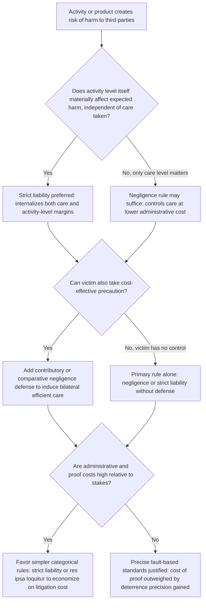

## Economic Goals and Functions of Tort Law

### Overview and Positioning Within Law and Economics

**Key Points**

- The economic analysis of tort law treats accident law primarily as a system of implicit pricing for risky activity, designed to induce parties to internalize the costs their conduct imposes on others.
- The foundational normative claim (Calabresi 1970; Posner 1972; Landes & Posner 1987; Shavell 1987) is that the central economic function of tort law is **minimization of the total social cost of accidents**, not corrective justice or moral desert per se, although these can coincide.
- Tort law is functionally an alternative (and complement) to markets, regulation, and insurance for controlling externalities arising from activities involving risk of physical or economic harm to third parties absent a contractual relationship.

### The Social Cost Minimization Objective

**Key Points**

- The dominant economic framework defines the goal of tort law as minimizing the sum of: (1) the costs of accidents (expected harm), (2) the costs of precaution (accident avoidance), and (3) the administrative costs of operating the liability system itself.
- This is Calabresi's tripartite cost framework, later formalized by Shavell as **social welfare = expected benefit of activity − expected accident costs − precaution costs − administrative costs**.

Formally, let $x$ denote the injurer's level of care (precaution), $c(x)$ the cost of care (increasing and convex, $c'>0, c''>0$), and $p(x)$ the probability of an accident occurring, decreasing in $x$ ($p'<0$). Let $L$ denote the magnitude of harm if an accident occurs. Total social cost is:

$$SC(x) = c(x) + p(x)L$$

The socially optimal (cost-minimizing) level of care $x^*$ solves:

$$\min_x \; c(x) + p(x)L \quad \Rightarrow \quad c'(x^*) = -p'(x^*)L$$

This is the **Learned Hand-type efficiency condition**: optimal care equates the marginal cost of additional precaution to the marginal reduction in expected accident losses it produces. This equation is the analytical backbone of nearly all subsequent tort economics.

### Function 1: Deterrence (Efficient Level and Efficient Activity Level)

**Key Points**

- Deterrence is generally identified as the primary economic function of tort law: liability rules are instruments for inducing injurers (and sometimes victims) to choose efficient levels of **care** and efficient **activity levels**.
- Care-level deterrence concerns how carefully an activity is conducted (e.g., how fast to drive); activity-level deterrence concerns how much of the activity to engage in at all (e.g., how many miles to drive, whether to operate a factory near a residential area).
- Shavell's key insight is that liability rules differ sharply in their capacity to control each margin: negligence rules control care well but poorly control activity levels (because a negligence-compliant injurer bears no liability regardless of how much of the activity they engage in), whereas strict liability controls both margins because the injurer internalizes expected harm at every unit of activity.

**Formal Activity-Level Extension**

Let $a$ denote the injurer's activity level, with accident probability $p(x,a)$ increasing in $a$ and benefit $b(a)$ increasing and concave. Social welfare is:

$$W(x,a) = b(a) - c(x) - p(x,a)L$$

Under a **negligence rule** with due-care standard $x^*$, an injurer who meets $x^*$ pays nothing regardless of $a$; the injurer thus privately maximizes $b(a) - c(x^*)$ with no accident-cost term, leading to **excessive activity level** relative to the social optimum whenever activity itself contributes to expected harm independent of care.

Under **strict liability**, the injurer bears $p(x,a)L$ at every activity level and internalizes:

$$\max_{x,a} \; b(a) - c(x) - p(x,a)L$$

which replicates the social planner's problem exactly, yielding efficient choices of both $x$ and $a$. **[Inference]** This asymmetry is a primary economic justification for strict liability in abnormally dangerous activities (e.g., blasting, hazardous waste transport) where activity level itself, not just care, is a major determinant of expected harm.

### Function 2: Loss (Risk) Spreading and Insurance

**Key Points**

- A secondary economic function is risk-spreading: tort law can shift losses from a victim (potentially risk-averse and un-diversified) to an injurer who is better positioned to insure or spread the loss across a customer base (e.g., a product manufacturer pricing insurance into unit cost).
- This function is in tension with the deterrence function: pure loss-spreading concerns are best served by insurance markets directly, and tort's comparative advantage is deterrence, not risk allocation, per Shavell and Priest's critiques of using tort primarily as social insurance.
- Under standard assumptions (risk-neutral injurers, insurance markets available to victims), the risk-spreading rationale for strict liability weakens considerably, since victims could self-insure at actuarially fair rates.

**[Inference]** The relative weight given to deterrence versus insurance functions in doctrine (e.g., enterprise liability rationales in products liability) reflects an implicit judgment that insurance markets for certain risks (catastrophic, low-probability harms) are incomplete or mispriced, making tort-based loss-spreading a second-best substitute.

### Function 3: Cost (Administrative) Minimization of the Liability System Itself

**Key Points**

- Administrative costs — litigation expenses, court operating costs, insurance transaction costs, claims processing — are a first-order component of the social cost function, not an afterthought.
- Rules that are cheaper to administer (e.g., simple strict liability requiring only proof of causation and harm) can be socially preferable to more "precise" but administratively costly rules (e.g., negligence requiring proof of the standard of care, breach, and counterfactual causation) even if the latter theoretically achieves marginally better deterrence.
- This trade-off explains doctrinal features such as res ipsa loquitur (reducing proof costs when direct evidence of negligence is unavailable) and categorical strict liability rules for specific activities (avoiding case-by-case reasonableness litigation).

Formally, total social cost should be restated to include administrative cost $A$:

$$SC = c(x) + p(x)L + A(\text{rule})$$

where $A(\cdot)$ varies systematically by liability regime — generally $A_{\text{strict liability}} < A_{\text{negligence}} < A_{\text{negligence with contributory negligence defenses}}$, because each additional element of proof required by a rule raises litigation cost.

### Function 4: Corrective Justice / Distributive Considerations (Non-Economic Counterpoint)

**Key Points**

- Corrective justice theory (Weinrib, Coleman) is the principal rival to the economic account: it holds that tort law's function is to rectify a wrongful imposition of loss between the specific injurer and victim (bipolar, backward-looking), not to minimize aggregate social cost (impersonal, forward-looking).
- Economic analysts generally treat corrective justice as descriptively compatible with efficiency in many doctrinal areas (the injurer/victim bipolarity is preserved by efficient liability rules assigning liability to the least-cost avoider) but argue efficiency, not corrective justice per se, provides the *justificatory* and *predictive* content of the doctrine.
- **[Speculation]** This remains an active jurisprudential dispute; the economic account is best understood as providing a positive (explanatory/predictive) theory of doctrine and a normative efficiency benchmark, not a claim that judges consciously reason in cost-benefit terms.

### The Least-Cost Avoider Principle

**Key Points**

- A unifying allocative principle across functions 1–3: liability should be assigned to whichever party (injurer or victim, or a specific party among multiple potential injurers) can avoid the accident at the lowest cost — the **least-cost avoider** (Calabresi's "cheapest cost avoider").
- This principle underlies bilateral care models (where both injurer and victim can take precaution), comparative negligence apportionment, and doctrines allocating liability along a supply chain (e.g., manufacturer versus retailer in products liability).

**Bilateral Care Extension**

With both injurer care $x$ and victim care $y$ affecting accident probability $p(x,y)$, social cost becomes:

$$SC(x,y) = c(x) + d(y) + p(x,y)L$$

where $d(y)$ is the victim's cost of care. The efficient outcome requires both parties simultaneously at their cost-minimizing levels $(x^*, y^*)$ satisfying the first-order conditions:

$$c'(x^*) = -p_x(x^*,y^*)L, \qquad d'(y^*) = -p_y(x^*,y^*)L$$

**[Inference]** A key result of bilateral-care models (Brown 1973) is that simple negligence and simple strict liability *each* fail to induce efficient care by *both* parties simultaneously; only rules incorporating a contributory or comparative negligence defense (negligence with a defense, or strict liability with contributory negligence) achieve bilateral efficiency in the standard model, which is a major economic explanation for why virtually all liability regimes pair a primary rule with a defense doctrine.

### Comparative Function of Major Liability Rules

| Rule | Controls Injurer Care | Controls Injurer Activity | Controls Victim Care | Administrative Cost |
| --- | --- | --- | --- | --- |
| No liability | No | No | Yes (bears own loss) | Lowest |
| Strict liability | Yes | Yes | No (unless contributory negligence defense added) | Low–Moderate |
| Negligence | Yes (at threshold $x^*$) | No | No (unless negligence rule applies to victim too) | Moderate–High |
| Negligence + contributory negligence | Yes | No | Yes | High |
| Strict liability + contributory negligence | Yes | Yes | Yes | Moderate |

**[Inference]** The strict-liability-with-contributory-negligence cell is frequently identified in the theoretical literature as dominating on pure efficiency grounds when both care and activity level matter on the injurer's side and care matters on the victim's side, which is consistent with its use in areas like abnormally dangerous activities coupled with assumption-of-risk-type defenses; real-world doctrinal choice also reflects administrative cost, distributive, and institutional-competence considerations beyond this static model.

### Diagrammatic Summary of the Cost-Minimization Framework

<svg xmlns="http://www.w3.org/2000/svg" viewBox="0 0 900 480" font-family="Helvetica, Arial, sans-serif">
<title>Social Cost Minimization in Tort Law (svg_diagram)</title>
<rect x="0" y="0" width="900" height="480" fill="#ffffff" />
<text x="450" y="30" text-anchor="middle" font-size="18" font-weight="bold" fill="#1a1a1a">Optimal Care Level: Marginal Cost of Care vs. Marginal Reduction in Expected Harm (svg_diagram)</text>
<line x1="90" y1="410" x2="850" y2="410" stroke="#333" stroke-width="2" />
<line x1="90" y1="410" x2="90" y2="60" stroke="#333" stroke-width="2" />
<text x="470" y="450" text-anchor="middle" font-size="14" fill="#333">Level of Care (x) →</text>
<text x="45" y="235" text-anchor="middle" font-size="14" fill="#333" transform="rotate(-90 45 235)">Cost</text>

<path d="M 110 400 Q 400 350 780 100" stroke="#c0392b" stroke-width="3" fill="none" />
<text x="600" y="150" font-size="13" fill="#c0392b" font-weight="bold">c(x): Cost of Precaution</text>

<path d="M 110 100 Q 400 200 780 390" stroke="#2471a3" stroke-width="3" fill="none" />
<text x="150" y="120" font-size="13" fill="#2471a3" font-weight="bold">p(x)L: Expected Accident Loss</text>

<path d="M 110 300 Q 400 240 780 300" stroke="#1e8449" stroke-width="4" fill="none" />
<text x="330" y="230" font-size="13" fill="#1e8449" font-weight="bold">SC(x) = c(x) + p(x)L (Total Social Cost)</text>

<circle cx="400" cy="255" r="6" fill="#1a1a1a" />
<line x1="400" y1="255" x2="400" y2="410" stroke="#1a1a1a" stroke-dasharray="4,4" />
<text x="400" y="430" text-anchor="middle" font-size="13" font-weight="bold" fill="#1a1a1a">x*</text>
</svg>

### Decision Logic: Which Economic Function Dominates Rule Selection

### Worked Numerical Illustration

**Example**

A factory's expected accident probability as a function of care spending $x$ (in $ thousands) is $p(x) = 0.5 - 0.04x$ for $x \in [0, 10]$, harm if an accident occurs is $L = \$200{,}000$, and the cost of care is $c(x) = 1000x^2$ (in dollars).

Total social cost: $SC(x) = 1000x^2 + (0.5 - 0.04x)(200{,}000)$

Taking the derivative and setting it to zero:

$$SC'(x) = 2000x - 0.04(200{,}000) = 2000x - 8000 = 0 \;\Rightarrow\; x^* = 4$$

At $x^* = 4$ (i.e., $4,000 spent on precaution), the factory achieves the cost-minimizing balance: marginal cost of additional care ($2000 \times 4 = \$8{,}000$) exactly equals the marginal reduction in expected harm ($0.04 \times \$200{,}000 = \$8{,}000$). A negligence rule setting the due-care standard at $x^*=4$ induces exactly this outcome if courts can observe and verify $x$; a strict liability rule induces the same $x^*$ automatically as the injurer's privately optimal choice, without requiring the court to determine the due-care standard at all — illustrating the informational economy strict liability offers when $x^*$ is difficult for courts to ascertain.

### Additional Functions Sometimes Cited in the Literature

**Key Points**

- **Information-forcing / signaling function**: tort litigation and liability exposure can generate and disseminate information about product or activity risks that would otherwise remain private, a function distinct from direct deterrence (e.g., mass tort litigation revealing latent defects).
- **Corrective pricing of externalities function**: tort liability can be understood as a decentralized Pigouvian mechanism, imposing on injurers a "price" (expected liability) approximating the marginal external cost of their activity, in lieu of direct regulation or taxation.
- **[Speculation]** Some law-and-economics scholars (e.g., in the "regulation versus litigation" debate) treat tort law's core economic function as filling gaps where ex ante regulation is too costly, too slow, or too informationally demanding for regulators, positioning tort as a complementary, adaptive, ex post regulatory instrument rather than a freestanding goal in itself; this remains a matter of institutional-design debate rather than settled consensus.

### Conclusion

The economic account of tort law identifies social cost minimization — the joint minimization of accident costs, precaution costs, and administrative costs — as its unifying objective, operationalized primarily through the deterrence function (correct incentives for care and activity level) and secondarily through loss-spreading and information-forcing functions. The Hand-formula-style efficiency condition $c'(x^*) = -p'(x^*)L$ and its bilateral-care and activity-level extensions provide the formal apparatus used throughout subsequent analysis of specific liability rules (negligence, strict liability, comparative fault) and doctrinal areas (products liability, medical malpractice, environmental torts).

**Related Topics**

- The Hand Formula and negligence standard of care
- Strict liability versus negligence: comparative efficiency analysis
- The least-cost avoider principle and comparative negligence
- Products liability and enterprise liability theory
- Activity-level effects and Shavell's deterrence model
- Punitive damages and the "optimal deterrence" multiplier
- Vicarious liability and judgment-proof injurers
- Class actions and mass torts as information-forcing mechanisms
- Regulation versus litigation as complementary or substitute deterrence instruments
- Insurance markets and moral hazard in tort compensation