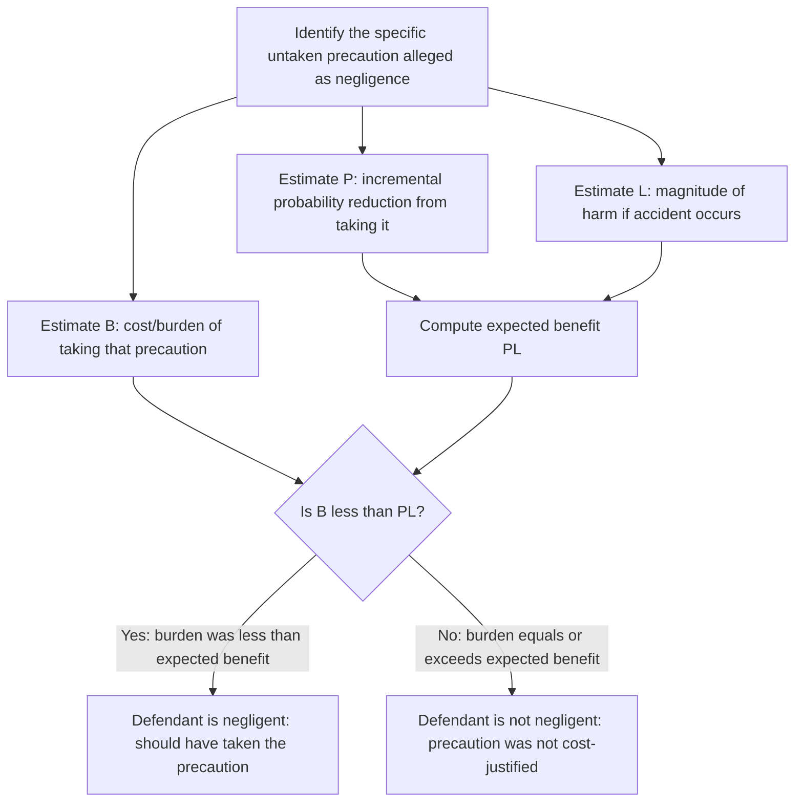

## The Learned Hand Formula and the Negligence Standard

### Origins and Doctrinal Statement

**Key Points**

- The Learned Hand Formula originates from Judge Learned Hand's opinion in *United States v. Carroll Towing Co.*, 159 F.2d 169 (2d Cir. 1947), a case concerning whether the absence of an attendant on a barge that broke loose and caused damage constituted negligence.
- Hand articulated negligence as a function of three variables: the probability that the conduct will result in injury ($P$), the gravity of the resulting injury if it occurs ($L$), and the burden of adequate precautions to avoid the injury ($B$).
- The doctrinal rule: a defendant is negligent if and only if the burden of precaution is less than the probability of harm multiplied by the magnitude of the harm, i.e., liability attaches when $B < PL$.

### The Formal Algebraic Statement

$$B < PL \;\Rightarrow\; \text{negligent (liable)}$$

$$B \geq PL \;\Rightarrow\; \text{not negligent (not liable)}$$

Where:

- $B$ = burden (cost) of the untaken precaution
- $P$ = incremental probability that the precaution would have prevented the accident
- $L$ = magnitude of loss if the accident occurs

This is a **marginal**, not average or total, comparison: $B$, $P$, and $L$ refer to the specific untaken precaution at issue in the case, not to the defendant's total spending on safety or the total risk of the activity. Courts and commentators sometimes conflate marginal and total/average formulations, which is a common source of misapplication.

### Equivalence to the Economic Optimal-Care Condition

**Key Points**

- The Hand Formula is the doctrinal, discrete-choice analogue of the continuous optimal-care condition derived in economic tort theory: $c'(x^*) = -p'(x^*)L$.
- Where the continuous model treats care $x$ as infinitely divisible and finds the interior optimum via calculus, the Hand Formula evaluates a specific, discrete untaken precaution and asks whether its cost was less than its expected benefit.

**Formal Correspondence**

Let $x$ be the injurer's chosen level of care, and consider a marginal increment $\Delta x$ representing "the precaution the defendant did not take." Define:

- $B \equiv c(x + \Delta x) - c(x)$ (incremental cost of the precaution)
- $PL \equiv [p(x) - p(x+\Delta x)]L$ (incremental reduction in expected loss)

The Hand Formula's negligence trigger $B < PL$ is precisely the statement that the defendant stopped short of the point where marginal cost equals marginal benefit — i.e., stopped short of $x^*$ where $c'(x^*) = -p'(x^*)L$. As $\Delta x \to 0$, the discrete Hand comparison converges exactly to the calculus first-order condition. This demonstrates that a court applying the Hand Formula correctly, with perfect information about $B$, $P$, and $L$, replicates the economically efficient (cost-minimizing) standard of care.

### Diagrammatic Illustration of the Marginal Logic

<svg viewBox="0 0 900 460" xmlns="http://www.w3.org/2000/svg" font-family="Helvetica, Arial, sans-serif">
<title>Hand Formula as Marginal Comparison at the Efficient Care Point (svg_diagram)</title>
<rect x="0" y="0" width="900" height="460" fill="#ffffff"/>
<text x="450" y="30" text-anchor="middle" font-size="18" font-weight="bold" fill="#1a1a1a">B versus PL Across Levels of Care (svg_diagram)</text>
<line x1="90" y1="400" x2="850" y2="400" stroke="#333" stroke-width="2"/>
<line x1="90" y1="400" x2="90" y2="60" stroke="#333" stroke-width="2"/>
<text x="470" y="440" text-anchor="middle" font-size="14" fill="#333">Level of Care (x) →</text>
<text x="45" y="230" text-anchor="middle" font-size="14" fill="#333" transform="rotate(-90 45 230)">Marginal Value</text>
<!-- Marginal B: rising -->
<path d="M 110 380 Q 400 300 780 100" stroke="#c0392b" stroke-width="3" fill="none"/>
<text x="600" y="150" font-size="13" fill="#c0392b" font-weight="bold">Marginal B (cost of next precaution)</text>
<!-- Marginal PL: falling -->
<path d="M 110 100 Q 400 260 780 380" stroke="#2471a3" stroke-width="3" fill="none"/>
<text x="150" y="120" font-size="13" fill="#2471a3" font-weight="bold">Marginal PL (benefit of next precaution)</text>
<!-- Intersection at x* -->
<circle cx="400" cy="280" r="6" fill="#1a1a1a"/>
<line x1="400" y1="280" x2="400" y2="400" stroke="#1a1a1a" stroke-dasharray="4,4"/>
<text x="400" y="420" text-anchor="middle" font-size="13" font-weight="bold" fill="#1a1a1a">x* (B = PL)</text>

<text x="200" y="410" text-anchor="middle" font-size="12" fill="`#c0392b`">Left of x*: B < PL → negligent zone</text>

<text x="680" y="410" text-anchor="middle" font-size="12" fill="`#2471a3`">Right of x*: B ≥ PL → non-negligent zone</text>

</svg>

### Decision Procedure for Applying the Formula

### Worked Numerical Example

**Example**

A warehouse owner did not install a $5,000 sprinkler system. Without it, there is a 2% annual chance of a fire causing $300,000 in damage; with it, the fire risk in a given year causing that damage falls to 0.5%.

- $B = \$5{,}000$ (annualized, or treated as a one-time cost compared against annualized expected loss — courts often implicitly annualize durable precautions, a frequently criticized simplification).
- $P = 0.02 - 0.005 = 0.015$ (incremental risk reduction)
- $L = \$300{,}000$
- $PL = 0.015 \times 300{,}000 = \$4{,}500$

Since $B (\$5{,}000) > PL (\$4{,}500)$, the precaution is not cost-justified under the formula: the warehouse owner is **not negligent** for failing to install the sprinkler system, because its cost exceeds its expected accident-cost reduction.

**[Inference]** If the sprinkler cost fell to $4{,}000 (e.g., due to a subsidized fire code compliance program), the same facts would flip the result to negligence, illustrating the formula's sensitivity to precise cost estimates — a major source of the formula's practical difficulty in litigation.

### The "Custom" and "Reasonable Person" Standards as Proxies

**Key Points**

- Before and alongside Hand's formulation, negligence doctrine relied on the "reasonable person" standard and evidence of industry custom as proxies for efficient care, without an explicit cost-benefit algorithm.
- Economically, custom can be understood as a decentralized aggregation mechanism: if an industry-wide practice survives competitive market pressure (firms bear the cost of their own liability and reputation), the surviving custom plausibly approximates $x^*$ — though this inference requires competitive markets, informed customers, and correctly priced liability exposure, conditions not always satisfied (cf. *The T.J. Hooper*, 60 F.2d 737 (2d Cir. 1932), where an entire industry's custom of not equipping tugs with radios was held insufficient to establish due care, because the custom itself may lag behind cost-justified technology).
- **[Inference]** *The T.J. Hooper* is frequently read as an earlier, less formalized articulation of the same cost-benefit logic Hand later made explicit — courts can override custom evidence when custom fails the underlying efficiency rationale.

### Application to Products Liability and the Risk-Utility Test

**Key Points**

- The "risk-utility test" used in design-defect products liability litigation (Restatement (Third) of Torts: Products Liability §2(b)) is structurally the Hand Formula applied to product design choices: a product design is defective if a reasonable alternative design existed whose omission renders the product not reasonably safe, implicitly comparing the cost of the alternative design ($B$) to the risk reduction it would have achieved ($PL$).
- This doctrinal convergence illustrates how the Hand Formula's marginal cost-benefit logic extends beyond ordinary negligence into strict-liability-labeled doctrines that nonetheless embed a negligence-like reasonableness inquiry at the design-defect stage.

### Critiques and Practical Limitations

**Key Points**

- **Measurement/valuation problem**: $L$ often includes non-market harms (pain and suffering, wrongful death, ecological damage) that are difficult to monetize reliably, and $P$ (incremental probability) is frequently unobservable or must be estimated from sparse statistical evidence, undermining the formula's claim to precise applicability.
- **Distributional and multiple-victim problems**: the basic formula as stated addresses a single victim/single precaution scenario; extending it to mass-harm or multiple-victim contexts requires aggregating $L$ across victims, which the simple $B < PL$ statement does not explicitly specify, though the underlying logic extends naturally by substituting $L$ with expected aggregate harm.
- **Hindsight bias**: because the formula is typically applied by a jury or judge ex post (after the accident has revealed which precaution "would have" prevented it), there is a structural risk that $P$ and $L$ are estimated with the benefit of hindsight, inflating apparent unreasonableness relative to the information the defendant actually possessed ex ante — a distinction courts formally require (an ex ante, not ex post, standard) but empirically may not always achieve. **[Speculation]** The extent of actual hindsight bias in jury and judicial application is an empirical, contested question studied in behavioral law and economics rather than a settled finding.
- **Non-monetizable and dignitary interests**: critics (particularly from the corrective justice tradition) argue the formula's aggregate cost-benefit framing is normatively inappropriate for harms implicating bodily autonomy or dignity, where a purely aggregative comparison may license imposing serious harm on an individual whenever it is "efficient" in the aggregate — a critique paralleling broader utilitarian-versus-deontological objections to cost-benefit analysis in law.
- **Formula does not by itself resolve activity level**: consistent with the broader deterrence literature, the Hand Formula as conventionally applied governs *how carefully* an activity is conducted, not *how much* of the activity should occur, so it inherits the activity-level limitation of negligence rules generally (see companion discussion of deterrence functions).

### Relationship to Comparative and Contributory Negligence

**Key Points**

- Where a jurisdiction applies contributory or comparative negligence, the Hand Formula is applied symmetrically to the plaintiff's own conduct: the plaintiff is contributorily/comparatively negligent if the plaintiff's own $B_{\text{victim}} < P_{\text{victim}}L_{\text{victim}}$ for a precaution the plaintiff failed to take.
- This symmetric application operationalizes the bilateral-care efficiency logic (see companion discussion of the least-cost avoider principle), allowing a single formula to be applied to both parties' conduct within one framework, with comparative fault statutes then apportioning damages according to relative fault percentages.

### Summary Table: Formula Components and Their Doctrinal/Economic Correlates

| Symbol | Doctrinal Meaning | Economic Correlate | Typical Evidentiary Source |
| --- | --- | --- | --- |
| $B$ | Burden of untaken precaution | Marginal cost of care, $c(x+\Delta x)-c(x)$ | Cost estimates, expert testimony |
| $P$ | Incremental probability precaution prevents harm | $-\Delta p(x)$ | Statistical/epidemiological evidence, expert testimony |
| $L$ | Magnitude of harm if accident occurs | Loss magnitude in $p(x)L$ term | Damages evidence, actuarial data |
| $B < PL$ | Negligence trigger | Failure to reach $x^*$ where $c'(x^*)=-p'(x^*)L$ | Jury/judge finding of fact |

### Conclusion

The Learned Hand Formula is the doctrinal crystallization of the economic optimal-care condition: it operationalizes "reasonable care" as the level of precaution at which marginal cost equals marginal expected benefit, converting the continuous calculus of $c'(x^*) = -p'(x^*)L$ into a discrete, litigable comparison of a specific untaken precaution's burden against its probability-weighted harm reduction. Its enduring significance in law and economics lies in demonstrating that negligence doctrine, developed independently of formal economic theory, converges precisely with the cost-minimizing standard that welfare-economic analysis derives from first principles — while its practical application remains constrained by well-documented measurement, hindsight, and valuation difficulties.

**Related Topics**

- Economic goals and functions of tort law (deterrence, loss-spreading, administrative cost minimization)
- Strict liability versus negligence: comparative efficiency analysis
- Risk-utility test in products liability design-defect claims
- *The T.J. Hooper* and the economic role of custom evidence
- Comparative and contributory negligence and bilateral care models
- Hindsight bias and behavioral law and economics critiques of cost-benefit standards
- Valuation of statistical life and non-market harms in tort damages
- Activity-level deterrence versus care-level deterrence
- Res ipsa loquitur and proof-cost economization
- Punitive damages as a supplement to compensatory deterrence