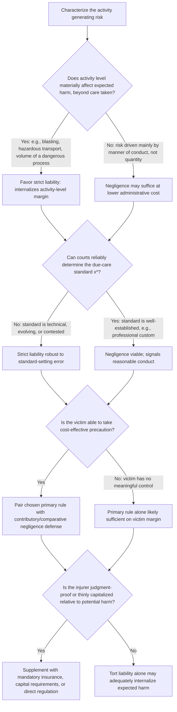

## Strict Liability versus Negligence Regimes

### Definitional Overview

**Key Points**

- **Negligence** conditions liability on the injurer's failure to meet a due-care standard $x^*$: the injurer pays damages only if actual care $x < x^*$; if $x \geq x^*$, the injurer pays nothing regardless of harm caused.
- **Strict liability** conditions liability solely on causation of harm: the injurer pays damages whenever an accident occurs and causes harm, regardless of the level of care exercised.
- Both are polar cases within a broader family of liability rules (negligence with contributory negligence, strict liability with contributory negligence, comparative negligence) that differ in which party bears residual loss and under what conditions.

### Formal Payoff Structure

Let $x$ = injurer's care, $c(x)$ = cost of care, $p(x)$ = accident probability (decreasing in $x$), $L$ = harm magnitude, and $x^*$ = the socially efficient care level solving $c'(x^*) = -p'(x^*)L$.

**Under negligence** (due-care standard set at $x^*$), the injurer's expected private cost is:

$$EC_{\text{negligence}}(x) = c(x) + \mathbb{1}[x < x^*] \cdot p(x)L$$

Because the indicator function drops the liability term entirely once $x \geq x^*$, the injurer's cost-minimizing choice is exactly $x = x^*$: any care above $x^*$ wastes resources with no offsetting liability benefit, and any care below $x^*$ triggers full expected liability. This produces a **discontinuity** at $x^*$ that is the doctrinal essence of the negligence rule.

**Under strict liability**, the injurer's expected private cost is:

$$EC_{\text{strict}}(x) = c(x) + p(x)L$$

which is identical to the social cost function $SC(x)$ itself. The injurer's privately optimal choice is therefore automatically $x^*$ — strict liability makes the injurer a residual claimant on the full social cost function.

**Central theoretical result**: under the standard unilateral-care model (only the injurer's care affects accident probability, injurer and victim are both risk-neutral, courts set $x^*$ correctly), **both rules induce identical, efficient injurer care**. The equivalence result is a foundational and frequently tested proposition in tort economics (Shavell 1980; Brown 1973).

### Where the Equivalence Breaks Down

**Key Points**

- The unilateral-care equivalence result depends on strong assumptions; relaxing any of them differentiates the two rules sharply. The major distinguishing dimensions are: (1) activity-level control, (2) bilateral (victim) care, (3) court error in setting the due-care standard, (4) administrative/proof cost, and (5) risk allocation under injurer/victim risk aversion or judgment-proof injurers.

#### 1. Activity-Level Control

Let $a$ = injurer's activity level, with $p(x,a)$ increasing in $a$ and injurer benefit $b(a)$.

- **Negligence**: an injurer who satisfies $x = x^*$ pays nothing at any activity level, so the injurer maximizes $b(a) - c(x^*)$, ignoring the accident-cost term entirely. This produces **excessive activity level** whenever activity level itself (independent of care) affects expected harm.
- **Strict liability**: the injurer internalizes $p(x,a)L$ at every activity level, replicating $\max_{x,a}\, b(a) - c(x) - p(x,a)L$, the social planner's problem — yielding efficient activity level as well as efficient care.

This is the single most robust theoretical argument for preferring strict liability in contexts where activity level is a first-order determinant of risk (e.g., blasting, hazardous transport, nuclear operation, volume of pesticide use).

#### 2. Bilateral Care (Victim Precaution)

With victim care $y$ also affecting $p(x,y)$:

- **Simple strict liability** (no contributory negligence defense) gives the victim zero private cost of accidents (fully compensated), so the victim has no incentive to take care — inducing $y=0$, generally inefficient.
- **Simple negligence** (no defense) similarly fails: since the injurer optimally sets $x=x^*$ regardless of $y$, the victim bears all uncompensated residual loss whenever the injurer meets $x^*$, so the victim is induced to take efficient care $y^*$ — meaning **simple negligence, unlike simple strict liability, does induce efficient victim care** in the standard model.
- Both rules paired with a **contributory/comparative negligence defense** (barring or reducing recovery if the victim failed to meet $y^*$) restore efficient bilateral care under either primary rule, which is why virtually every real-world liability regime pairs strict liability or negligence with some victim-side defense.

#### 3. Court Error in Setting the Due-Care Standard

- Negligence rules require courts to correctly identify $x^*$ ex post (via expert testimony, custom evidence, or Hand Formula analysis). Systematic court error (setting the standard too high or too low, or applying it inconsistently) directly distorts injurer incentives, since injurers respond to the *legal* standard, not the *true* social optimum.
- Strict liability requires no judicial determination of the correct standard of care at all — courts need only establish causation and harm — making it **informationally robust** to court error regarding $x^*$, at the cost of not directly signaling what conduct is or is not "reasonable."

#### 4. Administrative and Proof Costs

- Negligence litigation typically requires proof of the standard of care, breach, and often expert testimony — raising litigation cost per claim.
- Strict liability litigation requires only proof of causation and damages, generally reducing per-claim litigation cost, though it may increase the *number* of claims brought (since victims need not prove fault) and can shift costs into insurance pricing and claims administration instead of courtroom litigation.

#### 5. Risk-Bearing, Insurance, and Judgment-Proof Injurers

- If injurers are risk-averse or judgment-proof (assets insufficient to pay full expected liability, e.g., thinly capitalized firms), strict liability's requirement to internalize *all* accident costs at *all* activity levels can be undermined: a judgment-proof injurer's effective marginal liability is capped by its assets, reintroducing excessive activity level even under nominal strict liability.
- Under negligence, a judgment-proof injurer still faces full liability exposure only in the region below $x^*$; because compliant injurers pay nothing, judgment-proofness is less distortive to the *care* margin under negligence (though it remains a problem wherever it induces injurers below $x^*$ to under-invest, since expected liability is effectively capped).
- **[Inference]** This is a significant reason regulation (licensing, minimum capital/insurance requirements, direct safety standards) is often used as a complement to tort liability specifically for activities combining high potential harm with judgment-proof or thinly-capitalized injurers (e.g., mandatory insurance for common carriers, financial responsibility laws for motor vehicles).

### Comparative Table

| Dimension | Negligence | Strict Liability |
| --- | --- | --- |
| Injurer care (unilateral model) | Efficient (at $x^*$) | Efficient (at $x^*$) |
| Injurer activity level | Inefficient (excessive) | Efficient |
| Victim care (no defense) | Efficient | Inefficient (zero) |
| Victim care (with contributory negligence defense) | Efficient | Efficient |
| Requires court to determine $x^*$ | Yes | No |
| Robust to court error in setting standard | No | Yes |
| Litigation cost per claim | Higher (proof of breach) | Lower (causation/damages only) |
| Performance with judgment-proof injurer | Less distorted on care margin | Activity-level internalization undermined |
| Signals "reasonable" conduct to third parties | Yes | No |

### Diagrammatic Comparison

<svg xmlns="http://www.w3.org/2000/svg" viewBox="0 0 900 480" font-family="Helvetica, Arial, sans-serif">
<title>Injurer Private Cost Under Negligence versus Strict Liability (svg_diagram)</title>
<rect x="0" y="0" width="900" height="480" fill="#ffffff" />
<text x="450" y="30" text-anchor="middle" font-size="18" font-weight="bold" fill="#1a1a1a">Injurer's Expected Private Cost as a Function of Care (svg_diagram)</text>
<line x1="90" y1="410" x2="850" y2="410" stroke="#333" stroke-width="2" />
<line x1="90" y1="410" x2="90" y2="60" stroke="#333" stroke-width="2" />
<text x="470" y="450" text-anchor="middle" font-size="14" fill="#333">Level of Care (x) →</text>
<text x="45" y="235" text-anchor="middle" font-size="14" fill="#333" transform="rotate(-90 45 235)">Injurer Private Cost</text>

<path d="M 110 300 Q 400 220 780 320" stroke="#1e8449" stroke-width="4" fill="none" />
<text x="620" y="260" font-size="13" fill="#1e8449" font-weight="bold">EC_strict(x) = c(x) + p(x)L</text>

<path d="M 110 340 Q 300 250 400 235" stroke="#c0392b" stroke-width="4" fill="none" />
<path d="M 400 235 L 400 340" stroke="#c0392b" stroke-width="2" stroke-dasharray="3,3" />
<path d="M 400 340 Q 550 355 780 380" stroke="#c0392b" stroke-width="4" fill="none" />
<text x="180" y="300" font-size="13" fill="#c0392b" font-weight="bold">EC_negligence(x): discontinuous drop at x*</text>
<line x1="400" y1="60" x2="400" y2="410" stroke="#999" stroke-dasharray="4,4" />
<text x="400" y="430" text-anchor="middle" font-size="13" font-weight="bold" fill="#1a1a1a">x*</text>
<text x="400" y="60" text-anchor="middle" font-size="12" fill="#555">Both rules minimize private cost at x*</text>
</svg>

### Rule Selection Logic

### Worked Numerical Example: Divergence Through Activity Level

**Example**

A chemical transport firm chooses both a care level $x$ (cost $c(x) = 500x^2$) and an activity level $a$ (number of shipments per year, benefit $b(a) = 4000a - 50a^2$). Accident probability per shipment is $p(x,a) = (0.3 - 0.05x) \cdot a$ (harm probability scales with number of shipments), harm per accident $L = \$40{,}000$.

**Social planner's problem:** $\max_{x,a}\; 4000a - 50a^2 - 500x^2 - (0.3-0.05x)aL$

**Under negligence** with due-care standard $x^*$ correctly set, the firm meets $x^*$ and then maximizes activity ignoring the liability term entirely: $\max_a\; 4000a - 50a^2$, giving $a_{\text{negligence}} = 40$ — determined **without reference to accident costs at all**.

**Under strict liability**, the firm internalizes the full expected cost at every shipment, solving the same joint problem as the social planner, yielding a jointly optimal $(x^{**}, a^{**})$ pair in which $a^{**} < a_{\text{negligence}} = 40$, because the marginal shipment's expected liability cost is now weighed against its marginal benefit.

**[Inference]** This numerical structure illustrates concretely why negligence-compliant firms facing purely care-based liability standards can rationally over-produce the risky activity itself — the central Shavell critique of using unqualified negligence rules for activities where volume, not just manner, drives risk.

### Doctrinal Mapping to Real Liability Regimes

**Key Points**

- **Ultrahazardous/abnormally dangerous activities** (Restatement (Second) of Torts §520: blasting, toxic chemical storage, wild animal keeping) are strict liability categories, consistent with the activity-level rationale.
- **Products liability** (manufacturing defects) is predominantly strict liability, reflecting both activity-level logic (production volume) and administrative-cost logic (proving specific manufacturer negligence in mass production is often infeasible), while **design defects** typically retain a negligence-like risk-utility (Hand Formula) inquiry.
- **Ordinary negligence** (premises liability, professional malpractice, most accident law) remains the default, consistent with contexts where care/manner of conduct, not sheer activity volume, is the dominant risk determinant and courts can reasonably ascertain a due-care standard via custom or expert testimony.
- **Workers' compensation** systems replace tort negligence with a no-fault, strict-liability-like scheme layered with statutory caps, reflecting distinct administrative-cost and insurance-function priorities (see companion discussion of loss-spreading functions) rather than pure deterrence optimization.

### Critiques and Extensions

**Key Points**

- **[Speculation]** Some scholars argue the sharp theoretical dichotomy between negligence and strict liability overstates real-world divergence, since negligence standards are frequently set with reference to industry-wide activity-level norms (indirectly capturing some activity-level discipline) and strict liability regimes routinely incorporate negligence-like defenses (contributory negligence, assumption of risk, comparative fault), blurring the polar cases described by the formal models.
- Behavioral critiques note that both models assume injurers accurately perceive $p(x)$ or $p(x,a)$ and respond rationally to expected liability; probability neglect, optimism bias, and misperception of low-probability/high-severity risks can undermine the incentive equivalence predicted by either rule. **[Speculation]** The magnitude of this effect is empirically contested and likely varies by injurer sophistication (e.g., repeat corporate defendants versus individual actors).
- Insurance market interactions (experience rating, moral hazard, adverse selection) can restore or undermine incentive effects predicted by either liability rule depending on how accurately insurers price risk, an area studied extensively in the law-and-economics literature on liability insurance.

### Conclusion

The negligence/strict-liability comparison is the central applied result of the economic theory of accident law: under idealized unilateral-care conditions the two rules are formally equivalent in inducing efficient injurer care, but they diverge sharply once activity-level effects, bilateral (victim) care, court error in standard-setting, administrative cost, and injurer solvency are introduced. Strict liability dominates where activity level is a significant, independent driver of risk and where courts face difficulty ascertaining an accurate due-care standard; negligence dominates where administrative cost economy and clear signaling of a "reasonable" standard are more valuable and where activity-level effects are secondary. Real-world liability regimes overwhelmingly combine a primary rule (either negligence or strict liability) with a contributory or comparative negligence defense specifically to restore efficient incentives on both sides of the accident.

**Related Topics**

- The Learned Hand Formula and the negligence standard
- Economic goals and functions of tort law
- Activity-level deterrence and Shavell's bilateral model
- Products liability: manufacturing versus design defects
- Comparative negligence and bilateral care efficiency
- Judgment-proof problem and mandatory insurance/financial responsibility laws
- Abnormally dangerous activities (Restatement (Second) of Torts §520)
- Vicarious liability and enterprise liability theory
- Workers' compensation as a no-fault alternative regime
- Liability insurance, moral hazard, and experience rating