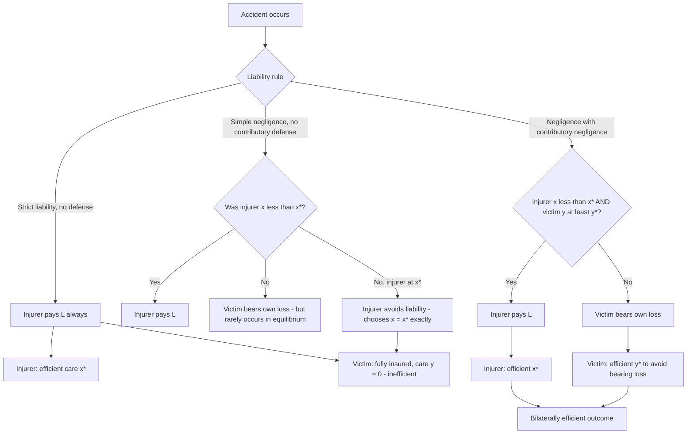

## Bilateral Precaution and Activity-Level Effects

### Conceptual Overview

Bilateral precaution refers to accident settings in which **both** the injurer and the victim can take actions that reduce the probability or magnitude of an accident. This contrasts with unilateral-care models (where only the injurer's behavior affects accident risk) and substantially complicates the design of efficient liability rules, since a rule that gives the injurer correct incentives may give the victim incorrect ones, and vice versa.

**Activity level** refers to a distinct margin of choice: how *much* of a given activity to engage in (miles driven, hours operated, units produced), as opposed to how much *care* to exercise per unit of activity (speed, precautions, inspection intensity). The joint treatment of care levels and activity levels is one of the central analytical contributions of the economic analysis of tort law, originating with Guido Calabresi and formalized by Steven Shavell.

### The Basic Model: Notation and Structure

Let:

- $x$ = injurer's level of care (cost $= x$, in monetized units)
- $y$ = victim's level of care (cost $= y$)
- $p(x, y)$ = probability of an accident, with $\partial p/\partial x < 0$ and $\partial p/\partial y < 0$ (more care by either party reduces accident probability)
- $L$ = magnitude of loss if an accident occurs (assumed fixed for simplicity in the base model)
- $s$ = injurer's activity level
- $z$ = victim's activity level

**Social cost function** (the planner's objective, to be minimized):

$$SC(x, y) = x + y + p(x,y) \cdot L$$

The **socially efficient (first-best) care levels** $x^*, y^*$ satisfy the first-order conditions:

$$\frac{\partial p(x^*, y^*)}{\partial x} \cdot L = -1 \quad \text{and} \quad \frac{\partial p(x^*, y^*)}{\partial y} \cdot L = -1$$

That is, each party should increase care until the marginal cost of an additional unit of care equals the marginal reduction in expected accident loss it produces. This is the standard **Learned Hand Formula** condition ($B = PL$ at the margin), extended to two simultaneous choice variables.

### Why Bilateral Care Breaks Simple Liability Rules

**Key Points**

- Under **strict liability** (injurer always pays $L$ when an accident occurs, regardless of victim's care), the injurer bears the full expected cost of their own care choice and will choose $x^*$ efficiently — but the victim, fully compensated for any loss, bears **no residual cost from an accident** and has no incentive to take care at all ($y = 0$), which is inefficient whenever $\partial p/\partial y < 0$.
- Under simple **negligence with no contributory negligence defense** (injurer pays $L$ only if $x < x^*$, i.e., the injurer failed to meet the due-care standard), the injurer chooses exactly $x^*$ (just enough to avoid liability) — but the victim, once again fully compensated whenever an accident occurs (since the injurer failed to meet the standard is not the typical case in equilibrium, but even so the victim internalizes no marginal loss when the injurer is *at* the standard), tends toward the same inefficient under-investment problem as strict liability, because the injurer meeting the due-care standard removes the victim's incentive to also take precaution.
- The solution: **negligence with a defense of contributory negligence** (or **comparative negligence**) — the injurer is liable only if $x < x^*$ *and* the victim exercised at least $y^*$; otherwise the victim bears their own loss. This dual-standard rule, remarkably, induces **both** parties to choose the efficient care level simultaneously, because each party's liability exposure depends on meeting their own due-care threshold given that the other party meets theirs.

**[Inference]** The claim that contributory-negligence-based negligence rules achieve full bilateral efficiency is a well-established result in the standard Shavell/Landes-Posner framework under idealized assumptions (courts can accurately observe and set $x^*, y^*$, parties are risk-neutral, information is complete). This is a modeling result, not an empirical claim about real courts' ability to set due-care standards accurately.

### Table: Liability Rules and Bilateral Care Incentives

| Rule | Injurer's Incentive | Victim's Incentive | Bilaterally Efficient? |
| --- | --- | --- | --- |
| No liability | None (externality fully unpriced) | Full (bears all loss) | No — injurer under-invests |
| Strict liability | Full (bears all loss) | None (fully compensated) | No — victim under-invests |
| Negligence (no contributory defense) | Efficient ($x=x^*$) | None once injurer meets standard | No — victim under-invests |
| Negligence + contributory negligence | Efficient ($x=x^*$) | Efficient ($y=y^*$) | Yes (in the baseline model) |
| Strict liability + contributory negligence | Efficient ($x=x^*$) | Efficient ($y=y^*$) | Yes (in the baseline model) |
| Comparative negligence | Efficient (generally) | Efficient (generally) | Yes, under standard assumptions |

**[Inference]** Strict liability with a contributory negligence defense and negligence with a contributory negligence defense both achieve bilateral efficiency in the canonical model, differing mainly in how they allocate risk/loss distribution at the margin (who bears loss when both parties are at the due-care standard) rather than in the efficiency of care incentives — this equivalence result depends on specific assumptions about damage measurement and risk neutrality and can break down once activity levels, judgment-proof risk, or litigation costs are introduced.

### Diagram: Bilateral Care Incentive Structure

### Activity-Level Effects: The Second Margin

The bilateral care model above holds activity levels ($s$, $z$) fixed. But real accident risk also scales with **how much** of an activity occurs — more vehicle-miles driven, more units of a hazardous chemical produced, more hours of machine operation. The **social cost function**, once activity is included, becomes:

$$SC(x, y, s, z) = s \cdot x + z \cdot y + s \cdot z \cdot p(x,y) \cdot L - B_s(s) - B_z(z)$$

where $B_s(s)$ and $B_z(z)$ represent the private benefit each party derives from their respective activity levels (this formulation is illustrative; functional forms vary across treatments).

**Key Points**

- A crucial and often counter-intuitive result: **negligence rules, even with a contributory negligence defense, generally fail to give injurers efficient activity-level incentives**, because the negligence standard is typically defined only over the *care* dimension ($x$), not the *activity* dimension ($s$). An injurer who meets the due-care standard escapes liability *regardless of how much they engage in the activity* — so they have no incentive to reduce activity level even when doing so would be efficient.
- **Strict liability, by contrast, does give the injurer efficient activity-level incentives**, because the injurer internalizes the full expected accident cost, which scales with activity level, at every margin — including the decision of how much to engage in the activity at all.
- Symmetrically, under strict liability the **victim** has no incentive to moderate their own activity level (since they are compensated for losses), while under a negligence-based regime with contributory negligence, the **victim's** activity-level incentives are typically efficient (since they bear residual risk), but the **injurer's** are not.

This produces a fundamental **asymmetry**: no single simple liability rule (pure strict liability, pure negligence, or negligence-with-contributory-negligence) achieves efficiency on all four margins ($x, y, s, z$) simultaneously in the standard bilateral model. This is one of the most important — and most frequently tested — insights of the economic analysis of tort law (Shavell 1980; Landes & Posner 1987).

### Table: Four-Margin Efficiency Summary

| Rule | Injurer Care ($x$) | Injurer Activity ($s$) | Victim Care ($y$) | Victim Activity ($z$) |
| --- | --- | --- | --- | --- |
| Strict liability | Efficient | Efficient | Inefficient (too low) | Inefficient (too high) |
| Negligence + contributory negligence | Efficient | Inefficient (too high) | Efficient | Efficient |

**[Inference]** No listed rule achieves efficiency across all four cells simultaneously — this "impossibility" within simple, single-dimensional liability rules is a canonical result, and much of the subsequent literature (on rules incorporating activity-level-sensitive negligence standards, or hybrid/multi-part liability schemes) is devoted to addressing this gap, though real-world doctrinal solutions are only partial.

### Example: Trucking Company and Local Residents

**Example**

A trucking company's activity level is the number of delivery trips per week ($s$); its care level is driver training and vehicle maintenance intensity ($x$). Local residents' activity level is how often they walk or bike near the depot ($z$); their care level is attentiveness while crossing ($y$).

- Under **strict liability**, the trucking company internalizes the full expected accident cost of *both* its care and its trip frequency — so it will choose an efficient number of weekly trips, not just efficient training. Residents, however, being fully compensated for any injury, may walk near the depot more than is efficient and pay less attention while doing so.
- Under **negligence with contributory negligence**, the trucking company will invest in efficient driver training (to meet the due-care standard) but has no liability-based reason to reduce trip frequency, since trip frequency is not part of the negligence standard courts typically evaluate — courts ask "was the driver careful?" not "was the company operating too many trucks?" Residents, by contrast, bearing residual risk, have efficient incentives on both their attentiveness and how often they choose to walk near the depot.

This example illustrates why activity-level externalities (traffic volume, industrial output levels, extraction rates) are often addressed through **regulation** (permits, quotas, zoning) or **Pigouvian taxation** rather than tort liability alone — tort law's negligence apparatus is structurally better suited to the care margin than the activity margin.

### Diagram: Activity Level vs. Care Level as Independent Margins (svg_diagram)

<svg xmlns="http://www.w3.org/2000/svg" viewBox="0 0 650 420">
<text x="325" y="25" text-anchor="middle" font-size="16" font-weight="bold" fill="#1a1a1a">Care vs. Activity Level Matrix (svg_diagram)</text>

<line x1="100" y1="370" x2="600" y2="370" stroke="#333" stroke-width="2" />
<line x1="100" y1="370" x2="100" y2="60" stroke="#333" stroke-width="2" />
<text x="350" y="400" text-anchor="middle" font-size="13" fill="#1a1a1a">Care Level (x, y) — how carefully</text>
<text x="40" y="215" text-anchor="middle" font-size="13" fill="#1a1a1a" transform="rotate(-90 40 215)">Activity Level (s, z) — how much</text>

<line x1="350" y1="60" x2="350" y2="370" stroke="#999" stroke-dasharray="4" />
<line x1="100" y1="215" x2="600" y2="215" stroke="#999" stroke-dasharray="4" />

<text x="225" y="140" text-anchor="middle" font-size="12" fill="`#1a1a1a`">Low care,</text>

<text x="225" y="155" text-anchor="middle" font-size="12" fill="`#1a1a1a`">low activity</text>

<text x="475" y="140" text-anchor="middle" font-size="12" fill="`#1a1a1a`">High care,</text>

<text x="475" y="155" text-anchor="middle" font-size="12" fill="`#1a1a1a`">low activity</text>

<text x="225" y="295" text-anchor="middle" font-size="12" fill="`#1a1a1a`">Low care,</text>

<text x="225" y="310" text-anchor="middle" font-size="12" fill="`#1a1a1a`">high activity</text>

<text x="475" y="295" text-anchor="middle" font-size="12" fill="`#1a1a1a`">High care,</text>

<text x="475" y="310" text-anchor="middle" font-size="12" fill="`#1a1a1a`">high activity</text>

<rect x="350" y="60" width="250" height="310" fill="#a3d9a5" fill-opacity="0.3" />
<text x="475" y="80" text-anchor="middle" font-size="11" fill="#2e7d32">Negligence standard reaches here</text>

<rect x="100" y="60" width="500" height="310" fill="none" stroke="#1565c0" stroke-width="3" stroke-dasharray="6" />
<text x="325" y="55" text-anchor="middle" font-size="11" fill="#1565c0">Strict liability internalizes full plane</text>
</svg>

### Extensions and Refinements

**Damage-magnitude endogeneity**

The base model treats $L$ as fixed, but many real accidents involve **variable severity** that also depends on care and activity (e.g., driving speed affects both probability and severity of collision). When $L = L(x, y)$ is itself a choice-sensitive variable, the Learned Hand condition generalizes to account for marginal reductions in expected severity, not just probability, but the qualitative bilateral-care and activity-level conclusions above are generally preserved.

**Judgment-proof injurers**

If the injurer's assets are less than the potential loss $L$ (judgment-proofing), strict liability's activity-level advantage weakens, since the injurer's effective liability exposure is capped at their asset level regardless of activity level. This is a major justification in the literature for supplementing tort liability with **ex ante regulation**, **mandatory insurance requirements**, or **minimum capital requirements** for hazardous activities — regulation directly controls the activity-level margin that liability, once capped by limited assets, cannot efficiently address.

**Causal/但-for uncertainty and evidentiary limits**

**[Inference]** Courts' practical inability to observe and verify activity levels precisely (unlike care, which can sometimes be evidenced by maintenance records, training logs, etc.) is frequently cited as a structural reason negligence doctrine has evolved to focus on care rather than activity — this is a plausible institutional explanation offered in the literature, though it is not the only proposed explanation and is difficult to test directly.

**Comparative negligence and activity levels**

Comparative negligence (apportioning damages by relative fault, as opposed to the all-or-nothing contributory negligence rule) generally preserves the same qualitative care-level efficiency results as contributory negligence in the standard risk-neutral model, but the activity-level asymmetry documented above persists under comparative negligence as well, since apportionment still typically evaluates only the care dimension.

### Empirical and Doctrinal Notes

**[Unverified]** The extent to which real-world negligence doctrine has evolved *informally* to capture some activity-level considerations — for instance, through doctrines like "excessive speed" liability, common carrier heightened duties, or ultrahazardous-activity strict liability categories (which effectively convert certain high-activity-risk categories to strict liability) — is a matter of ongoing doctrinal and empirical debate, and the degree of real-world efficiency achieved is not settled by the theoretical model alone.

The doctrine of **strict liability for abnormally dangerous (ultrahazardous) activities** (Restatement (Second) of Torts §520) can be understood through this activity-level lens: activities like blasting, storing explosives, or operating certain industrial processes are subjected to strict liability precisely because activity-level control (how much blasting, how much storage) is a more important margin than simple care, and negligence-based rules would systematically under-regulate the quantity of the dangerous activity.

### Related Topics

- Learned Hand Formula and the unilateral care model
- Strict liability vs. negligence: general comparative efficiency analysis
- Judgment-proof problem and mandatory liability insurance
- Products liability and market-level activity effects
- Pigouvian taxation as a substitute for tort liability on the activity margin
- Contributory vs. comparative negligence: doctrinal and efficiency comparison
- Ultrahazardous activities and Restatement (Second) of Torts §520
- Vicarious liability and employer activity-level incentives