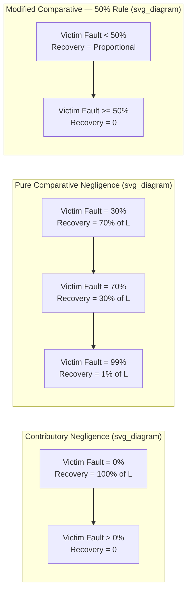

## Contributory and Comparative Negligence Rules

### Definitional Overview

Contributory and comparative negligence rules are legal doctrines that allocate liability between an injuring party (injurer) and an injured party (victim) when both parties' behavior contributed to an accident. These doctrines modify the baseline negligence rule by asking not only whether the injurer took adequate care, but also whether the victim did.

- **Contributory negligence (traditional rule):** If the victim's own negligence contributed to the injury in any degree, the victim is barred entirely from recovery, regardless of the injurer's degree of fault.
- **Comparative negligence:** Liability (and damages) is apportioned between injurer and victim according to their relative degrees of fault, allowing partial recovery even when the victim was partly at fault.

These rules matter because most accidents are "bilateral care" problems: both the injurer and the victim can take precautions that reduce the probability or severity of an accident (e.g., a driver's speed and a pedestrian's attentiveness). The choice of liability rule determines whether both parties face efficient incentives to take care.

---

### The Bilateral Care Model

The standard law-and-economics framework (Brown 1973; Shavell 1987) models an accident as a function of care levels chosen by both the injurer and the victim.

**Key Points**

- Let $x$ = injurer's level of care, $y$ = victim's level of care
- Let $p(x, y)$ = probability of accident, decreasing in both $x$ and $y$
- Let $L$ = magnitude of loss if an accident occurs
- Let $w(x)$ and $z(y)$ = cost of care to injurer and victim, respectively
- Social cost function:

$$SC(x, y) = w(x) + z(y) + p(x, y)L$$

- Efficient (cost-minimizing) care levels $x^*$ and $y^*$ satisfy the first-order conditions:

$$w'(x^*) = -p_x(x^*, y^*)L, \quad z'(y^*) = -p_y(x^*, y^*)L$$

- That is, each party should take care up to the point where the marginal cost of additional care equals the marginal reduction in expected accident loss it produces.

The central question for tort design is: **which liability rule induces both parties, acting independently and self-interestedly, to choose $x^*$ and $y^*$?**

---

### Contributory Negligence Rule

**Definition:** Under pure contributory negligence, the victim recovers damages from a negligent injurer only if the victim was not negligent. If the victim failed to meet the due-care standard $y^*$, the victim recovers nothing — even if the injurer was grossly negligent.

**Decision Rule**

$$\text{Injurer pays } L \text{ if } (x < x^*) \text{ and } (y \geq y^*); \quad \text{otherwise injurer pays } 0$$

**Incentive Analysis**

- **Injurer's incentive:** Facing liability only when negligent, the injurer minimizes $w(x) + p(x, y)L \cdot \mathbb{1}[x<x^*]$. The injurer's dominant strategy is to set $x = x^*$ exactly, since meeting the standard eliminates liability entirely at the lowest possible care cost.
- **Victim's incentive:** Because meeting the due-care standard $y^*$ shields the victim from bearing accident losses at the margin (once the victim clears the bar, the injurer is the residual bearer if negligent, and if the injurer is non-negligent, the victim bears $L$ regardless of care above $y^*$), the victim's incentive is also to set $y = y^*$ — since any negligence forfeits recovery entirely, and any care above $y^*$ is wasted cost.
- **Result:** Contributory negligence, in the simple bilateral-care model with a correctly-set legal standard, induces **both parties to take efficient care** — an important and somewhat counterintuitive result. This is often called the "double efficiency" property of contributory negligence.

**Practical and Distributive Problems**

- **All-or-nothing harshness:** A victim who is even 1% at fault recovers $0$, while an injurer who is 99% at fault pays nothing. This offends common intuitions of fairness and can produce inequitable outcomes in individual cases.
- **Sensitivity to standard-setting accuracy:** The efficiency result depends on courts correctly identifying $x^*$ and $y^*$. If courts set the standard incorrectly, or if there is uncertainty/noise in how courts assess care, both parties may over- or under-invest.
- **Jury nullification / sympathy bias:** Juries facing an all-or-nothing outcome for a sympathetic but partly-at-fault plaintiff may distort factual findings (e.g., understating plaintiff negligence) to avoid a harsh result — undermining the doctrine's clean incentive properties in practice. [Inference — based on well-documented behavioral patterns in jury studies, though the magnitude varies by jurisdiction and case type]
- **Historical dominance and decline:** Contributory negligence was the majority rule in U.S. common law through the mid-20th century but has been abandoned by most U.S. states in favor of comparative negligence since the 1960s–1980s. As of the present, only a small number of U.S. jurisdictions (e.g., Alabama, Maryland, North Carolina, Virginia, and Washington D.C.) retain pure contributory negligence.

---

### Comparative Negligence Rule

Comparative negligence apportions damages according to each party's relative share of fault, rather than an all-or-nothing bar. There are several distinct variants.

#### Pure Comparative Negligence

The victim recovers damages reduced in proportion to their own fault share, no matter how large that share is.

$$\text{Victim's recovery} = L \times (1 - \text{victim's fault share})$$

**Example**

If a court finds the injurer 30% at fault and the victim 70% at fault, and total loss $L = \$100{,}000$, the victim recovers $\$30{,}000$ from the injurer under pure comparative negligence.

#### Modified Comparative Negligence (Two Sub-Variants)

- **"50% rule" (equal-or-lesser-fault bar):** Victim recovers a proportional share only if the victim's fault is *less than* the injurer's (i.e., victim fault $< 50\%$). If victim fault reaches 50% or more, recovery is barred entirely.
- **"51% rule" (not-greater-than bar):** Victim recovers as long as victim fault does not *exceed* injurer fault (victim fault $\leq 50\%$); barred only if victim fault is strictly greater than 50%.

These modified rules are the most common in U.S. states today, with pure comparative negligence and pure contributory negligence each used in a minority of jurisdictions.

**Incentive Analysis**

- **Injurer's incentive under pure comparative negligence:** The injurer bears a fraction of $L$ proportional to their own fault share whenever the injurer is negligent (fault-based liability with apportionment). Because the injurer's expected liability still depends on being found negligent or not (i.e., on crossing the $x^*$ threshold), the injurer's incentive to reach $x^*$ remains similar to the contributory negligence case **in the standard model with negligence-based fault-finding** — the injurer still wants to avoid being found negligent altogether, since a negligence finding triggers liability exposure.
- **Victim's incentive:** Because the victim now bears a **share** of the loss proportional to fault even when not "at fault" in a binary sense, and recovers a **reduced but positive** amount even when partly negligent, the victim also retains an incentive to invest in care to reduce their own fault share and the probability of injury. Under the standard model with accurately assessed fault shares, comparative negligence can also support efficient care by both parties, though the result is **more sensitive to how "fault share" is measured** than the binary threshold approach of contributory negligence. [Inference — the equivalence-of-efficiency result across contributory and comparative regimes is a standard finding in the theoretical literature (e.g., Rea 1987; Cooter & Ulen), but empirical efficiency in practice depends on litigation and fact-finding accuracy]

**Practical and Distributive Advantages**

- **Proportionality reduces harsh, seemingly unfair outcomes:** Both parties bear costs roughly proportional to fault, which aligns better with lay intuitions of corrective justice.
- **Reduces jury distortion incentives:** Because outcomes are less extreme, juries have less incentive to skew factual findings to avoid all-or-nothing results.
- **Costs:** Apportioning fault percentages is itself often difficult, adds litigation cost and unpredictability, and can generate inconsistent outcomes across similar cases due to jury discretion in assigning fault shares. [Unverified] — the magnitude of this added litigation cost relative to contributory negligence regimes is not something with a single settled empirical figure across jurisdictions.

---

### Comparative Diagram: Recovery as a Function of Victim Fault Share

---

### Recovery Function Visualization

<svg xmlns="http://www.w3.org/2000/svg" viewBox="0 0 640 380" font-family="Helvetica, Arial, sans-serif">
<text x="320" y="24" text-anchor="middle" font-size="16" font-weight="bold">Victim Recovery vs. Victim Fault Share (svg_diagram)</text>

<line x1="70" y1="320" x2="580" y2="320" stroke="black" stroke-width="1.5" />
<line x1="70" y1="320" x2="70" y2="50" stroke="black" stroke-width="1.5" />

<text x="325" y="355" text-anchor="middle" font-size="13">Victim Fault Share (%)</text>

<text x="25" y="185" text-anchor="middle" font-size="13" transform="rotate(-90 25 185)">Recovery (% of L)</text>

<text x="70" y="335" text-anchor="middle" font-size="11">0</text>

<text x="325" y="335" text-anchor="middle" font-size="11">50</text>

<text x="580" y="335" text-anchor="middle" font-size="11">100</text>

<text x="55" y="324" text-anchor="end" font-size="11">0</text>

<text x="55" y="185" text-anchor="end" font-size="11">50</text>

<text x="55" y="54" text-anchor="end" font-size="11">100</text>

<line x1="70" y1="50" x2="580" y2="320" stroke="#2166ac" stroke-width="2.5" />
<text x="420" y="150" font-size="11" fill="#2166ac">Pure Comparative</text>

<line x1="70" y1="50" x2="72" y2="50" stroke="#b2182b" stroke-width="2.5" />
<line x1="72" y1="50" x2="72" y2="320" stroke="#b2182b" stroke-width="2.5" stroke-dasharray="3,3" />
<line x1="72" y1="320" x2="580" y2="320" stroke="#b2182b" stroke-width="2.5" />
<text x="120" y="70" font-size="11" fill="#b2182b">Contributory (drops to 0 at any fault)</text>

<line x1="70" y1="50" x2="325" y2="185" stroke="#1a9850" stroke-width="2.5" />
<line x1="325" y1="185" x2="326" y2="320" stroke="#1a9850" stroke-width="2.5" stroke-dasharray="3,3" />
<line x1="326" y1="320" x2="580" y2="320" stroke="#1a9850" stroke-width="2.5" />
<text x="380" y="220" font-size="11" fill="#1a9850">Modified (50% bar)</text>
</svg>

---

### The Last Clear Chance Doctrine (Mitigating Device)

A common-law exception developed to soften the harshness of contributory negligence: even if the victim was negligent, the victim can still recover if the injurer had the "last clear chance" to avoid the accident and failed to take it.

**Key Points**

- Effectively shifts liability back to the injurer when the injurer was the least-cost avoider at the final decision point before the accident.
- Economically, this can be understood as a sequential-care refinement: when care decisions are not truly simultaneous, the party with the last opportunity to avoid harm at low cost should bear liability for failing to do so, restoring efficient incentives that a rigid contributory-negligence bar would otherwise blunt.
- Largely rendered obsolete in jurisdictions that adopted comparative negligence, since apportionment already captures relative fault without needing a separate doctrine.

---

### Efficiency Comparison Table

| Feature | Contributory Negligence | Pure Comparative Negligence | Modified Comparative (50%/51%) |
| --- | --- | --- | --- |
| Victim recovery if partly at fault | None | Proportional to injurer's fault share | Proportional, unless victim fault exceeds threshold |
| Theoretical efficiency (both parties, standard model) | Efficient if standard set correctly | Efficient if fault shares assessed correctly | Efficient below threshold; distorted incentives near threshold |
| Litigation complexity | Lower (binary determination) | Higher (fault-share apportionment) | Higher (fault-share plus threshold determination) |
| Perceived fairness | Harsh, all-or-nothing | Proportional, seen as fairer | Intermediate |
| Dominant U.S. usage today | Minority (a few jurisdictions) | Minority | Majority of states |

---

### Threshold Effects and Strategic Behavior

**Key Points**

- Modified comparative negligence with a 50% or 51% threshold creates a **discontinuity** in expected recovery right at the threshold — a victim just below the bar recovers a substantial share, while a victim just above recovers nothing.
- This discontinuity can create strategic incentives in litigation: parties have strong incentives to argue over fault allocation specifically around the threshold, since a shift of a few percentage points can mean the difference between substantial recovery and zero. [Inference — a straightforward implication of the discontinuous payoff structure, though the extent to which real litigants and juries actually behave this way is an empirical question with mixed evidence in the litigation-behavior literature]
- Pure comparative negligence avoids this discontinuity, producing smoother incentives, but at the cost of allowing recovery even for grossly negligent victims (e.g., a victim 95% at fault still recovers 5% of losses).

---

### Application to Activity Levels

The bilateral care model above focuses on "care levels" (precaution intensity) but tort economics also distinguishes **activity levels** (how much of a risky activity a party engages in, e.g., miles driven, hours operating machinery).

**Key Points**

- A key finding in the law-and-economics literature (Shavell 1980) is that no simple negligence-based rule — including standard contributory or comparative negligence — induces efficient **activity levels** for both parties simultaneously, because a party who meets the due-care standard for precaution faces no liability at the margin and thus has no incentive to reduce activity level even when that would be efficient.
- This is sometimes cited as a fundamental limitation of negligence-based bilateral care rules (including all negligence-with-defense variants) relative to strict liability with a contributory/comparative negligence defense, which can restore some activity-level incentives for the injurer while preserving victim incentives through the defense.

---

### Strict Liability with Contributory/Comparative Negligence Defense

**Key Points**

- Courts and statutes sometimes combine strict liability for the injurer with a contributory or comparative negligence defense for the victim (common in products liability and abnormally dangerous activities).
- Under this hybrid: the injurer is liable for all accidents regardless of fault (addressing the injurer's activity-level incentive), but the victim's recovery is reduced or barred based on the victim's own negligence (addressing the victim's care-level incentive).
- This hybrid can, in principle, achieve efficient incentives for both care and activity level for both parties simultaneously — a result not generally available under pure negligence-based regimes. [Inference — standard theoretical result from the tort economics literature (Shavell), contingent on accurate court assessment of victim's due-care standard]

---

### Empirical and Comparative Notes

- International practice varies: many civil-law jurisdictions (e.g., most of continental Europe) have long used comparative-fault apportionment, while contributory negligence's strict bar was historically more associated with English and American common law.
- U.S. state-by-state variation is substantial: this is one of the clearest examples in American law of different states running, in effect, parallel natural experiments with different liability rules for similar accident types (e.g., automobile collisions), providing empirical researchers opportunities to study effects on litigation rates, settlement behavior, and insurance costs. [Unverified] — while such studies exist in the empirical law-and-economics literature, specific quantitative findings (e.g., effect sizes on litigation rates) vary by study and are not summarized here as a single settled figure.

---

### Related Topics

- Strict liability vs. negligence rule (efficiency comparison)
- The Hand Formula and the negligence standard $B < PL$
- Activity level incentives in tort law
- Products liability and design defect standards
- Joint and several liability vs. several (proportionate) liability
- Judgment-proof problem and liability rule design
- Insurance, moral hazard, and the interaction with negligence defenses
- Damages caps and their interaction with comparative fault apportionment
- Law and economics of causation (cause-in-fact, proximate cause)
- Settlement bargaining under asymmetric information in comparative fault regimes