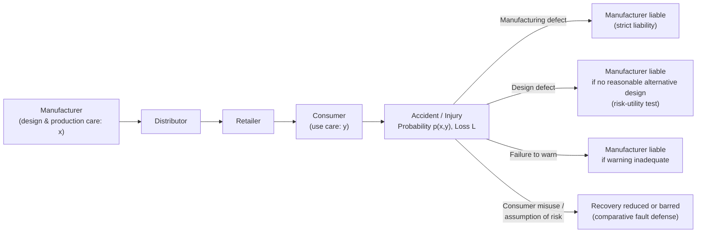

## Products Liability and Manufacturer Incentives

### Definitional Overview

Products liability is the body of tort law governing a manufacturer's or seller's responsibility for injuries caused by defective products. Economically, the central question is which liability rule — negligence, strict liability, or some hybrid — induces manufacturers to invest efficiently in product safety, and how consumer behavior (product use, precaution, and purchasing decisions) interacts with that incentive structure.

Unlike the two-party accident model of general tort law, products liability typically involves a **long causal chain**: manufacturer → distributor → retailer → consumer, with information asymmetries at every link. This structural feature drives much of the economic analysis.

---

### The Basic Bilateral Model Applied to Products

**Key Points**

- Let $x$ = manufacturer's investment in product safety (design and manufacturing care)
- Let $y$ = consumer's care in using the product
- Let $p(x, y)$ = probability of an accident, decreasing in both
- Let $L$ = magnitude of harm if an accident occurs
- Social cost:

$$SC(x, y) = w(x) + z(y) + p(x, y)L$$

- As in general accident law, efficiency requires both manufacturer and consumer to internalize the marginal effect of their own care on expected accident costs. The three dominant liability regimes — negligence, strict liability, and strict liability with a contributory/comparative negligence defense — produce different incentive patterns, as detailed below.

---

### Regime 1: Negligence-Based Products Liability

Under a negligence standard, the manufacturer is liable only if it failed to meet a due-care standard $x^*$ in design, manufacture, or warnings.

**Key Points**

- If courts can accurately observe and verify $x$, the manufacturer's dominant strategy is to meet $x^*$ exactly (minimizing $w(x)$ while avoiding liability).
- **Information problem:** Courts often cannot directly observe a manufacturer's actual design process or precautions taken; they infer negligence from the product's condition after the fact, which is a much noisier signal than direct observation of a driver's speed, for instance.
- **Consumer's incentive:** Facing residual risk when the manufacturer is non-negligent, and no liability protection when the manufacturer is negligent (assuming no contributory negligence issue), the consumer bears the incentive to take efficient precautions in most non-liability states — analogous to general negligence-with-defense-analysis.
- **Practical shift away from pure negligence:** Historically (early-to-mid 20th century United States), products liability was governed by negligence plus privity requirements (*MacPherson v. Buick*, 1916, eliminated the privity bar). Courts subsequently moved toward strict liability for defective products (*Greenman v. Yuba Power Products*, 1963; **Restatement (Second) of Torts §402A**, 1965) due to persistent proof difficulties under negligence.

---

### Regime 2: Strict Products Liability

Under strict liability, the manufacturer is liable for harm caused by a defective product regardless of whether it exercised due care in production.

**Key Points**

- **Categories of defect** commonly recognized (Restatement (Third) of Torts: Products Liability, 1998):
  - **Manufacturing defect:** product deviates from its intended design (e.g., a contaminated batch).
  - **Design defect:** the product's design itself is unreasonably dangerous, typically assessed via a risk-utility test (whether a reasonable alternative design existed) rather than pure strict liability in most modern U.S. jurisdictions.
  - **Warning/marketing defect (failure to warn):** inadequate instructions or warnings about non-obvious risks.

**Economic Rationale for Strict Liability in Products Context**

- **Information asymmetry:** Manufacturers possess vastly superior information about production processes, defect rates, and risk compared to consumers or courts — a classic **least-cost information-gatherer** argument for shifting liability onto the manufacturer.
- **Least-cost avoider / least-cost insurer:** Manufacturers are typically better positioned than individual consumers to (a) identify and eliminate defects at the design/production stage, and (b) spread residual risk through pricing and product liability insurance across the entire consumer base (loss-spreading rationale, prominently associated with Guido Calabresi's *The Costs of Accidents*, 1970).
- **Activity-level incentives:** As in the general Shavell (1980) result, strict liability gives the manufacturer an incentive to internalize the full expected accident cost of production and sales *volume*, not merely of design-level care — addressing the activity-level gap left by pure negligence rules.

**Manufacturer's Decision Problem Under Strict Liability**

$$\min_x \; w(x) + p(x, y)L$$

The manufacturer internalizes the full expected liability cost as a function of its own care choice, holding consumer behavior $y$ as given (or as anticipated in equilibrium), leading to efficient investment in $x$ — **provided $L$ is correctly measured and the manufacturer is not judgment-proof.**

---

### Regime 3: Strict Liability with Comparative/Contributory Negligence Defense

Most modern U.S. jurisdictions apply strict products liability but reduce or bar recovery when the consumer misused the product or failed to exercise reasonable care (analogous to comparative negligence apportionment, or complete bars for certain misuse defenses).

**Key Points**

- This hybrid is generally understood in the literature as the regime most capable of producing efficient incentives on **both** margins simultaneously:
  - Manufacturer bears full expected liability → efficient design care and efficient production/activity level.
  - Consumer's recovery is reduced by their own fault share → efficient incentive for consumer care and proper use.
- **Defenses commonly available:**
  - **Assumption of risk:** consumer knowingly and voluntarily encountered a known danger.
  - **Product misuse:** consumer used the product in an unforeseeable or unintended manner.
  - **Comparative fault:** apportionment of damages by relative fault share, as in general tort law (see prior chapter item on contributory/comparative negligence).

---

### The Risk-Utility Test for Design Defects

Because pure strict liability for *design* defects can be economically problematic (nearly any product design involves some risk-utility tradeoff, and "strict" liability for design would effectively make manufacturers insurers against all product risk), most U.S. jurisdictions apply a risk-utility balancing test resembling a **negligence-style Hand Formula** rather than true strict liability.

**Key Points**

- Common formulation (Restatement (Third) §2(b)): a product is defectively designed if the foreseeable risks could have been reduced by a **reasonable alternative design (RAD)**, and the omission renders the product not reasonably safe.
- This closely parallels the **Hand Formula**: $B < PL$, where $B$ = burden/cost of the alternative design, $P$ = probability reduction, $L$ = loss magnitude.
- Economically, this reintroduces negligence-style reasoning at the design-defect stage even within a formally "strict liability" cause of action — a point often noted as a conceptual tension in products liability doctrine. [Inference — widely discussed in the law-and-economics literature (e.g., Polinsky & Shavell) as a doctrinal convergence between "strict" design-defect liability and negligence, though courts and commentators differ on how strictly the RAD requirement functions in practice across jurisdictions]

---

### Diagram: Products Liability Causal Chain and Liability Allocation

---

### Diagram: Incentive Allocation Across Regimes

<svg xmlns="http://www.w3.org/2000/svg" viewBox="0 0 660 340" font-family="Helvetica, Arial, sans-serif">
<text x="330" y="24" text-anchor="middle" font-size="16" font-weight="bold">Incentive Coverage by Liability Regime (svg_diagram)</text>

<text x="230" y="55" text-anchor="middle" font-size="12" font-weight="bold">Manufacturer</text>

<text x="450" y="55" text-anchor="middle" font-size="12" font-weight="bold">Consumer</text>

<text x="60" y="100" font-size="12">Negligence</text>

<text x="60" y="170" font-size="12">Strict Liability</text>

<text x="60" y="240" font-size="12">Strict Liability +</text>

<text x="60" y="255" font-size="12">Comparative Defense</text>

<text x="180" y="72" text-anchor="middle" font-size="10">Care</text>

<text x="280" y="72" text-anchor="middle" font-size="10">Activity Level</text>

<text x="450" y="72" text-anchor="middle" font-size="10">Care</text>

<circle cx="180" cy="95" r="12" fill="#1a9850" />
<text x="180" y="99" text-anchor="middle" font-size="12" fill="white">✓</text>
<circle cx="280" cy="95" r="12" fill="#b2182b" />
<text x="280" y="99" text-anchor="middle" font-size="12" fill="white">✗</text>
<circle cx="450" cy="95" r="12" fill="#1a9850" />
<text x="450" y="99" text-anchor="middle" font-size="12" fill="white">✓</text>

<circle cx="180" cy="165" r="12" fill="#1a9850" />
<text x="180" y="169" text-anchor="middle" font-size="12" fill="white">✓</text>
<circle cx="280" cy="165" r="12" fill="#1a9850" />
<text x="280" y="169" text-anchor="middle" font-size="12" fill="white">✓</text>
<circle cx="450" cy="165" r="12" fill="#b2182b" />
<text x="450" y="169" text-anchor="middle" font-size="12" fill="white">✗</text>

<circle cx="180" cy="247" r="12" fill="#1a9850" />
<text x="180" y="251" text-anchor="middle" font-size="12" fill="white">✓</text>
<circle cx="280" cy="247" r="12" fill="#1a9850" />
<text x="280" y="251" text-anchor="middle" font-size="12" fill="white">✓</text>
<circle cx="450" cy="247" r="12" fill="#1a9850" />
<text x="450" y="251" text-anchor="middle" font-size="12" fill="white">✓</text>

<text x="330" y="300" text-anchor="middle" font-size="11" fill="#555">✓ = efficient incentive supported | ✗ = incentive gap</text>

<text x="330" y="318" text-anchor="middle" font-size="10" fill="#777">(Standard bilateral-care model; assumes accurate court fact-finding)</text>

</svg>

---

### The Judgment-Proof Problem in Products Liability

**Key Points**

- If a manufacturer's assets (or insurance coverage) are less than the expected liability from its activity, the manufacturer is "judgment-proof" beyond that amount and will systematically **under-invest** in safety and **over-produce** relative to the efficient level, since it does not bear the full marginal expected cost of accidents above its asset/insurance ceiling.
- This is a particularly salient issue for undercapitalized manufacturers, shell entities, or manufacturers who go bankrupt post-injury (a recurring issue in mass-tort litigation such as asbestos and certain pharmaceutical cases).
- Partial remedies discussed in the literature: minimum insurance/bonding requirements, minimum capital requirements, extending liability up the distribution chain (retailer or distributor liability) to a party with sufficient assets. [Inference — these are standard theoretical responses to the judgment-proof problem discussed by Shavell and others; the specific regulatory adoption of any given remedy is jurisdiction-dependent and not asserted here as universal practice]

---

### Learned Intermediary Doctrine (Pharmaceutical/Medical Products)

**Key Points**

- A specialized doctrine in prescription drug and medical device liability: the manufacturer's duty to warn is satisfied by adequately warning the **prescribing physician**, rather than the end patient directly, on the theory that the physician is the informed intermediary who translates general risk information into a patient-specific recommendation.
- Economically, this reflects an efficient allocation of the warning function to the **least-cost communicator** — the physician has patient-specific information the manufacturer lacks, making the physician better positioned to tailor risk disclosure.
- Subject to exceptions (e.g., direct-to-consumer marketing contexts and certain vaccine/mass-immunization contexts in some jurisdictions), where courts have questioned whether the traditional intermediary rationale still holds when manufacturers market directly to patients. [Unverified — the scope of these exceptions varies significantly by jurisdiction and is an active area of doctrinal development rather than a settled uniform rule]

---

### Punitive Damages and Deterrence in Products Cases

**Key Points**

- Punitive damages in products liability are economically justified (in the deterrence framework) primarily where compensatory damages alone would **under-deter**, such as when:
  - Some fraction of injuries go undetected or unlitigated (multiplier logic: if only a fraction $q$ of injuries result in suit, efficient deterrence requires damages of roughly $L/q$ rather than $L$).
  - The manufacturer engaged in conscious disregard of known risk (egregious conduct rationale, distinct from pure under-detection logic).
- Landmark cases illustrating punitive damages disputes in products contexts include *Grimshaw v. Ford Motor Co.* (1981, Ford Pinto fuel-tank case) and *BMW of North America v. Gore* (1996, U.S. Supreme Court limits on punitive damages ratios).
- The U.S. Supreme Court has imposed constitutional due-process limits on punitive damages ratios relative to compensatory damages (*State Farm v. Campbell*, 2003, suggesting single-digit ratios as a general guidepost, though not a rigid mathematical cap). [Inference — courts describe this as a guidepost rather than a bright-line rule, and application varies by case]

---

### Market-Based Critiques and the Coase Theorem Objection

**Key Points**

- A prominent law-and-economics critique (associated with scholars like Richard Epstein and, in different form, Chicago-school analyses) argues that in markets with reasonably well-informed consumers, **market forces alone** (reputation, warranties, price signals) could achieve efficient safety levels without tort liability, echoing Coasean bargaining logic: if transaction costs are low and consumers understand risk, contract and market mechanisms could allocate risk efficiently, making liability rules a matter of default-rule design rather than pure market correction.
- The counter-argument, dominant in mainstream products liability economics, emphasizes **information asymmetry and bounded rationality**: consumers frequently cannot accurately assess low-probability, high-severity risks (e.g., latent defects, long-latency harms like certain chemical exposures), undermining the informed-market assumption and justifying liability as a corrective mechanism. This debate remains unresolved as a normative matter and reflects differing empirical assumptions about consumer information-processing rather than a settled factual question. [Speculation as to which view is "more correct" is avoided here; both are established, actively-defended positions in the literature]

---

### Empirical Considerations

- Empirical products liability research has examined effects on: new product introduction rates, pharmaceutical R&D investment, "defensive" over-warning (excessive warnings that reduce their informational value — sometimes called "warning fatigue" or the over-warning problem), and insurance cost pass-through to consumer prices.
- Findings across this literature are mixed and highly context-dependent by industry and time period; no single universally-agreed quantitative estimate of products liability's net welfare effect exists in the literature. [Unverified] — presented here as a general characterization of the state of empirical disagreement, not as a specific verifiable statistic.

---

### Related Topics

- Strict liability vs. negligence rule (general efficiency comparison)
- Reasonable alternative design (RAD) test and the Hand Formula
- Judgment-proof problem and mandatory insurance/bonding solutions
- Punitive damages and the deterrence multiplier
- Class actions and mass tort litigation economics
- Learned intermediary doctrine and information-cost allocation
- Regulatory compliance as a defense (preemption doctrine)
- Warranty law and contractual risk allocation as an alternative to tort
- Behavioral law and economics: consumer risk misperception
- Insurance markets and loss-spreading rationale (Calabresi)