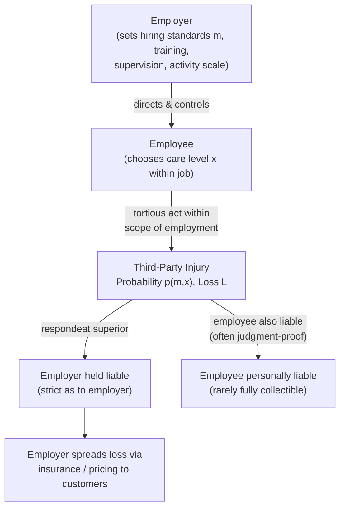

## Vicarious Liability and Enterprise Liability

### Definitional Overview

Vicarious liability is the legal doctrine under which one party (typically an employer or principal) is held liable for the tortious acts of another (typically an employee or agent) even though the liable party did not itself commit the wrongful act. The most common form is **respondeat superior** ("let the master answer"), which holds employers liable for torts committed by employees acting within the scope of employment.

Enterprise liability is the broader economic theory underlying vicarious liability: that the costs of accidents arising from an enterprise's activities should be borne by the enterprise itself (and ultimately spread across its customers, workers, and shareholders) rather than falling on the individual employee-tortfeasor or an uncompensated victim, because the enterprise is better positioned to prevent, insure against, and internalize those costs.

---

### Core Doctrinal Elements

**Key Points**

- **Respondeat superior** requires: (1) an employer-employee (or principal-agent) relationship, and (2) the tortious act occurred within the "scope of employment."
- **Scope of employment** tests vary by jurisdiction but generally examine: whether the act was of the kind the employee was employed to perform, occurred substantially within authorized time and space limits, and was motivated at least in part by a purpose to serve the employer (the classic *Restatement (Second) of Agency §228* formulation).
- **Frolic vs. detour distinction:** A "detour" (minor deviation from assigned duties) generally remains within the scope of employment; a "frolic" (substantial departure for purely personal purposes) generally does not, relieving the employer of vicarious liability for that period.
- Vicarious liability is a form of **strict liability as to the employer** — the employer need not have been personally negligent (e.g., in hiring or supervision) for liability to attach; it suffices that the employee was negligent and acting within scope. This is distinct from direct employer liability theories like negligent hiring or negligent supervision, which require proof of the employer's own fault.

---

### Economic Rationale: Why Impose Liability on a Non-Injuring Party?

The central puzzle vicarious liability poses for law-and-economics analysis: efficient deterrence normally suggests liability should fall on the party best positioned to prevent the harm — here, the employee who committed the act. Several economic justifications explain why liability is nonetheless extended to the employer.

#### 1. Judgment-Proof Employee Problem

**Key Points**

- Individual employees typically have far fewer assets than the enterprise they work for, and may lack liability insurance. If liability were limited to the employee alone, the employee would frequently be "judgment-proof" — unable to pay a judgment that exceeds their assets.
- A judgment-proof injurer does not fully internalize the expected cost of their own negligence (their expected liability is capped at their asset level, not the true expected harm $pL$), leading to **systematic under-deterrence**.
- By extending liability to the employer (whose assets typically exceed the expected judgment), vicarious liability restores full internalization of expected accident costs, because the employer, through its control over the employee (via monitoring, training, hiring, and discipline), can influence the probability of the tortious act $p$ even though the employer did not commit the act itself.

$$\text{Employer's expected cost} = w(m) + p(m)L$$

where $m$ = employer's monitoring/screening/training investment and $w(m)$ its cost. Because the employer internalizes $p(m)L$ in full (assuming employer assets exceed $L$), the employer has an incentive to invest efficiently in $m$ — even though the *employer* never directly chooses the employee's moment-to-moment care level.

#### 2. Least-Cost Avoider / Control Rationale

**Key Points**

- The employer typically has superior ability, relative to the injured third party (and often relative to what a court can extract from the individual employee), to control the conditions of the tortious act: hiring standards, training programs, supervision intensity, equipment provided, incentive structures, and work-pace pressures that may induce risk-taking.
- Even though the employer does not choose each specific act, the employer sets the **institutional environment** (screening rigor, training quality, workload, safety culture) that determines the probability distribution of employee negligence — the employer is thus a genuine, if indirect, cost-avoider.

#### 3. Loss-Spreading / Insurance Rationale

**Key Points**

- Enterprises, unlike individual employees, can spread the cost of accidents across a large customer base via product/service pricing, and can purchase liability insurance more efficiently (lower transaction costs, better risk pooling) than individual workers typically can.
- This is the same loss-spreading logic (Calabresi) that partly underlies strict products liability: risk-bearing costs are minimized when losses are diffused across many risk-neutral or risk-averse parties rather than concentrated on a single judgment-proof individual.

#### 4. Activity-Level Internalization

**Key Points**

- As with the general Shavell (1980) activity-level result, imposing liability on the employer for the *scope* of activities it directs gives the employer an incentive to consider the accident-cost consequences not just of how carefully each task is performed, but of **how much of the risky activity to undertake** — e.g., how large a delivery fleet to operate, how many overtime hours to schedule, how aggressively to pursue tight delivery deadlines that increase accident risk.
- An employee, by contrast, has essentially no control over the *scale* of the employer's overall operations, so vicarious liability shifts activity-level incentives to the party actually capable of responding to them.

---

### Diagram: Vicarious Liability Causal and Incentive Structure

---

### Enterprise Liability Theory: Extensions Beyond Employment

**Key Points**

- **Enterprise liability** as a broader jurisprudential concept (associated with scholars like Gregory Keating and, in tort history, the mid-20th-century "enterprise liability" movement that also influenced strict products liability's development) argues that any enterprise generating a *predictable stream* of accident risk as a byproduct of its normal operations should bear the cost of that risk as a **cost of doing business**, rather than externalizing it onto individual victims or judgment-proof agents.
- This logic extends the reasoning beyond direct employer-employee relationships to related doctrines:
  - **Non-delegable duties:** certain inherently hazardous activities (e.g., use of independent contractors for ultrahazardous work) cannot be contracted away to avoid liability, because the enterprise directing the work is deemed the appropriate cost-bearer regardless of the formal employment relationship.
  - **Apparent/ostensible agency:** liability extended to a principal (e.g., a franchisor or hospital) for the acts of a nominally independent contractor (e.g., franchisee, emergency-room physician) when the principal held the agent out as its own representative, on the theory that the principal is still the effective enterprise controlling the risk-generating context.
  - **Successor liability in corporate transactions:** in some jurisdictions and circumstances, an acquiring company may bear liability for a predecessor's defective products under a "product line" or "continuity of enterprise" theory, extending enterprise-liability logic across corporate reorganizations. [Unverified — successor liability doctrines vary substantially by jurisdiction and are one of the more contested extensions of enterprise-liability theory, not a uniformly adopted rule]

---

### Independent Contractor Exception and Its Economic Tension

**Key Points**

- Traditionally, vicarious liability does **not** extend to the acts of independent contractors (as opposed to employees), because the hiring party lacks the same degree of control over an independent contractor's work methods.
- Economically, this creates a **moral hazard / avoidance incentive**: firms may have an incentive to structure relationships as independent-contractor arrangements specifically to shed vicarious liability exposure, even where the underlying activity and risk profile is functionally similar to an employment relationship (a live and much-litigated issue in the "gig economy" context — e.g., rideshare and delivery platform classification disputes).
- Courts and legislatures have responded with various control-based, economic-realities, or hybrid tests (e.g., the "ABC test" adopted in some U.S. states for certain purposes) to determine worker classification, reflecting the underlying policy tension between contractual freedom and enterprise-liability cost-internalization goals. [Inference — this characterization of firms' incentives to route around vicarious liability via contractor classification is a standard economic observation in the literature and in policy debates, though firms cite multiple business rationales beyond liability avoidance for contractor arrangements, and motive is inherently difficult to verify empirically in any given case]

---

### Diagram: Liability Allocation Across Worker-Classification Structures

<svg xmlns="http://www.w3.org/2000/svg" viewBox="0 0 660 300" font-family="Helvetica, Arial, sans-serif">
<text x="330" y="24" text-anchor="middle" font-size="16" font-weight="bold">Vicarious Liability Exposure by Worker Classification (svg_diagram)</text>

<rect x="40" y="60" width="220" height="180" rx="8" fill="#e6f2e6" stroke="#1a9850" stroke-width="2" />
<text x="150" y="85" text-anchor="middle" font-size="13" font-weight="bold">Employee</text>
<text x="150" y="110" text-anchor="middle" font-size="11">High employer control</text>
<text x="150" y="130" text-anchor="middle" font-size="11">over work methods</text>
<text x="150" y="160" text-anchor="middle" font-size="12" font-weight="bold" fill="#1a9850">Employer vicariously liable</text>
<text x="150" y="180" text-anchor="middle" font-size="11">(if within scope</text>
<text x="150" y="198" text-anchor="middle" font-size="11">of employment)</text>

<rect x="400" y="60" width="220" height="180" rx="8" fill="#fbe9e7" stroke="#b2182b" stroke-width="2" />
<text x="510" y="85" text-anchor="middle" font-size="13" font-weight="bold">Independent Contractor</text>
<text x="510" y="110" text-anchor="middle" font-size="11">Low hiring-party control</text>
<text x="510" y="130" text-anchor="middle" font-size="11">over work methods</text>
<text x="510" y="160" text-anchor="middle" font-size="12" font-weight="bold" fill="#b2182b">Hiring party generally</text>
<text x="510" y="178" text-anchor="middle" font-size="12" font-weight="bold" fill="#b2182b">NOT vicariously liable</text>
<text x="510" y="198" text-anchor="middle" font-size="11">(exceptions: non-delegable</text>
<text x="510" y="216" text-anchor="middle" font-size="11">duties, apparent agency)</text>

<text x="330" y="150" text-anchor="middle" font-size="24">⇄</text>

<text x="330" y="175" text-anchor="middle" font-size="10" fill="#555">Contested classification</text>

<text x="330" y="190" text-anchor="middle" font-size="10" fill="#555">zone (e.g., gig economy)</text>

</svg>

---

### Punitive Damages and Vicarious Liability

**Key Points**

- Whether punitive damages can be imposed vicariously on an employer for an employee's egregious conduct is a distinct and more contested question than compensatory vicarious liability.
- Many jurisdictions apply a stricter standard for vicarious punitive damages — e.g., requiring that a **managerial agent** authorized, participated in, or ratified the conduct, or that the employer was itself reckless in hiring/retention (reflecting the **Restatement (Second) of Torts §909** approach) — rather than imposing punitive damages purely vicariously for a low-level employee's conduct.
- Economically, this reflects a judgment that punitive damages' deterrence function is best aimed at parties who had genuine decision-making control over the underlying misconduct, whereas compensatory vicarious liability's loss-spreading and judgment-proof rationales apply regardless of managerial involvement.

---

### Comparison: Vicarious Liability vs. Direct Enterprise Negligence

| Feature | Vicarious Liability (respondeat superior) | Direct Employer Negligence (e.g., negligent hiring/supervision) |
| --- | --- | --- |
| Employer fault required? | No (strict as to employer) | Yes — employer's own negligence must be proven |
| Triggering condition | Employee tort within scope of employment | Employer's own failure to screen, train, or supervise |
| Applies to independent contractors? | Generally no | Can apply even to contractor relationships in some cases |
| Primary economic rationale | Judgment-proof problem, loss-spreading, activity-level control | Standard negligence-based deterrence of employer's own choices |
| Punitive damages availability | Restricted (often requires managerial involvement) | Follows ordinary punitive damages standards for employer's own conduct |

---

### Interaction with Workers' Compensation Systems

**Key Points**

- Vicarious liability (a third-party tort doctrine) operates alongside, but is analytically distinct from, workers' compensation systems, which are no-fault schemes compensating employees themselves for workplace injuries in exchange for the employee's surrender of the right to sue the employer in tort (the "compensation bargain").
- Economically, workers' compensation addresses the employer-employee accident-cost internalization problem directly (through mandatory insurance and experience-rated premiums that give employers a continuous incentive to invest in workplace safety), while vicarious liability addresses the **employee-third-party** accident-cost problem (protecting the general public from employee-caused harms), so the two doctrines are complementary rather than substitutes, covering different classes of potential victims. [Inference — the analytical division into "employee protection" and "third-party protection" functions is a standard framing in the tort/workers'-comp economics literature, though the historical development and precise doctrinal boundary between the two systems varies by jurisdiction]

---

### Related Topics

- Judgment-proof problem and mandatory insurance solutions
- Strict liability vs. negligence rule (general efficiency comparison)
- Workers' compensation systems and experience rating
- Independent contractor classification tests (control test, economic realities test, ABC test)
- Punitive damages and the deterrence multiplier
- Corporate veil piercing and limited liability's interaction with tort claims
- Franchise liability and apparent agency doctrine
- Products liability and manufacturer incentives
- Insurance markets, moral hazard, and loss-spreading rationale (Calabresi)
- Non-delegable duty doctrine in ultrahazardous activities