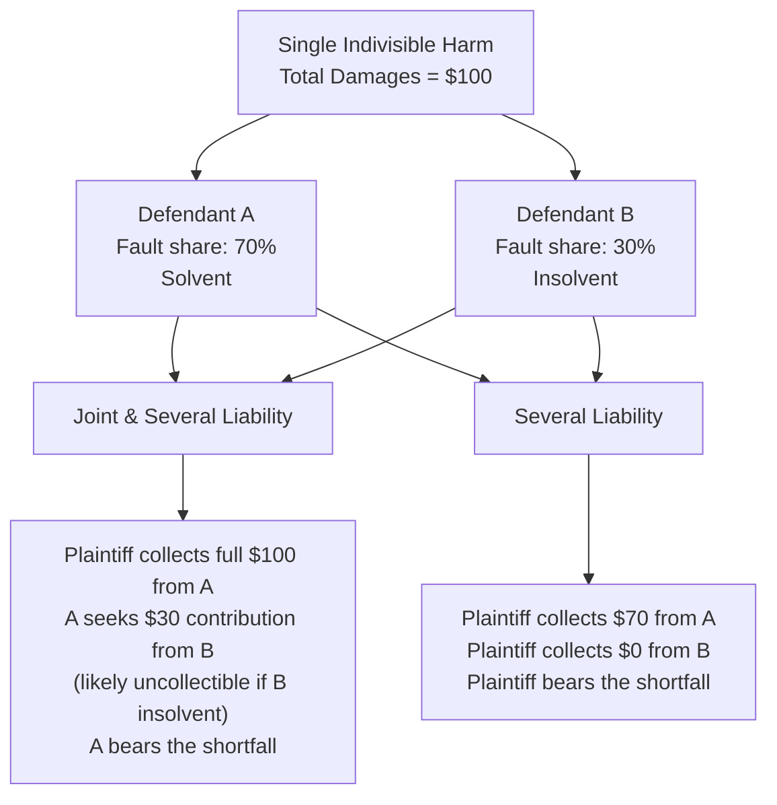

## Joint and Several Liability Among Multiple Tortfeasors

### Definitional Overview

Joint and several liability is a damages-allocation rule applicable when two or more parties (tortfeasors) are found liable for a single indivisible harm to a plaintiff. Under this rule, the plaintiff may recover the **full amount** of damages from **any one** liable defendant, regardless of that defendant's individual share of fault, leaving it to the defendants to sort out contribution among themselves. This contrasts with **several (proportionate) liability**, under which each defendant is liable only for their own share of the damages.

The doctrine matters economically because it determines (a) how litigation and collection risk is allocated between plaintiffs and defendants, (b) each defendant's incentive to take precautions when harm results from combined or independent contributions of multiple parties, and (c) the efficiency of settlement and litigation behavior in multi-defendant cases.

---

### Core Doctrinal Variants

**Key Points**

- **Pure joint and several liability:** Any defendant can be forced to pay 100% of the judgment, irrespective of their fault share, if other defendants are insolvent, unavailable, or judgment-proof. The paying defendant may then seek **contribution** from co-defendants for their proportionate shares (where contribution rights exist).
- **Pure several liability:** Each defendant pays only their own proportionate share of fault-based damages; the plaintiff bears the risk that a judgment-proof defendant's share goes uncollected.
- **Hybrid/modified regimes (common in current U.S. law):** Many U.S. states have modified pure joint and several liability by statute — e.g., applying joint and several liability only to economic damages while applying several liability to non-economic damages, or applying joint and several liability only to defendants whose fault share exceeds a specified threshold (e.g., 50%), with several liability applying below that threshold.

---

### Economic Rationale: The Risk-Bearing Allocation Problem

The central law-and-economics question: **who should bear the risk that one tortfeasor is insolvent — the innocent plaintiff, or the other (solvent) tortfeasors who share fault?**

**Key Points**

- Under joint and several liability, the **insolvency risk is shifted to co-defendants**: a solvent defendant may end up paying more than their fault share if a co-defendant cannot pay, and must then pursue contribution (which may itself fail if the co-defendant remains insolvent).
- Under several liability, the **insolvency risk is shifted to the plaintiff**: the plaintiff bears the shortfall directly if one tortfeasor cannot pay their share, even though the plaintiff was not at fault at all.
- The efficiency argument for joint and several liability rests on a basic risk-allocation principle: as between a wholly innocent plaintiff and a group of culpable (even if only partially at-fault) defendants, it is generally considered more equitable and often more efficient to place insolvency risk on the party who contributed to the wrongdoing rather than on the party who contributed nothing to it. [Inference — this is the standard normative argument advanced in the literature (e.g., American Law Institute discussions, Restatement (Third) of Torts: Apportionment of Liability), but it is a normative/equitable claim rather than a pure efficiency result, and reasonable disagreement exists about whether risk-shifting to defendants versus plaintiffs is "more efficient" in a strict Kaldor-Hicks sense]

---

### Contribution and Its Role in Restoring Proportionality

**Key Points**

- **Contribution** is the mechanism by which a defendant who paid more than their fault share under joint and several liability can recover the excess from co-defendants, based on their respective fault shares (as determined at trial or by subsequent proceeding).
- Where contribution rights exist and are fully enforceable against solvent co-defendants, joint and several liability with contribution can, in principle, replicate the same *ex post* proportional cost allocation as pure several liability — **except** in the specific case where a co-defendant is insolvent, which is exactly the scenario the doctrine is designed to address.
- **Contribution bar and settlement complications:** Many jurisdictions bar contribution claims against a defendant who has settled in good faith with the plaintiff (a "settlement bar" rule), which affects non-settling defendants' incentives (see settlement dynamics below).

$$\text{Defendant } i\text{'s net payment} = \max\left(0,\ \text{Judgment paid} - \sum_{j \neq i} \text{Contribution recovered from } j\right)$$

---

### Incentive Effects on Precaution

**Key Points**

- **Independent, separable harms model:** When each tortfeasor's negligence independently and separably contributes to a divisible portion of harm, several liability generally suffices to induce efficient care from each party, since each internalizes exactly their own contribution to expected harm.
- **Indivisible/joint-causation harms model:** When the harm is a single indivisible injury to which multiple tortfeasors jointly contributed (e.g., two factories whose combined pollution causes a single harm, or two drivers whose combined negligence causes one collision), it can be difficult or impossible for a court to disaggregate each party's marginal contribution to the harm. In this setting, joint and several liability with contribution can be shown, under standard assumptions, to preserve each party's incentive to take efficient care, since (through the contribution mechanism) each defendant still ultimately expects to bear a liability cost proportional to their own fault share in the aggregate, even though initial collection may fall on any one of them. [Inference — this equivalence result is a standard theoretical finding in the multi-tortfeasor law-and-economics literature (e.g., Kornhauser & Revesz), contingent on contribution being fully enforceable and fault shares being accurately determined; the result can break down under insolvency or contribution-bar conditions]
- **Uncertain-causation cases:** Where it cannot be determined *which* of several defendants actually caused the harm (as opposed to jointly contributing to a single harm), courts have developed special doctrines such as **market-share liability** (*Sindell v. Abbott Laboratories*, 1980, involving DES manufacturers) — apportioning liability according to each defendant's share of the relevant product market when the plaintiff cannot identify the specific manufacturer whose product caused the injury.

---

### Diagram: Insolvency Risk Allocation Under Alternative Regimes

---

### Diagram: Payment Outcomes Comparison

<svg viewBox="0 0 640 340" xmlns="http://www.w3.org/2000/svg" font-family="Helvetica, Arial, sans-serif">
<text x="320" y="24" text-anchor="middle" font-size="16" font-weight="bold">Who Bears the $30 Shortfall When Defendant B Is Insolvent? (svg_diagram)</text>
<!-- Joint and Several bar -->

<text x="150" y="60" text-anchor="middle" font-size="13" font-weight="bold">Joint & Several</text>

<rect x="60" y="75" width="180" height="40" fill="`#1a9850`"/>

<text x="150" y="100" text-anchor="middle" font-size="12" fill="white">A pays $70 (own share)</text>

<rect x="60" y="115" width="180" height="35" fill="`#fdae61`"/>

<text x="150" y="137" text-anchor="middle" font-size="12">A absorbs $30 shortfall</text>

<text x="150" y="165" text-anchor="middle" font-size="11">Plaintiff fully compensated ($100)</text>

<!-- Several bar -->

<text x="470" y="60" text-anchor="middle" font-size="13" font-weight="bold">Several (Proportionate)</text>

<rect x="380" y="75" width="180" height="40" fill="`#1a9850`"/>

<text x="470" y="100" text-anchor="middle" font-size="12" fill="white">A pays $70 (own share)</text>

<rect x="380" y="115" width="180" height="35" fill="`#b2182b`"/>

<text x="470" y="137" text-anchor="middle" font-size="12" fill="white">Plaintiff absorbs $30 shortfall</text>

<text x="470" y="165" text-anchor="middle" font-size="11">Plaintiff undercompensated ($70)</text>

<line x1="20" y1="200" x2="620" y2="200" stroke="#ccc" stroke-width="1"/>
<text x="320" y="225" text-anchor="middle" font-size="11" fill="#555">Both regimes give Defendant A the same $70 liability when solvent —</text>
<text x="320" y="243" text-anchor="middle" font-size="11" fill="#555">they differ only in who bears insolvency risk for B's $30 share</text>
</svg>

---

### Settlement Dynamics Under Joint and Several Liability

**Key Points**

- **Settlement bar rules:** Because settling defendants are often shielded from further contribution claims, non-settling defendants can end up bearing a disproportionate share of the judgment if a co-defendant settles for less than their proportionate fault share — creating strategic pressure and potentially distorting settlement timing and amounts.
- **Empty chair problem:** Non-settling defendants may attempt to shift blame onto absent or settled parties (the "empty chair") at trial to minimize their own apportioned share, since the settled party is no longer present to defend its position.
- **Incentive to settle early:** Because early settlement can allow a defendant to lock in a favorable (lower) payment and exit the litigation while shifting remaining collection risk onto co-defendants, joint and several liability can create incentives for defendants to settle earlier and more readily than they might under several liability, particularly where fault allocation is uncertain. [Inference — this is a commonly discussed strategic effect in the law-and-economics settlement literature, but the direction and magnitude of settlement-timing effects depend on the specific contribution and settlement-bar rules in the jurisdiction, and is not a universal result across all doctrinal configurations]

---

### The "Deep Pocket" Criticism

**Key Points**

- A frequent criticism of joint and several liability is that it creates incentives for plaintiffs' attorneys to pursue the defendant with the greatest ability to pay (the "deep pocket") rather than the defendant most responsible for the harm — particularly salient when a minimally-at-fault but well-resourced defendant (e.g., a municipality, large corporation, or property owner) is sued alongside a primarily-at-fault but judgment-proof individual defendant.
- This criticism substantially motivated the **tort reform movement** of the 1980s–1990s in the United States, which led many states to modify or abolish pure joint and several liability (e.g., replacing it with proportionate several liability, or hybrid thresholds tied to fault-share percentages).
- Empirical assessments of tort reform's actual effects on litigation costs, insurance premiums, and injury compensation rates vary substantially across studies and time periods; no single settled consensus figure exists in the literature regarding net welfare effects of these reforms. [Unverified — presented as a general characterization of an actively contested empirical literature, not as a specific measurable outcome]

---

### Comparison Table: Joint and Several vs. Several Liability

| Feature | Joint and Several Liability | Several (Proportionate) Liability |
| --- | --- | --- |
| Who bears insolvency risk of a co-defendant | Solvent co-defendants (via full collectibility, then contribution) | Plaintiff (uncollected shortfall) |
| Plaintiff's collection certainty | Higher — can pursue any solvent defendant for full amount | Lower — must collect separately from each defendant |
| Risk to well-resourced defendants | Higher — "deep pocket" exposure beyond own fault share | Limited to own fault share |
| Effect on settlement dynamics | Can incentivize early settlement; creates "empty chair" strategic issues | More predictable individual exposure; less strategic interdependence |
| Prevailing modern U.S. status | Modified/hybrid in most states (e.g., threshold-based, damages-type-based) | Increasingly common for non-economic damages specifically |
| Theoretical incentive equivalence to full internalization | Preserved with functioning contribution among solvent parties | Preserved directly, but plaintiff bears residual insolvency risk |

---

### Interaction with Comparative Fault Systems

**Key Points**

- Joint and several liability interacts directly with the comparative negligence framework discussed elsewhere in this chapter: a plaintiff's own fault share (if any) is typically deducted from total damages *before* joint and several liability is applied to the remaining defendants' shares, meaning the two doctrines operate sequentially rather than independently — first apportioning plaintiff-versus-defendants fault, then addressing the risk-allocation question of collectibility *among* the multiple defendants found liable.
- Many "hybrid" state statutes explicitly tie the joint-and-several threshold to comparative fault findings — e.g., a defendant found less than 50% at fault may be held only severally liable, while a defendant found 50% or more at fault remains jointly and severally liable for the full judgment, reflecting an attempt to reserve the harsher "deep pocket" exposure for defendants whose fault predominates.

---

### Related Topics

- Contributory and comparative negligence rules
- Contribution and indemnity among co-defendants
- Market-share liability and uncertain-causation doctrines
- Settlement bargaining and the empty-chair problem
- Tort reform and damages caps
- Judgment-proof problem and mandatory insurance solutions
- Vicarious liability and enterprise liability
- Class actions and mass tort litigation economics
- Causation doctrines: cause-in-fact and proximate cause
- Punitive damages and the deterrence multiplier