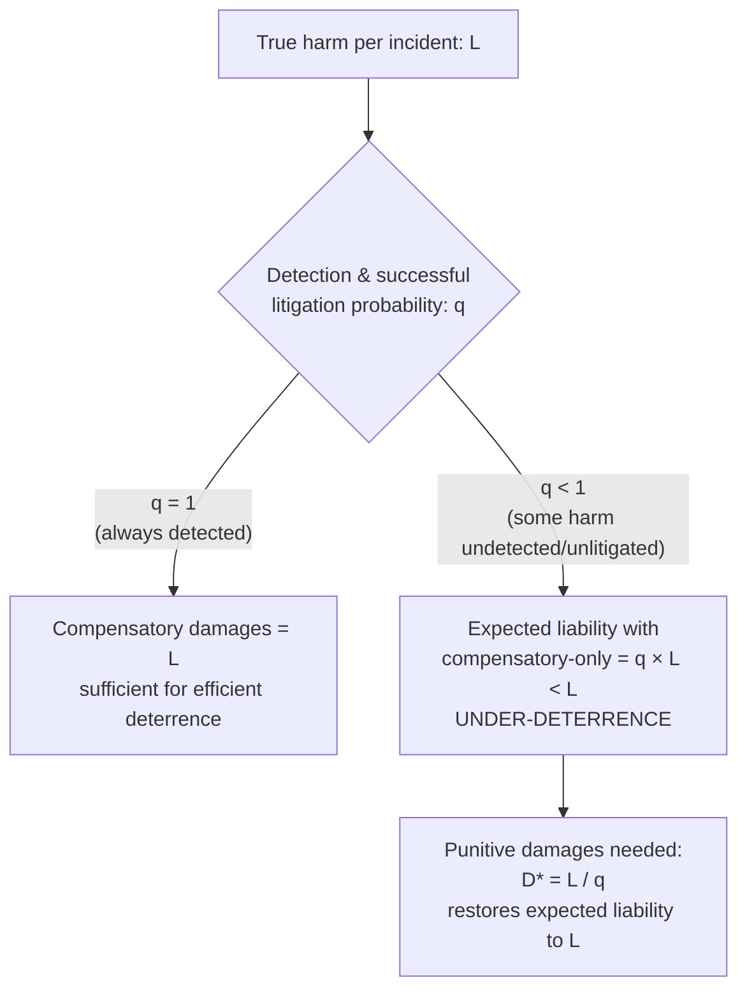

## Punitive Damages and Deterrence Theory

### Definitional Overview

Punitive damages (also called exemplary damages) are monetary awards to a plaintiff that exceed compensatory damages, intended not to compensate the plaintiff for actual loss but to punish the defendant for egregious conduct and to deter similar conduct by the defendant and others in the future. Economically, punitive damages are best understood not as a windfall or moral penalty in isolation, but as a **deterrence-correcting mechanism** that addresses systematic gaps between compensatory liability and the true expected social cost of harmful conduct.

The foundational law-and-economics question is: **under what conditions does compensatory damages alone (i.e., damages equal to $L$, the actual harm) fail to induce efficient deterrence, and how should punitive damages be sized to correct that gap?**

---

### The Baseline Efficient Deterrence Model

**Key Points**

- Under the standard tort deterrence model, if an injurer expects to pay damages exactly equal to the harm caused ($L$) whenever found liable, and if the injurer is *always* found liable when it causes harm (probability of detection and successful suit $q = 1$), then compensatory damages alone induce efficient care: the injurer's expected liability equals the true social cost of the harm.
- **Efficient deterrence condition:**

$$\text{Expected liability} = q \times D = L$$

where $q$ = probability that a harm-causing injurer is actually detected, sued, and held liable, and $D$ = damages awarded per successful suit. Efficient deterrence requires $D = L$ **only when** $q = 1$.

- When $q < 1$ — i.e., some injury-causing conduct escapes detection or successful litigation — compensatory damages alone systematically **under-deter**, because the injurer's expected liability ($qL$) is less than the true harm $L$.

---

### The Multiplier Theory of Punitive Damages

**Key Points**

- The dominant law-and-economics justification for punitive damages (developed prominently by Polinsky & Shavell, 1998, and building on earlier deterrence theory) is the **detection-multiplier** rationale: to restore efficient deterrence when only a fraction $q$ of harmful conduct results in a successful claim, damages should be scaled up so that expected liability still equals $L$.

$$D^* = \frac{L}{q}$$

**Example**

If a manufacturer's defective product causes an average harm of $L = \$50{,}000$ per incident, but only $q = 0.25$ (25%) of injured consumers ever discover the defect, identify the manufacturer as the cause, and successfully litigate a claim, then efficient total damages per successful suit should be:

$$D^* = \frac{\$50{,}000}{0.25} = \$200{,}000$$

Of this, $\$50{,}000$ would typically be awarded as compensatory damages (covering the plaintiff's actual loss) and the remaining $\$150{,}000$ as punitive damages — restoring the injurer's expected liability per harmful incident to the true social cost $L$, averaged across both detected and undetected incidents.

- **Key implication:** under the multiplier theory, punitive damages are properly understood as **completing** compensatory damages to reach efficient deterrence — not as a separate "punishment" layered atop already-efficient compensation. The theory implies punitive damages should generally *not* be awarded when $q$ is close to 1 (harm is nearly always detected and successfully litigated), since compensatory damages alone already achieve efficient deterrence in that case.

---

### Diagram: Multiplier Logic

---

### Second Justification: Egregious/Malicious Conduct and the Deterrence of Undesirable Activity Entirely

**Key Points**

- A distinct rationale, less tied to pure detection-probability mathematics, holds that punitive damages are appropriate for **intentional, willful, wanton, or maliciously reckless conduct** — where the goal is not merely to correct an under-detection gap but to deter conduct that society wishes to discourage more strongly than ordinary negligence, potentially even to the point of driving the underlying activity level toward zero rather than merely toward an "efficient" positive level of accidents.
- This rationale draws on a moral/retributive dimension that sits somewhat apart from the pure Kaldor-Hicks efficiency framework of the multiplier theory — reflecting a view that certain conduct (e.g., knowing concealment of a lethal defect for profit) warrants condemnation beyond what a purely mathematical detection-gap calculation would produce. [Inference — this dual-rationale framing (multiplier/economic vs. retributive/moral) is a standard way the law-and-economics literature (e.g., Polinsky & Shavell) distinguishes the two strands of punitive damages doctrine; courts in practice often blend both rationales without clearly separating them]

---

### Landmark Case Law Shaping Punitive Damages Limits

**Key Points**

- ***Grimshaw v. Ford Motor Co.*** (Cal. Ct. App. 1981) — the Ford Pinto fuel-tank case, often cited (with some historical dispute about the underlying cost-benefit memo's actual content and significance) as an illustration of a manufacturer allegedly weighing the cost of a design fix against expected litigation costs — frequently invoked in law-and-economics teaching as a cautionary example of under-deterrence when $q$ is low and detection/litigation is uncertain.
- ***BMW of North America, Inc. v. Gore*** (U.S. Supreme Court, 1996) — established constitutional due-process limits on punitive damages, articulating three "guideposts": (1) the degree of reprehensibility of the defendant's conduct, (2) the ratio between punitive and compensatory damages, and (3) comparable civil or criminal penalties for similar conduct.
- ***State Farm Mutual Automobile Insurance Co. v. Campbell*** (U.S. Supreme Court, 2003) — further constrained punitive damages, suggesting that **single-digit ratios** between punitive and compensatory damages are more likely to satisfy due process, and that few awards exceeding a **9:1 to 10:1 ratio** will survive constitutional scrutiny except in cases involving particularly egregious conduct or where compensatory damages are very small (in which case a higher ratio may be justified).
- ***Philip Morris USA v. Williams*** (U.S. Supreme Court, 2007) — held that punitive damages cannot be based on a jury's desire to punish a defendant for harm to non-parties (third parties not before the court), though harm to non-parties may still be considered in assessing reprehensibility.

**Tension Between Constitutional Ratio Limits and the Multiplier Theory**

- The multiplier theory ($D^* = L/q$) can, in cases of very low detection probability, generate efficient punitive-to-compensatory ratios far exceeding single digits (e.g., if $q = 0.05$, the theoretically efficient ratio would be roughly 19:1 for the punitive portion alone). Constitutional ratio caps under *Gore* and *State Farm* can therefore, in principle, prevent courts from awarding economically "efficient" punitive damages in low-detection-probability cases — a recognized tension between the economic deterrence framework and current U.S. constitutional doctrine. [Inference — this tension is explicitly discussed in law-and-economics commentary on punitive damages doctrine (e.g., Polinsky & Shavell's critique of ratio-based constitutional limits), though the Supreme Court's guideposts are framed as due-process/fairness constraints rather than deterrence-optimization constraints, reflecting different underlying values]

---

### Diagram: Ratio Constraint vs. Efficient Multiplier

<svg xmlns="http://www.w3.org/2000/svg" viewBox="0 0 640 340" font-family="Helvetica, Arial, sans-serif">
<text x="320" y="24" text-anchor="middle" font-size="16" font-weight="bold">Efficient Multiplier vs. Constitutional Ratio Cap (svg_diagram)</text>
<line x1="70" y1="290" x2="580" y2="290" stroke="black" stroke-width="1.5" />
<line x1="70" y1="290" x2="70" y2="50" stroke="black" stroke-width="1.5" />
<text x="325" y="320" text-anchor="middle" font-size="12">Detection Probability (q)</text>
<text x="30" y="170" text-anchor="middle" font-size="12" transform="rotate(-90 30 170)">Punitive:Compensatory Ratio</text>

<text x="70" y="303" text-anchor="middle" font-size="10">0.05</text>

<text x="200" y="303" text-anchor="middle" font-size="10">0.25</text>

<text x="325" y="303" text-anchor="middle" font-size="10">0.50</text>

<text x="450" y="303" text-anchor="middle" font-size="10">0.75</text>

<text x="580" y="303" text-anchor="middle" font-size="10">1.00</text>

<path d="M 70,60 Q 150,120 200,175 Q 260,220 325,245 Q 400,265 450,272 Q 520,280 580,285" fill="none" stroke="#2166ac" stroke-width="2.5" />
<text x="150" y="95" font-size="11" fill="#2166ac">Efficient ratio (L/q − 1)</text>

<line x1="70" y1="130" x2="580" y2="130" stroke="#b2182b" stroke-width="2.5" stroke-dasharray="6,4" />
<text x="440" y="122" font-size="11" fill="#b2182b">~9:1 constitutional guidepost</text>

<text x="150" y="270" font-size="10" fill="#555">Region where cap binds</text>

<text x="150" y="285" font-size="10" fill="#555">below efficient level</text>

</svg>

---

### Empirical Frequency and Magnitude

**Key Points**

- Punitive damages are, empirically, awarded relatively rarely across the general population of civil trials — most tort cases resolve through settlement or verdicts involving compensatory damages only, with punitive damages typically confined to a small subset of cases involving alleged intentional or highly reckless conduct.
- Popular perception of punitive damages as common and enormous is significantly shaped by a small number of highly publicized, unusually large awards, which are not representative of typical civil litigation outcomes. [Unverified — while this general characterization is widely noted in empirical civil-justice research (e.g., studies by the Bureau of Justice Statistics and RAND Institute for Civil Justice), specific frequency and magnitude statistics vary by jurisdiction, time period, and case-type sampling methodology, and are not restated here as a single verified figure]

---

### Punitive Damages and Insurance: The Insurability Debate

**Key Points**

- A distinct economic question: should punitive damages liability be insurable? If a defendant can purchase insurance covering punitive damages awards, the deterrence function of punitive damages (making the wrongdoer personally bear an above-compensatory cost) is undermined, since the insurer — not the wrongdoer — bears the marginal cost, and the wrongdoer's premiums may not fully reflect the incremental risk of egregious conduct if insurers cannot perfectly monitor or price that risk.
- Many U.S. jurisdictions therefore prohibit or limit insurance coverage for punitive damages as a matter of public policy, on the theory that insurability would blunt the deterrent and punitive purposes of the award — though jurisdictions vary considerably, and some permit insurance for vicariously-imposed punitive damages (e.g., employer liability for an employee's conduct) while barring it for a defendant's own intentional misconduct. [Unverified — the specific scope of insurability rules varies substantially across U.S. states and is not summarized here as a uniform national rule]

---

### Punitive Damages in Comparative/International Context

**Key Points**

- Punitive damages of the scale seen in U.S. litigation are relatively unusual internationally; many civil-law jurisdictions (e.g., much of continental Europe) do not recognize punitive damages at all in private civil litigation, relying instead on criminal or administrative penalties to address egregious conduct, reflecting a different institutional division between compensatory civil law and punitive public law.
- This divergence has generated conflict-of-laws and judgment-enforcement issues, as some foreign courts have historically declined to enforce U.S. punitive damages judgments on public-policy grounds. [Unverified — enforcement practice varies by country and has evolved over time; not summarized here as a fixed universal rule]

---

### Summary Comparison: Rationales for Punitive Damages

| Rationale | Core Logic | Damages Sizing Implication | Primary Legal Anchor |
| --- | --- | --- | --- |
| Detection multiplier | Corrects under-deterrence from $q < 1$ | $D^* = L/q$ | Polinsky & Shavell economic framework |
| Retribution / egregiousness | Punishes and strongly deters willful/malicious conduct | Not strictly formulaic; scaled to reprehensibility | Common-law punitive damages doctrine |
| Constitutional due process limits | Prevents arbitrary or grossly disproportionate awards | Single-digit ratio guideposts | *BMW v. Gore*, *State Farm v. Campbell* |

---

### Related Topics

- Products liability and manufacturer incentives
- Judgment-proof problem and its interaction with punitive damages
- Vicarious liability and restrictions on vicarious punitive damages
- Class actions and aggregate litigation of low-value, high-volume claims
- Settlement bargaining under asymmetric information
- Regulatory enforcement vs. private litigation as complementary deterrence mechanisms
- Insurance markets, moral hazard, and the insurability of punitive damages
- Due process constraints on civil damages (constitutional law and economics)
- Optimal law enforcement theory (Becker's economic model of crime and punishment, as an analog)