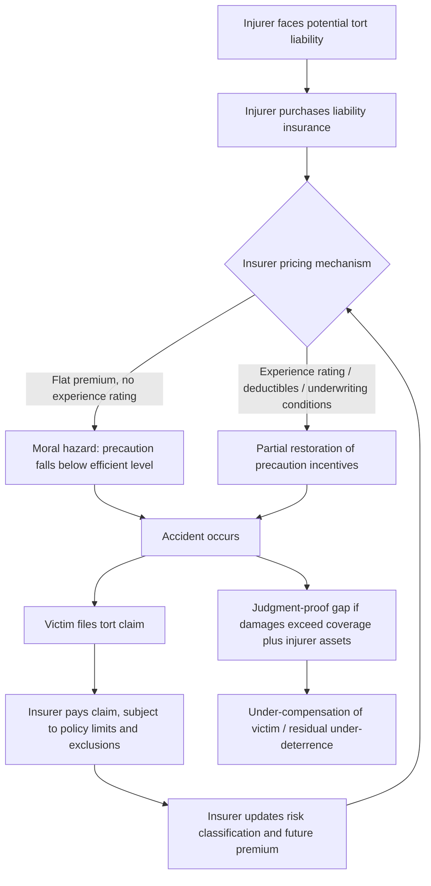

## The Interaction Between Tort Law and Insurance Markets

### Conceptual Foundations

**Key Points**

- Tort law and insurance markets are functionally intertwined: tort liability creates a demand for risk transfer, while insurance availability shapes the practical incidence and behavioral effects of tort rules.
- The economic analysis of this interaction rests on two branches of law and economics: the deterrence rationale for tort liability (Calabresi, Posner) and the risk-spreading rationale for insurance (Arrow, Shavell).
- A central tension exists between tort law's goal of inducing efficient precaution (deterrence) and insurance's goal of spreading risk (loss-smoothing), because insurance dulls the incentive effects that liability rules are designed to create.

Tort law, from a law and economics perspective, is typically justified on two grounds: compensating victims and deterring inefficient behavior by imposing the cost of accidents on the party best positioned to avoid them (the "cheapest cost avoider," per Calabresi). Insurance markets exist because risk-averse individuals and firms are willing to pay a premium to convert an uncertain, potentially catastrophic loss into a certain, smaller payment. When these two systems meet, the presence of insurance transforms who actually bears the cost of an accident, which in turn affects whether tort law's deterrence function operates as intended.

### The Moral Hazard Problem

**Key Points**

- Moral hazard arises when insurance reduces the insured party's incentive to take precaution, because the insurer (not the injurer) bears the financial consequence of the injurer's negligence.
- This directly undermines the Learned Hand Rule's incentive structure, since the injurer no longer internalizes the full expected liability cost.
- Insurers respond with contractual and pricing mechanisms designed to restore some of the lost incentive.

If an injurer purchases full liability insurance, the tort system's deterrent signal (expected damages, $E[D] = p \cdot D$, where $p$ is the probability of an accident and $D$ is the magnitude of damages) is no longer borne directly by the injurer. Absent any insurer response, the injurer's private cost of precaution no longer trades off against the liability she would otherwise pay, and precaution levels can fall below the socially efficient level $x^*$ that minimizes total social cost:

$$\min_x \; C(x) + p(x) \cdot D$$

where $C(x)$ is the cost of precaution and $p(x)$ is decreasing in $x$. Full insurance coverage, if unpriced with respect to behavior, severs the link between $x$ and the injurer's payoff, producing classic ex ante moral hazard.

Insurers mitigate this in several standard ways:

- **Experience rating**: premiums adjusted based on the policyholder's claims history (e.g., auto insurance premiums rising after at-fault accidents), which reinstates a dynamic, if imperfect, cost of carelessness.
- **Deductibles and copayments**: requiring the insured to bear a fixed initial loss or a percentage of damages, preserving a marginal incentive to avoid claims.
- **Coverage limits and exclusions**: capping payouts or excluding certain categories of negligence (e.g., gross negligence, intentional torts, punitive damages, which are often uninsurable or non-indemnifiable as a matter of public policy in many jurisdictions).
- **Underwriting and risk classification**: charging different premiums based on observable risk factors (age, driving record, industry sector, safety certifications), which is a form of ex ante screening rather than ex post incentive correction.
- **Monitoring and loss-control requirements**: some liability insurers (particularly in medical malpractice and product liability) impose safety audits, mandatory protocols, or risk-management conditions as a condition of coverage.

[Inference] The degree to which experience rating actually restores efficient incentives depends on the frequency and observability of claims; for low-frequency, high-severity risks (e.g., catastrophic industrial accidents), experience rating is a weaker instrument because premium adjustment lags the rare loss event by design.

### Adverse Selection in Liability Insurance

**Key Points**

- Adverse selection occurs when insurers cannot perfectly distinguish high-risk from low-risk injurers, causing pooled premiums to be unattractive to low-risk parties.
- This can lead to a shrinking, riskier pool of insureds — the classic Akerlof "lemons" dynamic applied to liability risk.
- Risk classification and mandatory insurance schemes are the primary policy responses.

Because injurers know more about their own riskiness (driving habits, internal safety culture, product defect rates) than insurers do, insurers face an information asymmetry. If insurers cannot price-discriminate, they set a premium reflecting the average risk in the pool. Low-risk injurers, for whom this average premium exceeds their actuarially fair premium, may exit the market (self-insure or go uninsured), leaving a residual pool skewed toward higher-risk injurers — a dynamic formally modeled by Rothschild and Stiglitz (1976) in the context of competitive insurance markets with asymmetric information.

$$\pi = q \cdot P - E[\text{Claims} \mid \text{pool}]$$

If insurers cannot separate types, they may offer a menu of contracts (screening) — e.g., a low-premium/high-deductible contract that only low-risk types find attractive, and a high-premium/low-deductible contract for high-risk types — as a self-selection mechanism.

**Example**: In medical malpractice insurance, physicians in high-litigation specialties (e.g., obstetrics, neurosurgery) face substantially higher premiums than those in low-litigation specialties (e.g., general practice), reflecting risk-based pricing that partially addresses adverse selection, though residual asymmetric information about individual physician skill and diligence persists.

### Compulsory Insurance and the Judgment-Proof Problem

**Key Points**

- The "judgment-proof problem" arises when a potential injurer's assets are less than the potential liability, causing under-deterrence because the injurer does not internalize losses beyond her asset level.
- Compulsory liability insurance (e.g., mandatory auto insurance) is a common policy response, converting an insolvent injurer's exposure into a funded, deep-pocket source of compensation.
- However, compulsory insurance can reintroduce moral hazard, since it guarantees a payment source regardless of the injurer's actual wealth constraint.

Shavell (1986) formalized the judgment-proof problem: if an injurer's wealth $W < D$, expected liability actually faced is $p \cdot \min(W, D)$, not $p \cdot D$, so precaution incentives are systematically weakened whenever assets are insufficient to cover potential damages. This is especially acute for small firms, individual drivers, and judgment-proof corporate subsidiaries.

Policy responses include:

- **Compulsory insurance mandates** (e.g., financial responsibility laws for motor vehicles in most U.S. states, and similar regimes internationally).
- **Minimum capital or bonding requirements** for hazardous activities (e.g., environmental bonding for mining or waste disposal operations).
- **Direct action statutes**, allowing victims to sue the insurer directly rather than the (possibly insolvent) injurer.
- **Vicarious liability and enterprise liability** extending liability to a solvent party (e.g., employer, parent corporation) who is better able to obtain and pay for insurance.

[Inference] Compulsory insurance solves the compensation problem for victims more reliably than it solves the deterrence problem for injurers, since mandated coverage does not by itself restore marginal incentives at the level of individual behavior — that requires accompanying experience-rating or deductible design.

### Insurance as a Substitute for and Complement to Tort Law

**Key Points**

- In some legal systems and contexts, first-party insurance (no-fault schemes) substitutes for third-party tort liability, trading deterrence for lower administrative costs and faster compensation.
- In others, liability insurance is a necessary complement that makes the tort system administrable by ensuring judgment-proof defendants can still pay.
- The choice between fault-based tort liability paired with liability insurance, versus no-fault first-party insurance, is a recurring policy debate in fields like auto accidents and workplace injuries.

No-fault systems (e.g., no-fault auto insurance regimes in several U.S. states and Canadian provinces, and workers' compensation systems broadly) replace tort litigation with a first-party insurance payout regardless of fault, up to scheduled amounts. The economic trade-off is:

| Dimension | Fault-Based Tort + Liability Insurance | No-Fault First-Party Insurance |
| --- | --- | --- |
| Administrative cost | Higher (litigation, proof of fault) | Lower (schedule-based payouts) |
| Deterrence signal | Present in theory, diluted by insurance | Largely absent for the specific injurer-victim dyad |
| Compensation speed | Slower | Faster |
| Compensation for pain and suffering | Available (subject to insurance limits) | Typically limited or excluded |
| Risk-spreading | Achieved via liability insurance | Achieved directly via first-party insurance |

Workers' compensation is the paradigmatic historical example: it replaced tort suits against employers with a no-fault, scheduled-benefit system funded by mandatory employer-purchased insurance, trading individualized deterrence for administrative efficiency and near-certain compensation.

### General vs. Specific Deterrence and the Insurer's Role

**Key Points**

- Insurers, as repeat players with statistical expertise, can perform a "private regulation" function that substitutes for or complements public regulation and tort deterrence.
- This is sometimes called the **insurer as a private regulator** hypothesis (Ben-Shahar, Logue).
- Insurers have private incentives (profit-maximization on the risk pool) that can align with, but do not always align with, socially optimal deterrence.

Because insurers price risk across large pools and have access to loss data unavailable to individual injurers, they are well-positioned to identify effective precautions and enforce them through underwriting requirements — sometimes more efficiently than direct government regulation. Examples include:

- Fire insurers historically requiring sprinkler systems and specific building materials.
- Product liability insurers requiring quality-control audits as a condition of coverage.
- Cyber-liability insurers now requiring specific security protocols (multi-factor authentication, patch management) as underwriting conditions. [Unverified] The precise scope and enforcement rigor of these requirements varies significantly by insurer and jurisdiction and is an evolving area of practice.

However, this private regulatory function is imperfect: insurers optimize for their own claims experience and profitability, not directly for social welfare, so gaps can emerge where systemic or diffuse harms (e.g., environmental externalities affecting non-policyholders) are not fully priced into the insurer's incentive structure.

### Formal Model: Precaution Under Partial Insurance

**Key Points**

- A simple two-party model illustrates how insurance coverage level interacts with the socially efficient precaution level.
- The result generalizes: the more complete the coverage, the greater the divergence from efficient precaution absent a corrective pricing mechanism.

Consider an injurer choosing precaution $x \geq 0$ at cost $c(x)$, convex and increasing, facing accident probability $p(x)$, decreasing and convex, with fixed damages $D$. Social welfare is maximized at $x^*$ solving:

$$c'(x^*) = -p'(x^*) \cdot D$$

Suppose the injurer holds liability insurance with coverage rate $\alpha \in [0,1]$ (fraction of liability the insurer pays) and the insurer charges a flat premium unrelated to $x$ (no experience rating). The injurer then minimizes:

$$\min_x \; c(x) + (1-\alpha) \cdot p(x) \cdot D$$

yielding first-order condition:

$$c'(\hat{x}) = -(1-\alpha) \cdot p'(\hat{x}) \cdot D$$

Since $c$ is convex and the right-hand side shrinks as $\alpha \to 1$, $\hat{x} < x^*$ whenever $\alpha > 0$ and premiums are flat — precaution is systematically under-provided relative to the social optimum, with the gap increasing in the completeness of coverage. This is the formal core of the moral hazard critique of liability insurance, and it is precisely the gap that experience rating, deductibles, and risk-based premiums are designed to narrow by making the effective premium a function of $x$.

### Diagram: Feedback Loop Between Tort Liability and Insurance Pricing

### SVG Diagram: The Precaution Gap Under Insurance Coverage (svg_diagram)

<svg xmlns="http://www.w3.org/2000/svg" viewBox="0 0 640 380">
<title>Precaution Gap Under Insurance Coverage (svg_diagram)</title>
<rect x="0" y="0" width="640" height="380" fill="#ffffff" />
<line x1="70" y1="320" x2="600" y2="320" stroke="#333" stroke-width="2" />
<line x1="70" y1="320" x2="70" y2="30" stroke="#333" stroke-width="2" />
<text x="330" y="360" font-size="14" text-anchor="middle" fill="#333">Precaution level (x)</text>
<text x="25" y="175" font-size="14" text-anchor="middle" fill="#333" transform="rotate(-90 25 175)">Cost / Marginal Value</text>
<path d="M 90 60 C 200 90, 350 200, 560 300" stroke="#1f77b4" stroke-width="2.5" fill="none" />
<text x="565" y="300" font-size="12" fill="#1f77b4">c'(x)</text>
<path d="M 90 300 C 250 260, 400 140, 560 60" stroke="#d62728" stroke-width="2.5" fill="none" />
<text x="480" y="70" font-size="12" fill="#d62728">-p'(x)·D (full liability)</text>
<path d="M 90 300 C 250 285, 400 220, 560 170" stroke="#ff7f0e" stroke-width="2.5" stroke-dasharray="6,4" fill="none" />
<text x="480" y="185" font-size="12" fill="#ff7f0e">-(1-α)·p'(x)·D (insured)</text>
<line x1="335" y1="30" x2="335" y2="320" stroke="#555" stroke-width="1" stroke-dasharray="3,3" />
<text x="340" y="45" font-size="12" fill="#555">x* (efficient)</text>
<line x1="245" y1="30" x2="245" y2="320" stroke="#888" stroke-width="1" stroke-dasharray="3,3" />
<text x="150" y="45" font-size="12" fill="#888">x̂ (under insurance)</text>
<path d="M 245 320 L 245 300 L 335 300 L 335 320" fill="none" stroke="#000" stroke-width="1" />
<text x="255" y="335" font-size="11" fill="#000">precaution gap</text>
</svg>

### Empirical and Policy Illustrations

**Example**

- **Automobile insurance**: Comparative studies of no-fault versus tort-based auto insurance regimes have generally found no-fault systems associated with modestly higher accident or fatality rates, consistent with a diluted deterrence signal, though results vary by study design and time period. [Unverified] Magnitudes are sensitive to specification and jurisdiction, and this remains a contested empirical literature.
- **Medical malpractice**: The relationship between malpractice insurance premiums, "defensive medicine," and actual care quality is heavily studied; higher premiums are associated with physician relocation and specialty-exit decisions in some studies, illustrating market-level feedback from tort exposure to insurance pricing to labor supply.
- **Product liability and environmental liability**: The unavailability or unaffordability of insurance for certain risks (e.g., asbestos-related and mass tort exposures) has historically driven insurers to exit certain lines entirely, which can leave both compensation and deterrence functions unfulfilled — a market failure sometimes addressed by statutory compensation funds (e.g., asbestos trusts, the September 11th Victim Compensation Fund) as an alternative institutional mechanism.

### Related Topics

- The Learned Hand Rule and the economics of negligence standards
- The judgment-proof problem and limited liability in corporate torts
- No-fault compensation systems: comparative design and efficiency trade-offs
- Adverse selection and screening models (Rothschild-Stiglitz) in insurance markets
- Enterprise liability and vicarious liability as solutions to insolvency risk
- Punitive damages and their (non-)insurability as a policy design choice
- Reinsurance markets and catastrophic/systemic risk pooling
- Regulation versus tort liability versus insurance as alternative instruments of social control (Shavell's comparative institutional framework)
- Statutory compensation funds as alternatives to tort-insurance systems