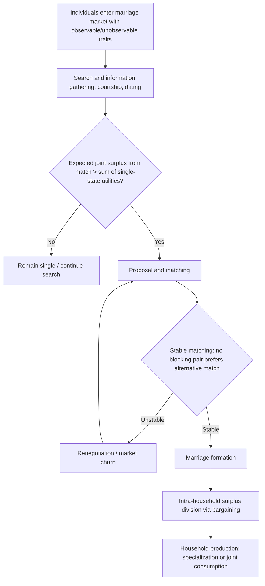

## Economic Models of Marriage Formation

### Conceptual Foundations

**Key Points**

- The economic theory of marriage treats marriage as a voluntary contractual arrangement entered into when it increases the joint welfare of both parties relative to remaining single, formalized in Gary Becker's foundational work (*A Theory of Marriage*, 1973–1974).
- Marriage formation is modeled as a matching problem in a marriage market, with search frictions, sorting on traits, and gains from specialization and exchange.
- The core analytical tools are gains-from-trade theory, comparative advantage, assortative matching, and — in more recent literature — search-and-matching models with incomplete information and bargaining.

Becker's framework reframed marriage not as a purely social or romantic institution but as a rational economic decision: individuals marry when the expected utility from marriage exceeds the expected utility from remaining single, and they choose *whom* to marry based on maximizing the joint surplus (household output) the union can produce. This treats the household as a small production unit combining the time, income, and traits of both partners to produce a composite "household commodity" — encompassing children, companionship, consumption, and status goods — that cannot be efficiently produced alone.

### Becker's Gains-from-Marriage Model

**Key Points**

- Marriage occurs when the output of a two-person household exceeds the sum of what each person could produce alone.
- Gains arise from two distinct sources: **specialization and division of labor** (comparative advantage) and **complementarities in consumption/production** (public-goods-like jointness, economies of scale, risk-pooling).
- The marriage market is modeled as clearing through a matching equilibrium that maximizes aggregate output across all possible pairings (an assignment problem).

Let $Z_m$ denote household output when a man and woman marry, and $Z_m^0, Z_f^0$ denote what each could produce single. Marriage is individually and jointly rational when:

$$Z_m > Z_m^0 + Z_f^0$$

Gains from specialization follow directly from **comparative advantage**: if one partner has a relative productivity advantage in market work (wage-earning) and the other in household production (childcare, home production), full specialization by each in their comparative-advantage activity maximizes total household output, following the same logic as Ricardian trade theory applied at the household level.

$$Z = f(t_m, t_f, x_m, x_h)$$

where $t_m, t_f$ are time allocations to market versus household production for each spouse, and $x_m, x_h$ are market goods and household-produced goods respectively. The household maximizes $Z$ subject to a joint budget and time constraint, and the resulting division of labor is efficient when each spouse allocates time according to relative comparative (not absolute) advantage — this holds even if one spouse is more productive than the other at *everything*, so long as relative productivities differ across market and household sectors.

[Inference] This specialization-based prediction of the traditional Becker model has become empirically less descriptive of contemporary marriage patterns in high-income economies, where dual-earner households with less extreme specialization are now common; later literature (see below) revises the model to emphasize consumption complementarities over strict specialization gains as female labor-force participation and wage convergence have risen.

### Assortative Matching and Sorting

**Key Points**

- Becker's model predicts equilibrium sorting patterns in the marriage market: **positive assortative matching** (like marries like) for traits that are complements in household production, and **negative assortative matching** for traits that are substitutes.
- Positive sorting is predicted for traits such as education, intelligence, and (in some specifications) wealth, because these traits raise the *marginal product* of the partner's traits (complementarity in the household production function).
- Negative sorting is predicted for traits such as market versus household productivity when specialization gains dominate — a high-wage-earning-potential partner optimally pairs with a partner who has comparative advantage in household production, generating sorting on the *market/household productivity ratio* rather than on raw income levels.

Formally, if the household production function $Z(m,f)$ exhibits supermodularity in traits $m$ (male trait) and $f$ (female trait) — i.e., $\frac{\partial^2 Z}{\partial m \, \partial f} > 0$ — the surplus-maximizing assignment in the marriage market exhibits positive assortative matching, a result formalized using the theory of optimal assignment (Becker 1973, building on Koopmans-Beckmann-type assignment models). If instead $\frac{\partial^2 Z}{\partial m \, \partial f} < 0$ (traits are substitutes in the household production function), negative assortative matching is the surplus-maximizing outcome.

**Example**: Empirical studies of educational homogamy consistently find substantial positive assortative matching on education across many countries — spouses' education levels are more highly correlated than would occur under random matching — consistent with education functioning as a complement in joint household production (e.g., through complementary parenting inputs, shared consumption of "cultural" goods, or correlated earnings potential).

### The Marriage Market as a Matching Market

**Key Points**

- The marriage market is modeled using tools from matching theory, most notably the **Gale-Shapley deferred acceptance algorithm** and its economic interpretation via **stable matchings**.
- A matching is *stable* if no man-woman pair who are not currently matched to each other would both prefer to leave their current partners and match with one another (no "blocking pair").
- Shapley and Shubik (1971) extended this to a transferable-utility framework where marriage surplus can be divided between partners, connecting matching theory directly to a cooperative bargaining solution.

In the non-transferable-utility (NTU) version (Gale-Shapley), each individual has a preference ranking over potential partners, and a stable matching always exists and can be computed via the deferred-acceptance algorithm. In the transferable-utility (TU) version relevant to Becker's economic model, the total surplus $Z(m,f)$ from a match can be split between the man and woman via a "marriage price" (which may take the form of a dowry, bride price, division of household roles, or intra-household allocation of consumption) — the equilibrium division is determined by market-clearing conditions analogous to a competitive equilibrium, and the stable matching coincides with the surplus-maximizing (efficient) assignment.

### Search Models and Incomplete Information

**Key Points**

- Later literature relaxes Becker's assumption of complete information and costless matching, modeling marriage formation as a **search-and-matching process** under uncertainty (analogous to labor market search models, e.g., Mortensen-Pissarides-style frameworks applied to marriage).
- Search frictions imply that individuals may accept matches below the theoretical surplus-maximizing partner because continued search is costly, generating a **reservation-quality** decision rule analogous to a reservation wage in job search.
- These models help explain phenomena such as delayed marriage, marriage market "thickness" effects (larger, denser markets improve match quality), and the role of cohabitation as an information-revelation mechanism prior to formal marriage.

An individual facing a sequence of potential partners of varying quality $q$, drawn from a known distribution, will optimally set a reservation quality $q^*$ such that they accept any partner with $q \geq q^*$ and continue searching otherwise. This reservation value solves:

$$q^* = \frac{b - c}{\delta} + E[\max(q - q^*, 0)]$$

conceptually analogous to the McCall search model, where $b$ is the flow value of remaining single, $c$ is the search cost, and $\delta$ is a discount factor — higher search costs or lower discounting lower the reservation quality (individuals settle sooner), while a thicker market (more draws per period) raises the option value of continued search and can raise $q^*$.

[Inference] Search-theoretic marriage models are more difficult to test empirically than the static Becker sorting model because reservation quality and match-specific information are not directly observable; most empirical work instead tests reduced-form implications, such as the relationship between local sex ratios or market thickness and marriage timing/rates.

### Intra-Household Bargaining Models

**Key Points**

- Once married, the division of household surplus and resource allocation is modeled using **bargaining theory**, moving beyond Becker's original "unitary household" assumption (which treated the household as maximizing a single joint utility function).
- The two dominant alternative frameworks are the **cooperative (Nash) bargaining model** (Manser-Brown 1980; McElroy-Horney 1981) and the **collective household model** (Chiappori 1988, 1992).
- Bargaining power within marriage is influenced by each spouse's **threat point** — typically modeled as the utility available outside the marriage (divorce, or in some specifications, a "separate spheres" non-cooperative equilibrium within an intact marriage).

The Nash bargaining solution to intra-household allocation maximizes:

$$\max_{u_m, u_f} \; (u_m - d_m)(u_f - d_f)$$

subject to the household's feasible utility possibility frontier, where $d_m, d_f$ are the threat points (fallback utilities) of each spouse. A key testable implication — the basis for empirical tests distinguishing bargaining models from the unitary model — is that any factor affecting a spouse's threat point (e.g., a spouse's individual non-labor income, divorce law regime, or external options) should affect intra-household allocation *even holding total household income constant*, a prediction the unitary model rules out (since the unitary model implies only total household income, not its distribution across spouses, matters — a proposition tested as **income pooling**).

**Example**: Empirical tests exploiting changes in divorce law (e.g., transitions from fault-based to unilateral/no-fault divorce regimes) or changes in the incidence of a specific transfer program's recipient (e.g., child benefit paid to mothers versus fathers) have found that shifting bargaining power/threat points toward one spouse changes observed household expenditure patterns (e.g., toward goods that spouse values more), providing evidence against strict income pooling and in favor of bargaining-based models.

### The Chiappori Collective Model

**Key Points**

- The collective model (Chiappori) assumes only that household outcomes are Pareto-efficient (weaker than the unitary model's assumption of a single utility function), and represents the outcome as maximizing a weighted sum of each spouse's individual utility.
- The weight, or **"sharing rule,"** $\mu$, can depend on prices, total household income, and distribution factors (threat-point-related variables that affect bargaining power without directly entering preferences or the budget constraint).

$$\max_{\{c_m, c_f\}} \; \mu \cdot U_m(c_m) + (1-\mu) \cdot U_f(c_f) \quad \text{s.t. household budget constraint}$$

The collective model is more general than a specific bargaining solution (it does not require Nash bargaining specifically) and has become the dominant framework in empirical household economics because it generates testable restrictions on demand systems (e.g., the "distribution factor proportionality" and rank conditions on the Slutsky matrix) that can be estimated from consumption microdata without directly observing the sharing rule.

### Effects of Legal and Policy Environment on Marriage Formation

**Key Points**

- Divorce law regime (fault-based versus unilateral/no-fault divorce) affects the threat point within marriage and, in some models, the *selection* of who chooses to marry and when.
- Tax law (joint versus separate filing, "marriage penalties" or "marriage bonuses" in progressive tax systems) creates a fiscal wedge that economic models incorporate directly into the net gains-from-marriage calculation.
- Welfare and transfer program design (e.g., means-tested benefits phased out with household income, historically including some U.S. AFDC/TANF provisions) can create implicit "marriage penalties" that reduce the net economic gain to formal marriage relative to cohabitation, a widely studied policy design problem.

The introduction of unilateral (no-fault) divorce, studied extensively in the empirical law-and-economics literature (e.g., Friedberg 1998; Stevenson and Wolfers 2006), is a natural experiment used to test Coasean bargaining predictions: if intra-marital bargaining is fully efficient (a Coasean "bargaining in the shadow of the law" result), the *default* legal division-of-property rule at divorce should not affect the decision to marry or divorce, only the distribution of resources — while if bargaining is imperfect (transaction costs, incomplete contracts, imperfect information), changing the legal default can have real effects on marriage and divorce rates. [Unverified] Empirical findings on the size and persistence of unilateral divorce's effect on divorce rates have varied across studies and time periods, and remain an actively contested empirical question rather than a settled result.

### Comparative Summary Table

| Model | Core Assumption | Key Prediction | Primary Author(s) |
| --- | --- | --- | --- |
| Gains-from-trade (specialization) | Comparative advantage in market/household production | Negative sorting on market/household productivity; full specialization | Becker (1973, 1974) |
| Assortative matching (TU assignment) | Household production function is supermodular/submodular in traits | Positive sorting on complementary traits (education); market-clearing "marriage price" | Becker; Shapley-Shubik (1971) |
| Search-and-matching | Costly search, incomplete information | Reservation-quality acceptance rule; market thickness affects match quality/timing | Mortensen-style extensions |
| Unitary household | Household maximizes single joint utility function | Only total household income matters (income pooling) | Becker (baseline) |
| Nash bargaining | Cooperative bargaining over threat points | Distribution factors (individual income, divorce law) affect allocation | Manser-Brown; McElroy-Horney |
| Collective model | Household outcomes are Pareto-efficient (weaker assumption) | Sharing rule varies with distribution factors; testable via demand system restrictions | Chiappori (1988, 1992) |

### Related Topics

- Intra-household bargaining and the collective household model in depth
- Economics of divorce: unilateral divorce laws and empirical natural experiments
- Assortative matching and the rise in educational homogamy: labor market and inequality implications
- Household production theory and time allocation (Becker's *A Theory of the Allocation of Time*)
- Economics of cohabitation as a pre-marital search/information mechanism
- Tax policy and the "marriage penalty"/"marriage bonus" under progressive taxation
- Search-and-matching theory: applications from labor markets (Mortensen-Pissarides) to marriage markets
- Fertility decisions as a joint economic choice within the household bargaining framework
- Same-sex marriage legalization: economic and legal analysis of marriage market effects