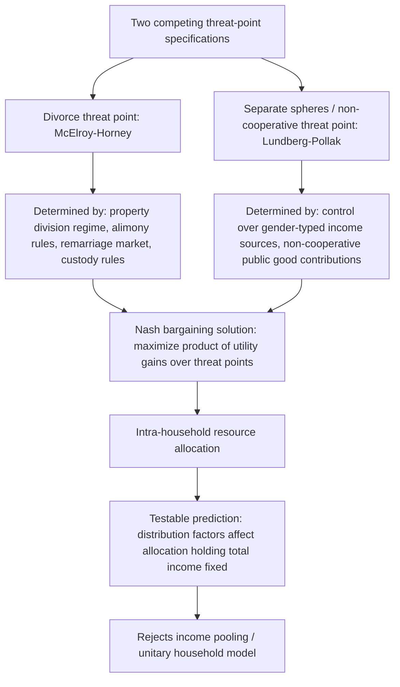

## Bargaining Theory Within the Household

### Conceptual Foundations

**Key Points**

- Household bargaining theory replaces Becker's "unitary household" model — in which the family is treated as a single decision-maker maximizing one joint utility function — with models in which spouses are distinct agents with potentially conflicting preferences who must reach an allocation through some bargaining process.
- The two dominant frameworks are **cooperative bargaining models** (Nash bargaining, applied by Manser-Brown 1980 and McElroy-Horney 1981) and the more general **collective model** (Chiappori 1988, 1992), which assumes only Pareto efficiency rather than a specific bargaining solution.
- A separate, influential **non-cooperative** strand (Lundberg-Pollak 1993, "separate spheres" model) relaxes the assumption that spouses necessarily bargain to an efficient (Pareto-optimal) outcome at all.
- The unifying legal-economic significance is that family law rules — divorce regimes, property division defaults, custody standards, spousal support — function as **threat points** or **distribution factors** that shift bargaining power without necessarily changing the total resources available to the household.

The shift from unitary to bargaining models was motivated by both theoretical and empirical concerns: theoretically, treating a two-person household as maximizing a single utility function requires either altruism assumptions strong enough to fully align both spouses' interests (Becker's "Rotten Kid Theorem" conditions) or an ad hoc social welfare function; empirically, unitary models generate a strong, testable restriction — **income pooling** — that is frequently rejected in household consumption data.

### The Income Pooling Hypothesis and Its Rejection

**Key Points**

- Income pooling is the unitary model's core testable implication: only *total* household income (or total household resources) should affect household demand and allocation decisions — the *distribution* of income or wealth across spouses should be irrelevant, since all resources go into one joint utility maximization.
- Multiple empirical studies using policy-driven "natural experiments" have rejected income pooling, providing the primary evidentiary basis for bargaining models over the unitary model.
- Rejection of income pooling does not by itself validate any *specific* bargaining model — it only rules out the unitary model, motivating the search for a correctly specified alternative.

**Example**: A widely cited test exploits a U.K. policy change in the late 1970s that shifted a child benefit payment from being paid via a tax credit (typically accruing to the husband's paycheck) to being paid directly in cash to mothers. Under income pooling, this administrative change in *who receives* the transfer should have no effect on household spending patterns, since total household income is unchanged. Empirical studies associated with this reform (notably Lundberg, Pollak, and Wales, 1997) found that spending shifted toward goods associated with children's and women's welfare (e.g., women's and children's clothing) following the change — a result inconsistent with income pooling and consistent with a bargaining-power interpretation in which the identity of the income recipient affects allocation.

### Cooperative (Nash) Bargaining Models

**Key Points**

- The Nash bargaining model imports the axiomatic cooperative bargaining solution (Nash 1950) into the household context: spouses bargain over the allocation of household resources, and the outcome maximizes the product of each spouse's utility gain over their **threat point** (fallback utility).
- The threat point is the key variable through which legal rules enter the model — it represents each spouse's utility if bargaining breaks down, typically modeled as the utility from **divorce** (the "divorce threat point" model) or from a non-cooperative equilibrium within an ongoing marriage (the "separate spheres" threat point, see below).
- This generates the model's central testable prediction: any variable that shifts a spouse's threat point — even holding total household income fixed — should shift the intra-household allocation, a prediction the unitary model rules out.

Formally, letting $u_m, u_f$ denote spouse utilities and $d_m, d_f$ denote their threat points, the Nash bargaining solution solves:

$$\max_{u_m, u_f \, \in \, \Omega} \; (u_m - d_m)(u_f - d_f)$$

subject to $\Omega$, the Pareto-efficient utility possibility frontier attainable from the household's joint budget constraint. The solution allocates the surplus $S = Z - d_m - d_f$ (where $Z$ is total household welfare attainable) such that each spouse's utility gain over their threat point is (in the symmetric Nash solution) split according to the bargaining weights implied by the axioms — efficiency, symmetry, independence of irrelevant alternatives, and invariance to affine transformations of utility.

**Divorce-threat-point specification** (McElroy-Horney 1981): $d_m, d_f$ are set equal to each spouse's utility if the marriage dissolves, which depends on:

- Each spouse's **individual (non-shared) wealth and earning capacity** post-divorce.
- The **legal property division regime** at divorce (community property vs. equitable distribution vs. separate property), which determines each spouse's post-divorce asset endowment.
- The **availability and generosity of spousal support/alimony** rules.
- Each spouse's **remarriage prospects**, itself a function of local marriage-market conditions (see marriage-market matching models).
- Custody rules and expected post-divorce child-related transfers, which affect the threat point of the spouse anticipated to become the primary custodial parent.

This is why McElroy-Horney's specification is sometimes called the model with **"extra-environmental parameters"** — variables (called **distribution factors**) that affect bargaining power without directly entering either spouse's utility function or the household budget constraint, yet still shift observed outcomes through their effect on the threat point.

### The "Separate Spheres" Non-Cooperative Model (Lundberg-Pollak)

**Key Points**

- Lundberg and Pollak (1993) proposed an alternative threat point: rather than divorce, the relevant fallback is a **non-cooperative equilibrium within the ongoing marriage**, in which spouses continue living together but fail to cooperate, each independently providing certain public goods according to socially prescribed gender roles ("separate spheres").
- This model was motivated by the observation that divorce is often a highly disruptive, low-probability threat point that may not realistically constrain day-to-day bargaining, whereas a non-cooperative "internal threat point" is a more plausible everyday fallback.
- The distinction matters legally: if divorce law changes shift bargaining power in this model, they do so more weakly (since divorce is not the operative threat point), while other variables (e.g., control over specific income sources tied to gender-typed contributions) become more central to bargaining power.

In the separate-spheres non-cooperative equilibrium, each spouse independently chooses a contribution to household public goods (e.g., childcare, housing) taking the other's contribution as given (a Cournot-Nash equilibrium in voluntary contributions), which is generically Pareto-inefficient (a public-goods under-provision result analogous to standard voluntary contribution games). The cooperative bargain must then deliver each spouse at least this non-cooperative equilibrium payoff to be sustainable, making the *non-cooperative equilibrium payoff* — not divorce utility — the relevant threat point in the Nash bargaining problem.

### The Collective Household Model (Chiappori)

**Key Points**

- Chiappori's collective model (1988, 1992) is more general than any specific bargaining solution: it assumes only that household decisions are **Pareto-efficient**, without specifying *which* point on the Pareto frontier is chosen or *how* bargaining power is determined.
- The model represents household choices as maximizing a weighted sum of individual utilities, where the weight — the **sharing rule**, $\mu$ — is itself a function of prices, total household income (or "full income"), and **distribution factors**.
- This generality makes the collective model the dominant workhorse in empirical household economics: it generates falsifiable restrictions on observable demand data without requiring the analyst to observe the sharing rule or bargaining process directly.

The collective model's household problem is:

$$\max_{c_m, c_f} \; \mu(p, y, z) \cdot U_m(c_m) + \big(1 - \mu(p, y, z)\big) \cdot U_f(c_f) \quad \text{s.t.} \quad p \cdot (c_m + c_f) \leq y$$

where $p$ is the price vector, $y$ is total household income, $z$ is a vector of distribution factors (e.g., relative wages, divorce-law regime, sex ratio in the local marriage market, individual non-labor income shares), and $\mu \in [0,1]$ is the sharing rule reflecting spouse $m$'s bargaining weight.

Key identification results (Chiappori and collaborators) show that under separability and observability assumptions, the sharing rule $\mu$ can in principle be *identified up to a constant* from observed household demand data, using variation in distribution factors that shift $\mu$ without directly entering preferences — this is analytically powerful because it means bargaining power effects can be recovered econometrically without ever directly observing intra-household transfers.

**Testable restriction**: the collective model implies specific rank and symmetry conditions on the Slutsky-like substitution matrix of household demand (distinguishing it from both the unitary model's stronger restrictions and from an unrestricted, non-cooperative model's weaker/absent restrictions), providing a formal empirical test distinguishing the three model classes.

### Comparative Model Table

| Model | Efficiency Assumed? | Threat Point / Mechanism | Key Testable Prediction | Primary Source(s) |
| --- | --- | --- | --- | --- |
| Unitary household | N/A (single utility function) | None (no bargaining) | Income pooling: only total income matters | Becker (Samuelson consensus model) |
| Nash bargaining (divorce threat point) | Yes (Pareto-efficient by construction) | Utility from divorce | Property/alimony/custody law shifts allocation | McElroy-Horney (1981) |
| Nash bargaining (separate spheres) | Yes | Non-cooperative in-marriage equilibrium | Control over gender-typed income shifts allocation | Lundberg-Pollak (1993) |
| Collective model | Yes (assumed, not derived from specific bargaining protocol) | Generic distribution factors via sharing rule $\mu$ | Rank/symmetry restrictions on demand system; sharing rule identifiable from data | Chiappori (1988, 1992) |
| Non-cooperative (general) | No | Strategic interaction, possibly inefficient | Public goods under-provided; no efficiency-based restrictions on demand | Various (game-theoretic household models) |

### Legal Applications: Family Law as a Determinant of Bargaining Power

**Key Points**

- Because divorce law, property division rules, and support obligations enter directly as threat-point determinants (or distribution factors), family law reform is not merely a matter of ex post fairness at dissolution — it has ex ante, within-marriage distributive effects, a key insight of the law-and-economics literature on family law.
- The shift from **fault-based to unilateral (no-fault) divorce** across U.S. states from the late 1960s through the 1980s is the most extensively studied natural experiment for testing these models.
- **Coasean bargaining logic** predicts that if intra-marital bargaining is costless and fully efficient, the *default* legal rule governing divorce (who must consent, how property is divided) should not affect whether a marriage dissolves — only the distribution of resources between spouses (a household-level analogue to the Coase theorem). Empirical rejection of this invariance is evidence of bargaining frictions (transaction costs, incomplete contracts, or non-cooperative behavior).

**Example**: Property division regime as a distribution factor — in a **community property** jurisdiction, both spouses have a presumptive claim to a roughly equal share of marital assets upon divorce regardless of whose name the asset is titled in or who earned the income, generally raising the divorce-threat-point utility of the lower-earning spouse relative to an **equitable distribution** or historical **separate property** regime. The Nash bargaining model predicts this should shift intra-marital allocation toward the lower-earning spouse even during an intact marriage, independent of any actual divorce occurring — a strong and distinctive prediction of the threat-point mechanism.

[Inference] The empirical magnitude of these threat-point effects on *intact*-marriage allocation (as opposed to divorce outcomes themselves) is harder to identify cleanly than divorce-rate effects, because within-marriage consumption/allocation data linked to plausibly exogenous legal-regime variation is comparatively scarce; much of the applied literature therefore relies on divorce-rate and labor-supply responses as indirect tests of the underlying bargaining mechanism.

### Empirical Identification Strategies

**Key Points**

- Because bargaining power and the sharing rule are not directly observed, empirical tests rely on **distribution factors**: observable variables that plausibly shift bargaining power without entering preferences or the budget set directly.
- Common distribution factors used in the literature include: relative spousal wages/income shares, relative age or education, the local marriage market sex ratio, divorce law regime (unilateral vs. mutual-consent), and the individual (as opposed to household) receipt of a specific transfer payment.
- Identification typically exploits **policy variation** (law changes across states/countries/time) or **quasi-random assignment** of the distribution factor (e.g., which spouse's account receives a benefit payment) to isolate a causal bargaining-power effect from confounding factors correlated with total household resources.

**Example**: Cross-country and cross-state variation in the *local marriage market sex ratio* has been used as a distribution factor — a relative scarcity of potential spouses of one sex is theorized to improve that sex's bargaining position within existing marriages (a higher outside-option/remarriage-prospect argument), with some empirical studies finding correlations between sex ratios and measures of within-household allocation or divorce rates consistent with this mechanism. [Unverified] As with other distribution-factor studies, results are sensitive to the specific measure of sex ratio used, the geographic level of aggregation, and potential confounding from migration selection, so this remains an area with mixed and contested findings rather than a uniformly replicated result.

### Related Topics

- The economics of divorce law: unilateral divorce and the Coase theorem applied to marriage
- Property division regimes at divorce: community property vs. equitable distribution, economic effects
- Alimony and spousal support as threat-point-shifting legal instruments
- Child custody standards and their effect on bargaining power (best-interests standard vs. presumptive joint custody)
- The Rotten Kid Theorem and the limits of altruism-based unitary household models
- Sharing-rule identification methods in applied microeconometrics
- Labor supply responses to intra-household bargaining power shifts (e.g., married women's labor force participation)
- Public goods provision within the household and the non-cooperative "separate spheres" equilibrium
- Comparative family law: bargaining power effects across differing marital property regimes internationally