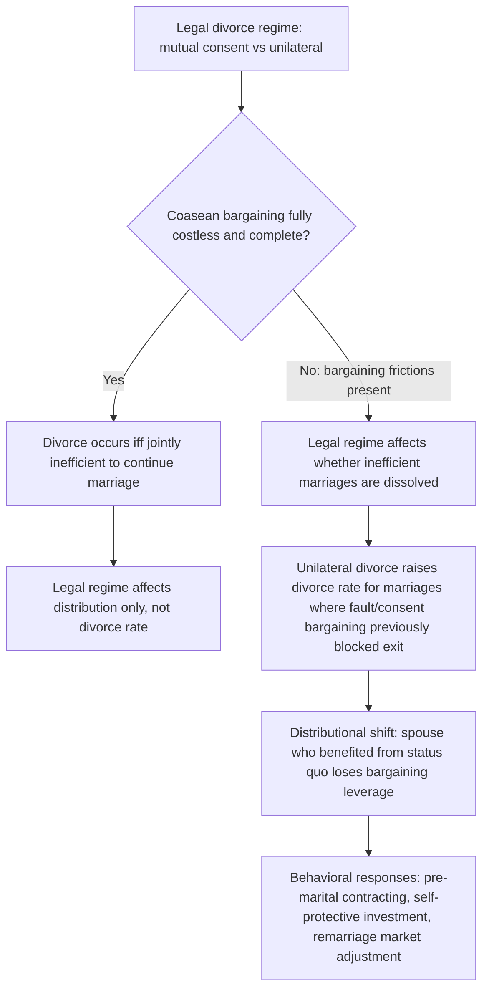

## Economic Incentives Created by Divorce Law

### Conceptual Foundations

**Key Points**

- Divorce law establishes the legal default rules governing marital dissolution — consent requirements, property division, spousal support, and custody — and each of these rules functions as a price or endowment that shapes incentives both at the point of divorce and, through anticipation, throughout the marriage and even at the marriage-formation stage.
- The central analytical question in law and economics is whether divorce law is merely a **distributive** rule (determining how a fixed surplus is split when a marriage ends) or also an **allocative/behavioral** rule (affecting whether marriages form, how spouses behave within marriage, and whether marriages dissolve at all).
- This question maps directly onto the **Coase theorem**: if intra-marital bargaining is costless and complete, the legal default divorce rule should be distributively relevant but allocatively irrelevant (marriages that are jointly efficient to continue will continue regardless of the legal rule, because spouses can bargain around an inefficient default). Empirical deviations from this prediction are used to infer the presence and importance of bargaining frictions.

The two major U.S. historical divorce regimes contrasted in this literature are **fault-based/mutual-consent divorce** (requiring proof of fault or agreement by both spouses to dissolve the marriage) and **unilateral (no-fault) divorce** (permitting either spouse to obtain a divorce without the other's consent or proof of fault). The wave of unilateral divorce law adoption across U.S. states from the late 1960s through the 1980s constitutes one of the most extensively studied natural experiments in family law economics.

### The Becker-Landes-Michael Framework and Marital Surplus

**Key Points**

- Building on Becker's marriage model, divorce is modeled as occurring when the **expected gains from remaining married fall below the gains from divorce**, incorporating updated information about match quality, changed circumstances, and outside options.
- Marriages are modeled as **experience goods** under uncertainty: partners have imperfect information about match quality ex ante, and divorce functions as an option to exit when realized match quality (or updated information) reveals the marriage to be surplus-destroying relative to divorce and remarriage/singlehood.
- Becker, Landes, and Michael (1977) formalized divorce as arising from the arrival of new information about the quality of the match, modeled analogously to a real-options exercise decision.

Let $S(t)$ denote the marital surplus at time $t$, updated as new information arrives (about spousal compatibility, income shocks, health shocks, or outside opportunities). Divorce occurs when:

$$S(t) < \max(d_m(t), d_f(t)) - \text{(actual joint surplus available outside marriage)}$$

more simply, when continuing the marriage no longer Pareto-dominates dissolution given each spouse's current best outside option. Under **full and costless bargaining** (the Coasean benchmark), the marriage dissolves if and only if it is jointly efficient to do so — that is, if and only if $S(t) < 0$ relative to the sum of what each spouse could obtain separately — and this efficient-divorce condition is **independent of the legal consent regime**, because spouses can always bargain (via side payments, property settlements, or renegotiated household roles) to sustain any marriage worth sustaining.

### Coasean Bargaining and the Irrelevance (and Non-Irrelevance) of Legal Divorce Rules

**Key Points**

- The theoretical **Coasean prediction** is that switching from mutual-consent to unilateral divorce should not change the *divorce rate*, because a spouse who wants to leave an inefficient marriage under mutual consent can simply "buy" the other spouse's consent (via a larger property settlement or transfer), while a spouse in an efficient (surplus-positive) marriage should be able to persuade a unilaterally-empowered spouse to stay via a compensating transfer.
- This prediction fails when there are **transaction costs to intra-marital bargaining** — imperfect information about the true gains from the marriage, inability to write enforceable long-term contracts governing future behavior, inability to commit to promised future transfers, or when the legal system restricts the transferability of the marital "asset" (e.g., limits on enforceable pre/post-nuptial contracts).
- Empirical tests of whether unilateral divorce laws changed divorce rates are therefore interpreted as **tests of the Coase theorem** applied within the family, and findings of a real effect are taken as evidence that intra-marital bargaining frictions are empirically significant.

### Empirical Literature on Unilateral Divorce and Divorce Rates

**Key Points**

- Early empirical work (e.g., Peters 1986) using cross-sectional variation found limited support for real effects of the legal regime, consistent with the Coasean prediction.
- Subsequent work using **panel data and difference-in-differences designs** across the staggered adoption of unilateral divorce by different U.S. states (notably Friedberg 1998) found that the switch to unilateral divorce was associated with a statistically significant, economically meaningful increase in divorce rates.
- Later reassessments (notably Wolfers 2006) found that while unilateral divorce laws produced a real, short-run increase in divorce rates, the effect **dissipated over roughly a decade**, suggesting a transitional-stock effect (dissolution of a backlog of marriages that had been held together by the prior legal constraint) rather than a permanent change in the underlying divorce-generating process.

[Unverified] The precise long-run magnitude and duration of the unilateral divorce effect on divorce rates remains actively debated in the empirical literature, with results sensitive to the choice of state-level control variables, the treatment of state-specific time trends, and the classification of ambiguous or gradually-implemented legal changes; this is presented here as a summary of major identified findings rather than a fully settled empirical consensus.

**Example**: The staggered timing of unilateral divorce adoption across U.S. states (spanning from California's pioneering 1969 Family Law Act through adoption in most other states by the mid-1980s) provides the standard identifying variation for difference-in-differences designs, treating each state's law-change date as a quasi-random "treatment" timing relative to other states.

### Distributive and Behavioral Effects Beyond the Divorce Rate

**Key Points**

- Even where the divorce *rate* effect of unilateral divorce is contested or transitional, the **distributive effect** on intra-marital bargaining power is a distinct and more robustly supported channel: unilateral divorce reduces the bargaining leverage of the spouse who would have preferred to withhold consent under a mutual-consent regime.
- This distributive shift generates predicted behavioral responses even in marriages that do not end in divorce, including changes in labor supply, savings behavior, and self-protective investments.
- Property division rules interacting with the divorce-consent regime (e.g., whether unilateral divorce is paired with **equitable distribution** of marital property or a **separate property** default) affect the magnitude of the distributive shift.

Documented and hypothesized behavioral margins include:

- **Female labor force participation**: a lower-earning spouse (historically, disproportionately wives) facing a higher probability of unilateral, non-consensual divorce has a stronger incentive to maintain independent labor-market attachment and human capital as a form of self-insurance against the reduced bargaining power/threat-point value that specialization in home production would otherwise entail.
- **Domestic violence and household bargaining**: some studies have examined whether unilateral divorce, by providing an easier exit option, is associated with changes in reported domestic violence rates, consistent with an improved outside option reducing a victim-spouse's vulnerability. [Unverified] Findings in this specific literature are mixed and sensitive to measurement of reporting versus incidence.
- **Savings and asset titling behavior**: spouses may adjust savings rates or the titling of assets in anticipation of the applicable property division regime at divorce.
- **Pre-nuptial and post-nuptial contracting**: to the extent the law permits, spouses may attempt to privately contract around the default legal rule (e.g., specifying an agreed property division or waiving/limiting spousal support), representing exactly the kind of Coasean bargain the theory predicts absent transaction costs — the fact that such contracts are used but do not eliminate observed legal-regime effects is itself evidence of residual transaction costs (enforceability limits, incomplete anticipation of future circumstances, unconscionability doctrines limiting enforceable terms).

### Property Division Regimes as a Complementary Incentive Structure

**Key Points**

- Divorce law's economic effects operate jointly through **two dimensions**: the *consent/grounds* regime (who can initiate divorce and under what conditions) and the *property division* regime (how marital assets and debts are allocated upon divorce).
- The three principal U.S. property division frameworks are **community property** (a presumptive equal split of marital property, used in a minority of U.S. states), **equitable distribution** (a judicially determined "fair" division based on enumerated factors, the majority U.S. approach), and (historically) **separate/title-based property** (assets divided according to legal title, largely superseded in modern U.S. law).
- The interaction between the consent regime and the property regime determines the net threat-point effect: unilateral divorce combined with a property regime highly favorable to the economically weaker spouse may largely offset the loss of consent-based bargaining leverage, while unilateral divorce combined with a title-based property regime maximizes the distributive shift against the economically weaker (typically non-title-holding) spouse.

| Regime Combination | Consent-Based Leverage | Property-Based Protection | Net Effect on Weaker-Earning Spouse's Threat Point |
| --- | --- | --- | --- |
| Mutual consent + title-based property | High (can block divorce) | Low | Ambiguous; consent leverage may substitute for property protection |
| Mutual consent + community/equitable property | High | Moderate–High | Strongest protection; two reinforcing sources of leverage |
| Unilateral divorce + title-based property | None | Low | Weakest protection; largest adverse distributive shift |
| Unilateral divorce + community/equitable property | None | Moderate–High | Partial offset; property rule substitutes for lost consent leverage |

[Inference] This substitution logic — that property-division generosity can offset the loss of consent-based leverage under unilateral divorce — is a theoretical implication of the bargaining framework rather than a single directly-tested empirical result, though it is consistent with the broader finding that the specific *combination* of legal rules, not the consent regime alone, determines the net distributive effect of a state's divorce-law regime.

### Alimony and Spousal Support as an Incentive Instrument

**Key Points**

- Spousal support (alimony) rules function economically as a mechanism to address the **specific-investment / hold-up problem** inherent in specialized marriages: a spouse who specializes in home production (per Becker's comparative-advantage model) makes a marriage-specific investment (foregone market human capital accumulation) that has little value outside the marriage, creating vulnerability to opportunistic divorce absent a compensating legal mechanism.
- Economically, alimony can be understood as a form of **ex post compensation for relationship-specific investment**, analogous to compensation for reliance investments in contract law, addressing the under-investment-in-specialization problem that would otherwise arise if a specializing spouse anticipated being left without recourse.
- Modern U.S. trends toward limiting alimony's duration and generosity ("rehabilitative" rather than permanent alimony) shift incentives back toward reduced specialization and increased dual-earner labor supply as a rational anticipatory response.

Without some compensating mechanism (property division favoring the specializing spouse, or alimony), the specialization gains identified in Becker's marriage model create a **hold-up risk**: the market-specializing spouse can credibly threaten divorce knowing the home-specializing spouse's outside options have deteriorated due to the marriage-specific human capital investment (or its foregone accumulation), a classic instance of the general contract-theory hold-up problem applied to family law. Legal rules that fail to compensate this relationship-specific investment predictably reduce the *ex ante* incentive to specialize, potentially reducing total household surplus generation even in marriages that do not end in divorce.

### Custody Rules as an Additional Incentive Margin

**Key Points**

- Child custody standards — historically maternal preference ("tender years" doctrine), now generally a "best interests of the child" standard, with an increasing trend toward presumptive joint physical custody in many jurisdictions — affect divorce-related incentives through their effect on each spouse's post-divorce welfare and, anticipatorily, on parental investment during marriage.
- A custody rule that reliably favors one parent (historically mothers) functions similarly to a favorable property-division rule for that parent's divorce threat point, while a shift toward presumptive joint custody reduces this asymmetric protection.
- Custody rules also interact with child support formulas, which are typically calculated based on income shares or percentage-of-income models and function as an additional, largely non-negotiable (in most jurisdictions) transfer that partially insures the custodial parent against income loss.

[Speculation] The shift toward presumptive joint custody in many jurisdictions may, by symmetrizing post-divorce custodial outcomes, reduce the asymmetric threat-point effect that custody rules previously provided primarily to mothers — but a rigorous causal empirical literature quantifying this specific channel (as distinct from the broader unilateral divorce literature) is less developed than the divorce-rate and property-division literatures discussed above, so this should be treated as a theoretically motivated hypothesis rather than an established empirical finding.

### Related Topics

- Bargaining theory within the household: Nash bargaining, collective models, and threat points
- Economic models of marriage formation and assortative matching
- The hold-up problem and relationship-specific investment in contract theory
- Child support formula design and its economic effects on custodial and non-custodial parents
- Comparative international divorce law regimes and cross-country divorce rate evidence
- Pre-nuptial and post-nuptial contracts: enforceability limits and law-and-economics analysis
- The Coase theorem: applications and empirical tests across legal domains
- Marriage-specific human capital and specialization incentives
- Domestic violence and legal exit options: economic analysis of protective mechanisms