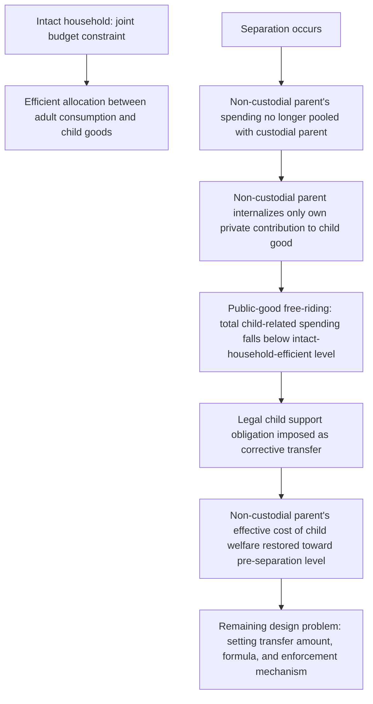

## Child Custody and Child Support as Economic Problems

### Conceptual Foundations

**Key Points**

- Child custody and child support are analyzed in law and economics as intertwined problems of **public goods provision**, **externalities**, and **principal-agent/incentive design** under conditions where parents' interests may diverge from each other and, potentially, from the child's welfare.
- Children are modeled as a form of **household public good**: both parents derive utility from the child's well-being, but post-separation, each parent's private cost of contributing to that public good (time, money) is no longer pooled within a single household budget, creating classic **public goods under-provision** dynamics absent legal intervention.
- Custody rules determine the allocation of **decision-making rights and physical time** with the child, while child support rules determine the **financial transfer** between parents; economically, these are complementary instruments addressing different margins of the same underlying under-provision and coordination problem.

Unlike ordinary bargaining over divisible marital property, custody and support decisions involve a **third party's welfare** (the child) whose interests the two bargaining parents may not fully internalize, motivating a distinct law-and-economics framework layered on top of standard household bargaining theory (see Nash bargaining and collective household models). This creates a **triangular incentive structure**: mother, father, and child, where legal rules must be designed knowing that parents bargain over an allocation that centrally affects a party who is not directly a bargaining participant.

### Child Support as Correction for a Post-Separation Externality

**Key Points**

- Within an intact household, both parents' spending on the child is disciplined by the shared household budget constraint and (under efficient bargaining) reflects the Pareto-efficient allocation between adult consumption and child-related public goods.
- Upon separation, the non-custodial parent's marginal cost of the custodial parent's child-related spending drops to near zero (a classic **externality**: the non-custodial parent no longer bears the opportunity cost of that spending against their own consumption), while the custodial parent bears the full cost of provision unless compensated.
- Absent a support obligation, standard public-goods theory predicts **under-provision of child welfare investment** relative to the efficient (intact-household-equivalent) level, because the non-custodial parent's private incentive to contribute financially disappears once the day-to-day utility benefit of co-residence with the child (a private consumption benefit for the custodial parent, and to a lesser extent the non-custodial parent) is removed.

Formally, in an intact household, both parents jointly choose consumption $c_m, c_f$ and child-good expenditure $q$ to maximize a weighted (Pareto/collective) household objective subject to $c_m + c_f + p_q q \leq y_m + y_f$, internalizing the full cost and joint benefit of $q$. Post-separation, absent a transfer mechanism, each parent instead solves an individual problem:

$$\max_{c_i, q_i} \; U_i(c_i, q_i, q_{-i}) \quad \text{s.t.} \quad c_i + p_q q_i \leq y_i$$

where parent $i$ only internalizes their own contribution $q_i$'s cost but benefits (to varying degrees) from the total $q = q_i + q_{-i}$ — a standard **voluntary contribution to a public good** setup, which generically yields inefficiently low total contributions relative to the jointly optimal level, following the same free-riding logic as in general public-goods theory (Bergstrom-Blume-Varian type models). Legally mandated child support functions as a **Pigouvian-style corrective transfer**, compelling the non-custodial parent to internalize a share of the child-cost externality that would otherwise be under-provided through voluntary contribution alone.

### Child Support Formula Design: Income Shares vs. Percentage-of-Income Models

**Key Points**

- U.S. states (and many other jurisdictions) use one of several standardized guideline formulas to calculate the presumptive child support obligation, replacing case-by-case judicial discretion with a rule-based approach — itself a law-and-economics tradeoff between the **predictability/lower-transaction-cost benefits of rules** and the **case-specific accuracy benefits of standards**.
- The two dominant U.S. models are the **Income Shares Model** (the majority approach) and the **Percentage of Obligor Income Model** (used by a minority of states); a smaller number use a **Melson Formula** variant.
- Each model embeds different implicit assumptions about how child-rearing costs scale with parental income and about the appropriate treatment of the custodial parent's own income and time costs.

**Income Shares Model**: estimates the total amount that would have been spent on the child had the parents remained together, based on combined parental income and standardized child-cost tables (typically derived from consumer expenditure survey data on household spending patterns by income level and number of children), then allocates that total obligation between parents in proportion to each parent's share of combined income.

$$\text{Support Obligation}_{\text{non-custodial}} = \left( \frac{y_{\text{non-custodial}}}{y_{\text{custodial}} + y_{\text{non-custodial}}} \right) \times \text{BaseSupport}(y_{\text{combined}}, n_{\text{children}})$$

**Percentage of Income Model**: a simpler formula applying a fixed or income-graduated percentage to the *non-custodial* parent's income alone, without directly incorporating the custodial parent's income into the base calculation, in either a **flat percentage** variant (a constant percentage regardless of income level) or a **varying percentage** variant (percentage declines as income rises, reflecting the empirical regularity that child-cost expenditure share of income tends to fall as income increases).

[Inference] The Income Shares Model is generally considered more consistent with the theoretical "intact household equivalence" benchmark described above, since it directly estimates what would have been spent jointly, whereas the Percentage of Income Model is simpler to administer (lower information requirements and litigation costs over the custodial parent's income) but is a cruder proxy for that benchmark — this is a standard characterization in the family law economics literature rather than a claim that either model is empirically "correct," since the underlying "amount that would have been spent" is itself not directly observable and must be estimated from cross-sectional expenditure data with its own methodological limitations.

### Custody Standards and Their Incentive Effects

**Key Points**

- Custody law has moved historically from a **maternal preference standard** ("tender years doctrine") through the modern **best interests of the child (BIOC)** standard, to an increasing number of jurisdictions adopting a **presumption of joint physical custody** (equal or near-equal parenting time) absent evidence it would harm the child.
- Each standard has distinct economic properties along the dimensions of **predictability** (affecting litigation costs and bargaining efficiency, per Coasean logic — see divorce law incentives), **incentive effects on parental investment during marriage**, and **incentive effects on post-divorce parental behavior**.
- The **best interests standard**, while flexible and intended to be child-welfare-maximizing on a case-by-case basis, is criticized in the law and economics literature for its indeterminacy, which **raises litigation costs and bargaining uncertainty** (an application of the general "rules vs. standards" tradeoff), potentially harming children through prolonged custody disputes even when the intended per-case benefit is optimal targeting.

**Example**: A move to a presumptive joint-custody default changes the effective "no-agreement" fallback point in custody negotiations (analogous to a threat point in the household bargaining models discussed elsewhere in this chapter): under a prior maternal-preference or maternal-default norm, a father seeking greater parenting time bore the burden and cost of overcoming that presumption in litigation, whereas a joint-custody default shifts that negotiating burden onto whichever parent seeks a *departure* from equal time — a pure legal-default change with predicted bargaining-power and settlement-pattern effects independent of any change in actual child welfare, directly analogous to the Coasean "default rule matters when bargaining is costly" logic applied to divorce law generally.

### Custody as a Determinant of Child-Support and Parental-Investment Incentives

**Key Points**

- Physical custody arrangements interact directly with child support obligations: most guideline formulas adjust the support calculation based on the number of overnights or the parenting-time split, reflecting that a parent exercising more physical custody time bears more direct in-kind costs and should owe (or receive) a correspondingly adjusted transfer.
- This creates a potential **strategic incentive problem**: if support obligations are highly sensitive to parenting-time thresholds (common in many state formulas, which apply discrete adjustments at specific overnight-count thresholds), parents may have an incentive to negotiate for custody arrangements partly motivated by the financial support consequences rather than solely by the child's best interests — a potential **incentive-compatibility problem** in mechanism design terms.
- Conversely, a strength of tying support adjustments to actual parenting time is that it better aligns each parent's financial obligation with their actual in-kind contribution, addressing a version of the free-riding/externality problem described above at a finer-grained level.

[Inference] The empirical significance of strategic custody-time-threshold behavior (sometimes informally discussed in family law commentary) is difficult to cleanly identify because parents' true preferences over parenting time cannot be separately observed from their financial incentives, and rigorous causal identification of this specific channel is more limited in the empirical literature than the broader unilateral divorce and support-enforcement literatures; this should be treated as a theoretically motivated concern raised in the literature rather than a robustly quantified empirical effect.

### Enforcement of Child Support Obligations

**Key Points**

- Because the non-custodial parent's incentive to pay support voluntarily is weak once separated from the custodial household (the same externality logic that motivates the obligation in the first place also weakens voluntary compliance), enforcement mechanism design is a central economic problem in child support policy.
- Major enforcement tools in the U.S. system include **wage withholding/garnishment** (now the default mechanism for most support orders), **license suspension** (driver's and professional licenses), **tax refund interception**, **credit bureau reporting**, and, in cases of substantial arrears, **civil contempt proceedings** (potentially resulting in incarceration).
- Enforcement design faces a core economic tradeoff: **stronger enforcement increases compliance and the resulting child-welfare-transfer benefit**, but **excessively punitive enforcement against low-income, genuinely unable-to-pay obligors can reduce their labor market participation** (e.g., driving them into informal/untaxed work to avoid wage garnishment) and reduce their capacity to pay at all — an application of general **enforcement-cost and Laffer-curve-type logic** to support collection.

**Example**: Federal U.S. legislation (the Child Support Enforcement program under Title IV-D of the Social Security Act, and related legislation such as the Family Support Act of 1988 mandating expanded wage withholding) established a nationwide infrastructure for interstate support enforcement, reflecting the recognition that support obligations are otherwise difficult to enforce across state lines — a jurisdictional/enforcement-cost problem distinct from the underlying formula-design problem.

[Unverified] The precise elasticity of non-custodial parent labor supply and formal-sector participation with respect to enforcement stringency (the potential "driving obligors underground" effect) is empirically studied but findings vary by population studied (e.g., low-income vs. higher-income obligors) and enforcement mechanism, so this tradeoff is presented as a theoretically well-established concern rather than a single settled elasticity estimate.

### Summary Table: Instruments and Their Economic Function

| Legal Instrument | Primary Economic Function | Key Design Tradeoff |
| --- | --- | --- |
| Income Shares support formula | Estimate and replicate intact-household child spending | Accuracy vs. administrative/informational cost |
| Percentage-of-income support formula | Simplified proxy for intact-household spending | Simplicity vs. precision |
| Best interests of the child (custody) | Case-specific welfare maximization | Flexibility vs. litigation cost/predictability (rules vs. standards) |
| Presumptive joint custody | Reduce litigation via clear default; symmetrize bargaining | Predictability vs. loss of individualized fit |
| Wage withholding / garnishment | Reduce non-compliance via automatic enforcement | Compliance vs. potential labor-supply distortion for low-income obligors |
| License suspension / contempt | Escalated enforcement for persistent non-payment | Deterrence vs. reduced ability-to-pay if income-earning capacity is impaired |

### Related Topics

- Bargaining theory within the household: threat points and the collective model
- Economic incentives created by divorce law: property division and alimony
- Public goods theory and free-riding: the Bergstrom-Blume-Varian voluntary contribution model
- The "rules vs. standards" tradeoff in legal design (Kaplow's framework)
- Mechanism design and incentive compatibility in family law rule-making
- Comparative international child support systems (e.g., UK Child Maintenance Service, Australian formula design)
- Economic effects of joint custody presumptions on parental labor supply and remarriage
- Poverty and child support enforcement: effects on low-income non-custodial parents