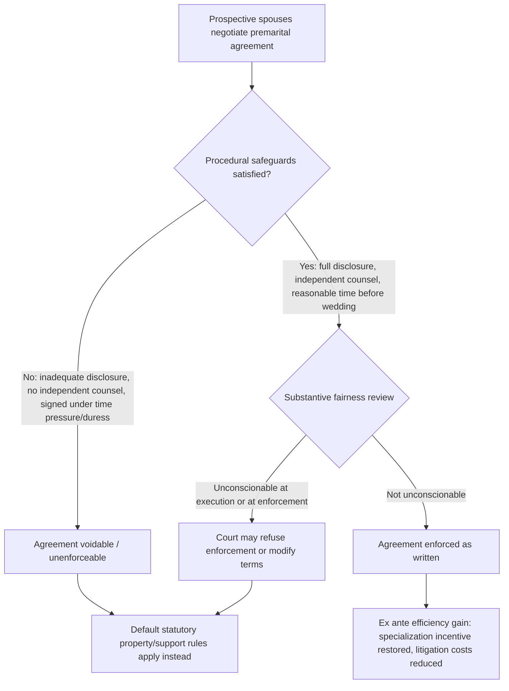

## Premarital Agreements and Contractual Freedom

### Conceptual Foundations

**Key Points**

- Premarital agreements (prenuptial agreements, or "prenups") are private contracts between prospective spouses that modify the default legal rules — primarily property division and spousal support — that would otherwise apply upon divorce or death, and are the primary legal instrument through which couples can exercise **contractual freedom** within family law.
- Economically, premarital agreements are the direct real-world instantiation of the **Coasean bargaining response** to legal default rules discussed elsewhere in this chapter: if a state's default divorce-law regime is inefficient for a particular couple's circumstances, contractual freedom in principle allows the couple to bargain around that default and select a jointly preferred allocation ex ante.
- Family law's treatment of premarital agreements is a paradigmatic case study in the broader law-and-economics tension between **freedom of contract** (efficiency gains from allowing parties to tailor terms to their private information and preferences) and **paternalistic/status-protective limits on enforceability** (concerns about unequal bargaining power, information asymmetry, and externalities on third parties, especially children).

Unlike most commercial contracts, premarital agreements are contracts made in contemplation of a **status relationship** (marriage) that the legal system has historically regulated as a matter of public policy rather than pure private ordering — historically, many jurisdictions treated agreements that facilitated or anticipated divorce as void against public policy on the theory that they undermined the sanctity and stability of marriage. Modern U.S. law has moved substantially toward enforceability, but with continuing procedural and substantive limits that reflect the persistent public-policy tension.

### Why Contractual Freedom Is Valuable: The Efficiency Case for Enforceable Prenups

**Key Points**

- Allowing enforceable premarital contracting permits couples to correct for a **mismatch between the one-size-fits-all statutory default and their particular circumstances** — a standard efficiency argument for freedom of contract generally, applied here to marital property and support defaults.
- Enforceable prenups can **directly solve the hold-up problem** identified in the divorce-law-incentives literature: a spouse anticipating specialization in home production (foregoing market human capital) can contractually secure compensation for that relationship-specific investment ex ante, rather than relying on the discretionary, ex post protection of default alimony and equitable distribution rules.
- Prenups also **reduce the ex post litigation costs** of divorce by pre-specifying the property/support terms, consistent with the general "rules vs. standards" efficiency argument — a clear contractual rule agreed ex ante avoids costly ex post judicial fact-finding under a discretionary "equitable distribution" or "fair and reasonable alimony" standard.

Applying the hold-up framework directly: without a prenup, a spouse choosing to specialize in home production faces the risk described in the divorce-incentives analysis — that a state's default property/support rules may under-compensate the relationship-specific investment, particularly in a title-based or minimally-generous jurisdiction, or particularly if the marriage ends early (before equitable distribution doctrines that scale with marriage length provide meaningful protection). A well-drafted prenup can specify a schedule of compensation (e.g., increasing entitlements tied to years of marriage, explicit provisions for a spouse who reduces market work for childrearing) that directly targets this under-investment problem, in principle **restoring the ex ante incentive to specialize efficiently** that Becker's marriage model identifies as a source of marital surplus.

**Example**: A common efficiency-oriented prenup provision is a **"sunset" or graduated schedule**, under which the financially weaker or specializing spouse's contractual entitlement (property share, alimony duration) increases with each year of marriage — designed to approximate the protection a court might extend under a discretionary "length of marriage" factor in equitable distribution, while providing more certainty and lower litigation cost than relying on judicial discretion.

### The Case for Limiting Enforceability: Information Asymmetry and Bargaining Power

**Key Points**

- Premarital agreements are frequently negotiated under conditions law and economics scholarship identifies as prone to contracting failures: **asymmetric information** about future circumstances (career trajectories, health, fertility outcomes, the true state of each party's finances), **time pressure** (agreements are often finalized close to a wedding date, when the emotional and social cost of backing out is high), and **unequal bargaining power or sophistication** (frequently, one party has access to specialized legal/financial counsel and the other does not).
- These conditions parallel the classic justifications for limiting freedom of contract in other domains — **unconscionability doctrine**, **duress**, and **failure of full disclosure** — applied here with heightened scrutiny because the "product" being contracted over (the terms of a decades-long, non-fungible personal relationship with children potentially involved) is far less standardized and far more difficult to price than typical commercial goods.
- A distinct externality concern is that premarital agreements can **affect children's welfare** (a third party to the contract) — for example, by waiving or limiting spousal support in a way that indirectly reduces resources available to a custodial parent raising the couple's children — which most jurisdictions address by categorically prohibiting agreements from waiving or predetermining **child support** obligations, which are treated as belonging to the child rather than as a bargainable spousal entitlement.

The economic logic of unconscionability doctrine as applied to prenups can be framed as an attempt to distinguish **efficient risk-allocation contracts** (which should be enforced, since they reflect genuine mutual gains from trade and cheaper insurance against relationship-specific risk) from contracts that reflect **exploitation of a temporary information or bargaining asymmetry** (which, if enforced, would not represent a genuine efficiency gain but a transfer extracted under conditions incompatible with the standard assumptions of voluntary, informed exchange that justify contract enforcement in the first place).

### Legal Enforceability Framework: Procedural and Substantive Requirements

**Key Points**

- Most U.S. states apply a **two-part enforceability test** combining procedural fairness requirements (how the agreement was formed) and substantive fairness requirements (whether its terms are unconscionable), reflecting the law-and-economics distinction between contracting-process failures and outcome-based fairness concerns.
- The **Uniform Premarital Agreement Act (UPAA)**, adopted in a majority of U.S. states in some form, and its successor the **Uniform Premarital and Marital Agreements Act (UPMAA)**, standardize many of these requirements, reflecting a policy judgment favoring predictability and enforceability relative to the more skeptical common-law tradition it replaced.
- Common procedural requirements include: **full and fair financial disclosure** by both parties (addressing the information-asymmetry concern directly), **voluntary execution** (addressing duress/time-pressure concerns, sometimes formalized as a minimum number of days before the wedding), and **independent legal counsel** for each party (or a knowing, informed waiver of counsel), addressing the bargaining-sophistication asymmetry concern.

| Requirement Category | Economic Rationale | Typical Doctrinal Test |
| --- | --- | --- |
| Full financial disclosure | Corrects information asymmetry preventing informed consent | Each party disclosed (or had adequate knowledge of) the other's assets/income at signing |
| Voluntary execution / no duress | Ensures genuine consent, not coerced by time pressure | Sufficient time between presentation and wedding; absence of last-minute pressure |
| Independent legal counsel | Corrects bargaining-sophistication asymmetry | Each party had (or knowingly waived) representation by separate counsel |
| Substantive unconscionability review | Prevents enforcement of exploitative terms inconsistent with genuine ex ante efficiency gains | Terms not unconscionable at execution, and (in some states) not unconscionable at the time of enforcement |
| Child support exclusion | Protects third-party (child) interests not represented in the bargain | Provisions purporting to waive or fix child support are void/unenforceable regardless of other terms |

[Inference] The "unconscionable at time of enforcement" standard (used in a subset of jurisdictions, versus the more common "unconscionable at execution" standard) reflects a stronger paternalistic limit on contractual freedom, since it allows a court to refuse enforcement even of a procedurally impeccable, fully-disclosed agreement if changed circumstances make its terms harsh by the time of divorce — this represents a meaningfully different point on the freedom-of-contract-versus-protection spectrum than a pure execution-time unconscionability test, though characterizing exactly how much less enforceable this makes prenups in practice would require jurisdiction-specific empirical analysis beyond the scope of the general doctrinal contrast presented here.

### Incomplete Contracts and the Limits of Ex Ante Contracting

**Key Points**

- Premarital agreements are subject to the general **incomplete contracts problem** studied in contract theory: because marriages last for long, uncertain durations and are exposed to a wide range of unforeseeable future contingencies (career changes, illness, disability, the number and needs of children), it is prohibitively costly (or simply impossible) to draft a fully contingent contract specifying optimal terms for every possible future state of the world.
- This incompleteness is a core justification for retaining **judicial discretion as a residual default** — courts serve a "gap-filling" function for contingencies the parties did not (and could not efficiently) anticipate or specify, analogous to the role of default contract terms and implied covenants of good faith in commercial contract law.
- The incomplete-contracts framing also explains why **provisions attempting to govern non-financial, difficult-to-verify matters** (e.g., contractual clauses specifying household chore division, weight-maintenance requirements, or infidelity-triggered penalty clauses) are frequently held unenforceable or disfavored — such terms often lack the verifiability required for judicial enforcement (a standard **verifiability** problem in contract theory: a term is only enforceable if a court can, at reasonable cost, verify whether it was breached), and enforcing highly personal behavioral terms raises the same public-policy concerns that limit specific performance remedies in personal-service contracts generally.

**Example**: Courts in most U.S. jurisdictions have declined to enforce **infidelity clauses** (penalty provisions triggering an adverse property/support reallocation upon proven adultery) both because of significant **verifiability difficulties** (proving infidelity to the evidentiary standard required) and because reintroducing fault-based financial consequences for marital conduct runs counter to the broader shift toward no-fault, low-litigation-cost divorce regimes discussed in the "Economic Incentives Created by Divorce Law" analysis — illustrating that contractual freedom in family law is bounded not only by fairness/exploitation concerns but by verifiability and consistency with the surrounding legal-incentive architecture.

### Postnuptial Agreements as a Related Instrument

**Key Points**

- **Postnuptial agreements** (negotiated after marriage, rather than before) serve a similar economic function to prenups — allocating property/support rights ex ante relative to a future divorce — but are negotiated at a point when the parties are already bound by the marital status contract, which changes the applicable bargaining and duty-of-disclosure framework.
- Because spouses owe each other a **fiduciary-type duty of good faith and fair dealing** once married in many jurisdictions (a duty not generally owed between unmarried prospective spouses), courts often apply **heightened scrutiny** to postnuptial agreements relative to prenups, reflecting the theoretical concern that the existing marital relationship (and dependence built up within it) increases the risk of one spouse exploiting a position of trust or the other spouse's diminished outside options at the point of signing.
- Postnuptial agreements are also used as a **renegotiation mechanism** when circumstances have materially changed since the marriage began (e.g., a spouse leaving the workforce, a significant change in one spouse's income or health) — functioning economically as an efficient contract renegotiation in response to new information, analogous to renegotiation clauses in long-term commercial contracts under incomplete-contracting theory.

[Speculation] Because postnuptial agreements are negotiated once exit options have already narrowed (a spouse who has specialized in home production has less outside-option leverage than the same spouse would have had before marrying), the *threat-point* framework from household bargaining theory suggests postnuptial negotiations may systematically favor the higher-earning or less-specialized spouse relative to what an equivalent prenuptial negotiation would have produced — though this is a theoretical inference from the bargaining-power literature rather than a directly established empirical finding specific to postnuptial agreement terms.

### Related Topics

- Economic incentives created by divorce law: property division regimes and alimony
- Bargaining theory within the household: threat points and the collective model
- The hold-up problem and relationship-specific investment in contract theory
- Incomplete contracts theory (Grossman-Hart-Moore framework) and its application to relational contracts
- Unconscionability doctrine in general contract law: procedural vs. substantive unconscionability
- The Uniform Premarital Agreement Act and Uniform Premarital and Marital Agreements Act: comparative adoption and provisions
- Verifiability and enforceability limits on personal-conduct contract clauses
- Comparative international approaches to premarital contracting (civil law marital property regimes vs. U.S. common law approach)