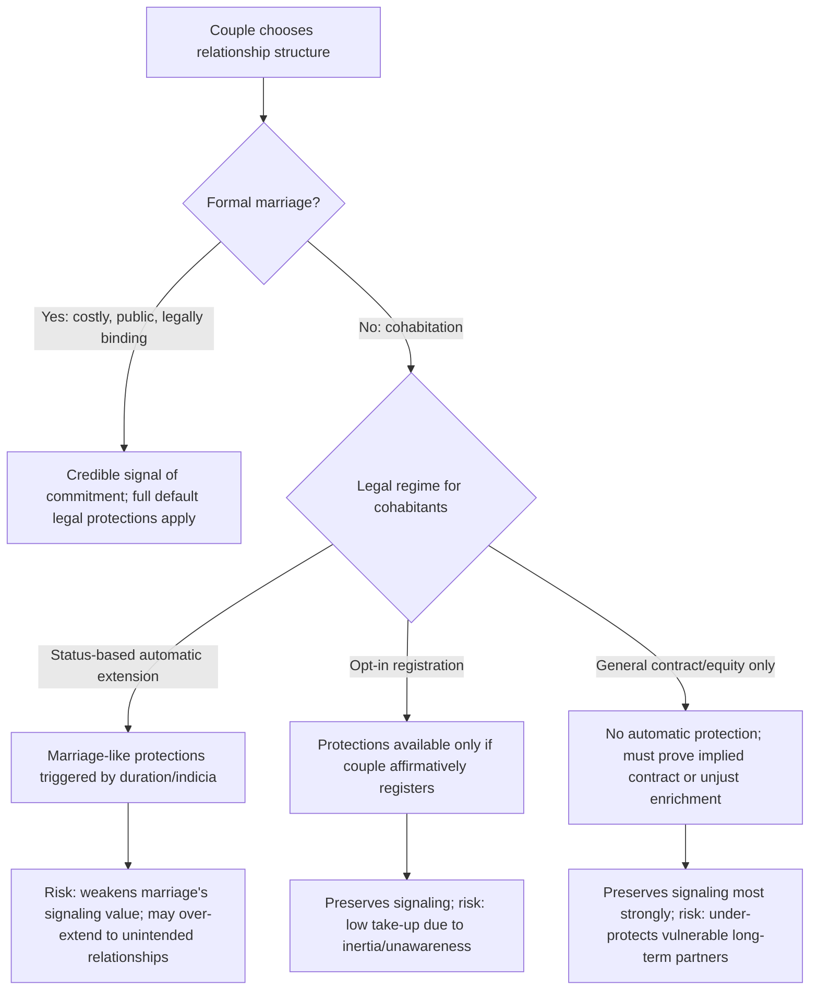

## Economic Analysis of Domestic Partnership and Cohabitation Law

### Conceptual Foundations

**Key Points**

- Domestic partnership and cohabitation law addresses couples who share a household and economic life without entering formal marriage, raising the question of whether — and to what extent — the legal system should extend marriage-like default rules (property division, support obligations, benefits) to these relationships.
- Economically, this is a problem of **optimal default rule design under heterogeneous preferences**: some cohabiting couples functionally resemble marriages in every economically relevant respect (joint production, specialization, relationship-specific investment) while others are transactionally distinct (roommates, short-term relationships), and a legal system must decide whether to extend a uniform default, offer an opt-in intermediate status, or leave cohabitants entirely to general contract and property law.
- The core law-and-economics tension mirrors the premarital-agreement analysis: extending marriage-like protections to cohabitants can **solve under-investment/hold-up problems** for genuinely marriage-like relationships, but risks **over-extension** to relationships the parties did not intend to be legally binding, undermining the value of formal marriage as a costly, credible signal of commitment.

Three broad institutional responses have emerged across jurisdictions: (1) **status-based extension**, in which cohabitation of sufficient duration or with sufficient indicia (common-law marriage, or statutory "de facto relationship" regimes in some jurisdictions) triggers marriage-like default obligations automatically; (2) **opt-in registration**, in which couples must affirmatively register (civil unions, domestic partnerships) to receive a defined bundle of marriage-like rights and obligations; and (3) **default reliance on general contract/property/equity doctrines**, in which cohabitants receive no automatic status-based protection but can seek remedies through ordinary contract law, implied contract theories, or equitable doctrines such as unjust enrichment.

### The Signaling Function of Formal Marriage

**Key Points**

- A key economic argument against extending full marital defaults automatically to all cohabitants is that **formal marriage functions as a costly, credible signal of commitment** — the very costliness of the marriage "ritual" (public ceremony, legal formality, difficulty of exit) is what makes the signal informative, screening for couples confident enough in relationship durability to make marriage-specific investments worthwhile.
- If cohabitation automatically triggered the same legal consequences as marriage after some duration, this would **weaken the signaling value of the choice to marry**, potentially producing a **pooling equilibrium** in which the decision to marry (or not) conveys less information about a couple's underlying commitment level — a direct application of signaling theory (Spence-type models) to relationship formation.
- Conversely, treating cohabitation identically to non-relationship strangers (providing zero default protection regardless of relationship duration or economic interdependence) risks **under-protecting economically vulnerable partners** in relationships that are functionally indistinguishable from marriage in every respect except the formal ceremony — precisely the population most likely to have made unprotected relationship-specific investments (see the hold-up problem discussion in the premarital agreements and divorce-incentives analyses).

### Common-Law Marriage and Automatic Status Extension

**Key Points**

- **Common-law marriage** (recognized in a minority of U.S. states and various forms internationally) automatically confers full marital status — including all marital property and support consequences upon dissolution — on cohabiting couples who meet specified criteria, typically requiring cohabitation plus a mutual present intent to be married and public "holding out" as a married couple.
- Economically, common-law marriage can be understood as a **default rule targeting relationships that are functionally equivalent to formal marriage** but where the couple did not complete the formal ceremony, often due to inertia, lack of legal sophistication, or lack of access rather than a deliberate choice to avoid marital legal consequences.
- The doctrine's central economic weakness is an **identification/verifiability problem**: because entry into common-law marriage is not marked by a discrete, verifiable, publicly recorded event (unlike a marriage license and ceremony), its existence and the exact date of formation are frequently contested in later litigation, imposing significant **ex post litigation costs** relative to formal marriage's clear, low-cost verifiability — a direct illustration of the general law-and-economics preference for bright-line, easily verifiable triggering events where feasible.

[Inference] This verifiability weakness is a leading reason cited in the literature for the decline in the number of U.S. jurisdictions recognizing common-law marriage over the twentieth century, in favor of opt-in registration regimes (civil unions, domestic partnerships) or reliance on general contract/equity doctrines that place the burden of establishing an economic relationship on the party seeking a remedy, though this characterization describes the general legal-economic critique found in the scholarship rather than a claim about the specific historical motivations of any individual state legislature.

### Opt-In Registration Regimes: Civil Unions and Domestic Partnerships

**Key Points**

- Opt-in registration regimes require an affirmative act (registering with a government office) to trigger a defined bundle of marriage-like rights and obligations, historically developed in part to extend marriage-equivalent legal protections to same-sex couples prior to the nationwide legalization of same-sex marriage, and in some jurisdictions retained afterward as an option for opposite-sex or same-sex couples who prefer a status short of full marriage.
- Economically, opt-in regimes attempt to **preserve the signaling value of an affirmative, verifiable, low-but-nonzero-cost act** (registration) while offering a lower-commitment-cost alternative to full marriage — theoretically appealing to couples who want legal protection and recognition without the higher social, religious, or psychological commitment costs associated with marriage as a status.
- A commonly noted economic limitation is **low take-up even among couples who would benefit**: because registration requires active initiation (unlike common-law marriage's automatic, duration-based trigger), couples subject to inertia, limited legal knowledge, or simple procrastination may fail to register even when their relationship is functionally identical to a marriage and would benefit from the legal protections — a standard **behavioral economics / default-effects** concern (opt-in defaults systematically produce lower participation than opt-out defaults across many domains, per the broader behavioral law and economics literature).

**Example**: Following the U.S. Supreme Court's *Obergefell v. Hodges* (2015) decision extending marriage to same-sex couples nationwide, many jurisdictions that had previously offered civil unions or domestic partnerships as a substitute for same-sex couples either phased out those statuses, converted existing registered partnerships into marriages, or retained them as a genuinely optional lesser-commitment status available to any couple — illustrating how the legal landscape for opt-in intermediate statuses has evolved substantially as the underlying policy rationale (providing a marriage-substitute where marriage was unavailable) has changed.

### General Contract and Equitable Doctrines: The *Marvin* Approach

**Key Points**

- In jurisdictions without common-law marriage or a registration regime (or for relationships that do not meet those regimes' requirements), cohabitants seeking a remedy upon separation must typically rely on **general contract law** (express or implied-in-fact agreements to share property or provide support) or **equitable doctrines** such as unjust enrichment, constructive trust, or quantum meruit.
- The landmark case establishing this framework in U.S. law is **Marvin v. Marvin** (California, 1976), which held that unmarried cohabitants can enforce express contracts regarding property and finances, and — significantly from a law-and-economics standpoint — that courts may also look to the **conduct of the parties** to find an **implied contract or implied agreement of partnership** even absent an explicit written agreement.
- This approach preserves the **signaling value of marriage** most strongly (no automatic status extension) while still providing an **information-forcing mechanism** for genuinely marriage-like economic relationships: parties who behaved as economic partners (pooling income, one party foregoing career opportunities for the relationship) can potentially recover based on that conduct, but the burden of proof and litigation cost is substantially higher than under an automatic status-based regime.

The *Marvin* approach can be understood as a compromise instrument in the tradeoff diagrammed above: it does not extend automatic marital-equivalent protection (preserving the signal value of formal marriage) but reduces (relative to pure at-will termination with no remedy at all) the under-protection of relationship-specific investment in genuinely marriage-like cohabiting relationships, at the cost of the higher **ex post litigation and proof costs** inherent in any standard-based (as opposed to bright-line rule-based) legal test — again the general "rules vs. standards" tradeoff recurring throughout family law economics.

### Comparative Table: Institutional Responses to Cohabitation

| Regime | Trigger Mechanism | Signaling Preservation | Verifiability / Litigation Cost | Under- vs. Over-Extension Risk |
| --- | --- | --- | --- | --- |
| Common-law marriage | Automatic (cohabitation + intent + holding out) | Weak — no distinct affirmative act required | Low verifiability; high ex post litigation cost over existence/date | Risk of over-extension to unintended relationships |
| Opt-in registration (civil union/domestic partnership) | Affirmative registration | Moderate — requires deliberate act, but lower-cost than marriage | High verifiability (recorded registration) | Risk of under-extension due to low take-up/inertia |
| General contract/equity (*Marvin* approach) | Case-by-case proof of express or implied agreement/conduct | Strong — no automatic status extension | Low verifiability of "implied" agreements; highest ex post litigation cost | Risk of under-extension for genuinely marriage-like relationships lacking provable conduct |
| Formal marriage | Explicit ceremony and license | Strongest — costly, public, formal | Highest verifiability (recorded license/ceremony) | Baseline; couples fully self-select in |

### Economic Rationales for Extending Benefits to Cohabitants: Third-Party and Public Benefit Contexts

**Key Points**

- Beyond private inter-partner property and support disputes, a distinct set of economic questions arises regarding whether cohabitants should receive **third-party benefits** historically tied to marital status — employer-provided health insurance for spouses, inheritance/intestacy rights, wrongful death standing, immigration sponsorship, and social insurance program eligibility (e.g., Social Security spousal benefits in the U.S.).
- These extensions raise **distinct economic tradeoffs from the private inter-partner questions above**: extending employer or public benefits to cohabitants increases program cost (potentially requiring higher premiums or taxes to fund the expanded eligible population) and reintroduces the same **verifiability problem** in a different context — third-party payers (employers, government agencies) need low-cost, administrable criteria to determine who qualifies as a "partner," which is more easily satisfied by a bright-line marriage license than by variable, fact-intensive cohabitation criteria.
- [Speculation] The general trend among U.S. employers offering domestic partner benefits was, for a period prior to *Obergefell*, partly motivated by competition for talent among relatively higher-skilled workforces where such benefits functioned as a differentiating compensation element; the extent to which this specific competitive/labor-market motivation (as opposed to other factors such as diversity policy commitments) drove the historical adoption pattern is a claim from general commentary on the topic rather than a rigorously established causal finding, and is presented here as a plausible but not firmly evidenced explanation.

### Related Topics

- Economic incentives created by divorce law: the marriage-formality threshold as a legal boundary
- Premarital agreements and contractual freedom: private ordering as an alternative to status-based defaults
- The hold-up problem and relationship-specific investment in contract theory
- Signaling theory (Spence models) applied to social and economic institutions beyond labor markets
- Behavioral law and economics: default effects and opt-in vs. opt-out participation rates
- Comparative international cohabitation regimes (e.g., French PACS, Scandinavian "sambo" laws, UK cohabitation reform debates)
- Same-sex marriage legalization and its effect on the economic function of intermediate legal statuses
- Unjust enrichment and constructive trust doctrine: economic rationale in non-marital contexts