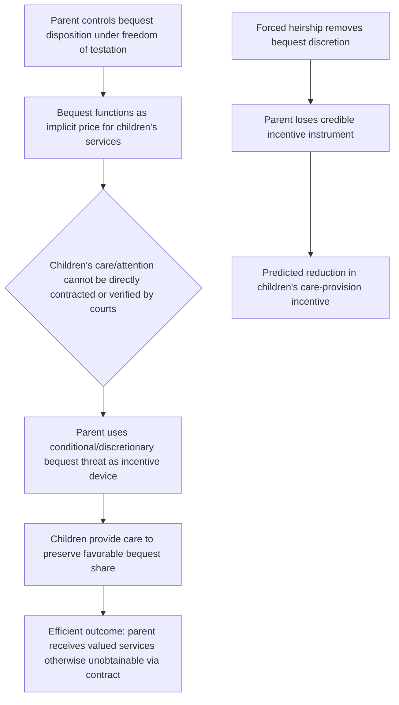

## Economic Rationale for Freedom of Testation

### Conceptual Foundations

**Key Points**

- Freedom of testation is the legal principle allowing property owners to direct the distribution of their wealth after death via a will, largely as they choose, subject to limited legal constraints (forced heirship rules, spousal elective shares, public policy limits).
- The economic case for freedom of testation rests on extending the standard efficiency justifications for private property rights and freedom of contract to the disposition of wealth at death: if an owner has the right to consume, transfer, or destroy property during life, extending that control to the moment of death (rather than treating death as an automatic transfer of control to the state or to statutorily mandated heirs) preserves the incentive structure that makes private property valuable in the first place.
- The competing institutional alternatives against which freedom of testation is evaluated are **intestacy defaults** (statutory distribution rules applying absent a valid will), **forced heirship regimes** (mandatory minimum shares for certain heirs, common in civil law systems), and **confiscatory/high estate taxation** (state capture of a large share of the decedent's wealth), each with distinct economic properties.

Testation can be understood as the final exercise of an owner's property rights — the ability to determine, subject to legal limits, who benefits from wealth accumulated over a lifetime. Law and economics analysis of this right draws on several interconnected strands: incentive effects on savings and bequest behavior, the use of bequests as an instrument within intergenerational bargaining, transaction-cost arguments for freedom of contract applied to testamentary instruments, and the treatment of a will as a mechanism for correcting information gaps that intestacy's uniform default cannot address.

### The Incentive Argument: Bequest Motives and Savings Behavior

**Key Points**

- If individuals derive utility from control over the disposition of their wealth after death (a "bequest motive"), restricting testamentary freedom reduces the expected utility from lifetime saving and wealth accumulation, potentially reducing savings rates below the socially efficient level.
- Economic models of bequest motives are typically classified into three types: the **altruistic bequest motive** (parents value children's welfare directly, as in Barro-Becker dynastic models), the **strategic/exchange bequest motive** (bequests are used instrumentally to purchase services, attention, or compliance from potential heirs), and the **accidental bequest motive** (bequests arise merely from uncertain lifespan combined with imperfect annuity markets, rather than from any deliberate intent to transfer wealth).
- The strength of the incentive argument for freedom of testation depends critically on which bequest motive dominates: freedom of testation matters most where bequests are strategic or altruistically discretionary, and matters least where bequests are purely accidental (since an accidental bequest, by definition, was not shaped by anticipated legal constraints on its distribution).

In the pure altruistic (dynastic) model, a testator's utility function incorporates each heir's utility directly:

$$U_{\text{parent}} = u(c_{\text{parent}}) + \sum_i \beta_i \, U_i(\text{heir}_i)$$

Under this specification, freedom of testation allows the parent to allocate bequests across heirs according to the $\beta_i$ weights (reflecting relative altruistic concern, need, or other private information the parent holds about each heir), which a rigid, uniform intestacy or forced-heirship rule (typically equal division among children) cannot replicate — an efficiency loss whenever heirs' relevant circumstances (wealth, need, family size, health) genuinely differ, since equal statutory division is optimal under this framework only in the special case where heirs are otherwise identical.

[Inference] Empirically distinguishing altruistic from strategic from accidental bequest motives is a well-known identification challenge in the household finance and public economics literature, because all three motives can be observationally similar in aggregate savings and bequest data; most tests rely on more specific implications (e.g., whether bequest division correlates with children's relative income — the strategic model's "compensatory" prediction — versus whether it correlates with the amount of attention/care provided by each child — the strategic "exchange" model's prediction) rather than a single decisive test.

### The Strategic Bequest Motive and Testamentary Freedom as a Bargaining Instrument

**Key Points**

- Bernheim, Shleifer, and Summers (1985) formalized the **strategic bequest motive**, modeling bequests as a price parents can use to purchase services, visits, or care from adult children in a setting where such services cannot be efficiently contracted for directly (a classic incomplete-contracts problem, since courts cannot verify or enforce "attentiveness" or "care" as contractual performance).
- Under this model, **freedom of testation is economically essential**, not merely valuable: if parents cannot credibly threaten to alter bequest shares based on children's behavior (because the law mandates equal or fixed division), they lose their primary instrument for inducing children to provide services that benefit the parent, predicting a measurable decline in children's attentiveness/care-provision under a forced-heirship regime relative to a freedom-of-testation regime.
- This model generates a distinctive testable prediction: bequest division under the strategic model should be correlated with **variation in attention or care actually provided**, rather than with children's relative need or income (the pattern predicted by a purely altruistic model) — providing an empirical basis for distinguishing the two motives using data on unequal bequests and their correlates.

### Freedom of Testation as an Extension of Freedom of Contract

**Key Points**

- A parallel economic argument treats a will as simply another form of contract (a unilateral, revocable-until-death instrument directing the disposition of the testator's own property), and applies the standard efficiency case for freedom of contract: individuals possess private information about their own preferences, family circumstances, and the relative merits of potential beneficiaries that a uniform statutory default cannot capture.
- Under this view, forced heirship and rigid intestacy rules impose a **one-size-fits-all default** analogous to a mandatory contract term that cannot be varied by the parties — inefficient whenever the testator's actual preferences and family circumstances deviate from the assumptions built into the statutory default (e.g., equal division among children regardless of differing need, differing prior gifts already received, estrangement, or a child's own independent wealth).
- The efficiency case is strongest where the **testator's private information is genuinely superior** to what a court or legislature could feasibly determine ex post or ex ante (e.g., knowledge of which child provided years of unpaid caregiving, which child has special needs, which relationships have broken down) — precisely the information a discretionary instrument like a will can encode that a rule-based default cannot.

### Intestacy as a "Default Rule": Majoritarian and Information-Forcing Functions

**Key Points**

- Intestacy statutes function economically as **default contract terms** in the sense developed in general contract theory (Ayres-Gertner): they specify the outcome that applies when a testator fails to execute a valid will, and good default design should minimize the total social cost of that failure across the population of decedents who die intestate.
- A **majoritarian default** approach designs intestacy rules to match what most testators would have wanted (typically, distribution to spouse and children in specified shares), minimizing the number of decedents for whom the default produces an outcome contrary to their actual wishes, thereby minimizing the aggregate cost of dying without a will.
- A distinct **information-forcing (or "penalty") default** approach would instead deliberately set intestacy rules to an outcome most people would dislike, inducing testators with atypical preferences to reveal them by executing a will — a design that is economically attractive in some contract contexts (forcing efficient disclosure) but is **generally disfavored for intestacy law**, because the population dying intestate skews toward those with the least access to legal services, the least financial sophistication, and the least ability to respond to a "penalty" default by executing a will in time.

[Inference] This disfavoring of information-forcing intestacy defaults reflects a distributional/access-to-justice consideration layered onto the pure default-rule efficiency logic: a penalty default is efficient only if the population facing it can respond by contracting around it at reasonably low cost, which is a weaker assumption for intestate decedents (who by definition failed to execute a will, often due to cost, procrastination, or lack of access to counsel) than for sophisticated commercial contracting parties, so most scholars characterize majoritarian design as the dominant, though not universally applied, principle in modern intestacy statute drafting.

### Limits on Freedom of Testation: Forced Heirship and Elective Shares

**Key Points**

- Nearly all legal systems impose **some** limits on testamentary freedom, reflecting competing economic and non-economic concerns that qualify the pure freedom-of-testation case.
- **Civil law forced heirship regimes** (common in France, much of continental Europe, and Latin America) reserve a mandatory minimum share (the "légitime" or "reserved portion") of the estate for specified heirs (typically children and sometimes a surviving spouse), which the testator cannot disinherit regardless of stated intent.
- **U.S. common law systems** generally reject forced heirship for children but retain a **spousal elective share** (or community property rules in community property states), guaranteeing a surviving spouse a minimum share of the marital estate regardless of the decedent-spouse's will — an intra-marital protection distinct from, but conceptually related to, the household-bargaining and hold-up-problem protections discussed in the divorce-law-incentives literature (a spouse's implicit contribution to marital wealth accumulation, including via specialization in home production, is protected against complete testamentary disinheritance).

The economic rationale for the spousal elective share parallels the **hold-up problem** analysis applied to divorce law: a spouse who specialized in home production over a long marriage made a relationship-specific investment premised on an implicit expectation of sharing in the resulting marital wealth; unrestricted testamentary freedom would allow the other spouse to expropriate that investment via complete disinheritance at death, undermining the same specialization incentives that a well-functioning marital bargain is meant to protect. Forced heirship for children is harder to justify on pure hold-up grounds (children generally do not make comparable relationship-specific investments premised on inheritance), and is more often explained by non-efficiency, distributive, or family-solidarity rationales specific to civil law legal traditions.

| Constraint | Population Protected | Primary Economic Rationale |
| --- | --- | --- |
| Spousal elective share / community property | Surviving spouse | Protects against expropriation of relationship-specific investment (hold-up problem parallel to divorce law) |
| Forced heirship for children (civil law) | Children (statutorily specified share) | Distributive/family-solidarity rationale; weaker efficiency-based justification |
| Public policy limits (e.g., conditions against public policy, certain restraints on marriage) | General public / specific beneficiaries | Prevents testamentary terms imposing negative externalities or undermining other legal policies |
| Estate/inheritance taxation | State (via tax base) | Revenue and wealth-concentration concerns; distinct from testamentary-freedom limits per se but interacts with net bequest incentives |

### Interaction with Estate Taxation

**Key Points**

- Estate and inheritance taxation is analytically distinct from restrictions on the *freedom to choose beneficiaries* (forced heirship) but economically interacts with freedom of testation because it affects the **net incentive to accumulate and bequeath wealth** regardless of how freely the testator may allocate the after-tax remainder.
- High estate tax rates can, in principle, reduce the incentive effects of freedom of testation described above (weakening the strategic bequest motive's bargaining power and the altruistic motive's savings incentive) even while leaving the testator's formal legal freedom to allocate the estate among beneficiaries fully intact.
- Optimal estate tax design in the public economics literature (e.g., work building on Kopczuk and others) explicitly incorporates bequest-motive heterogeneity: optimal tax rates differ depending on whether the marginal bequest is altruistically, strategically, or accidentally motivated, since only intentional (altruistic or strategic) bequests generate the behavioral/incentive distortions that standard optimal taxation theory treats as a cost of taxation, while accidental bequests (arising from mortality risk under incomplete annuity markets) can in principle be taxed with less efficiency cost since they were not the object of a deliberate savings decision.

[Unverified] The precise optimal estate tax rate implied by this heterogeneous-bequest-motive framework is highly sensitive to the assumed mixture of bequest motives in the population and to modeling choices regarding intergenerational altruism, and remains an active area of theoretical and empirical public economics research rather than a settled policy conclusion.

### Related Topics

- Intestacy rules as default rules: majoritarian versus information-forcing design (Ayres-Gertner framework)
- The strategic bequest motive: empirical tests using unequal bequest data
- Spousal elective share and community property as hold-up problem protections
- Optimal estate and inheritance taxation under heterogeneous bequest motives
- Trusts as instruments for extending testamentary control beyond outright bequests
- Comparative civil law forced heirship regimes versus common law testamentary freedom
- Dynastic/altruistic models of intergenerational transfers (Barro-Becker framework)
- The economics of charitable bequests and tax-incentivized giving