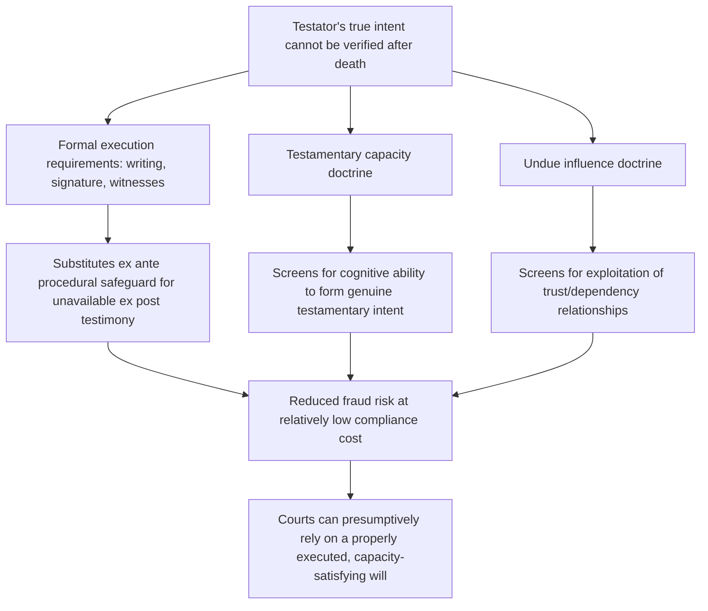

## Limits on Testamentary Freedom

### Conceptual Foundations

**Key Points**

- No legal system grants testators unlimited control over the disposition of their property at death; every jurisdiction imposes some combination of substantive limits (mandatory shares, public policy restrictions) and formal/procedural limits (execution formalities, capacity requirements) on testamentary freedom.
- Economically, these limits can be understood as responses to distinct market failures and non-efficiency concerns that qualify the baseline efficiency case for freedom of testation: **externalities on third parties** (spouses, dependents, creditors, the state), **verification and fraud-prevention problems** unique to a transaction that takes effect only after the transacting party is deceased and unavailable to confirm intent, and **distributive/paternalistic concerns** independent of pure efficiency.
- The limits fall into several analytically distinct categories, each with its own economic logic: **capacity and formality requirements** (addressing verification and fraud), **forced heirship/elective share rules** (addressing hold-up and dependency protection), **public policy restrictions on conditions** (addressing externalities and incentive distortions), **the Rule Against Perpetuities and related dead-hand control limits** (addressing intergenerational efficiency), and **creditor and tax claims** (addressing externalities on non-family third parties).

Unlike ordinary contracts, a will is a unique legal instrument in that it takes effect only when the party who could best explain or defend its terms — the testator — is no longer available to do so, and cannot be renegotiated, clarified, or contested through direct testimony of the primary party. This single structural feature underlies much of the distinct doctrinal apparatus surrounding wills (attestation requirements, capacity doctrine, undue influence doctrine) that has no close parallel in ordinary contract law.

### Capacity and Formality Requirements: Solving the Verification Problem

**Key Points**

- **Testamentary capacity** doctrine (requiring the testator to understand the nature of the act, the extent of their property, and the natural objects of their bounty) and **formal execution requirements** (writing, signature, witnesses, sometimes notarization) exist primarily to solve a verification problem: because the testator cannot be examined after death to confirm the document reflects genuine intent, the legal system substitutes ex ante procedural safeguards for the ex post testimony that would resolve disputes in an ordinary contract case.
- Formal execution requirements function economically as a **screening/authentication mechanism**, analogous to notarization or witnessing requirements in other legal contexts where fraud risk is elevated and the principal party cannot later confirm authenticity — the cost of compliance (finding witnesses, following statutory formalities) is deliberately low relative to the fraud-prevention benefit, reflecting a considered tradeoff between formality costs and fraud-detection benefits.
- **Undue influence doctrine** addresses a related but distinct concern: even a testator with full capacity and a properly executed will may have been manipulated by a beneficiary in a position of trust or dependency (a caregiver, a much-younger companion, an isolated elderly testator's sole regular visitor) — an information-asymmetry and exploitation concern structurally similar to the unconscionability concerns discussed in the premarital agreement analysis, but here compounded by the testator's unavailability to rebut the claim of manipulation.

[Inference] The economic case for formality requirements is strongest where compliance costs are low relative to the population of testators (a simple attested written will), and weaker justification exists for formalities that impose disproportionate costs on testators with limited access to legal services — a concern reflected in the gradual relaxation of strict-compliance formality doctrine toward "substantial compliance" or "harmless error" standards in a number of modern U.S. jurisdictions, which trade some fraud-detection precision for reduced error costs when a testator's genuine intent is otherwise clear despite a technical formality defect.

### Forced Heirship and Spousal Elective Shares Revisited as Limits

**Key Points**

- As developed in the freedom-of-testation analysis, **spousal elective shares** (common law) and **forced heirship** (civil law) are the most direct substantive limits on testamentary freedom, guaranteeing specified heirs a minimum share regardless of the will's stated terms.
- From the limits-focused perspective, the key economic question is **where to set the mandatory minimum**: too low, and the hold-up/dependency-protection rationale (protecting a spouse's relationship-specific investment) is under-served; too high, and the efficiency benefits of testamentary discretion (private-information-based, need-based, or strategic-incentive-based allocation) are correspondingly crowded out.
- Most common law jurisdictions calibrate the elective share as a **fraction of the estate** (often one-third to one-half, sometimes scaled to length of marriage) rather than a fixed absolute amount, reflecting an implicit recognition that the appropriate minimum protection scales with the size of the marital estate and the duration of the underlying relationship-specific investment.

### Public Policy Restrictions on Testamentary Conditions

**Key Points**

- Courts refuse to enforce testamentary conditions that violate public policy, even when the underlying disposition (a bequest to a chosen beneficiary) would itself be entirely permissible — this category addresses **externalities imposed by the specific conditions attached to a bequest**, as distinct from restrictions on who may receive the bequest at all.
- Commonly voided condition categories include: **conditions in total restraint of marriage** (a bequest conditioned on a beneficiary never marrying), **conditions requiring divorce or encouraging family dissolution**, **conditions violating anti-discrimination or other strong public policies** (e.g., historically, conditions requiring a beneficiary to practice or abstain from a particular religion have received mixed treatment depending on jurisdiction and the condition's severity), and **conditions that are impossible, illegal, or unduly burdensome to administer**.
- The economic logic parallels the **verifiability and enforceability limits** discussed for personal-conduct clauses in premarital agreements: conditions requiring courts to monitor and adjudicate highly personal, hard-to-verify future conduct (marital status, religious practice, relationship choices) impose high ongoing administrative and litigation costs on the court system for the indefinite future, while also potentially imposing significant **negative externalities on third parties** (e.g., a condition against marriage may pressure a beneficiary to forgo a marriage that would otherwise be efficient/welfare-enhancing, purely to preserve inheritance rights).

**Example**: A bequest conditioned on a beneficiary "never remarrying" has historically received mixed treatment — some jurisdictions void such conditions outright as against public policy (total restraints on marriage), while others enforce a *partial* restraint (e.g., a condition operative only during a limited period, or providing support only "while widowed," reflecting a legitimate support-continuity purpose rather than a punitive restraint) — illustrating that courts often distinguish between conditions serving a **legitimate, non-punitive economic purpose** (continuing support tied to genuine need) and those serving primarily to **control beneficiary behavior for its own sake**, with the latter facing substantially higher risk of invalidation.

### The Rule Against Perpetuities and Limits on Dead-Hand Control

**Key Points**

- The **Rule Against Perpetuities (RAP)** and related doctrines (the rule against unreasonable restraints on alienation, statutory trust-duration limits) restrict how far into the future a testator's control over property disposition can extend, addressing a distinct economic concern from the other limits discussed above: **intergenerational efficiency and the cost of "dead-hand control."**
- The classical RAP formulation voids any future interest that might vest later than 21 years after the death of some "life in being" at the time the interest was created — a rule whose underlying economic rationale is to prevent testators from tying up property in **inalienable or contingent arrangements indefinitely**, which would impose efficiency costs on future generations who cannot freely reallocate that property to higher-valued uses as circumstances change.
- The economic critique of excessive dead-hand control parallels concerns about **inefficient long-term contracts and incomplete contracting** discussed elsewhere in this chapter: a testator, however well-intentioned, cannot anticipate all future contingencies (changes in beneficiaries' circumstances, changes in the value or usefulness of specific property, unforeseen social and economic change), and rigid multi-generational restrictions risk locking property into an allocation that becomes increasingly inefficient as the gap between the testator's death and the present grows.

$$\text{Efficiency cost of dead-hand control} \; \propto \; f(\text{duration of restriction}, \, \text{rigidity of restriction}, \, \text{divergence between testator's assumptions and future states of the world})$$

**Example**: Many U.S. states have modernized or abolished the traditional common-law RAP in favor of statutory alternatives — such as a flat maximum permissible vesting period (e.g., 90 or 360-plus years under various state "wait-and-see" or USRAP-influenced statutes) or, in a significant minority of states, outright abolition of RAP for certain trust instruments (enabling so-called "dynasty trusts" that can persist for many generations) — reflecting an active, unresolved policy debate about the appropriate balance between honoring testator intent over long horizons and preserving intergenerational allocative efficiency. [Unverified] The competitive dynamic among states in relaxing or abolishing RAP to attract trust business (sometimes discussed as a "race to the bottom" or alternatively a "race to satisfy settlor demand" in the trusts and estates literature) is a widely discussed phenomenon, but characterizing its net welfare effect is contested and depends on normative views about the appropriate weight to give long-horizon dead-hand control.

### Creditor Claims and Tax Claims as External Limits

**Key Points**

- Beyond limits protecting family members or preventing dead-hand inefficiency, testamentary freedom is further bounded by the claims of **creditors** (an estate's debts generally must be satisfied before distribution to beneficiaries) and the **state's tax claims** (estate or inheritance taxes), both of which reflect the basic principle that a testator cannot use death to extinguish obligations to third parties who are not voluntary beneficiaries of the estate plan.
- Economically, creditor-priority rules address a straightforward **externality/opportunism concern**: absent a priority rule ensuring creditors are paid before voluntary beneficiaries, testators (or, more precisely, testators anticipating insolvency) would have an incentive to use testamentary transfers to place assets beyond creditors' reach, undermining the credibility of lifetime credit markets that price loans partly on the expectation of estate-level recovery in the event of death before full repayment.
- **Fraudulent transfer** and **fraudulent conveyance** doctrines extend this logic to certain *lifetime* transfers made in contemplation of death or in an attempt to defeat creditor claims, closing an obvious avoidance channel that would otherwise undermine the creditor-priority principle at the moment of death.

### Comparative Summary Table

| Limit Category | Market Failure / Concern Addressed | Economic Mechanism |
| --- | --- | --- |
| Capacity and execution formalities | Verification problem (testator unavailable to confirm intent) | Ex ante procedural screening substitutes for ex post testimony |
| Undue influence doctrine | Exploitation of trust/dependency relationships | Screens for manipulation given testator's post-death unavailability |
| Spousal elective share / forced heirship | Hold-up/expropriation of relationship-specific investment | Mandatory minimum share protects dependent-spouse contribution |
| Public policy limits on conditions | Externalities from highly personal, hard-to-verify conditions | Courts refuse to enforce conditions with high administrative/social cost |
| Rule Against Perpetuities | Intergenerational efficiency; incomplete contracting over long horizons | Time-limits dead-hand control to preserve future reallocation flexibility |
| Creditor priority rules | Opportunistic asset-shielding from legitimate creditors | Ensures estate settles obligations before voluntary bequests |

### Related Topics

- Economic rationale for freedom of testation and bequest motive theory
- Undue influence and capacity doctrine: comparative evidentiary standards
- Trusts as instruments for extending or circumventing dead-hand control limits
- Dynasty trusts and the state-level competition over Rule Against Perpetuities reform
- Fraudulent conveyance and fraudulent transfer doctrine in estate planning
- Optimal estate and inheritance taxation under heterogeneous bequest motives
- Comparative civil law forced heirship versus common law elective share systems
- Incomplete contracts theory applied to long-duration trust instruments