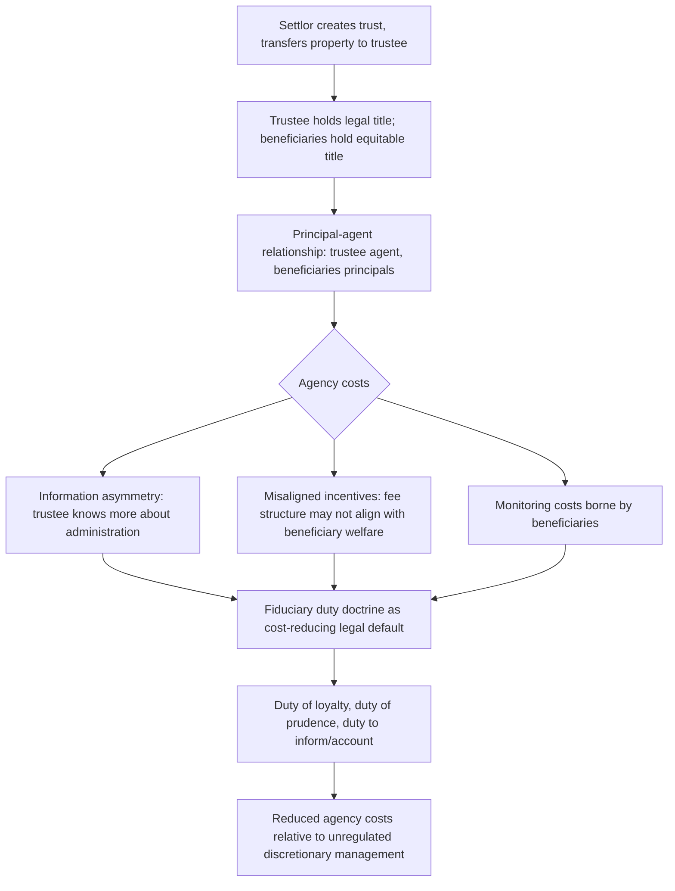

## Trusts as Instruments of Economic Planning

### Conceptual Foundations

**Key Points**

- A trust is a legal arrangement splitting property ownership into **legal title** (held by a trustee, who manages the property) and **equitable/beneficial title** (held by beneficiaries, who receive the economic benefit), a structural bifurcation with no close analogue in outright ownership or simple testamentary bequests.
- Economically, this bifurcation is what makes trusts uniquely valuable as **planning instruments**: separating control from enjoyment allows a settlor (the person creating the trust) to solve problems that neither outright ownership transfer nor a simple will can address — including managing property for beneficiaries who cannot or should not manage it themselves, spreading control and benefit across multiple parties and time horizons, and imposing conditions and discretion on distributions in ways ordinary transfers cannot replicate.
- The law and economics literature analyzes trusts through several overlapping lenses: **agency theory** (the trustee-beneficiary relationship as a principal-agent problem), **incomplete contracting** (a trust instrument as a long-duration relational contract that cannot specify every future contingency), **risk-pooling and diversification** (professional trustee management, spendthrift protection), and **tax and asset-protection planning** (trusts as vehicles for tax-efficient and creditor-resistant wealth transfer).

Unlike a will (a one-time, immediately-executed transfer at death) or an outright lifetime gift (an immediate, unconditional transfer of full ownership), a trust creates an **ongoing managerial relationship** that can persist for years, decades, or (subject to Rule Against Perpetuities-type limits discussed in the prior item) even longer, governed by a trust instrument that the settlor drafts once but that must be administered by a trustee across a potentially long and uncertain future.

### The Trustee-Beneficiary Relationship as an Agency Problem

**Key Points**

- The relationship between trustee and beneficiary is a canonical **principal-agent problem**: the trustee (agent) controls and manages property for the benefit of beneficiaries (principals) who typically lack the information, expertise, or legal authority to directly manage the trust assets themselves.
- This generates the classic agency-cost concerns studied in corporate governance and applied finance: **information asymmetry** (the trustee typically knows more about the trust's actual administration, investment decisions, and expenses than beneficiaries do), **misaligned incentives** (a trustee compensated by a percentage-of-assets fee may favor asset growth over income distributions beneficiaries need, or may favor investment strategies that minimize the trustee's own effort or liability rather than maximizing beneficiary welfare), and **monitoring costs** (beneficiaries must expend resources to verify the trustee is fulfilling fiduciary obligations).
- The law responds with a dense body of **fiduciary duty doctrine** — the duty of loyalty (no self-dealing), the duty of prudence/care (the "prudent investor rule" in modern U.S. trust law, generally requiring diversification and a portfolio-level risk-return analysis rather than a legalistic list of "approved" investments), the duty to inform and account (mandatory disclosure to beneficiaries) — functioning as a set of **default and mandatory contractual terms** designed to reduce agency costs that would otherwise be prohibitively costly for individual beneficiaries to negotiate and monitor themselves.

[Inference] The shift from traditional "legal list" investment statutes (specifying categorically approved investment types) to the modern **Prudent Investor Rule** and **Uniform Prudent Investor Act** framework (evaluating trustee investment decisions based on overall portfolio risk-return characteristics and diversification, consistent with modern portfolio theory) reflects a broader law-and-economics-informed modernization of fiduciary standards, moving from a rigid, categorical rule toward a more economically grounded, portfolio-level prudence standard — though the specific pace and form of this adoption vary by jurisdiction.

### Trusts as a Solution to Incomplete Contracting Over Long Horizons

**Key Points**

- A trust instrument is a **relational contract** that must govern an uncertain future — the settlor cannot specify in advance every contingency that might arise over the trust's duration (beneficiaries' changing needs, market conditions, tax law changes, family circumstances such as divorce, disability, or addiction).
- Trust law responds to this incompleteness with a **default-and-discretion architecture**: rather than attempting to specify a complete contingent plan, settlors typically grant trustees varying degrees of **discretion** (from fully discretionary "spray" or "sprinkle" trusts, where the trustee decides how much to distribute to which beneficiaries and when, to fully mandatory trusts specifying fixed distribution schedules), delegating the resolution of unanticipated future contingencies to a trustee exercising fiduciary judgment rather than attempting ex ante to draft for every possible state of the world.
- This mirrors the general **incomplete contracts** insight (Grossman-Hart-Moore-type reasoning) that when contracting costs make full contingent specification infeasible, allocating **residual decision rights** to a party (here, the trustee, bound by fiduciary duty) is often more efficient than attempting an exhaustive but necessarily imperfect contingent contract.

**Example**: A **discretionary support trust** for a settlor's minor children might instruct the trustee to distribute income and principal "as needed for health, education, maintenance, and support," rather than specifying precise dollar amounts or a fixed schedule — delegating to the trustee's judgment, informed by future circumstances the settlor could not have anticipated (which child develops special medical needs, which pursues expensive graduate education, which faces unexpected financial hardship), the resolution of a contingency space too large to specify completely at the time of drafting.

### Spendthrift Trusts and Asset Protection

**Key Points**

- A **spendthrift trust** includes a provision restricting a beneficiary's ability to voluntarily transfer (sell, assign) their beneficial interest and, in most jurisdictions, also shields that interest from most creditor claims until distributions are actually made to the beneficiary.
- Economically, spendthrift provisions address a specific problem: absent such protection, a beneficiary with poor financial self-control, susceptibility to undue influence, or exposure to creditor claims (including, in some cases, divorcing spouses) could have trust benefits diverted before ever reaching the beneficiary's actual use, defeating the settlor's intended purpose of providing ongoing, protected support.
- The doctrine represents a considered exception to the general common-law principle disfavoring **restraints on alienation** (which normally limits property owners' ability to render an interest permanently non-transferable, for the efficiency reasons discussed regarding dead-hand control) — justified here specifically because the settlor is restricting transferability of an interest they themselves created and are giving away, rather than attempting to restrict the transferability of property already owned outright by the restricted party.

[Inference] The economic justification for spendthrift protection is generally framed as protecting a **paternalistic or precautionary settlor intent** (providing support that survives the beneficiary's own poor decisions or predatory creditors) rather than a pure efficiency argument in the Coasean sense, since spendthrift restrictions do, by design, limit the beneficiary's own contractual freedom over their beneficial interest — a tradeoff the law accepts because the interest being restricted was a gift from the settlor rather than the beneficiary's pre-existing property.

### Trusts as Tax and Estate Planning Instruments

**Key Points**

- Beyond management and protection functions, trusts are extensively used as vehicles for **tax-efficient wealth transfer**, exploiting specific features of estate, gift, and generation-skipping transfer tax regimes (in the U.S. context) to reduce the tax cost of intergenerational wealth transmission relative to outright transfers.
- Common tax-planning trust structures include: **irrevocable life insurance trusts (ILITs)** (removing life insurance proceeds from the taxable estate), **grantor retained annuity trusts (GRATs)** (transferring future asset appreciation above a hurdle rate to beneficiaries at reduced gift-tax cost), **qualified personal residence trusts (QPRTs)**, and **generation-skipping trusts** (using the generation-skipping transfer tax exemption to transfer wealth to grandchildren or later generations while minimizing the number of times transfer tax is imposed across generations).
- Economically, the widespread use of these instruments is best understood as a **tax-arbitrage response to differential tax treatment** of different transfer forms and timings — a standard result in public economics that when a tax system treats economically similar transactions differently based on legal form or timing, sophisticated taxpayers will substitute toward the lower-taxed form, and much of sophisticated trust and estate practice can be characterized as this kind of legal-form substitution in response to the tax code's specific structure.

[Unverified] The precise revenue and distributional effects of these tax-planning trust structures are subjects of ongoing empirical and policy debate (including periodic legislative proposals to curtail specific techniques such as "zeroed-out" GRATs), and quantifying the aggregate scale of tax base erosion attributable to trust-based planning versus other estate-tax-avoidance channels requires data and analysis beyond a general conceptual description.

### Dynasty Trusts and the Interaction with Perpetuities Reform

**Key Points**

- As discussed in the limits-on-testamentary-freedom analysis, a number of U.S. states have relaxed or abolished the Rule Against Perpetuities for trust instruments, enabling **dynasty trusts** capable of persisting for many generations, sometimes in perpetuity.
- Dynasty trusts combine several of the economic functions discussed above simultaneously: extended discretionary management (agency-theoretic delegation to a professional or institutional trustee across generations), spendthrift-style creditor protection sustained indefinitely, and — critically for their popularity — potential exemption from transfer taxation at each successive generational transition, since assets held in a properly structured dynasty trust may avoid being included in any individual beneficiary's own taxable estate.
- This combination has generated the state-level competitive dynamic noted previously (jurisdictions relaxing perpetuities and related trust-friendliness rules, such as favorable trustee liability limitations and privacy provisions, to attract trust-formation business), raising the same intergenerational-efficiency concerns discussed under dead-hand control, now compounded by the added consideration of long-run tax-base effects from assets held largely outside the estate tax system across multiple generations.

### Comparative Table: Trust Structures and Their Primary Economic Function

| Trust Type | Primary Economic Function | Key Mechanism |
| --- | --- | --- |
| Discretionary support trust | Delegating resolution of unanticipated future contingencies | Trustee discretion bound by fiduciary standard, substituting for infeasible complete contract |
| Spendthrift trust | Protecting beneficiary interest from self-control failures and creditors | Restraint on alienation exception justified by gift/settlor-intent rationale |
| Irrevocable life insurance trust (ILIT) | Removing an asset class from the taxable estate | Ownership held outside settlor's estate at death |
| Grantor retained annuity trust (GRAT) | Transferring future appreciation at reduced gift-tax cost | Retained annuity interest reduces the taxable gift value of the remainder |
| Generation-skipping trust | Minimizing the number of taxable transfer events across generations | Direct benefit to skip-generation beneficiaries within tax exemption limits |
| Dynasty trust | Long-horizon (potentially perpetual) wealth preservation and tax deferral | Combines perpetuities relaxation, spendthrift protection, and estate-tax exclusion across generations |

### Related Topics

- Limits on testamentary freedom: Rule Against Perpetuities and dead-hand control
- Fiduciary duty doctrine: the duty of loyalty and the Prudent Investor Rule
- Agency theory and principal-agent problems in corporate governance (comparative application)
- Incomplete contracts theory (Grossman-Hart-Moore) applied to relational and long-duration instruments
- Optimal estate, gift, and generation-skipping transfer taxation
- Economic rationale for freedom of testation and the strategic bequest motive
- Comparative international trust law: civil law fiducie/treuhand analogues versus common law trusts
- State-level competition in trust law: perpetuities reform, decanting statutes, and trustee liability limitations