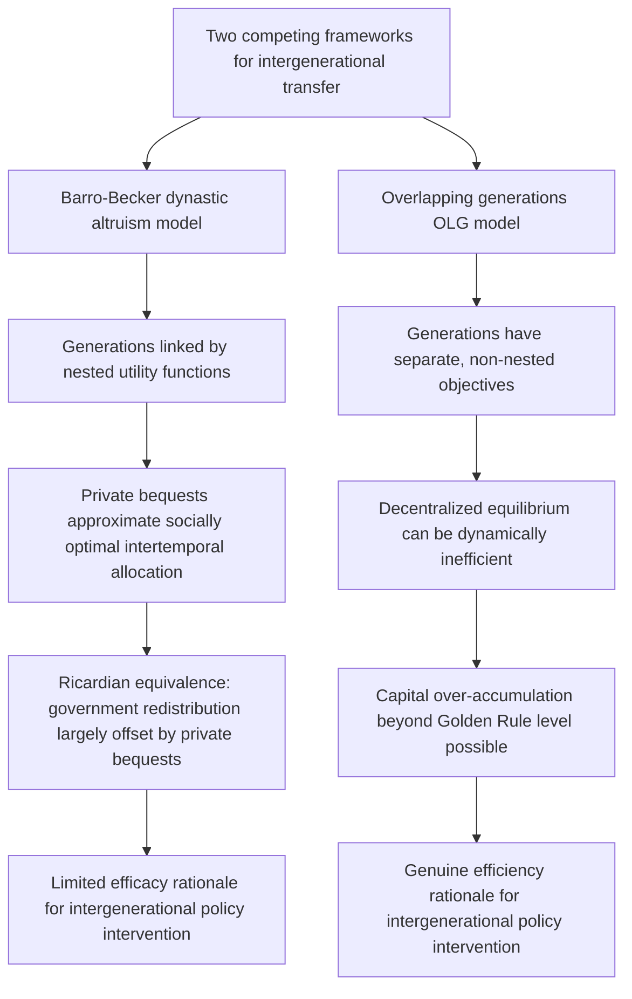

## Intergenerational Wealth Transfer and Efficiency

### Conceptual Foundations

**Key Points**

- Intergenerational wealth transfer analysis studies how bequests, inter vivos gifts, and human capital investments passed from one generation to the next affect aggregate savings, capital accumulation, growth, and the efficient allocation of resources across generations who cannot directly bargain with one another.
- The central analytical challenge distinguishing this topic from ordinary intra-generational transfers is that **future generations cannot participate in the transactions that shape their inheritance**: a parent's savings and bequest decisions are made unilaterally (or via bargaining only with a spouse and living family members), with no possibility of the child generation negotiating terms, which raises distinct efficiency questions absent from standard two-party contracting analysis.
- The dominant theoretical frameworks are the **altruistic dynastic model** (Barro-Becker), which treats successive generations as if linked by a single extended-family utility function, and **overlapping generations (OLG) models** (Samuelson-Diamond), which explicitly model distinct generations with separate objectives, coexisting and interacting only during overlapping periods of life, generating fundamentally different efficiency predictions about capital accumulation and the role of bequests.

Because future generations are not present at the bargaining table when wealth-transfer decisions are made, standard voluntary-exchange-based efficiency arguments (a transaction is presumed efficient if both parties consent) do not directly apply across generations in the same way — this creates space for the two frameworks below to reach starkly different efficiency conclusions about the same underlying phenomenon (private saving and bequests).

### The Barro-Becker Dynastic Model: Bequests as Efficiency-Restoring

**Key Points**

- In the Barro-Becker altruistic model, each generation's utility function includes the discounted utility of its immediate descendant, who in turn cares about their own descendant, generating (via recursive substitution) an effectively infinite-horizon "dynastic" utility function even though each individual has a finite lifespan.
- Under this framework, **voluntary bequests function as an efficiency-restoring mechanism**: because parents internalize their children's welfare (and, through the recursive chain, all future descendants' welfare), private savings and bequest decisions approximate the socially optimal intertemporal allocation of resources that a fully informed social planner maximizing the same dynastic objective would choose — a result closely related to the famous **Ricardian equivalence** proposition (government debt/deficit-financed transfers are neutralized by offsetting private bequest adjustments, since altruistic parents undo any attempt to shift the effective tax burden onto future generations they care about).
- This generates a strong (and heavily debated) policy implication: if the dynastic altruism assumption holds, government intervention to redistribute across generations (e.g., via debt-financed spending, or forced savings/social security schemes) may be largely offset by private bequest adjustments, limiting the efficacy of such policies for achieving intergenerational redistribution.

$$U_0 = u(c_0) + \beta \, U_1 = u(c_0) + \beta \big[ u(c_1) + \beta \, U_2 \big] = \sum_{t=0}^{\infty} \beta^t \, u(c_t)$$

where each generation's consumption $c_t$ reflects both their own income and the bequest received from/left to adjacent generations, and $\beta$ is the intergenerational discount factor reflecting parental altruism toward the next generation.

[Inference] The empirical validity of the strict Barro-Becker dynastic model — and particularly of Ricardian equivalence, its most testable implication — is a long-contested question in macroeconomics; most empirical tests have found only partial or limited support for full Ricardian offsetting behavior, suggesting that pure dynastic altruism, if present, is not the sole or dominant motive shaping observed savings and bequest behavior for most households, consistent with the broader difficulty (noted in the freedom-of-testation analysis) of empirically isolating altruistic from strategic or accidental bequest motives.

### Overlapping Generations (OLG) Models and Potential Inefficiency

**Key Points**

- Samuelson (1958) and Diamond (1965) developed **overlapping generations models** in which distinct generations, each with separate and non-nested objective functions (not linked by dynastic altruism), coexist and trade only during the overlapping portion of their lives, fundamentally changing the efficiency analysis of intergenerational resource allocation relative to the Barro-Becker framework.
- A central and striking result of OLG theory is that the **decentralized competitive equilibrium can be dynamically inefficient**: it is theoretically possible for an economy to over-accumulate capital to the point where the capital stock exceeds the "Golden Rule" level that would maximize steady-state consumption per generation — a genuine market failure in which every generation could be made better off by a coordinated reduction in savings, but no individual generation can achieve this outcome unilaterally because doing so requires cooperation with generations not yet born (or already deceased) who cannot participate in any bargain.
- This dynamic inefficiency result provides a distinct and, unlike the dynastic model, **efficiency-based (not merely distributive) rationale for government intervention** in intergenerational transfers — for example, via a pay-as-you-go social security system, which can in principle move the economy from a dynamically inefficient over-saving equilibrium toward the Golden Rule, a result with no analogue in the Barro-Becker framework (where private bequest behavior already achieves the dynastically optimal allocation by assumption).

### Comparative Table: Dynastic vs. OLG Efficiency Implications

| Dimension | Barro-Becker Dynastic Model | Overlapping Generations (OLG) Model |
| --- | --- | --- |
| Generational linkage | Nested altruism (single effective infinite-horizon planner) | Separate, non-nested generational objectives |
| Private savings/bequests | Efficiency-restoring; approximates social optimum | May produce dynamically inefficient (excess) capital accumulation |
| Ricardian equivalence | Holds (in the strict theoretical model) | Does not generally hold |
| Rationale for policy intervention | Limited — private behavior already near-optimal | Genuine efficiency rationale possible (e.g., correcting over-accumulation) |
| Role of social security / pay-as-you-go transfers | Largely offset by private bequest adjustment | Can improve welfare by shifting equilibrium toward Golden Rule |

### Human Capital as a Distinct Channel of Intergenerational Transfer

**Key Points**

- Beyond financial bequests, intergenerational wealth transfer occurs substantially through **investment in children's human capital** (education, health, skills), a channel emphasized in Becker and Tomes-style models of intergenerational income mobility, which can be economically more significant in aggregate terms than direct financial bequests for most households.
- Human capital transfers raise a distinct **efficiency question relative to financial bequests**: unlike a financial bequest (a pure transfer with no independent productive return beyond whatever the recipient does with it), human capital investment is itself a **productive investment decision** subject to standard investment-efficiency criteria (the marginal return to an additional dollar of education/health investment in a child should, in an efficient allocation, be equalized across children and compared against the market return on financial capital).
- Because credit markets for financing human capital investment in children are typically **imperfect or absent** (children cannot borrow against their own future human capital to finance their own optimal investment, and cannot contract with a lender independent of their parents), parental wealth becomes a binding constraint on human capital investment for liquidity-constrained families — generating a distinct mechanism for the **intergenerational transmission of economic status** that operates through underinvestment in human capital by low-wealth families, rather than through the direct transfer of financial wealth itself.

[Inference] This credit-constraint-driven human capital transmission channel is a leading explanation in the intergenerational mobility literature for the persistence of income and wealth differences across generations independent of direct financial bequests, though the relative empirical importance of credit constraints versus other transmission channels (genetic/ability inheritance, neighborhood and peer effects, direct preference transmission, social network effects) remains an actively studied and only partially resolved empirical question.

### Efficiency Implications of Unequal Bequest Division

**Key Points**

- Building on the strategic and altruistic bequest-motive analysis from the freedom-of-testation item, the efficiency properties of **equal versus unequal bequest division** among multiple children depend critically on the underlying motive and on whether children's circumstances (wealth, need, human capital already received) are genuinely symmetric.
- Under a pure altruistic model with equal parental concern for each child's utility (not their consumption level), efficient bequest division should generally **compensate for differences in children's own earning capacity or wealth** (an "equalizing" pattern, transferring relatively more to lower-income children, since a dollar generates more utility for a poorer child under standard diminishing marginal utility assumptions) — a prediction that empirical studies of actual bequest patterns have found **mixed support for**, with many households instead dividing bequests equally regardless of children's differing circumstances.
- One influential explanation for the empirical prevalence of **equal division despite unequal children's circumstances** is that parents value the appearance of fairness or wish to avoid signaling favoritism (preserving family harmony) — a consideration outside the pure wealth-maximizing efficiency framework but consistent with parents holding a distinct utility component for perceived equal treatment, alongside (rather than purely instead of) altruistic concern for each child's realized utility level.

[Speculation] The tension between the "compensatory" prediction of a pure altruistic-utility model and the widely observed empirical norm of equal division is sometimes explained in the literature by appeal to fairness norms or the strategic value of a clear, easily-verifiable equal-division rule in reducing sibling conflict and post-death litigation risk — but disentangling these competing explanations empirically is difficult, and this characterization should be read as a summary of proposed explanations in the literature rather than a settled resolution of the puzzle.

### Estate Taxation and Intergenerational Efficiency

**Key Points**

- The intergenerational efficiency frameworks above directly inform the **optimal estate taxation** literature (touched on in the freedom-of-testation item): whether estate taxation is efficiency-reducing (distorting an already-optimal private allocation, as the strict Barro-Becker model would suggest) or potentially efficiency-neutral-or-improving (correcting a dynamically inefficient over-accumulation equilibrium, as OLG-based reasoning might suggest) depends on which underlying model of intergenerational linkage more accurately describes actual behavior.
- This theoretical ambiguity is a leading reason optimal estate tax design remains contested in public economics: the same policy instrument (estate taxation) has starkly different normative implications depending on the assumed structure of intergenerational preferences and the empirical extent of dynamic inefficiency (or its absence) in the economy being modeled.

### Related Topics

- Economic rationale for freedom of testation and bequest motive theory
- Optimal estate and inheritance taxation under heterogeneous bequest motives
- Overlapping generations models and dynamic efficiency (Golden Rule capital accumulation)
- Ricardian equivalence: theory and empirical tests
- Credit constraints and intergenerational income/wealth mobility (Becker-Tomes framework)
- Social security systems and their interaction with private intergenerational transfers
- Trusts as instruments of economic planning across generations
- Human capital theory and educational investment under liquidity constraints