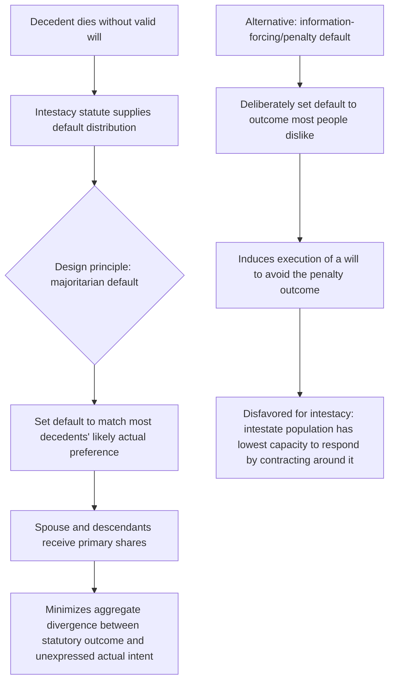

## Intestacy Rules as Default Allocations

### Conceptual Foundations

**Key Points**

- Intestacy statutes specify how a decedent's probate estate is distributed when the decedent dies without a valid will (or with a will that fails to dispose of the entire estate), and are best understood in law and economics terms as a **statutory default rule** — the outcome the legal system supplies to fill a gap the parties (here, a single party, the decedent) did not fill themselves.
- This framing directly imports the general theory of **default rules in contract law** (developed by Ayres and Gertner and others) into the trusts-and-estates context: because drafting a complete, individually tailored estate plan is costly (in legal fees, time, and the cognitive/emotional cost of confronting mortality), a substantial share of decedents will always die intestate, making the **content of the default** a first-order determinant of actual outcomes for a large population.
- The economic design question is not whether to have a default (some default is unavoidable — property cannot simply remain ownerless), but **what the default rule's content should be**, and this chapter item builds directly on the majoritarian-versus-information-forcing distinction introduced in the freedom-of-testation analysis, examining it in more structural detail.

Empirically, a substantial fraction of adults in most jurisdictions — and a majority in some studies of the U.S. population — die without a valid will, meaning intestacy statutes are not a marginal or rarely-invoked backstop but the **operative estate plan for a very large population**, giving outsized practical importance to getting the default's design right relative to its comparatively modest role in legal education and scholarly attention relative to testate estate planning.

### The Majoritarian Default Principle Applied to Intestacy

**Key Points**

- The **majoritarian default** design principle holds that a statutory default should be set to match the outcome that the largest feasible share of the affected population would have chosen for themselves, thereby minimizing the number of decedents for whom the default produces a result contrary to their actual (unexpressed) wishes.
- Modern U.S. intestacy statutes (heavily influenced by the **Uniform Probate Code**, adopted in some form across a majority of states) generally implement a majoritarian design: a surviving spouse typically receives all or a substantial share of the estate (with the share often depending on whether the decedent has surviving descendants from outside the current marriage, and whether those descendants are also descendants of the surviving spouse), with any remainder passing to descendants, and further contingent categories of relatives (parents, siblings, more remote kin) inheriting only in the absence of a surviving spouse or descendants.
- This structure is designed to approximate what **survey and historical-pattern evidence** suggests most decedents would actually want: primary provision for a surviving spouse and children, since these are typically the intended primary beneficiaries of the large majority of actual wills, meaning the intestacy default is calibrated to minimize the "error cost" (divergence from actual preferences) across the broadest possible share of the intestate population.

### Why Information-Forcing Defaults Are Disfavored for Intestacy

**Key Points**

- In general contract theory, an **information-forcing (or "penalty") default** can be efficient when it induces a party with private information to reveal that information by contracting around an unattractive default — the classic example being a default rule assigning liability to whichever party has better information, inducing that party to disclose or contract explicitly rather than bear the default's cost.
- Applying this logic to intestacy would suggest deliberately setting an unattractive default (e.g., escheat to the state, or distribution to distant relatives most decedents would not choose) specifically to induce more people to execute wills — but this approach is **generally rejected in intestacy design** for a structural reason distinguishing intestate decedents from typical contracting parties: the population that dies intestate is systematically composed of those **least able to respond to the incentive** the penalty default would create.
- Individuals who die intestate disproportionately include those who **procrastinated**, lacked **access to affordable legal services**, held **lower financial literacy or awareness** of the consequences of dying without a will, or died **unexpectedly** before executing a plan they may have intended to create — none of which are corrected by making the default outcome worse, since a penalty default only functions efficiently when the target population can and will respond to the penalty by taking the alternative contracting action, an assumption that fails for a population characterized precisely by its inability or failure to engage in estate planning in the first place.

[Inference] This access-to-justice-inflected critique of information-forcing intestacy defaults is a recurring theme in the trusts-and-estates law and economics literature and explains why virtually all modern reform efforts (including the Uniform Probate Code's periodic revisions) have moved toward refining majoritarian accuracy (e.g., updating spousal and stepchild provisions to better track modern family structures such as blended families and non-marital cohabitation) rather than toward more punitive default designs intended to spur additional will execution.

### Structural Features of Modern Intestacy Statutes

**Key Points**

- Modern intestacy schemes typically allocate the estate through a hierarchical, prioritized sequence of relationship categories, with each subsequent category inheriting only if no member of a prior category survives the decedent — a design intended to track the presumed strength of the decedent's typical relational and economic ties.
- The **Uniform Probate Code's** approach to the spousal share is illustrative of majoritarian refinement over time: rather than a single fixed spousal fraction, the UPC scales the surviving spouse's share based on factors correlated with the likely strength of competing claims — for example, providing the spouse the entire estate if all of the decedent's descendants are also descendants of the surviving spouse (and the spouse has no other surviving descendants from a prior relationship), but reducing the spouse's share when the decedent has descendants from a relationship outside the current marriage, reflecting a majoritarian judgment that most decedents in a blended-family situation would want to provide for children from a prior relationship rather than have the entire estate pass through the current spouse alone.
- **Per stirpes versus per capita distribution rules** (governing how a deceased descendant's share is redistributed among that descendant's own children) represent a further layer of default design, addressing a contingency (predeceased descendants leaving their own children) that requires a further sub-default within the broader intestacy scheme.

| Priority Category | Typical Modern Treatment | Majoritarian Rationale |
| --- | --- | --- |
| Surviving spouse (no other-relationship descendants) | Often entire estate | Presumed strongest, most complete relational and economic tie |
| Surviving spouse + descendants also of that spouse, plus decedent's other-relationship descendants | Spouse receives a share; remainder to descendants | Balances spousal provision against presumed intent to provide for all descendants |
| Descendants (no surviving spouse) | Estate divided among descendants, often per stirpes | Presumed primary object of bounty absent a spouse |
| Parents (no spouse or descendants) | Estate to surviving parent(s) | Presumed next-closest relational tie |
| Siblings, then more remote kin | Estate to next surviving category in sequence | Extends the presumed-closeness ranking outward |
| No surviving qualifying relatives | Escheat to the state | Residual default when no plausible private claimant exists |

### Non-Marital Partners and the Limits of the Intestacy Default

**Key Points**

- A significant and well-documented limitation of majoritarian intestacy design is its treatment of **non-marital cohabiting partners**, who typically receive **no share whatsoever** under standard intestacy statutes regardless of relationship duration or economic interdependence, directly connecting this item to the domestic-partnership-and-cohabitation analysis discussed earlier in this chapter.
- This gap is a direct consequence of the **verifiability problem** discussed in that earlier analysis: because cohabitation lacks the bright-line, publicly recorded formation event that marriage provides, extending an automatic intestate share to cohabitants would require intestacy administrators (probate courts) to make exactly the kind of costly, fact-intensive determinations (was this a marriage-like relationship? for how long? with what degree of interdependence?) that a well-designed default rule is generally supposed to avoid.
- The practical consequence is that surviving cohabitants — who may be economically indistinguishable from a surviving spouse in every respect except formal marital status — are entirely dependent on either having executed a valid will (defeating the purpose of relying on a default) or falling back on the general contract/equity doctrines (the *Marvin*-style implied contract or unjust enrichment claims) discussed in the cohabitation-law item, which impose substantially higher litigation costs and less certain recovery than an intestate spousal share.

[Unverified] Some jurisdictions have begun extending limited intestacy-like rights to registered domestic partners or, in a smaller number of cases, to long-term cohabitants meeting specific statutory criteria, but the extent and consistency of this trend across U.S. states and other common law jurisdictions varies considerably and is not comprehensively characterized here; a jurisdiction-specific inquiry would be needed to assess current treatment in any particular location.

### Advancements, Disclaimers, and Renunciation as Modifications to the Default

**Key Points**

- Intestacy defaults interact with several doctrines allowing modification of the otherwise-applicable statutory outcome even absent a will: the **advancement doctrine** (treating a substantial lifetime gift to an heir as a prepayment against that heir's intestate share, correcting for the majoritarian assumption that the decedent intended equal treatment among same-category heirs when lifetime gifts suggest otherwise), and **disclaimer/renunciation** (allowing an heir to refuse an intestate inheritance, which then passes as though the disclaiming heir had predeceased the decedent).
- Disclaimer functions economically as a **limited private-ordering escape valve within an otherwise mandatory default system**: it allows an heir with superior private information about the optimal allocation (for example, an heir who is already financially secure and would prefer the inheritance pass directly to their own children, or an heir facing tax or creditor considerations that make declining the inheritance advantageous) to partially correct the statutory default's inflexibility without requiring the decedent to have executed a will, functioning as a narrow but meaningful safety valve against the rigidity inherent in any one-size-fits-all default rule.

### Related Topics

- Economic rationale for freedom of testation and bequest motive theory
- Limits on testamentary freedom: forced heirship and spousal elective shares
- Economic analysis of domestic partnership and cohabitation law: the verifiability problem revisited
- Default rules in contract theory: majoritarian versus information-forcing design (Ayres-Gertner)
- The Uniform Probate Code: comparative adoption and structural features across states
- Per stirpes and per capita distribution methods: comparative design and effects
- Advancement, disclaimer, and renunciation doctrines in estate administration
- Access to justice and the demand for affordable estate planning services