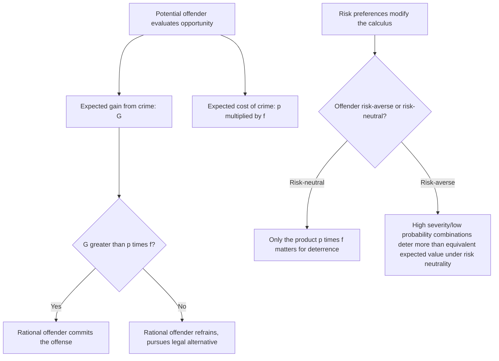

## The Becker Model of Crime and Optimal Enforcement

### Conceptual Foundations

**Key Points**

- Gary Becker's "Crime and Punishment: An Economic Approach" (1968) launched the modern economic analysis of criminal law by treating criminal behavior as the outcome of **rational choice under uncertainty**, rather than as pathology or irrationality — a potential offender weighs the expected benefits of crime against the expected costs, including the probability of detection and the severity of punishment.
- This reframing shifts the central policy question from "how do we prevent inherently deviant behavior" to an **optimization problem**: given that offenders respond to incentives, what combination of enforcement resources (probability of apprehension, $p$) and sanction severity ($f$, the fine or punishment) minimizes the total social cost of crime, including the cost of crime itself, the cost of enforcement, and the cost of punishment?
- The model's core innovation is recognizing a **fundamental substitutability** between probability and severity as deterrence instruments: because expected punishment is (in the simplest formulation) the product $p \cdot f$, the same expected deterrent effect can in principle be achieved by a high probability of a mild sanction or a low probability of a severe sanction — but these combinations differ sharply in their resource cost and risk implications, which is the crux of the model's policy relevance.

Becker's framework treats the decision to commit a crime as analogous to any other economic decision under uncertainty: a rational potential offender commits an offense if and only if the expected utility from doing so exceeds the expected utility from the best available legal alternative, given the offender's subjective assessment of the probability of apprehension and conviction and the severity of the resulting sanction.

### The Offender's Expected Utility Calculation

**Key Points**

- A risk-neutral potential offender compares the certain gain from a legal alternative against the **expected value** of committing the offense, which nets the gain from the crime against the expected cost of punishment.
- Under risk neutrality, the offender commits the crime if the gain from the offense exceeds the expected punishment cost:

$$G > p \cdot f$$

where $G$ is the private gain from the offense, $p$ is the subjective probability of apprehension and conviction, and $f$ is the monetized severity of the sanction if caught.

- If offenders are **risk-averse** rather than risk-neutral (a common and arguably more realistic assumption for many offense types, particularly involving prison sentences with irreversible personal costs), the same expected punishment $p \cdot f$ deters more effectively than under risk neutrality, because a risk-averse offender weighs the variance of the outcome (a small chance of severe punishment versus a certain but smaller cost) unfavorably — this asymmetry is central to why probability and severity are not perfect substitutes once risk preferences are incorporated (see below).

### The Social Planner's Optimization Problem

**Key Points**

- Becker frames the policymaker's problem as minimizing the **total social cost of crime**, comprising three components: the **harm caused by offenses that still occur** ($D$, damage), the **cost of enforcement** (resources spent achieving a given probability of apprehension, $C(p)$, increasing and typically convex in $p$), and the **cost of imposing punishment** itself (which varies dramatically by sanction type, a point developed further below).
- The optimization is typically written as minimizing:

$$\text{Social Cost} = D(1-p) \cdot N(p,f) + C(p) \cdot N(p,f) + b \cdot f \cdot N(p,f)$$

(in various formulations), where $N(p,f)$ is the number of offenses committed, itself decreasing in both $p$ and $f$ per the offender's rational decision rule above, and $b$ is a parameter reflecting the social cost per unit of the sanction (crucially, **not always equal to 1**, since different sanction types impose different social costs per unit of deterrent value delivered — the key insight developed in the next section).

- A central comparative-statics result of the model is that because **increasing detection probability $p$ is resource-costly** (requiring more police, investigators, prosecutors, courts) while **increasing sanction severity $f$ is comparatively cheap at the margin** (writing a longer sentence into a statute costs little to nothing directly, though it has other costs — see below), a purely enforcement-cost-minimizing planner would be tempted to favor **low probability, high severity** regimes, since this achieves any given level of expected punishment ($p \cdot f$) at lower direct enforcement-resource cost.

### Why "Low Probability, High Severity" Is Not Simply Optimal: The Marginal Deterrence Problem

**Key Points**

- The naive implication that severity should be maximized while probability is minimized (to economize on enforcement costs) is checked by several important qualifications developed in the subsequent literature, the most significant being the **marginal deterrence problem**: if sanctions are already at or near their maximum severity for a given offense, there is no way to impose an even harsher sanction to specifically deter a **more serious escalation** of that same offense.
- If armed robbery and murder carry the same maximum sanction, for example, an offender who has already committed armed robbery faces **no additional expected cost** from also committing murder to eliminate a witness, undermining the marginal incentive to refrain from escalating — implying that an efficient sanction schedule must preserve **increasing severity across a graduated scale of offense seriousness**, which limits how far severity can be pushed for any single offense category without compressing the schedule and eroding marginal deterrence for more severe offenses.
- This marginal deterrence concern is a primary economic rationale (distinct from proportionality-based retributive justifications) for maintaining a **graduated sentencing structure** in which the severity of punishment scales with the seriousness of the offense, rather than imposing uniformly maximal sanctions across all offense categories.

[Inference] The marginal deterrence argument is widely treated as a robust theoretical qualification to the simple "maximize severity, minimize probability" implication of the baseline Becker model, though translating it into precise quantitative guidance for how much a sanction schedule should be graduated in practice requires additional empirical input (on the actual distribution of offense-escalation decisions) that the pure theoretical model alone does not supply.

### Risk-Aversion and the Case for Probability Over Severity

**Key Points**

- As noted above, if offenders are risk-averse, a given level of expected punishment achieved through **higher probability and lower severity** may actually deter *more effectively per dollar of enforcement cost* than the reverse combination, because a certain, moderate sanction is more strongly discounted-against by a risk-averse decision-maker than an equivalent-expected-value but higher-variance gamble on a severe sanction with low probability — this directly counters the naive cost-minimization argument for extreme severity.
- Additionally, **exclusive reliance on severity while probability is very low** risks a form of **desensitization or salience decay**: if apprehension is sufficiently rare, potential offenders may substantially **underweight or misperceive** the true (low) probability of detection (a behavioral economics concern distinct from Becker's original fully-rational framework, but frequently incorporated into extensions of the model), which would undermine the deterrent effect of even very severe sanctions if offenders do not accurately perceive how unlikely detection actually is.

[Speculation] The behavioral-economics-informed critique regarding offenders' subjective misperception of low probabilities is a meaningful extension beyond Becker's original fully rational-expectations framework, and while it is widely discussed in later law-and-economics and criminology literature, the specific magnitude of any such perception bias (and whether it is large enough to reverse the basic policy prescription in particular contexts) would require empirical study specific to the offense type and population in question rather than a general theoretical claim.

### The Distinctive Social Cost of Different Sanction Types

**Key Points**

- A central refinement to Becker's original framework, developed extensively by Polinsky and Shavell and others, emphasizes that different sanction types have **dramatically different social costs per unit of deterrent value delivered**, which the simple $p \cdot f$ formulation obscures by treating all sanctions as interchangeable in social cost.
- **Monetary fines** are, from a pure social-cost perspective, close to a **costless transfer**: a fine paid by an offender to the state is (ignoring collection costs and offender wealth constraints) largely a redistribution rather than a net social resource loss, making fines the theoretically preferred sanction wherever feasible, since they achieve deterrence at near-zero net social cost.
- **Imprisonment**, by contrast, is enormously socially costly: it requires substantial direct expenditure (housing, guarding, feeding the incarcerated), imposes a **deadweight loss** on the offender (lost liberty and lost productive output during incarceration) that is not offset by any corresponding transfer or benefit to society, and generates significant additional social costs (family disruption, reduced post-release earning capacity, potential criminogenic effects of incarceration itself).

| Sanction Type | Approximate Social Cost Character | Key Limiting Factor |
| --- | --- | --- |
| Monetary fine | Near-costless transfer (minus collection costs) | Offender's ability to pay (judgment-proof problem); may under-deter wealthy offenders and over-deter poor ones for the same offense |
| Imprisonment | High social cost: incarceration expenditure plus deadweight loss of offender's lost liberty/output | Justified primarily where fines cannot achieve sufficient deterrence (see below) |
| Probation/community supervision | Moderate cost: supervision expenditure, lower deadweight loss than incarceration | Weaker incapacitation effect than imprisonment |
| Capital punishment | High direct and (in practice) very high procedural/appellate cost | Irreversibility raises acute error-cost concerns absent from other sanction types |

**Example**: The **judgment-proof problem** directly parallels its role in tort law (discussed in the tort-insurance analysis earlier in this course): a sufficiently wealth-constrained offender cannot be deterred by a fine larger than their total assets, since a fine exceeding wealth is effectively capped at confiscation of everything the offender owns — this is the primary economic justification, within the Becker-Polinsky-Shavell framework, for resorting to costly non-monetary sanctions like imprisonment specifically for offenses or offenders where the optimal deterrent fine would exceed the offender's ability to pay.

### The Polinsky-Shavell Extension: Optimal Use of Fines and Imprisonment

**Key Points**

- Polinsky and Shavell formalized the policy implication following directly from the fines-are-cheap, imprisonment-is-costly distinction: the **socially optimal enforcement strategy relies on monetary fines up to the maximum an offender can feasibly pay**, resorting to costly imprisonment only for the residual deterrence needed beyond what a wealth-constrained fine can achieve.
- This generates a further prediction: because wealthier offenders have a higher effective "fine ceiling," the model predicts (as a matter of pure cost-minimizing enforcement design, independent of any retributive consideration) that wealthier offenders should, in principle, face proportionally more fine-based and less imprisonment-based sanctions than judgment-proof offenders for equivalent offenses — a prediction in some tension with common retributive-justice intuitions about equal treatment, illustrating a recurring point of friction between the pure economic-efficiency framework and other normative commitments embedded in actual criminal law systems.

[Inference] This wealth-differentiated sanction prediction is a genuine implication of the pure Polinsky-Shavell cost-minimization logic, but it is not, in practice, how most legal systems structure sanctions (which generally aim for offense-based rather than offender-wealth-based sanction differentiation, subject to some exceptions such as day-fines used in several European jurisdictions that scale fine amounts to offender income) — this divergence between the model's efficiency-based prescription and actual legal practice is frequently cited as illustrating the limits of a pure economic-efficiency framework as a complete positive or normative account of criminal sanctioning, given the weight most legal systems place on considerations (equal treatment, retribution, proportionality independent of wealth) outside the model's optimization function.

### Enforcement Cost and the Probability Margin

**Key Points**

- The cost function $C(p)$ governing how expensive it is to raise the probability of detection is typically modeled as **increasing and convex** in $p$: achieving very high detection probabilities (approaching certainty) requires disproportionately large enforcement expenditures relative to achieving moderate probabilities, reflecting diminishing returns to additional police, surveillance, and investigative resources.
- This convexity provides an independent (enforcement-cost-based, as opposed to marginal-deterrence-based or risk-aversion-based) rationale for the observed real-world reliance on **moderate detection probabilities combined with more-than-proportionally severe sanctions** for many offense categories, since achieving very high $p$ directly is prohibitively expensive at the margin.
- The socially optimal $p^*$ balances the **marginal enforcement cost of raising detection probability** against the **marginal social benefit** of the resulting reduction in offenses (via increased deterrence), following the standard economic first-order condition that marginal cost should equal marginal benefit at the optimum — a direct application of general optimal-resource-allocation logic to the specific context of law enforcement budgeting.

### Related Topics

- Polinsky-Shavell theory of optimal fines and imprisonment
- The judgment-proof problem: parallel treatment in tort law and criminal law
- Marginal deterrence and graduated sentencing schedules
- Behavioral economics critiques of the rational-offender assumption
- Day-fines and income-scaled monetary sanctions: comparative international practice
- Public choice theory and the political economy of criminal sentencing policy
- Incapacitation, rehabilitation, and retribution as alternative (non-deterrence) justifications for punishment
- Plea bargaining as a mechanism affecting the effective probability and severity of sanctions