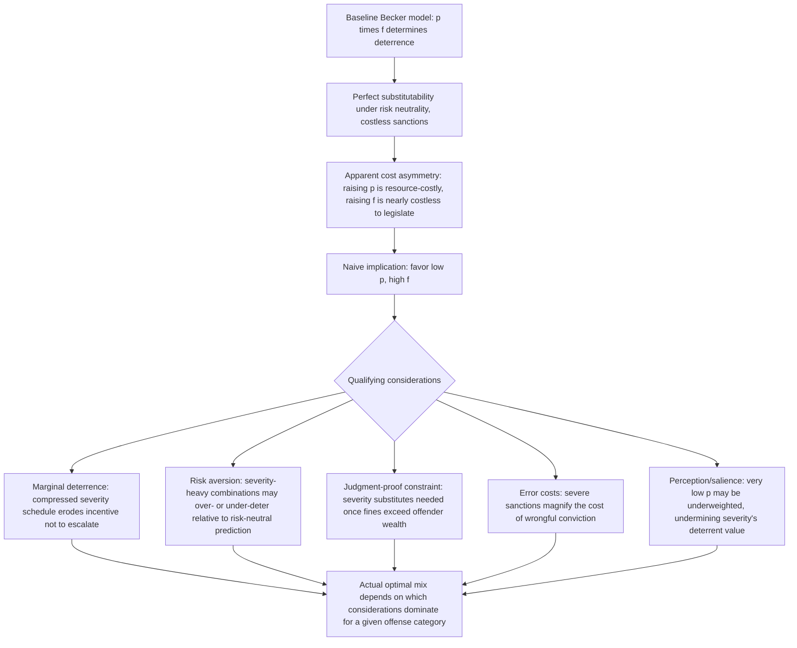

## Probability of Detection Versus Severity of Punishment

### Conceptual Foundations

**Key Points**

- The choice between investing enforcement resources in **raising the probability of detection** ($p$) versus increasing the **severity of punishment** ($f$) is the central instrument-design question in the economic theory of criminal deterrence, building directly on the Becker framework's expected-punishment formulation $p \cdot f$.
- Although the baseline model treats $p$ and $f$ as substitutes that produce the same deterrent effect for the same product, the two instruments differ sharply along multiple dimensions once the model is extended to incorporate realistic features: **enforcement cost structure**, **offender risk preferences**, **marginal deterrence across offense categories**, **the judgment-proof constraint**, and **error costs from wrongful conviction**.
- The practical upshot of this literature is that the probability-severity choice is not a matter of indifference once these extensions are incorporated — different offense contexts and institutional settings systematically favor different mixes, and much of the applied law-and-economics literature on criminal sanctions is devoted to identifying which considerations dominate in which settings.

This item consolidates and extends, from the specific perspective of the probability-versus-severity tradeoff, several considerations introduced in the general Becker model discussion (marginal deterrence, risk-aversion, the judgment-proof problem, enforcement cost convexity) alongside additional considerations — most notably error costs and behavioral perception effects — that bear specifically on how enforcement resources should be allocated between the two margins.

### The Baseline Substitutability Result and Its Fragility

**Key Points**

- Under the simplest Becker assumptions (risk-neutral offenders, costless and error-free sanctions, no marginal-deterrence concerns across offense categories), $p$ and $f$ enter the offender's decision rule only through their product, implying **perfect substitutability**: any $(p, f)$ combination yielding the same $p \cdot f$ produces identical deterrence.
- This substitutability result is the theoretical starting point but is **not intended as a realistic policy conclusion** — Becker himself, and virtually all subsequent literature, treats it as a baseline to be qualified by the frictions and asymmetries discussed below, which is why "should society rely more on catching more offenders or punishing them more severely" remains a live and empirically contested policy question rather than one resolved by the baseline model alone.
- The key asymmetry motivating departure from pure substitutability is that **raising $p$ is directly resource-costly** (police, forensic investigation, prosecutorial capacity, court throughput — all requiring real expenditure with diminishing returns) while **raising $f$ is comparatively cheap to legislate** (a longer sentence written into a statute has near-zero direct drafting cost), creating an apparent cost asymmetry favoring severity — an asymmetry immediately complicated by the considerations below.

### Risk Aversion Reconsidered: When Severity Becomes Relatively More Costly to Deploy

**Key Points**

- If offenders are **risk-averse**, a low-probability/high-severity combination achieving a given expected punishment $p \cdot f$ deters *more* than the equivalent expected value delivered via a high-probability/low-severity combination — because risk-averse decision-makers disproportionately weight the possibility of the bad (severe) outcome, effectively meaning **severity-heavy regimes achieve a given deterrent effect at a lower expected-punishment cost** than the risk-neutral analysis suggests.
- This appears, at first glance, to strengthen the case for relying on severity over probability — but it must be weighed against the fact that **imprisonment (the primary lever for severity beyond the fine-affordability ceiling) carries a large social cost per unit of severity**, as developed in the Polinsky-Shavell framework, meaning the "cheap deterrence" that risk-aversion delivers through severity is cheap only from the *offender's decision-calculus* perspective, not necessarily from the *social cost-accounting* perspective once the cost of actually imposing and administering severe sanctions is included.
- The correct synthesis is that **risk aversion favors severity as a deterrence-per-expected-punishment-dollar instrument**, while **the social cost of severe sanctions (particularly imprisonment) favors probability and fines as a deterrence-per-social-cost-dollar instrument** — these two effects pull in opposite directions, and which dominates depends on the specific offense, the availability of fines (governed by the judgment-proof constraint), and the actual social cost of the available severe sanctions.

### The Judgment-Proof Constraint as a Forcing Mechanism Toward Severity

**Key Points**

- As developed in the Becker model discussion, when an offender's wealth is insufficient to pay a fine equal to the socially optimal deterrent level, **fines alone cannot achieve adequate deterrence**, and the enforcement system must supplement or substitute with non-monetary (typically severity-based, via imprisonment) sanctions to make up the shortfall.
- This means the probability-versus-severity tradeoff is **not offense-invariant**: for offenses predominantly committed by wealth-constrained offenders (many street crimes, for example), the judgment-proof constraint mechanically forces greater reliance on severity (via imprisonment, since fines are capped by wealth) relative to offenses predominantly committed by higher-wealth offenders (many white-collar and regulatory offenses), where fines can, in principle, achieve substantial deterrence at much lower social cost.
- This directly explains a broad empirical regularity remarked upon in the law and economics literature: **white-collar and corporate offenses are disproportionately sanctioned via monetary fines and civil penalties**, while **many street-level offenses rely much more heavily on imprisonment** — a pattern consistent with the judgment-proof-constrained optimal-mix logic, rather than (or in addition to) any independent normative judgment about offense severity.

[Inference] While this judgment-proof-based explanation is a standard and widely cited application of the Polinsky-Shavell framework, actual observed sentencing patterns across offense types also reflect numerous other factors (historical/political sentencing norms, statutory mandatory minimums, prosecutorial discretion, public perception of offense seriousness) not captured by the pure optimal-enforcement model, so this economic explanation should be understood as one significant contributing factor among several rather than a complete positive account of observed sentencing practice.

### Marginal Deterrence and the Limits of "Maximize Severity"

**Key Points**

- As introduced in the Becker model discussion, if the maximum feasible severity is already applied to a given offense, there is **no further severity margin available to specifically deter an escalation** to a more serious version of that offense (or to a categorically more serious offense committed in the course of the original one) — undermining any policy that pushes severity to its maximum for a broad range of offenses simultaneously.
- From the probability-versus-severity perspective specifically, this implies that **once severity approaches its practical or legal ceiling for a category of offenses, further deterrence gains must come from the probability margin instead**, since the severity margin is exhausted — a structural reason that even a strong theoretical preference for severity (from the risk-aversion or enforcement-cost-savings arguments) cannot be pushed indefinitely without reintroducing reliance on probability-based investment.
- This creates a natural **graduated allocation**: for the most severe offense categories (where sanctions already approach practical or constitutional/humanitarian ceilings — e.g., maximum sentence lengths, restrictions on cruel and unusual punishment), additional deterrence effort must come predominantly from raising detection probability rather than severity, while for less severe offense categories with more available headroom on the severity scale, the severity margin remains available as a comparatively resource-cheap deterrence lever.

### Error Costs: Wrongful Conviction and the Asymmetric Risk of Severity

**Key Points**

- A consideration specific to the probability-versus-severity tradeoff (and largely orthogonal to the baseline Becker framework, which generally assumes accurate conviction of the guilty) is that **increasing sanction severity increases the social cost of any wrongful conviction**, since a false conviction under a severe sanction regime (e.g., a long prison sentence or capital punishment) imposes vastly greater harm on an innocent defendant than the same false conviction would under a milder sanction regime.
- This generates an **asymmetric error-cost argument favoring investment in detection accuracy (which affects both the probability of catching true offenders and the probability of wrongly convicting innocent parties) over simply escalating severity**, particularly for offense categories or evidentiary contexts where wrongful conviction risk is non-trivial — a consideration that pushes toward channeling enforcement-improvement resources into investigative and evidentiary accuracy (forensic reliability, eyewitness identification procedures, adequate defense resources) rather than purely toward statutory sentence escalation.
- This error-cost consideration is particularly emphasized in the literature and public debate surrounding **capital punishment**, where the sanction's irreversibility means any wrongful conviction cannot be corrected after the fact, making the error-cost asymmetry maximally severe for that specific sanction relative to any reversible alternative.

[Unverified] Quantifying the precise wrongful-conviction rate for any given offense category or jurisdiction is methodologically difficult (by definition, confirmed wrongful convictions are typically identified only through subsequent exonerating evidence, meaning the observed exoneration rate is likely a lower bound on the true wrongful-conviction rate), so while the qualitative error-cost argument is well established in the literature, translating it into a precise optimal-severity adjustment for any specific offense category would require empirical inputs beyond what the general theoretical framework alone provides.

### Behavioral Considerations: Perception of Probability and the Limits of Severity-Heavy Strategies

**Key Points**

- Extensions of the Becker model incorporating **bounded rationality and probability misperception** (drawing on behavioral economics, e.g., prospect-theory-style overweighting or underweighting of small probabilities) suggest that potential offenders may not accurately perceive very low objective detection probabilities, which would undermine the effectiveness of a strategy relying heavily on severity while probability is minimized to save enforcement costs.
- If offenders **underweight small probabilities** (treating a 2% detection chance as negligible, effectively "rounding down" to zero), then further reductions in an already-low $p$ combined with compensating increases in $f$ may deliver **much less additional deterrence than the pure $p \cdot f$ formula predicts**, since the offender's subjective decision calculus no longer tracks the true expected value once $p$ falls below some behaviorally relevant threshold.
- Conversely, some behavioral models suggest the opposite bias is also plausible in certain contexts — **overweighting of small probabilities** (a well-documented feature of prospect theory in some domains) — which would instead suggest that low-probability, high-severity regimes could be *more* effective than the risk-neutral rational model predicts, illustrating that the sign and magnitude of behavioral departures from Becker's rational-actor assumption is context-dependent rather than uniformly pointing in one policy direction.

[Speculation] Because empirical evidence on probability perception varies by context, offense type, and the population of potential offenders being studied (with some studies finding meaningful support for a deterrent role of increased certainty of punishment relative to severity, and criminological research on "certainty versus severity" often emphasizing certainty as the more empirically robust deterrent margin), the net direction and magnitude of behavioral departures from the classical model's probability-severity substitutability remains an area of active empirical inquiry rather than one with a single settled conclusion applicable across all offense contexts.

### Synthesis: Factors Favoring Probability vs. Factors Favoring Severity

**Key Points**

- The applied literature does not offer a single universal answer to the probability-versus-severity question; instead, it identifies **context-dependent factors** that shift the optimal mix in one direction or the other, summarized below.

| Factor | Favors Higher Probability | Favors Higher Severity |
| --- | --- | --- |
| Offender risk preference | — | Risk-averse offenders: severity deters more per expected-punishment-dollar |
| Sanction social cost | Fines (cheap) achievable within offender wealth | — |
| Judgment-proof constraint | — | Wealth-constrained offenders exhaust the fine margin, forcing reliance on severity |
| Marginal deterrence across offense categories | Once severity nears its ceiling for serious offenses | For offenses with headroom below the severity ceiling |
| Wrongful conviction / error costs | Favors accuracy-improving probability investment | — |
| Behavioral underweighting of small probabilities | Favors raising p above the threshold where offenders meaningfully perceive it | — |
| Enforcement resource cost convexity | — | Severity is comparatively cheap to legislate at the margin |

### Related Topics

- The Becker model of crime and optimal enforcement
- Polinsky-Shavell theory of optimal fines and imprisonment
- Marginal deterrence and graduated sentencing schedules
- Behavioral law and economics: probability perception and prospect theory in legal contexts
- Wrongful conviction, error costs, and the economics of evidentiary standards
- Capital punishment: economic analysis of deterrence and irreversibility
- Certainty versus severity of punishment in the empirical criminology literature
- Judgment-proof offenders and the choice between monetary and non-monetary sanctions